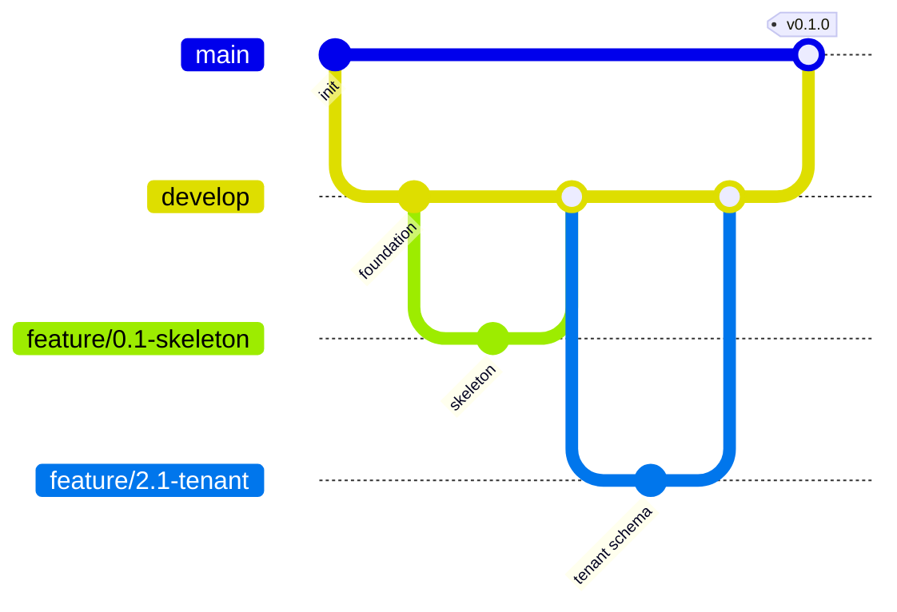
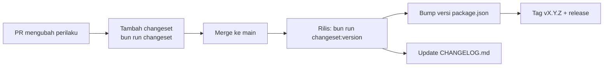

# Bagian 9 — Roadmap Teknis Repository dan Urutan Commit

## Tujuan

Dokumen ini menjadi panduan teknis implementasi repository AWCMS Mini: struktur folder, branch, commit atomic, migration order, API/UI/testing order, release versioning, merge/deploy checklist, dan template laporan implementasi.

## Prinsip repository

1. Setiap perubahan atomic.
2. Jangan campur perubahan unrelated.
3. Database change harus migration.
4. API change harus OpenAPI.
5. Event change harus AsyncAPI.
6. High-risk mutation harus idempotent.
7. High-risk action harus audit.
8. Jangan commit `.env`, token, backup, dump DB, data customer asli.

## Struktur repository final

```text
awcms-mini/
├── AGENTS.md
├── README.md
├── CHANGELOG.md         # digenerate Changesets
├── .changeset/          # config + changeset entries
├── .claude/skills/      # skill proyek Claude Code
├── package.json
├── bun.lockb
├── astro.config.mjs
├── tsconfig.json
├── .env.example
├── .gitignore
├── docker-compose.yml
├── src/
├── sql/
├── scripts/
├── openapi/
├── asyncapi/
├── docs/
├── deploy/
├── tests/
├── fixtures/
└── public/
```

## Struktur source

```text
src/
├── lib/
│   ├── db.ts
│   ├── database/
│   ├── logging/
│   ├── auth/
│   ├── files/
│   └── errors/
├── modules/
│   ├── _shared/
│   ├── tenant-admin/
│   ├── identity-access/
│   ├── profile-identity/
│   ├── catalog-inventory/
│   ├── sales-pos/
│   ├── warehouse-management/
│   ├── accounting-tax/
│   ├── crm-communication/
│   ├── sync-storage/
│   ├── ai-analyst/
│   ├── localization-ui/
│   ├── observability-logging/
│   ├── database-connectivity/
│   ├── workflow-approval/
│   ├── management-reporting/
│   ├── ui-experience/
│   └── production-security-readiness/
└── pages/
    ├── api/v1/
    ├── admin/
    ├── pos/
    └── customer/
```

## Struktur modul standard

```text
src/modules/<module>/
├── module.ts
├── domain/
├── application/
├── infrastructure/
├── api/
└── README.md
```

## Branch strategy



| Branch                   | Fungsi                  |
| ------------------------ | ----------------------- |
| `main`                   | Stabil/production-ready |
| `develop`                | Integrasi fitur         |
| `feature/<issue>-<name>` | Fitur atomic            |
| `fix/<issue>-<name>`     | Bug fix                 |
| `release/vX.Y.Z`         | Release prep            |
| `hotfix/vX.Y.Z-<name>`   | Hotfix production       |

## Commit convention

Format:

```text
<type>(<scope>): <summary>
```

Contoh:

```text
feat(profile): add central profile schema
feat(pos): add idempotent transaction posting
fix(warehouse): prevent over receiving transfer lines
docs(security): add production readiness checklist
test(access): add ABAC default deny tests
```

Types: `feat`, `fix`, `docs`, `test`, `refactor`, `chore`, `security`, `perf`, `ci`, `build`.

Scopes: `foundation`, `db`, `api`, `auth`, `access`, `profile`, `tenant`, `inventory`, `pos`, `warehouse`, `tax`, `crm`, `sync`, `ai`, `ui`, `logging`, `pooling`, `workflow`, `reporting`, `security`, `docs`.

## Urutan commit atomic utama

### Sprint 1

1. `feat(foundation): initialize Bun Astro modular monolith skeleton`
2. `feat(db): add SQL migration runner`
3. `feat(api): add OpenAPI and AsyncAPI baseline contracts`
4. `chore(deploy): add local PostgreSQL Docker Compose profile`

### Sprint 2

1. `feat(tenant): add tenant office and physical location schema`
2. `feat(profile): add central profile management schema`
3. `feat(profile): add profile resolver and entity linking service`
4. `feat(auth): add identity login and tenant user membership`

### Sprint 3

1. `feat(access): add RBAC ABAC schema and activity registry`
2. `feat(access): implement ABAC evaluator with deny by default`
3. `feat(access): add access assignment API and audit trail`

### Sprint 4

1. `feat(inventory): add product catalog schema`
2. `feat(inventory): add product CRUD and search API`
3. `feat(inventory): add stock balance and stock movement service`

### Sprint 5

1. `feat(pos): add checkout session and cart schema`
2. `feat(pos): add checkout cart API`
3. `feat(shared): add idempotency key service`
4. `feat(pos): implement idempotent atomic transaction posting`

### Sprint 6

1. `feat(logging): add structured logger and request correlation`
2. `feat(logging): add cross-module audit event helper`
3. `feat(pooling): add database pool gate and backpressure`
4. `chore(deploy): add optional PgBouncer deployment profile`

### Sprint 7

1. `feat(crm): add receipt PDF generator`
2. `feat(crm): add CRM contacts channels and consent`
3. `feat(crm): add StarSender WhatsApp receipt provider`
4. `feat(crm): add Mailketing email receipt provider`
5. `feat(ui): add customer receipt portal`

### Sprint 8

1. `feat(sync): add offline sync outbox inbox and signed API`
2. `feat(sync): add sync conflict tracking and resolution`
3. `feat(sync): add R2 object sync queue`

### Sprint 9

1. `feat(warehouse): add warehouse zone bin and bin balance schema`
2. `feat(warehouse): add warehouse zone and bin APIs`
3. `feat(warehouse): add lot batch serial and expiry tracking`
4. `feat(warehouse): add transfer order shipment and receipt workflow`
5. `feat(warehouse): add cycle count and stock adjustment request`

### Sprint 10

1. `feat(tax): add tenant tax profile and business unit schema`
2. `feat(tax): add party and product tax profiles`
3. `feat(tax): add VAT invoice staging from sales document`
4. `feat(tax): add Coretax XML batch export workflow`

### Sprint 11

1. `feat(ui): add UI persona screen and navigation registry`
2. `feat(ui): build admin shell with modular navigation`
3. `feat(pos-ui): build keyboard-first cashier POS screen`
4. `feat(reporting): add management reporting views and dashboard API`
5. `feat(ai): add safe AI business analyst tools`

### Sprint 12

1. `feat(workflow): add cross-module approval workflow engine`
2. `security(production): add production security readiness gates`
3. `chore(deploy): add offline LAN and production deployment profiles`
4. `docs(handover): add operational SOP and handover manual`

## Migration order final rekomendasi

```text
001_awcms_foundation_schema.sql
002_awcms_tenant_identity_schema.sql
003_awcms_catalog_inventory_schema.sql
004_awcms_sales_pos_schema.sql
005_awcms_sync_storage_r2_schema.sql
006_awcms_crm_receipt_communication_schema.sql
007_awcms_accounting_tax_coretax_schema.sql
008_awcms_ai_hermes_business_analyst_schema.sql
009_awcms_i18n_po_schema.sql
010_awcms_theme_mode_schema.sql
011_awcms_abac_access_control_schema.sql
012_awcms_modular_monolith_contracts_schema.sql
013_awcms_logging_observability_schema.sql
014_awcms_central_profile_management_schema.sql
015_awcms_profile_stabilization_schema.sql
016_awcms_workflow_approval_audit_schema.sql
017_awcms_management_dashboard_reporting_schema.sql
018_awcms_legacy_migration_backfill_toolkit_schema.sql
019_awcms_performance_sync_validation_schema.sql
020_awcms_production_security_readiness_schema.sql
021_awcms_database_connection_pooling_schema.sql
022_awcms_ui_ux_persona_experience_schema.sql
023_awcms_warehouse_management_schema.sql
024_awcms_transaction_integrity_idempotency_hardening.sql
025_awcms_setup_wizard_extension.sql
026_awcms_dashboard_materialized_views.sql
```

Catatan: setelah production, migration tidak boleh di-rename sembarangan. Koreksi harus migration baru.

## Urutan API implementation

1. Shared response/error helper.
2. Tenant context middleware.
3. Auth middleware.
4. ABAC middleware.
5. Idempotency middleware.
6. Audit helper.
7. Logging middleware.
8. `/setup/status` dan `/setup/initialize`.
9. `/auth/login` dan `/auth/me`.
10. `/access/evaluate`.
11. `/profiles/resolve`.
12. `/inventory/products`.
13. `/inventory/stock-balances`.
14. `/sales/checkout-sessions`.
15. `/sales/checkout-sessions/{id}/post`.
16. `/crm/receipts/{id}/send`.
17. `/sync/push` dan `/sync/pull`.
18. `/warehouses` dan `/warehouse-transfers`.
19. `/tax/vat-invoices/generate`.
20. `/reports/sales/daily`.
21. `/ai/business-analyst/chat`.
22. `/security/go-live-gates/evaluate`.

## Urutan UI implementation

1. Design tokens.
2. Base layout.
3. Button/input/select/dialog/table/status components.
4. Login.
5. Setup wizard.
6. Admin shell.
7. Dashboard.
8. User/access management.
9. Product catalog.
10. POS fullscreen.
11. Customer receipt portal.
12. Warehouse.
13. Tax.
14. Reports.
15. Logs/security readiness.

## Versioning

```mermaid
flowchart LR
  V1[v0.1.0<br/>foundation/tenant/identity] --> V2[v0.2.0<br/>product/stock/checkout]
  V2 --> V3[v0.3.0<br/>atomic posting/logging/pool]
  V3 --> V4[v0.4.0<br/>receipt/CRM/sync]
  V4 --> V5[v0.5.0<br/>warehouse]
  V5 --> V6[v0.6.0<br/>tax/Coretax]
  V6 --> V7[v0.7.0<br/>UI]
  V7 --> V8[v0.8.0<br/>reporting/AI]
  V8 --> V9[v0.9.0<br/>security/deploy]
  V9 --> V10[v1.0.0<br/>production MVP]
```



| Versi    | Isi                                   |
| -------- | ------------------------------------- |
| `v0.1.0` | Foundation, tenant, identity, profile |
| `v0.2.0` | Product, stock, POS checkout          |
| `v0.3.0` | Atomic posting, logging, pooling      |
| `v0.4.0` | Receipt, CRM, sync                    |
| `v0.5.0` | Warehouse basic                       |
| `v0.6.0` | Tax/Coretax readiness                 |
| `v0.7.0` | UI admin/kasir/customer               |
| `v0.8.0` | Reporting dan AI                      |
| `v0.9.0` | Security readiness dan deployment     |
| `v1.0.0` | Production-ready MVP                  |

### SemVer

- **MAJOR** — perubahan tidak-kompatibel (breaking) pada API/kontrak/schema publik.
- **MINOR** — fitur baru yang kompatibel ke belakang.
- **PATCH** — bug fix kompatibel.
- Pra-1.0.0: perubahan minor boleh membawa penyesuaian yang belum stabil.

### Versioning dengan Changesets

Versi & `CHANGELOG.md` dikelola dengan [Changesets](../../.changeset/README.md). Alur:



Aturan:

- **Setiap PR** yang mengubah perilaku (fitur, fix, schema/API/event) **wajib menyertakan satu changeset** dengan tingkat bump SemVer + ringkasan.
- Perubahan **docs-only/chore** boleh tanpa changeset.
- Baseline saat ini `0.0.0` (belum ada kode dirilis); rilis bertag pertama = `0.1.0` (Foundation).
- `CHANGELOG.md` mengikuti format Keep a Changelog; entri versi digenerate dari changeset.
- Proses rilis ter-otomasi lewat skill `awcms-mini-release` (status → version → tag → GitHub release).

## PR checklist

- Scope sesuai issue.
- Tidak ada unrelated change.
- No secret/data customer.
- Build pass.
- Test relevan pass.
- Migration jika schema berubah.
- OpenAPI jika API berubah.
- AsyncAPI jika event berubah.
- Security notes terpenuhi.
- Docs update.
- Changeset ditambahkan jika perubahan mempengaruhi perilaku.

## Pre-deploy checklist

```bash
bun install
bun run db:migrate
bun run api:spec:check
bun test
bun run build
bun run db:pool:health
bun run security:readiness
```

## Template laporan implementasi

```text
Summary:
Files changed:
Commands run:
Test results:
Security notes:
Documentation updates:
Remaining limitations:
Next recommended step:
```
