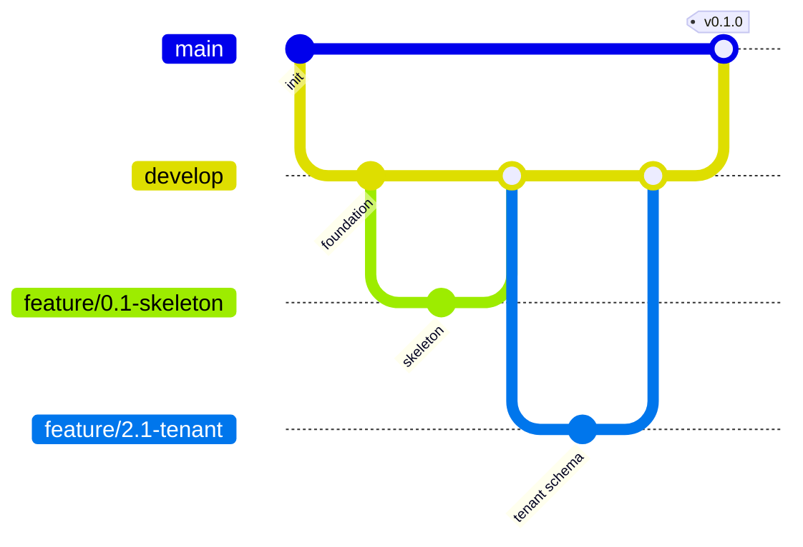
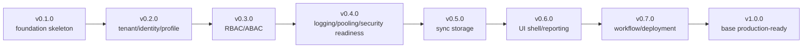
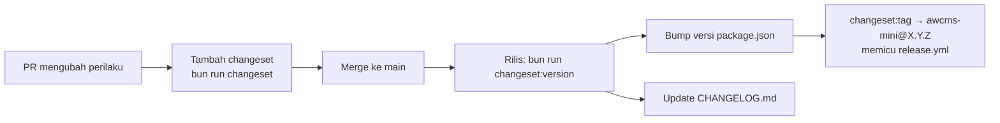

# Bagian 9 — Roadmap Teknis Repository dan Urutan Commit

## Tujuan

Dokumen ini menjadi panduan teknis implementasi repository AWCMS-Mini: struktur folder, branch, commit atomic, migration order, API/UI/testing order, release versioning, merge/deploy checklist, dan template laporan implementasi.

## Prinsip repository

1. Setiap perubahan atomic.
2. Jangan campur perubahan unrelated.
3. Database change harus migration.
4. API change harus OpenAPI.
5. Event change harus AsyncAPI.
6. High-risk mutation harus idempotent.
7. High-risk action harus audit.
8. Resource deletable memakai soft delete; posted/append-only entity tidak dihapus.
9. Jangan commit `.env`, token, backup, dump DB, data customer asli.

## Struktur repository final

```text
awcms-mini/
├── AGENTS.md
├── README.md
├── CHANGELOG.md         # digenerate Changesets
├── .changeset/          # config + changeset entries
├── .claude/skills/      # skill proyek Claude Code
├── package.json
├── bun.lock
├── astro.config.mjs
├── tsconfig.json
├── .env.example
├── .gitignore
├── docker-compose.yml
├── src/
├── sql/
├── scripts/
├── openapi/
├── asyncapi/
├── docs/
├── deploy/
├── tests/
├── fixtures/
└── public/
```

## Struktur source

```text
src/
├── lib/
│   ├── db.ts
│   ├── database/
│   ├── logging/
│   ├── auth/
│   ├── files/
│   └── errors/
├── modules/
│   ├── _shared/
│   ├── tenant-admin/
│   ├── identity-access/
│   ├── profile-identity/
│   ├── sync-storage/
│   ├── localization-ui/
│   ├── observability-logging/
│   ├── database-connectivity/
│   ├── workflow-approval/
│   ├── management-reporting/
│   ├── ui-experience/
│   └── production-security-readiness/
└── pages/
    ├── api/v1/
    └── admin/
```

Modul domain aplikasi turunan (mis. `catalog-inventory`, `sales-pos`, `warehouse-management`, `accounting-tax`, `crm-communication`, `ai-analyst` pada contoh AWPOS) ditambahkan di repo aplikasi tersebut, bukan bagian struktur base AWCMS-Mini.

## Struktur modul standard

```text
src/modules/<module>/
├── module.ts
├── domain/
├── application/
├── infrastructure/
├── api/
└── README.md
```

## Branch strategy



| Branch                   | Fungsi                  |
| ------------------------ | ----------------------- |
| `main`                   | Stabil/production-ready |
| `develop`                | Integrasi fitur         |
| `feature/<issue>-<name>` | Fitur atomic            |
| `fix/<issue>-<name>`     | Bug fix                 |
| `release/vX.Y.Z`         | Release prep            |
| `hotfix/vX.Y.Z-<name>`   | Hotfix production       |

## GitHub issue snapshot

Issue atomic dibuat atau dibuat ulang dari `docs/awcms-mini/06_github_issues_detail.md`, sedangkan state GitHub aktual dicatat di `docs/awcms-mini/github/`. Snapshot live terbaru bisa saja kosong apabila issue GitHub sudah dibersihkan; dalam kondisi itu, dokumen 06 tetap menjadi backlog rencana, bukan bukti issue aktif.

Aturan:

1. Snapshot issue dipisahkan berdasarkan state: `issues-open-NNN.md` dan `issues-closed-NNN.md`.
2. Setiap file snapshot berisi maksimal 100 issue.
3. Snapshot memuat metadata issue, body, label, milestone, assignee, timestamp, URL, dan komentar.
4. Label dan milestone dicatat di `docs/awcms-mini/github/labels-milestones.md`.
5. Refresh snapshot dilakukan setelah perubahan massal issue, sebelum audit sprint, dan sebelum laporan release.

## Commit convention

Format:

```text
<type>(<scope>): <summary>
```

Contoh:

```text
feat(profile): add central profile schema
feat(sync): add offline sync outbox and inbox
fix(access): prevent privilege escalation on role assignment
docs(security): add production readiness checklist
test(access): add ABAC default deny tests
```

Types: `feat`, `fix`, `docs`, `test`, `refactor`, `chore`, `security`, `perf`, `ci`, `build`.

Scopes: `foundation`, `db`, `api`, `auth`, `access`, `profile`, `tenant`, `sync`, `ui`, `logging`, `pooling`, `workflow`, `reporting`, `security`, `docs`. Aplikasi turunan menambah scope domainnya sendiri (mis. `pos`, `inventory`, `warehouse`, `tax`, `crm`).

## Urutan commit atomic utama

### Sprint 1

1. `feat(foundation): initialize Bun Astro modular monolith skeleton`
2. `feat(db): add SQL migration runner`
3. `feat(api): add OpenAPI and AsyncAPI baseline contracts`
4. `feat(shared): add soft delete repository conventions`
5. `chore(deploy): add local PostgreSQL Docker Compose profile`

### Sprint 2

1. `feat(tenant): add tenant office and physical location schema`
2. `feat(profile): add central profile management schema`
3. `feat(profile): add profile resolver and entity linking service`
4. `feat(auth): add identity login and tenant user membership`

### Sprint 3

1. `feat(access): add RBAC ABAC schema and activity registry`
2. `feat(access): implement ABAC evaluator with deny by default`
3. `feat(access): add access assignment API and audit trail`

### Sprint 4

1. `feat(logging): add structured logger and request correlation`
2. `feat(logging): add cross-module audit event helper`
3. `feat(pooling): add database pool gate and backpressure`
4. `security(production): add production security readiness checklist`

### Sprint 5

1. `feat(sync): add offline sync outbox inbox and signed API`
2. `feat(sync): add sync conflict tracking and resolution`
3. `feat(sync): add R2 object sync queue`

### Sprint 6

1. `feat(ui): add UI persona screen and navigation registry`
2. `feat(ui): build admin shell with modular navigation`
3. `feat(reporting): add management reporting views and dashboard API`

### Sprint 7

1. `feat(workflow): add cross-module approval workflow engine`
2. `chore(deploy): add offline LAN and production deployment profiles`
3. `docs(handover): add operational SOP and handover manual`

Aplikasi turunan menambah sprint/commit domainnya sendiri setelah base ini siap (lihat pola sprint domain di paket dokumen AWPOS sebagai contoh).

## Migration order final rekomendasi

```text
001_awcms_mini_foundation_schema.sql
002_awcms_mini_tenant_office_schema.sql
003_awcms_mini_central_profile_management_schema.sql
004_awcms_mini_identity_login_schema.sql
005_awcms_mini_abac_access_control_schema.sql
006_awcms_mini_setup_wizard_schema.sql
007_awcms_mini_sync_storage_outbox_inbox_schema.sql
008_awcms_mini_sync_storage_conflict_schema.sql
009_awcms_mini_object_sync_queue_schema.sql
010_awcms_mini_management_reporting_permission_schema.sql
011_awcms_mini_audit_logging_schema.sql
012_awcms_mini_workflow_approval_schema.sql
013_awcms_mini_i18n_po_schema.sql
014_awcms_mini_theme_mode_schema.sql
015_awcms_mini_ui_ux_persona_experience_schema.sql
016_awcms_mini_modular_monolith_contracts_schema.sql
017_awcms_mini_dashboard_materialized_views.sql
```

Catatan: setelah production, migration tidak boleh di-rename sembarangan. Koreksi harus migration baru. Aplikasi turunan melanjutkan nomor migration domainnya sendiri mulai nomor setelah migration terakhir base di atas.

**Superseded oleh ADR-0014 untuk aplikasi turunan yang memakai build-time module composition (Issue #740).** Aturan relatif di atas ("mulai nomor setelah migration terakhir base saat ini", mis. lanjut dari `056` bila base saat ini berhenti di `055`) masih berlaku untuk pola lama (repo turunan mem-fork/vendor base lalu mengedit `src/modules/index.ts` langsung, ADR-0013 §5) — tapi begitu sebuah repo turunan memakai mekanisme komposisi baru (`src/modules/application-registry.ts`, `composeModuleRegistry()`), gunakan aturan TETAP `docs/adr/0014-deterministic-build-time-module-composition.md` §4 sebagai gantinya: base mereservasi range `1-899` (`BASE_MODULE_MIGRATION_NAMESPACE`), migration repo turunan mulai dari `900` — bukan "setelah nomor terakhir base saat ini", yang akan berbeda-beda tiap kali base bertambah migration baru dan tidak deterministik lintas waktu. Deklarasikan range ini lewat `ApplicationModuleRegistry.migrationNamespace`, divalidasi otomatis terhadap tabrakan oleh `bun run modules:compose:check`.

`002` semula bernama `tenant_identity_schema` (menggabungkan Issue 2.1 dan 2.3); dipecah agar satu migration = satu issue: `002` scope Issue 2.1 (tenant/office), `004` scope Issue 2.3 (identity/login). `006` (setup wizard, Issue 12.1) diimplementasikan lebih awal dari rencana semula (slot `015`) begitu Issue 2.1–2.4 selesai — sesuai `docs/awcms-mini/06_github_issues_detail.md` §Koreksi urutan sprint yang menempatkan 12.1 tepat setelah 2.4. `007` (Issue 6.1 — sync nodes/outbox/inbox), `008` (Issue 6.2 — sync conflict tracking), dan `009` (Issue 6.3 — R2 object sync queue) dipecah dari rencana gabungan `sync_storage_r2`, menuntaskan epic M5 (Sync Storage) sepenuhnya; `008` juga menambah `ALTER TABLE` pada tabel `sync_push_batches` milik `007` (koreksi via migration baru, bukan mengedit `007`), dan `008`/`009` masing-masing menyisipkan permission baru ke katalog `awcms_mini_permissions` (`005`). `009` tidak memanggil R2/Cloudflare SDK nyata — hanya antrean lokal + kolom `requires_upload` yang digerakkan env `R2_ENABLED`; dispatcher upload nyata tetap backlog pada saat itu (kemudian dibangun oleh Issue #436, migrasi `018` — lihat `src/modules/sync-storage/README.md` §Dispatcher), sama seperti `awcms_mini_sync_outbox` (event lokal antar-node) yang juga belum punya dispatcher live saat `007`/`009` dibuat. `010` (Issue 9.1 — management reporting) diimplementasikan lebih awal dari rencana semula (slot `016`) karena 9.1 hanya bergantung pada M2 (tuntas) dan mengikuti tepat setelah 8.1 di sprint aktual, bukan setelah M8; migration ini hanya menyisipkan satu permission baru (`reporting.dashboard.read`) ke katalog `005` — keempat view laporannya (tenant activity, access/audit, sync health, module usage) adalah agregasi baca murni atas tabel yang sudah ada (`002`-`009`), tidak ada tabel baru. Slot `016` lama (`management_dashboard_reporting_schema`) dihapus dari rencana karena sudah terealisasi sebagai `010`; sisa migration `011`-`019` bergeser turun satu slot mengikuti hal ini. `011` (Issue 10.1 — structured logging & audit trail) tetap di nomor yang sama seperti rencana, hanya nama file diganti dari `logging_observability_schema` menjadi `audit_logging_schema` agar mencerminkan scope sesungguhnya (tabel generik `awcms_mini_audit_events` + 2 permission baru — `logging.audit_trail.read` dan `profile_identity.profile_management.purge`; `profile_identity.profile_management.delete`/`.restore` sudah diseed sejak `005`); Issue 10.2 (connection pooling & backpressure) ternyata tidak butuh migration sama sekali — pool config, work-class gate, dan circuit breaker semuanya infrastruktur aplikasi murni (`src/lib/database/`) di depan koneksi yang sudah ada, bukan skema baru. Slot `012` lama (`database_connection_pooling_schema`) dihapus dari rencana; sisa migration `013`-`019` bergeser turun satu slot menjadi `012`-`018`. Issue 10.3 (production security readiness checklist) juga tidak butuh migration — deliverable-nya adalah tiga script CLI (`bun run db:pool:health`, `bun run security:readiness`, `bun run production:preflight`) yang memverifikasi kontrol yang sudah ada (RLS, ABAC default-deny, audit trail, pool health), bukan skema baru. Slot lama `012` (`production_security_readiness_schema`) dihapus dari rencana; sisa migration `013`-`018` bergeser turun satu slot menjadi `012`-`017`. Issue 11.1 (workflow approval engine) mendarat lebih awal dari rencana semula (slot `015`, bernama `workflow_approval_audit_schema`) karena mengikuti tepat setelah 10.3 yang tidak butuh migration; menempati slot `012` yang baru kosong, nama file disesuaikan menjadi `workflow_approval_schema` (4 tabel generik — definitions/instances/tasks/decisions — plus tabel idempotency generik `awcms_mini_idempotency_keys` yang dipakai bersama oleh endpoint mutation high-risk mana pun di masa depan). Slot `012`-`014` lama (`i18n_po_schema`, `theme_mode_schema`, `ui_ux_persona_experience_schema`) bergeser turun satu menjadi `013`-`015`. Penomoran `013` dst. di atas adalah rencana; nomor final ditentukan saat setiap issue benar-benar diimplementasikan berurutan.

**Realisasi menyimpang dari rencana di atas (2026-07-06)**: seluruh 18 issue backlog doc 06 tuntas tanpa pernah mengimplementasikan slot rencana `013`-`017` (`i18n_po_schema`, `theme_mode_schema`, `ui_ux_persona_experience_schema`, `modular_monolith_contracts_schema`, `dashboard_materialized_views` — tidak pernah difile sebagai GitHub issue, tetap sketsa aspirasional untuk roadmap base v2/aplikasi turunan, bukan bagian 18 issue backlog yang benar-benar dikerjakan). Migration `013`-`015` yang benar-benar ada di `sql/` adalah **perawatan pasca-backlog** yang sama sekali tidak berkaitan dengan rencana di atas — bukan realisasi/renumbering slot manapun: `013_awcms_mini_enforce_rls_least_privilege.sql` (penegakan RLS `FORCE` + role aplikasi least-privilege), `014_awcms_mini_sync_node_management_permission_schema.sql` (seed permission admin node sync), dan `015_awcms_mini_tenant_settings_management_permission_schema.sql` (seed permission admin Settings) — ketiganya dicatat lengkap di `AUDIT_STANDAR_PENGEMBANGAN_2026-07-17.md` §Perawatan pasca-backlog, bukan di sini karena bukan bagian issue backlog terencana.

## Urutan API implementation

1. Shared response/error helper.
2. Tenant context middleware.
3. Auth middleware.
4. ABAC middleware.
5. Idempotency middleware.
6. Soft delete query/repository helper.
7. Audit helper.
8. Logging middleware.
9. `/setup/status` dan `/setup/initialize`.
10. `/auth/login` dan `/auth/me`.
11. `/access/evaluate`.
12. `/profiles/resolve`.
13. Soft delete/restore endpoint untuk master data yang deletable.
14. `/sync/push` dan `/sync/pull`.
15. `/reports/*` (view generik: tenant activity, access/audit summary, sync health).
16. `/security/go-live-gates/evaluate`.

Aplikasi turunan menambah endpoint domainnya sendiri (mis. katalog, transaksi, gudang, pajak) setelah urutan base ini.

## Urutan UI implementation

1. Design tokens.
2. Base layout.
3. Button/input/select/dialog/table/status components.
4. Login.
5. Setup wizard.
6. Admin shell.
7. Dashboard.
8. User/access management.
9. Reports generik (tenant activity, sync health, audit).
10. Logs/security readiness.

Aplikasi turunan menambah layar domainnya sendiri (mis. layar operasional, portal) setelah urutan base ini.

## Versioning



| Versi    | Isi                                                                                 |
| -------- | ----------------------------------------------------------------------------------- |
| `v0.1.0` | Foundation skeleton (SSR, module contract, migration runner, API contract baseline) |
| `v0.2.0` | Tenant, identity, profile                                                           |
| `v0.3.0` | RBAC/ABAC evaluator + assignment                                                    |
| `v0.4.0` | Logging, pooling, security readiness                                                |
| `v0.5.0` | Sync storage (outbox/inbox, conflict, R2 queue)                                     |
| `v0.6.0` | UI shell, management reporting                                                      |
| `v0.7.0` | Workflow approval, deployment profile                                               |
| `v1.0.0` | Base production-ready (gates doc 07)                                                |

Aplikasi turunan (mis. AWPOS) memakai baseline versinya sendiri di atas base ini (lihat versioning doc 09 milik aplikasi tersebut).

Nomor versi naik progresif per rilis Changesets, bukan hanya saat satu slot di atas selesai penuh — satu issue yang merge bisa langsung memicu rilis minor/patch walau issue lain dalam slot yang sama belum selesai. `CHANGELOG.md` mencatat isi riil tiap rilis; tabel ini hanya peta target.

### SemVer

- **MAJOR** — perubahan tidak-kompatibel (breaking) pada API/kontrak/schema publik.
- **MINOR** — fitur baru yang kompatibel ke belakang.
- **PATCH** — bug fix kompatibel.
- Pra-1.0.0: perubahan minor boleh membawa penyesuaian yang belum stabil.

### Versioning dengan Changesets

Versi & `CHANGELOG.md` dikelola dengan [Changesets](../../.changeset/README.md). Alur:



Aturan:

- **Setiap PR** yang mengubah perilaku (fitur, fix, schema/API/event) **wajib menyertakan satu changeset** dengan tingkat bump SemVer + ringkasan.
- Perubahan **docs-only/chore** boleh tanpa changeset.
- Baseline saat ini `0.0.0` (belum ada kode dirilis); rilis bertag pertama = `0.1.0` (Foundation).
- `CHANGELOG.md` mengikuti format Keep a Changelog; entri versi digenerate dari changeset.
- Proses rilis ter-otomasi lewat skill `awcms-mini-release` (status → version → tag → GitHub release).

## PR checklist

- Scope sesuai issue.
- Tidak ada unrelated change.
- No secret/data customer.
- Build pass.
- Test relevan pass.
- Migration jika schema berubah.
- OpenAPI jika API berubah.
- AsyncAPI jika event berubah.
- Security notes terpenuhi.
- Soft delete policy terpenuhi untuk resource deletable.
- Docs update.
- Changeset ditambahkan jika perubahan mempengaruhi perilaku.

## Pre-deploy checklist

```bash
bun install
bun run db:migrate
bun run api:spec:check
bun test
bun run build
bun run db:pool:health
bun run security:readiness
```

## Template laporan implementasi

```text
Summary:
Files changed:
Commands run:
Test results:
Security notes:
Documentation updates:
Remaining limitations:
Next recommended step:
```
