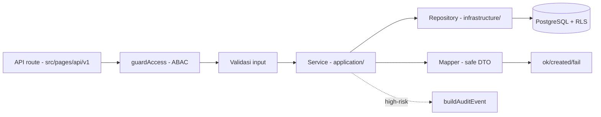

# Bagian 10 — Template Kode dan Coding Standard

## Prinsip coding

1. TypeScript strict (`astro/tsconfigs/strict`).
2. API route tipis; business logic di service (application layer).
3. Query database hanya di repository (infrastructure layer).
4. Semua input user divalidasi (`_shared/validation.ts`).
5. Mutation high-risk idempotent (`_shared/idempotency.ts`).
6. Operasi multi-table memakai transaction (`lib/database/transaction.ts`).
7. Akses tenant-scoped memakai `withTenant` + ABAC + RLS.
8. High-risk action → audit (`_shared/audit.ts`).
9. Data sensitif dimask/redact (`lib/logging/redact.ts`).
10. Error response standard — tidak expose stack trace (`toErrorResponse`).

## Aliran request antar layer



## Struktur modul

```text
src/modules/<module>/
├── module.ts              # ModuleDescriptor
├── domain/                # entities, value-objects, events
├── application/           # services, commands, queries
├── infrastructure/        # repository, mappers
├── api/                   # handlers dipanggil route tipis
└── README.md
```

Route Astro di `src/pages/api/v1/...` hanya: ambil context → panggil handler modul → return Response.

## Sumber tunggal helper (JANGAN duplikasi)

| Kebutuhan               | Pakai                                                          |
| ----------------------- | -------------------------------------------------------------- |
| Module descriptor       | `_shared/module-contract.ts`                                   |
| Response envelope       | `_shared/api-response.ts` (`ok/created/fail`)                  |
| Error + code standar    | `_shared/api-error.ts` (`apiError`)                            |
| Tenant context + header | `_shared/tenant-context.ts`                                    |
| ABAC guard              | `_shared/access.ts` (`guardAccess`, default deny)              |
| Audit                   | `_shared/audit.ts` (`buildAuditEvent`)                         |
| Domain event            | `_shared/domain-event.ts` (`createDomainEvent`)                |
| Idempotency             | `_shared/idempotency.ts` + `lib/database/idempotency-store.ts` |
| Validasi input          | `_shared/validation.ts`                                        |
| Transaction/RLS         | `lib/database/transaction.ts` (`withTenant`)                   |
| Logger                  | `lib/logging/logger.ts` (redaction bawaan)                     |
| Konfigurasi             | `lib/config.ts` (`getConfig`)                                  |

## Template module descriptor

Lihat modul base mana pun, mis. [`src/modules/identity-access/module.ts`](../../src/modules/identity-access/module.ts). Wajib: `key` snake_case, `dependencies` merujuk key terdaftar, `api.openApiPath` dan `events.asyncApiPath` menunjuk file kontrak nyata (dicek `api:spec:check`), lalu daftarkan di `src/modules/index.ts`.

## Template API route + handler

```ts
// src/pages/api/v1/<area>/<resource>.ts — route tipis
import type { APIRoute } from "astro";
import { toErrorResponse } from "../../../../modules/_shared/api-response";
import { traceIdsFromRequest } from "../../../../modules/_shared/tenant-context";
import { handleCreateResource } from "../../../../modules/<module>/api/handlers";

export const POST: APIRoute = async ({ request, locals }) => {
  const { correlationId } = traceIdsFromRequest(request);
  try {
    return await handleCreateResource(request, locals);
  } catch (error) {
    return toErrorResponse(error, correlationId);
  }
};
```

Handler modul: ambil `TenantContext` dari locals → `guardAccess` → `parseJsonBody` + `rejectUnknownFields` + validasi field → (high-risk) `requireIdempotencyKey` → service.

## Template service + repository

```ts
// application/services.ts
export async function createResource(
  context: TenantContext,
  command: CreateResourceCommand,
) {
  return withTenant(context.tenantId, async (tx) => {
    const row = await insertResource(tx, context.tenantId, command); // repository
    await insertAuditEvent(tx, buildAuditEvent({/* high-risk */}));
    return toResourceDto(row); // mapper safe DTO
  });
}
```

Repository rules: hanya query terparametrisasi (tagged template `sql\`\``); filter `tenant_id`eksplisit; tidak ada business logic; tidak return row sensitif mentah. Service rules: terima`TenantContext`, tidak membaca `Request`, kembalikan DTO aman, mudah di-unit-test.

## Idempotency wrapper

Alur (diimplementasi `_shared/idempotency.ts`): `requireIdempotencyKey` → `computeRequestHash` → `store.find` → `evaluateReplay` (replay/konflik/fresh) → `store.start` → mutation → `store.complete`. Simpan response via store dalam transaction yang sama dengan mutation.

## Transaction & locking

1. `withTenant` men-set RLS context di awal transaction (`set_config(..., true)` = `SET LOCAL`).
2. Jangan buka transaction lama-lama; jangan panggil provider eksternal di dalamnya.
3. Baris yang di-update bersamaan (counter/saldo): `SELECT ... FOR UPDATE`, urutkan lock berdasarkan ID.
4. Statement timeout global dari `DATABASE_STATEMENT_TIMEOUT_MS`.

## SQL migration standard

- Nama `NNN_awcms_<area>_<desc>.sql`, nomor berurutan unik.
- **Tanpa `BEGIN`/`COMMIT`** — runner membungkus per file (di-enforce runner + test).
- `CREATE TABLE IF NOT EXISTS`, `CREATE INDEX IF NOT EXISTS`, `DROP POLICY IF EXISTS` sebelum `CREATE POLICY`.
- Tenant-scoped: `tenant_id` + RLS ENABLE+FORCE+policy (template doc 04); FK child index; `timestamptz`; `numeric`; enum-like `text + CHECK`.
- Tidak menyimpan password/API key plaintext.

## Logger & redaction

- `rootLogger()` / `childLoggerForRequest({ requestId, ... })`; dilarang `console.*` di jalur HTTP.
- Redaction otomatis untuk key sensitif (daftar di `SENSITIVE_KEY_PATTERNS`): password, token, apiKey, secret, authorization, npwp, nik, phone, whatsapp, email, dst.

## TypeScript standard

| Item              | Standard                     |
| ----------------- | ---------------------------- |
| File              | kebab-case                   |
| Type/interface    | PascalCase                   |
| Function/variabel | camelCase                    |
| Konstanta global  | UPPER_SNAKE_CASE             |
| Module key        | snake_case                   |
| Tabel/kolom DB    | snake_case, prefiks `awcms_` |

Hindari `any` (pakai `unknown` untuk input belum valid); type eksplisit untuk command/result; jangan expose row DB mentah.

## Pull request checklist & laporan

Lihat doc 09 (checklist) dan template laporan implementasi:

```text
Summary:
Files changed:
Commands run:
Test results:
Security notes:
Documentation updates:
Remaining limitations:
Next recommended step:
```
