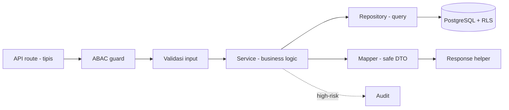
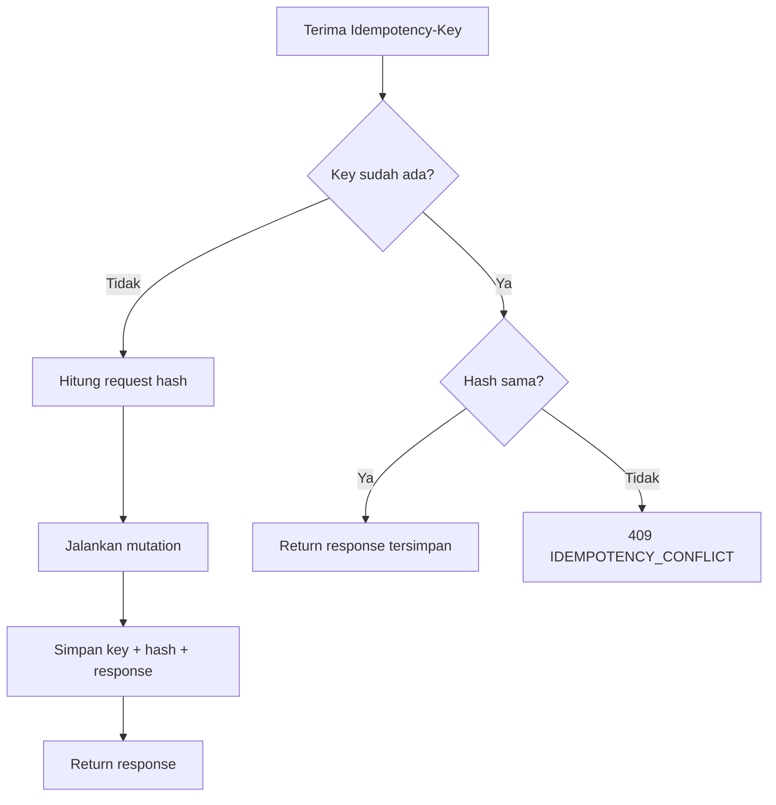

# Bagian 10 — Template Implementasi Kode dan Coding Standard

## Tujuan

Dokumen ini menetapkan standar coding AWCMS-Mini untuk TypeScript/Bun/Astro/PostgreSQL agar implementasi konsisten, aman, testable, dan maintainable.

## Prinsip coding

1. TypeScript strict.
2. API route tipis; business logic di service.
3. Query database di repository/infrastructure.
4. Semua input user divalidasi.
5. Semua mutation high-risk idempotent.
6. Semua operasi multi-table memakai transaction.
7. Semua akses tenant-scoped memakai tenant context, ABAC, dan RLS.
8. Semua high-risk action audit log.
9. Semua sensitive data dimasking/redacted.
10. Resource deletable memakai soft delete; query default menyaring `deleted_at IS NULL`.
11. Error response standard dan tidak expose stack trace.

## Aliran request antar layer



Route tipis → guard → validasi → service → repository → DB. Data sensitif lewat mapper sebelum keluar.

## Skill pendukung

Standar di dokumen ini ditegakkan oleh skill proyek di `.claude/skills/` (katalog: `.claude/skills/README.md`).

| Bagian standar | Skill |
|---|---|
| Struktur modul & descriptor | `awcms-mini-new-module` |
| SQL migration standard | `awcms-mini-new-migration` |
| API handler rules & response helper | `awcms-mini-new-endpoint` |
| Domain event envelope | `awcms-mini-new-event` |
| Idempotency wrapper rules | `awcms-mini-idempotency` |
| ABAC guard | `awcms-mini-abac-guard` |
| Audit helper & redaction | `awcms-mini-audit-log` |
| Masking/redaction data sensitif | `awcms-mini-sensitive-data` |
| Sync HMAC standard | `awcms-mini-sync-hmac` |
| Pull request checklist | `awcms-mini-pr-review` |
| UI/komponen (doc 14/15) | `awcms-mini-ui-screen` |
| Rilis & CHANGELOG (doc 09) | `awcms-mini-release` |

## Struktur modul

```text
src/modules/<module>/
├── module.ts
├── domain/
│   ├── entities.ts
│   ├── value-objects.ts
│   └── events.ts
├── application/
│   ├── services.ts
│   ├── commands.ts
│   └── queries.ts
├── infrastructure/
│   ├── repository.ts
│   └── mappers.ts
├── api/
│   ├── routes.ts
│   ├── schemas.ts
│   └── handlers.ts
└── README.md
```

## Template Module Descriptor

```ts
import type { ModuleDescriptor } from "../_shared/module-contract";

export const warehouseManagementModule: ModuleDescriptor = {
  key: "warehouse_management",
  name: "Warehouse Management",
  version: "0.1.0",
  status: "active",
  description: "Multi warehouse, zone, bin, lot, transfer, in-transit, cycle count, and warehouse stock operations.",
  dependencies: [
    "tenant_admin",
    "identity_access",
    "catalog_inventory",
    "workflow_approval",
    "observability_logging"
  ],
  api: {
    openApiPath: "openapi/modules/warehouse-management.openapi.yaml",
    basePath: "/api/v1"
  },
  events: {
    asyncApiPath: "asyncapi/modules/warehouse-events.asyncapi.yaml",
    publishes: [
      "warehouse.transfer.created",
      "warehouse.transfer.shipped",
      "warehouse.transfer.received",
      "warehouse.cycle_count.variance_detected"
    ],
    subscribes: ["inventory.stock.adjustment.posted", "sales.transaction.posted"]
  }
};
```

## Module contract

```ts
export type ModuleStatus = "active" | "experimental" | "deprecated";

export type ModuleDescriptor = {
  key: string;
  name: string;
  version: string;
  status: ModuleStatus;
  description: string;
  dependencies: string[];
  api?: {
    openApiPath: string;
    basePath: string;
  };
  events?: {
    asyncApiPath?: string;
    publishes?: string[];
    subscribes?: string[];
  };
};
```

## API response helper

```ts
export type ApiMeta = {
  correlationId?: string;
  requestId?: string;
};

export type ApiSuccess<T> = {
  success: true;
  data: T;
  meta?: ApiMeta;
};

export type ApiErrorResponse = {
  success: false;
  error: {
    code: string;
    message: string;
    details?: Array<{ field?: string; message: string; code?: string }>;
    correlationId?: string;
  };
};

export function ok<T>(data: T, meta?: ApiMeta): Response {
  return Response.json({ success: true, data, meta } satisfies ApiSuccess<T>);
}

export function created<T>(data: T, meta?: ApiMeta): Response {
  return Response.json({ success: true, data, meta } satisfies ApiSuccess<T>, { status: 201 });
}

export function fail(status: number, code: string, message: string, options?: { details?: Array<{ field?: string; message: string; code?: string }>; correlationId?: string }): Response {
  return Response.json({ success: false, error: { code, message, details: options?.details, correlationId: options?.correlationId } } satisfies ApiErrorResponse, { status });
}
```

## ApiError

```ts
export class ApiError extends Error {
  public readonly status: number;
  public readonly code: string;
  public readonly details?: Array<{ field?: string; message: string; code?: string }>;

  constructor(params: { status: number; code: string; message: string; details?: Array<{ field?: string; message: string; code?: string }> }) {
    super(params.message);
    this.status = params.status;
    this.code = params.code;
    this.details = params.details;
  }
}
```

## Tenant context

```ts
export type TenantContext = {
  tenantId: string;
  tenantUserId: string;
  identityId: string;
  profileId?: string;
  defaultOfficeId?: string;
  roles: string[];
  correlationId?: string;
  requestId?: string;
};
```

Catatan: pada production, `tenantUserId` dan `identityId` tidak boleh dipercaya langsung dari public header. Nilai harus berasal dari auth middleware yang memvalidasi token.

## ABAC guard

```ts
export type AccessRequest = {
  moduleKey: string;
  activityCode: string;
  action: "read" | "create" | "update" | "delete" | "post" | "cancel" | "approve" | "export" | "send" | "configure" | "analyze" | "assign";
  resourceType?: string;
  resourceId?: string;
  resourceAttributes?: Record<string, unknown>;
  environmentAttributes?: Record<string, unknown>;
};

export type AccessDecision = {
  allowed: boolean;
  reason: string;
  decisionId?: string;
  matchedPolicy?: string;
};
```

Aturan:

- Semua endpoint non-public wajib guard.
- Default deny.
- Deny overrides allow.
- RLS tetap wajib.
- Access denied high-risk masuk decision log.
- Untuk resource soft-deletable, action `delete` berarti soft delete. Tambahkan action `restore` dan `purge` pada kontrak modul yang membutuhkan pemulihan atau purge retention; keduanya default deny sampai permission/ABAC eksplisit tersedia.

## Audit helper

```ts
export type AuditEventInput = {
  tenantId: string;
  actorTenantUserId?: string;
  moduleKey: string;
  action: string;
  resourceType: string;
  resourceId?: string;
  severity?: "info" | "warning" | "critical";
  message: string;
  attributes?: Record<string, unknown>;
  correlationId?: string;
};
```

Aturan audit:

- Jangan memasukkan password/token/API key/NPWP/NIK penuh/phone/email penuh.
- Gunakan redaction sebelum audit attributes.
- Audit tenant-scoped.
- Soft delete, restore, dan purge high-risk wajib audit dengan reason dan resource identity yang sudah aman.

## Soft delete helper

```ts
export type SoftDeleteColumns = {
  deletedAt?: string | null;
  deletedBy?: string | null;
  deleteReason?: string | null;
  restoredAt?: string | null;
  restoredBy?: string | null;
};

export type ListOptions = {
  includeDeleted?: boolean;
  onlyDeleted?: boolean;
};
```

Aturan repository:

- `list` dan `getById` default menambahkan `deleted_at IS NULL`.
- `includeDeleted`/`onlyDeleted` hanya boleh dipakai setelah ABAC archive permission.
- Soft delete mengisi `deleted_at`, `deleted_by`, `delete_reason`, dan menaikkan `sync_version`.
- Restore mengosongkan `deleted_at`, `deleted_by`, `delete_reason`, mengisi `restored_at`/`restored_by`, lalu validasi ulang unique business key.
- Purge memakai jalur terpisah dengan retention/legal check; jangan memutus FK transaksi/audit.
- DTO publik memakai status `deleted`/`archived` seperlunya tanpa membuka PII mentah.

## Domain event envelope

```ts
export type DomainEventEnvelope<TPayload> = {
  eventId: string;
  eventType: string;
  eventVersion: string;
  tenantId: string;
  nodeId?: string;
  aggregateType: string;
  aggregateId: string;
  occurredAt: string;
  actor?: { tenantUserId?: string; profileId?: string };
  correlationId?: string;
  causationId?: string;
  payload: TPayload;
  metadata: {
    sourceModule: string;
    schemaVersion: string;
  };
};
```

## Idempotency wrapper rules



Mutation high-risk harus:

1. Membaca header `Idempotency-Key`.
2. Menghitung request hash stabil.
3. Jika key sama dan hash sama, return response tersimpan.
4. Jika key sama dan hash berbeda, return `IDEMPOTENCY_CONFLICT`.
5. Menyimpan status/resource hasil mutation.

Endpoint wajib idempotency:

- POS posting.
- Cancel/return.
- Profile resolve/link/merge.
- Warehouse transfer approve/ship/receive.
- Cycle count submit.
- Stock adjustment.
- VAT invoice generate.
- Coretax batch.
- Receipt send.
- Sync push.
- Workflow decision.

## Transaction wrapper rules

1. Gunakan transaction untuk mutation multi-table.
2. Set RLS context pada awal transaction.
3. Jangan buka transaction terlalu lama.
4. Jangan call provider eksternal di dalam transaction.
5. Gunakan `SELECT ... FOR UPDATE` untuk stok yang berubah.
6. Gunakan timeout.

## Repository rules

1. Repository hanya query database.
2. Tidak ada business logic kompleks.
3. Gunakan parameterized query.
4. Jangan string interpolation input user.
5. Query tenant-scoped wajib filter `tenant_id`.
6. Jangan return row mentah yang mengandung data sensitif langsung ke API.

## Service rules

1. Business validation di service.
2. Service menerima `TenantContext`.
3. Service tidak membaca `Request` langsung.
4. Service mengembalikan DTO aman.
5. Service menulis audit untuk high-risk.
6. Service mudah diuji unit test.

## API handler rules

1. Route tipis.
2. Ambil tenant/auth context.
3. Cek ABAC.
4. Validasi body/query.
5. Gunakan transaction jika mutation.
6. Gunakan response helper.
7. Gunakan error handler standar.

## Validation standard

- Semua input divalidasi.
- UUID divalidasi.
- Enum divalidasi.
- String length dibatasi.
- Numeric finite dan range checked.
- Unknown field ditangani.

## Stock locking standard

- Lock row balance dengan `FOR UPDATE`.
- Urutkan lock berdasarkan product ID untuk mengurangi deadlock.
- Jangan call provider saat lock aktif.
- Deadlock retry harus aman dengan idempotency.

## Sync HMAC standard

Signature berdasarkan:

```text
<timestamp>.<body>
```

Validasi:

- Signature wajib ada.
- Timestamp valid.
- Max skew default 300 detik.
- Timing-safe compare.

## Logger redaction

Redact key yang mengandung:

- password
- passwordHash
- token
- accessToken
- refreshToken
- apiKey
- secret
- authorization
- npwp
- nik
- phone
- whatsapp
- email

## SQL migration standard

Format nama:

```text
NNN_awcms_mini_<area>_<description>.sql
```

Aturan:

- `CREATE TABLE IF NOT EXISTS` jika aman.
- `CREATE INDEX IF NOT EXISTS`.
- Tenant-scoped table wajib `tenant_id`.
- RLS wajib.
- FK child index wajib.
- CHECK constraint untuk status enum-like.
- `timestamptz`, bukan timestamp polos.
- `numeric` untuk uang/quantity.
- Tidak menyimpan password/API key plaintext.

## TypeScript standard

| Item | Standard |
|---|---|
| File | kebab-case |
| Type/interface | PascalCase |
| Function/variable | camelCase |
| Global constant | UPPER_SNAKE_CASE |
| Module key | snake_case |
| DB table/column | snake_case |

Aturan:

- Hindari `any`.
- Gunakan `unknown` untuk input belum valid.
- Gunakan type eksplisit untuk command/result.
- Jangan expose DB row mentah.
- Gunakan mapper untuk data sensitif.

## Pull request checklist

- Scope sesuai issue.
- Tidak ada unrelated change.
- No secret/data customer.
- Migration jika schema berubah.
- OpenAPI jika API berubah.
- AsyncAPI jika event berubah.
- Input validation.
- Auth/ABAC/RLS.
- Audit high-risk.
- Sensitive data masked.
- Test pass.
- Docs updated.

## Implementation report template

```text
Summary:
Files changed:
Commands run:
Test results:
Security notes:
Documentation updates:
Remaining limitations:
Next recommended step:
```
