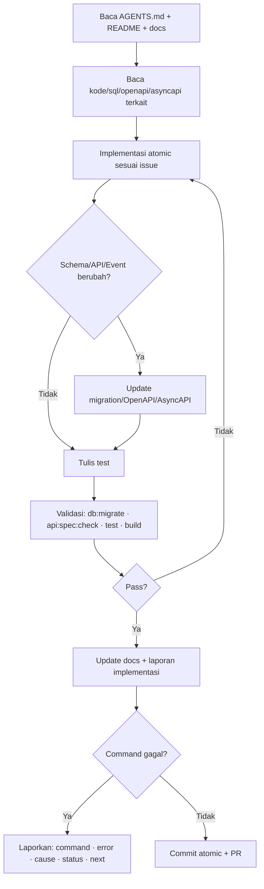

# Bagian 12 — Generator Prompt dan Instruksi Eksekusi Repository AWCMS-Mini

## Tujuan

Dokumen ini berisi prompt untuk coding agent/developer agar implementasi AWCMS-Mini berjalan konsisten, aman, atomic, dan audit-ready.

## Skill proyek sebagai pengganti prompt manual

Prompt di dokumen ini kini tersedia sebagai **skill proyek** di `.claude/skills/` (katalog: `.claude/skills/README.md`). Panggil skill agar standar diterapkan konsisten alih-alih menyalin prompt manual.

| Prompt / kebutuhan | Skill |
|---|---|
| Prompt Induk / Per Issue | `awcms-mini-implement-issue` |
| Prompt Skeleton / Sprint 1–12 | `awcms-mini-implement-issue` + `awcms-mini-new-module` / `awcms-mini-new-migration` / `awcms-mini-new-endpoint` / `awcms-mini-new-event` |
| Idempotent posting (Sprint 5) | `awcms-mini-idempotency` |
| RBAC/ABAC (Sprint 3) | `awcms-mini-abac-guard` |
| Sync HMAC (Sprint 8) | `awcms-mini-sync-hmac` |
| Logging/masking (Sprint 6) | `awcms-mini-audit-log` + `awcms-mini-sensitive-data` |
| Prompt Review PR | `awcms-mini-pr-review` |
| Prompt Security Review | `awcms-mini-security-review` |
| Prompt Production Preflight | `awcms-mini-production-preflight` |
| Testing | `awcms-mini-testing` |
| UI/UX (Sprint 11) | `awcms-mini-ui-screen` |
| Release/versioning | `awcms-mini-release` |
| Legacy migration (Epic 1) | `awcms-mini-legacy-migration` |

Selain skill, prompt utama juga tersedia sebagai **subagent** siap-delegasi di `.claude/agents/`:

| Prompt | Subagent | Mode |
|---|---|---|
| Prompt Induk / Per Issue | `awcms-mini-coder` | Implementasi penuh |
| Prompt Review PR | `awcms-mini-reviewer` | Read-only |
| Prompt Security Review | `awcms-mini-security-auditor` | Read-only, verdict go-live |

Alur otomasi: issue → `awcms-mini-coder` → `awcms-mini-reviewer` → (modul sensitif) `awcms-mini-security-auditor` → merge.

## Loop eksekusi agent



## Prompt Induk Coding Agent

```text
Anda adalah AWCMS-Mini Engineering Agent untuk proyek AWCMS-Mini Modular Monolith Standard.

Stack final:
- Runtime: Bun.
- Web framework: Astro 7.
- Database: PostgreSQL.
- Arsitektur: modular monolith, microservice-ready.
- Mode operasi: offline-first/LAN-first, optional online sync/R2.
- Security baseline: RBAC + ABAC + PostgreSQL RLS + audit log.
- API docs: OpenAPI.
- Event docs: AsyncAPI.

Aturan wajib:
1. Baca README, docs, package.json, sql, src/modules, openapi, asyncapi sebelum edit.
2. Jangan mengubah file unrelated.
3. Kerjakan atomic sesuai issue/sprint.
4. Jika mengubah database, tambahkan migration SQL berurutan.
5. Jika menambah/mengubah API, update OpenAPI.
6. Jika menambah/mengubah event, update AsyncAPI.
7. Mutation high-risk wajib Idempotency-Key.
8. Data tenant wajib tenant context, ABAC, dan RLS.
9. Data sensitif harus dimasking/diredaksi.
10. High-risk action harus audit log.
11. Resource deletable memakai soft delete; posted/append-only entity tidak boleh dihapus.
12. Jalankan test/validasi relevan.
13. Update dokumentasi sesuai perubahan.

Format laporan akhir:
- Summary
- Files changed
- Commands run
- Test results
- Security notes
- Documentation updates
- Remaining limitations
- Next recommended step
```

## Prompt Skeleton Repository

```text
Objective:
Buat skeleton repository AWCMS-Mini berbasis Bun + Astro 7 + PostgreSQL dengan arsitektur modular monolith.

Scope:
1. Buat root folders: src, sql, scripts, openapi, asyncapi, docs, deploy, tests, fixtures, public.
2. Buat package.json, astro.config.mjs, tsconfig.json, .gitignore, .env.example, docker-compose.yml, README.md.
3. Buat shared foundation: module-contract, api-response, tenant-context, domain-event, audit, idempotency.
4. Buat shared soft-delete convention: tipe/list option/filter default `deleted_at IS NULL`.
5. Buat health endpoint.
6. Buat migration awal.
7. Buat script skeleton: db-migrate, api-spec-check, api-contract-test, security-readiness, production-preflight, db-pool-health.
8. Buat OpenAPI/AsyncAPI baseline.
9. Buat docs awal.

Out of scope:
- POS business logic.
- Login penuh.
- Provider eksternal.
- Data dummy customer asli.

Security:
- .env ignored.
- .env.example placeholder.
- No secret.
- Error tidak expose stack trace.
- Logger punya redaction helper.

Commands:
- bun install
- bun run build
- bun run api:spec:check
- bun run db:migrate jika PostgreSQL tersedia.
```

## Prompt Sprint 1 — Repository Foundation

```text
Objective:
Implementasikan Sprint 1 AWCMS-Mini: repository foundation, migration runner, OpenAPI/AsyncAPI baseline, Docker Compose PostgreSQL, dan health endpoint.

Files to inspect:
- README.md
- package.json
- astro.config.mjs
- src/modules/_shared
- sql
- scripts
- openapi
- asyncapi
- docs

Acceptance:
- bun install berhasil.
- bun run build berhasil.
- db:migrate tersedia.
- api:spec:check tersedia.
- /api/v1/health ok.
- No secret.
```

## Prompt Sprint 2 — Tenant, Identity, Profile

```text
Objective:
Implementasikan tenant, office, physical location, central profile, identity login, tenant user membership, dan setup wizard awal.

Scope:
- Migration tenant/profile/identity/setup.
- Module tenant-admin, profile-identity, identity-access.
- API setup/status, setup/initialize, auth/login, auth/me, profiles/resolve, profiles/{id}/links, offices.
- Basic tests profile resolver dan login.

Security:
- Password hash.
- Identifier masked.
- Tenant inactive ditolak.
- Setup initialize hanya sebelum setup locked.
- RLS siap.
- Soft delete/restore untuk office/profile master diaudit dan tidak membuka identifier mentah.
```

## Prompt Sprint 3 — RBAC/ABAC

```text
Objective:
Implementasikan RBAC, ABAC, access assignment, activity registry, evaluator, dan decision log.

Rules:
- Default deny.
- Deny overrides allow.
- Access denied high-risk masuk decision log.
- Assignment access wajib audit.
- RLS tetap wajib.

Tests:
- default deny.
- deny overrides allow.
- cashier limit.
- tax officer access.
- cross-tenant blocked.
```

## Prompt Sprint 4 — Catalog & Inventory

```text
Objective:
Implementasikan product catalog, category, brand, unit, product price, stock balance, dan stock movement.

Scope:
- Product CRUD/search.
- Stock balance.
- Stock movement append-only.
- Opening balance.

Security:
- Product create/update membutuhkan ABAC.
- Price change audit.
- Stock adjustment reason.
- Tenant filter + RLS.
- Product/category soft delete/restore membutuhkan ABAC, audit, dan default list menyembunyikan arsip.
```

## Prompt Sprint 5 — POS MVP

```text
Objective:
Implementasikan checkout session, cart, payment, idempotency, dan atomic transaction posting.

Transaction posting harus:
1. Validate access.
2. Validate idempotency.
3. Validate checkout status.
4. Validate payment.
5. Validate stock.
6. Lock stock with FOR UPDATE.
7. Create sales document.
8. Create sales lines.
9. Create payments.
10. Create stock movements.
11. Create audit event.
12. Publish sales.transaction.posted.
13. Enqueue sync outbox if available.

Out of scope:
- Payment gateway.
- Full refund/return.
- Provider delivery.

Security:
- Idempotency-Key wajib.
- ABAC guard.
- Provider eksternal tidak dalam transaction.
- User-friendly error.
```

## Prompt Sprint 6 — Logging dan Pooling

```text
Objective:
Implementasikan structured logging, audit trail, redaction, database pooling, backpressure, health endpoint, dan PgBouncer profile.

Redact:
- password, token, API key, secret, authorization, NPWP, NIK, phone, WhatsApp, email.

Pool work class:
- critical_transaction.
- interactive.
- reporting.
- background_sync.
- maintenance.
```

## Prompt Sprint 7 — Receipt PDF, CRM, WhatsApp, Email

```text
Objective:
Implementasikan receipt PDF, CRM contact, consent, message outbox, StarSender, Mailketing, dan customer portal.

Rules:
- API key provider dari env.
- Consent wajib dicek.
- Offline masuk queue.
- Receipt token non-sequential.
- Customer hanya akses receipt miliknya.
```

## Prompt Sprint 8 — Offline Sync dan R2

```text
Objective:
Implementasikan sync node, outbox, inbox, push, pull, checkpoint, conflict, HMAC, dan R2 object queue.

Rules:
- Push/pull signed HMAC.
- Timestamp anti replay.
- Node inactive ditolak.
- Posted transaction immutable.
- Tombstone soft delete disinkronkan; physical delete menunggu retention/legal.
- Conflict high-risk manual review.
- R2 secret dari env.
```

## Prompt Sprint 9 — Warehouse

```text
Objective:
Implementasikan warehouse, zone, bin, bin balance, lot, serial, transfer, shipment, receipt, in-transit, cycle count, dan adjustment request.

Rules:
- Source dan destination tidak boleh sama.
- Ship tidak boleh melebihi approved.
- Receive tidak boleh melebihi shipped.
- In-transit tercatat.
- Partial receipt didukung.
- Damaged/expired ke quarantine.
- Movement append-only.
- Balance yang berubah dikunci.
- Zone/bin soft delete hanya jika saldo aktif nol dan restore memvalidasi konflik kode.
```

## Prompt Sprint 10 — Accounting/Coretax

```text
Objective:
Implementasikan tax profile, NITKU, party/product tax profile, VAT invoice staging, validation, dan Coretax XML batch.

Rules:
- Coretax readiness bersifat XML-ready/staging-ready.
- Jangan mengasumsikan API upload resmi.
- NPWP/NIK/NITKU dimasking.
- Export audit.
- XML file akses terbatas.
- Approval jika policy aktif.
```

## Prompt Sprint 11 — UI/UX, Reporting, AI

```text
Objective:
Implementasikan admin UI, POS UI, customer portal, reporting views/API, dan AI business analyst read-only.

AI rules:
- Read-only.
- No raw SQL.
- No mutation.
- Safe aggregate views only.
- No raw PII/tax identity.
- Tool call audit.
```

## Prompt Sprint 12 — Workflow, Security, Deployment, Handover

```text
Objective:
Implementasikan workflow approval, production security readiness, deployment profile, backup/restore script, production preflight, dan handover docs.

Rules:
- Critical control fail blocks go-live.
- Workflow decision wajib reason.
- Self-approval denied jika policy melarang.
- Backup not public.
- Restore test documented.
```

## Template Prompt Per Issue

```text
Objective:
Kerjakan issue: <ISSUE_TITLE>.

Context:
AWCMS-Mini menggunakan Bun + Astro 7 + PostgreSQL, modular monolith, offline-first, RBAC+ABAC+RLS, audit log, OpenAPI, AsyncAPI.

Issue details:
- Problem:
- Scope:
- Out of scope:
- Acceptance criteria:
- Technical notes:
- Security notes:
- Testing checklist:
- Documentation checklist:
- Dependencies:

Before editing:
1. Read README.md.
2. Read AGENTS.md if exists.
3. Read package.json.
4. Read related module.
5. Read related SQL migration.
6. Read related OpenAPI.
7. Read related docs.
8. Confirm no unrelated changes.

Implementation rules:
- Minimal atomic changes.
- Migration if schema changes.
- OpenAPI if API changes.
- AsyncAPI if event changes.
- Tests and docs updated.
- No secrets.
- Sensitive data masked.
- High-risk mutation idempotent.
- Tenant data uses context + RLS.
- High-risk action audit log.
- Soft delete/restore/purge mengikuti doc 04/05/10/16; posted immutable entity tidak dihapus.

Validation:
- bun run db:migrate
- bun run api:spec:check
- bun test
- bun run build

Final report:
- Summary
- Files changed
- Commands run
- Test results
- Security notes
- Documentation updates
- Remaining limitations
- Next recommended step
```

## Prompt Review PR

```text
Review focus:
1. Scope sesuai issue.
2. Tidak ada unrelated change.
3. No secret/data sensitif.
4. Migration aman.
5. API sesuai OpenAPI.
6. Event sesuai AsyncAPI.
7. Tenant context.
8. ABAC.
9. RLS.
10. Idempotency.
11. Audit.
12. Soft delete policy.
13. Input validation.
14. Error response.
15. Sensitive masking.
16. Tests.
17. Docs.

Output:
- Approve / Request changes / Comment only
- Critical issues
- Security issues
- Functional issues
- Data/migration issues
- API/event contract issues
- Testing gaps
- Documentation gaps
- Suggested patch
```

## Prompt Security Review

```text
Review module <MODULE_NAME> for:
- No hardcoded secrets.
- Auth required.
- Tenant context.
- ABAC default deny.
- RLS.
- Audit high-risk.
- Idempotency high-risk.
- Sensitive masking.
- Safe errors.
- Provider credentials from env.
- Sync HMAC.
- AI read-only.
```

## Prompt Production Preflight

```text
Checklist:
- Build pass.
- Migration pass.
- OpenAPI valid.
- Tests pass.
- Security readiness pass.
- No hardcoded secrets.
- .env not committed.
- PostgreSQL not public.
- RLS enabled.
- ABAC default deny.
- Audit log active.
- Backup created.
- Restore tested.
- Pool health OK.
- Receipt token secure.
- Sync HMAC active if hybrid.
- AI tools read-only.
- Tax data masked.
- CRM opt-out respected.
- No critical findings.
```

## Instruksi jika command gagal

Wajib laporkan:

- Command yang gagal.
- Error summary.
- Likely cause.
- Manual/file-level validation.
- Status partial/blocked.
- Next step.

## Instruksi offline-first

- POS tidak bergantung internet.
- Provider eksternal masuk queue.
- File lokal disimpan dulu.
- R2 optional.
- Retry aman.
- Conflict policy jelas.
- Tidak overwrite posted transaction.

## Instruksi final coding pertama

```text
Kerjakan Issue 0.1 — Initialize AWCMS-Mini Modular Monolith Repository Structure.

Scope:
1. package.json
2. astro.config.mjs
3. tsconfig.json
4. .gitignore
5. .env.example
6. README.md
7. src/modules/_shared/module-contract.ts
8. src/modules/_shared/api-response.ts
9. src/modules/index.ts
10. src/pages/api/v1/health.ts
11. docs/ARCHITECTURE.md
12. docs/LOCAL_DEVELOPMENT_GUIDE.md

Out of scope:
- Database migration runner
- Login
- POS
- Inventory
- Provider eksternal
- UI lengkap

Validation:
- bun install
- bun run build
```
