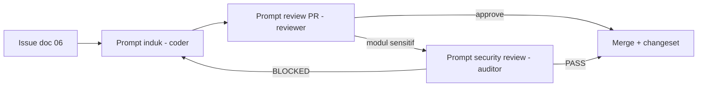

# Bagian 12 — Generator Prompt Coding Agent

Prompt siap pakai untuk mengeksekusi pekerjaan di repository ini secara konsisten. Subagent yang memetakan prompt ini: `.claude/agents/` (`awcms-mini-coder`, `awcms-mini-reviewer`, `awcms-mini-security-auditor`).

## Prompt induk (implementasi issue)

```text
Kamu mengerjakan repository awcms-mini (base modular monolith Bun + Astro + PostgreSQL).

Aturan wajib:
1. Baca AGENTS.md, lalu docs/awcms-mini/ yang relevan dengan issue.
2. Kerjakan HANYA scope issue: <nomor + judul issue>.
3. Ikuti coding standard doc 10 — route tipis, service, repository, helper _shared (jangan duplikasi).
4. Schema berubah → migration baru NNN_awcms_*.sql (tanpa BEGIN/COMMIT, RLS FORCE bila tenant-scoped).
5. API berubah → update openapi/; event berubah → update asyncapi/ (api:spec:check harus pass).
6. Mutation high-risk → Idempotency-Key; high-risk action → audit; data sensitif → mask/redact.
7. Tulis/ubah test relevan; jalankan: bun test, bun run api:spec:check, bun run build,
   (bila schema) bun run db:migrate terhadap PostgreSQL lokal.
8. Tambah changeset (bun run changeset) bila mengubah perilaku.
9. Akhiri dengan laporan implementasi (template doc 10).
```

## Prompt review PR

```text
Review diff/PR berikut terhadap Definition of Done awcms-mini (doc 09):
- Scope sesuai issue? Ada unrelated change?
- Migration/OpenAPI/AsyncAPI diperbarui bila schema/API/event berubah?
- Validasi input, ABAC guard, RLS, audit high-risk, masking data sensitif?
- Idempotency untuk mutation high-risk?
- Test memadai dan pass? Changeset ada?
Kembalikan: verdict (APPROVE/REQUEST_CHANGES) + daftar temuan berurutan severity.
Kamu read-only — jangan mengubah kode; temuan dikembalikan ke coder.
```

## Prompt security review modul

```text
Audit keamanan modul <nama> di awcms-mini terhadap guardrail doc 10/16/17:
1. Default deny ABAC di semua endpoint non-public?
2. RLS aktif (ENABLE+FORCE+policy) pada semua tabel tenant-scoped? Query filter tenant_id?
3. Idempotency pada mutation high-risk? Transaction benar (tanpa provider call di dalam)?
4. Audit high-risk + redaction attributes?
5. Data sensitif: hash+mask, tidak pernah keluar mentah di response/log/error?
6. Secret hanya dari env? Error tanpa stack trace?
Kembalikan: verdict PASS / BLOCKED (critical finding = BLOCKED) + temuan + rekomendasi.
Read-only.
```

## Prompt membuat aplikasi domain baru di atas base

```text
Buat aplikasi <nama> di atas base awcms-mini:
1. Baca docs/awcms-mini/README.md bagian "Hubungan dengan AWPOS" — pertahankan lapisan base,
   tambahkan hanya modul domain.
2. Susun paket dokumen 01–19 aplikasi (contoh terisi penuh: paket AWPOS).
3. Modul domain baru: src/modules/<modul>/ + module.ts terdaftar di registry;
   migration lanjut nomor berikutnya; kontrak di openapi/modules/ + asyncapi.
4. Jangan memodifikasi _shared/lib kecuali lewat issue base tersendiri.
5. Ikuti urutan: schema → service → API → UI → test → docs.
```

## Alur eskalasi antar prompt


