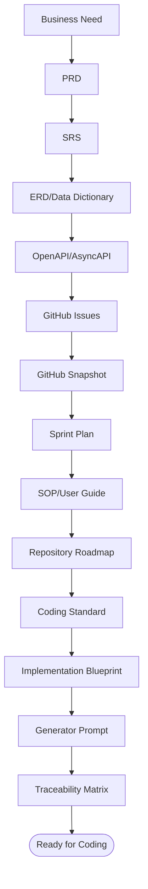

# Bagian 13 — Final Master Index dan Traceability Matrix

> **Contoh domain (ilustratif).** Dokumen ini memakai domain retail/POS bergaya AWPOS sebagai contoh berjalan. **Pola & standar**-nya reusable untuk base AWCMS-Mini; **entitas, endpoint, layar, dan istilah domain** (produk, POS, gudang, pajak, CRM, AI, dsb.) adalah ilustrasi yang **diganti** oleh aplikasi turunan. Lihat [README paket dokumen](README.md) §Reusable vs domain turunan.

## Tujuan

Dokumen ini menjadi master index final untuk seluruh paket dokumen AWCMS-Mini, sekaligus traceability matrix dari kebutuhan bisnis sampai implementasi, test, security, SOP, dan production readiness.

## Master index dokumen

| Bagian | File                                                                                                                | Fungsi                                                                                         |
| -----: | ------------------------------------------------------------------------------------------------------------------- | ---------------------------------------------------------------------------------------------- |
|      1 | `01_canvas_induk.md`                                                                                                | Canvas arsitektur dan fase pengembangan                                                        |
|      2 | `02_prd_detail_per_modul.md`                                                                                        | Kebutuhan produk per modul                                                                     |
|      3 | `03_srs_detail_per_modul.md`                                                                                        | Spesifikasi teknis per modul                                                                   |
|      4 | `04_erd_data_dictionary.md`                                                                                         | ERD, data dictionary, RLS, index                                                               |
|      5 | `05_openapi_asyncapi_detail.md`                                                                                     | API contract dan event contract                                                                |
|      6 | `06_github_issues_detail.md`                                                                                        | Issue atomic siap copy-paste                                                                   |
|      7 | `07_sprint_testing_production_readiness.md`                                                                         | Sprint, testing, go-live                                                                       |
|      8 | `08_sop_operasional_user_guide.md`                                                                                  | SOP operasional dan user guide                                                                 |
|      9 | `09_roadmap_repository_commit.md`                                                                                   | Roadmap repo, branch, commit, release                                                          |
|     10 | `10_template_kode_coding_standard.md`                                                                               | Template kode dan coding standard                                                              |
|     11 | `11_implementation_blueprint.md`                                                                                    | Skeleton dan blueprint per sprint                                                              |
|     12 | `12_generator_prompt.md`                                                                                            | Prompt eksekusi coding agent                                                                   |
|     13 | `13_final_master_index_traceability.md`                                                                             | Master index dan traceability                                                                  |
|     14 | `14_ui_ux_design_system.md`                                                                                         | Design system, token, komponen, layar, a11y, i18n                                              |
|     15 | `15_frontend_architecture_integration.md`                                                                           | Arsitektur frontend, API client, auth, offline-first                                           |
|     16 | `16_backend_data_access_integration.md`                                                                             | Data access, pooling, RLS, transaction, outbox                                                 |
|     17 | `17_default_seed_rbac_abac.md`                                                                                      | Role default, permission matrix, ABAC policy, seed                                             |
|     18 | `18_configuration_env_reference.md`                                                                                 | Referensi env, feature flag, topologi deployment                                               |
|     19 | `19_glossary_terminology.md`                                                                                        | Glossary & terminologi lintas dokumen                                                          |
|     20 | `20_threat_model_security_architecture.md`                                                                          | Threat model (STRIDE), trust boundary, kontrol keamanan berlapis (dokumen base)                |
|    ADR | `../adr/README.md`                                                                                                  | Architecture Decision Records (keputusan base + alasan)                                        |
|   Gov. | `../../GOVERNANCE.md`, `../../CONTRIBUTING.md`, `../../SECURITY.md`, `../../CODE_OF_CONDUCT.md`, `../../SUPPORT.md` | Tata kelola, kontribusi, keamanan, komunitas                                                   |
|     CI | `../../.github/workflows/`                                                                                          | CodeQL + CI: lint, docs-check, typecheck, unit test, hygiene (Bun-only, no-`.env`)             |
|  Tools | `../../scripts/`, `../../tests/`                                                                                    | Pemeriksa docs Bun-native (`scripts/lib/docs-checks.mjs`) + unit/integration test (`bun test`) |
| GitHub | `github/README.md`                                                                                                  | Snapshot issue aktual, label, milestone, dan proses refresh                                    |

## Executive summary final

AWCMS-Mini adalah standar modular monolith berbasis AWCMS-Mini dengan stack final:

```text
Bun-only backend + Astro 7 + PostgreSQL + Modular Monolith + Offline-first/LAN-first
```

Keputusan teknis:

1. PostgreSQL sebagai database utama.
2. Bun sebagai runtime dan backend platform; Node.js hanya boleh lewat pengecualian tertulis bila Bun belum mendukung capability yang diperlukan.
3. Astro 7 sebagai web framework.
4. Modular monolith, microservice-ready.
5. Offline-first/LAN-first.
6. Optional online sync.
7. Optional Cloudflare R2.
8. Optional StarSender/Mailketing.
9. Optional AI analyst via safe views.
10. RBAC + ABAC + RLS + Audit Log.
11. Coretax-ready via staging/XML/checksum/approval/audit.
12. Soft delete tenant-safe untuk master/config/draft; posted/append-only entity tetap immutable.

## Rantai traceability


## Traceability — Business Need ke Modul

| Business Need            | Modul                 | Output                             |
| ------------------------ | --------------------- | ---------------------------------- |
| Multi tenant toko/cabang | Tenant Admin          | Tenant, office, physical location  |
| User login dan role      | Identity & Access     | Identity, tenant user, role        |
| Hak akses fleksibel      | Identity & Access     | RBAC, ABAC, decision log           |
| Profil terpusat          | Central Profile       | Profile, identifier, entity link   |
| Master produk            | Catalog Inventory     | Product, category, unit, price     |
| Arsip master data aman   | Semua modul master    | Soft delete, restore, purge policy |
| Stok toko/gudang         | Catalog Inventory     | Balance, movement                  |
| Transaksi operasional    | Sales POS             | Checkout, payment, sales document  |
| Posting aman             | Sales POS + Inventory | Idempotency, stock lock, audit     |
| Shared stock             | Shared Stock Routing  | Pool, routing rule, decision       |
| Multi gudang             | Warehouse             | Warehouse, bin, lot, transfer      |
| Receipt digital          | CRM                   | PDF, WA/email outbox, portal       |
| Offline sync             | Sync Storage          | Outbox, inbox, conflict            |
| Data pajak               | Accounting Tax        | Tax profile, NITKU, VAT invoice    |
| Coretax-ready            | Accounting Tax        | XML batch, checksum, approval      |
| Dashboard                | Reporting             | Sales/stock/tax/sync reports       |
| AI insight               | AI Analyst            | Safe read-only tools               |
| UI admin/operator        | UI Experience         | Admin shell, POS screen            |
| Audit/troubleshooting    | Observability         | Logs, audit, security events       |
| DB reliability           | DB Connectivity       | Pool, queue, circuit breaker       |
| Approval high-risk       | Workflow              | Workflow instance/task/decision    |
| Go-live aman             | Production Security   | Readiness, findings, gates         |

## Traceability — PRD → SRS → ERD → API → Issue → Sprint → Test

| Need               | SRS Area              | Tabel                                              | API                                | Issue            | Sprint | Test                 |
| ------------------ | --------------------- | -------------------------------------------------- | ---------------------------------- | ---------------- | -----: | -------------------- |
| Setup tenant       | Tenant Admin          | `awcms_mini_tenants`, `awcms_mini_offices`         | `/setup/initialize`                | 12.1             |    1–2 | setup test           |
| Login              | Identity              | `awcms_mini_identities`, `awcms_mini_tenant_users` | `/auth/login`                      | 2.3              |      2 | login test           |
| Access control     | ABAC                  | `awcms_mini_roles`, `awcms_mini_abac_policies`     | `/access/evaluate`                 | 2.4              |      3 | default deny         |
| Customer profile   | Profile               | `awcms_mini_profiles`, identifiers                 | `/profiles/resolve`                | 2.2              |      2 | resolver             |
| Product            | Inventory             | `awcms_mini_products`                              | `/inventory/products`              | 3.1              |      4 | CRUD/search          |
| Soft delete master | Shared + modul domain | `deleted_at`, `deleted_by`                         | `DELETE/restore/includeDeleted`    | 0.1/0.3 + domain |    1–4 | archive/restore      |
| Stock              | Inventory             | `awcms_mini_stock_balances`, movements             | `/inventory/stock-balances`        | 3.2              |      4 | movement             |
| Checkout           | Sales                 | `awcms_mini_checkout_sessions`                     | `/sales/checkout-sessions`         | 3.3              |      5 | checkout             |
| Posting            | Sales                 | `awcms_mini_sales_documents`, idempotency          | `/sales/.../post`                  | 3.4              |      5 | idempotency/rollback |
| Receipt            | CRM                   | `awcms_mini_receipt_pdfs`                          | `/crm/receipts/{id}/send`          | 5.1              |      7 | PDF                  |
| WA/email           | CRM                   | `awcms_mini_message_outbox`                        | `/crm/receipts/{id}/send`          | 5.2/5.3          |      7 | provider mock        |
| Sync               | Sync                  | `awcms_mini_sync_outbox`, inbox                    | `/sync/push`                       | 6.1              |      8 | HMAC                 |
| Conflict           | Sync                  | `awcms_mini_sync_conflicts`                        | `/sync/conflicts/{id}/resolve`     | 6.2              |      8 | conflict             |
| Warehouse          | WMS                   | `awcms_mini_warehouses`, bins                      | `/warehouses`                      | 4.1              |      9 | location             |
| Transfer           | WMS                   | transfer tables                                    | `/warehouse-transfers`             | 4.3              |      9 | transfer             |
| Cycle count        | WMS                   | cycle count tables                                 | `/cycle-counts`                    | 4.4              |      9 | variance             |
| VAT invoice        | Tax                   | `awcms_mini_vat_invoices`                          | `/tax/vat-invoices/generate`       | 7.3              |     10 | validation           |
| Coretax            | Tax                   | `awcms_mini_coretax_batches`                       | `/tax/coretax/batches`             | 7.4              |     10 | XML/checksum         |
| UI                 | UI                    | UI registry                                        | `/ui/navigation`                   | 8.1/8.2          |     11 | render               |
| Reports            | Reporting             | report views                                       | `/reports/sales/daily`             | 9.1              |     11 | tenant-aware         |
| AI                 | AI                    | `awcms_mini_ai_tool_calls`                         | `/ai/business-analyst/chat`        | 9.2              |     11 | no PII/SQL           |
| Logs               | Observability         | `awcms_mini_log_events`                            | `/logs/recent`                     | 10.1             |      6 | redaction            |
| Pooling            | DB                    | `awcms_mini_db_pool_*`                             | `/database/pool/health`            | 10.2             |      6 | health/load          |
| Workflow           | Workflow              | `awcms_mini_workflow_*`                            | `/workflow/tasks/{id}/decision`    | 11.1             |     12 | approval             |
| Security           | Security              | `awcms_mini_security_*`                            | `/security/go-live-gates/evaluate` | 10.3             |     12 | go-live gate         |

## Matrix Modul vs Migration

| Modul                 | Migration                                                        |
| --------------------- | ---------------------------------------------------------------- |
| Foundation            | `001_awcms_mini_foundation_schema.sql`                           |
| Tenant Admin          | `002_awcms_mini_tenant_identity_schema.sql`                      |
| Catalog Inventory     | `003_awcms_mini_catalog_inventory_schema.sql`                    |
| Sales POS             | `004_awcms_mini_sales_pos_schema.sql`                            |
| Sync Storage          | `005_awcms_mini_sync_storage_r2_schema.sql`                      |
| CRM                   | `006_awcms_mini_crm_receipt_communication_schema.sql`            |
| Accounting Tax        | `007_awcms_mini_accounting_tax_coretax_schema.sql`               |
| AI                    | `008_awcms_mini_ai_hermes_business_analyst_schema.sql`           |
| i18n                  | `009_awcms_mini_i18n_po_schema.sql`                              |
| Theme                 | `010_awcms_mini_theme_mode_schema.sql`                           |
| ABAC                  | `011_awcms_mini_abac_access_control_schema.sql`                  |
| Contracts             | `012_awcms_mini_modular_monolith_contracts_schema.sql`           |
| Logging               | `013_awcms_mini_logging_observability_schema.sql`                |
| Profile               | `014_awcms_mini_central_profile_management_schema.sql`           |
| Profile Stabilization | `015_awcms_mini_profile_stabilization_schema.sql`                |
| Workflow              | `016_awcms_mini_workflow_approval_audit_schema.sql`              |
| Reporting             | `017_awcms_mini_management_dashboard_reporting_schema.sql`       |
| Legacy Migration      | `018_awcms_mini_legacy_migration_backfill_toolkit_schema.sql`    |
| Performance Sync      | `019_awcms_mini_performance_sync_validation_schema.sql`          |
| Production Security   | `020_awcms_mini_production_security_readiness_schema.sql`        |
| DB Pooling            | `021_awcms_mini_database_connection_pooling_schema.sql`          |
| UI Experience         | `022_awcms_mini_ui_ux_persona_experience_schema.sql`             |
| Warehouse             | `023_awcms_mini_warehouse_management_schema.sql`                 |
| Idempotency           | `024_awcms_mini_transaction_integrity_idempotency_hardening.sql` |
| Setup Wizard          | `025_awcms_mini_setup_wizard_extension.sql`                      |
| Dashboard Views       | `026_awcms_mini_dashboard_materialized_views.sql`                |

## Matrix Modul vs Security Control

| Control               | Modul                                                          |
| --------------------- | -------------------------------------------------------------- |
| No hardcoded secrets  | Semua                                                          |
| Password hashing      | Identity                                                       |
| Tenant isolation      | Semua tenant-scoped                                            |
| RBAC/ABAC             | Identity Access                                                |
| RLS                   | Semua tenant-scoped                                            |
| Audit log             | Observability + semua high-risk                                |
| Idempotency           | POS, Warehouse, Tax, CRM, Sync, Workflow                       |
| Soft delete           | Master/config/draft tenant-scoped; restore/purge by permission |
| Input validation      | Semua API                                                      |
| Sensitive masking     | Profile, CRM, Tax, Logs, AI                                    |
| Stock lock            | Inventory, POS, Warehouse                                      |
| Immutable transaction | Sales POS                                                      |
| Sync HMAC             | Sync                                                           |
| File checksum         | Sync/R2, Tax export                                            |
| Consent               | CRM                                                            |
| AI read-only          | AI Analyst                                                     |
| Tax export approval   | Tax + Workflow                                                 |
| Go-live gate          | Production Security                                            |
| Backup/restore        | Deployment/Ops                                                 |

## Matrix Security Control vs Skill

| Control                               | Skill penegak                                                                                          |
| ------------------------------------- | ------------------------------------------------------------------------------------------------------ |
| Tenant isolation + RBAC/ABAC + RLS    | `awcms-mini-abac-guard`                                                                                |
| Idempotency high-risk                 | `awcms-mini-idempotency`                                                                               |
| Audit log high-risk                   | `awcms-mini-audit-log`                                                                                 |
| Sensitive masking                     | `awcms-mini-sensitive-data`                                                                            |
| Sync HMAC + file checksum             | `awcms-mini-sync-hmac`                                                                                 |
| Migration aman (RLS/index)            | `awcms-mini-new-migration`                                                                             |
| Soft delete policy                    | `awcms-mini-new-migration`, `awcms-mini-new-endpoint`, `awcms-mini-abac-guard`, `awcms-mini-audit-log` |
| API/event contract                    | `awcms-mini-new-endpoint`, `awcms-mini-new-event`                                                      |
| Testing berlapis                      | `awcms-mini-testing`                                                                                   |
| Review keamanan                       | `awcms-mini-security-review` + agent `awcms-mini-security-auditor`                                     |
| Review PR / DoD                       | `awcms-mini-pr-review` + agent `awcms-mini-reviewer`                                                   |
| Go-live gate                          | `awcms-mini-production-preflight`                                                                      |
| Profil deployment (LAN-first/Coolify) | `awcms-mini-deploy`                                                                                    |
| UI/design system/a11y                 | `awcms-mini-ui-screen`                                                                                 |
| Form multi-step (wizard)              | `awcms-mini-wizard-form`                                                                               |
| Server-side draft persistence         | `awcms-mini-form-drafts`                                                                               |
| Kirim email transaksional             | `awcms-mini-email`                                                                                     |
| Rilis/CHANGELOG                       | `awcms-mini-release`                                                                                   |
| Legacy migration                      | `awcms-mini-legacy-migration`                                                                          |
| Implementasi issue                    | skill `awcms-mini-implement-issue` + agent `awcms-mini-coder`                                          |
| Snapshot docs GitHub                  | `awcms-mini-github-snapshot`                                                                           |

## Matrix Modul vs SOP

| SOP                   | Modul utama                    |
| --------------------- | ------------------------------ |
| Instalasi awal        | Deployment/Foundation          |
| Setup tenant          | Tenant Admin                   |
| Tambah user/role      | Identity + Profile             |
| Input produk          | Inventory                      |
| Input stok awal       | Inventory/Warehouse            |
| Transaksi operasional | Sales POS                      |
| Cancel/retur          | Sales POS + Workflow           |
| Warehouse transfer    | Warehouse                      |
| Cycle count           | Warehouse                      |
| Stock adjustment      | Inventory/Warehouse + Workflow |
| Receipt WA/email      | CRM                            |
| Customer portal       | CRM/UI                         |
| Offline sync          | Sync                           |
| Pajak/Coretax         | Accounting Tax                 |
| Reporting             | Reporting                      |
| AI Analyst            | AI                             |
| Backup/restore        | Deployment/Database            |
| Troubleshooting       | Observability/DB               |
| Handover              | Semua                          |

## Matrix kesiapan implementasi

Kelengkapan dokumen per kebutuhan implementasi. "Design/spec ready" = cukup untuk mulai koding; DDL penuh & schema OpenAPI penuh sengaja diproduksi per-migration/per-endpoint saat implementasi (bukan pra-tulis).

| Kebutuhan                                   | Dokumen           | Status                                    |
| ------------------------------------------- | ----------------- | ----------------------------------------- |
| Arsitektur & fase                           | 01                | Ready                                     |
| Kebutuhan produk & teknis                   | 02, 03            | Ready                                     |
| ERD & data dictionary                       | 04                | Ready (ringkas; DDL penuh per-migration)  |
| Kontrak API/event                           | 05                | Ready (daftar; schema penuh per-endpoint) |
| Issue, sprint, testing                      | 06, 07            | Ready                                     |
| SOP operasional                             | 08                | Ready                                     |
| Roadmap, coding standard, blueprint, prompt | 09–12             | Ready                                     |
| **UI/UX design system & layar**             | 14                | Ready                                     |
| **Frontend & integrasi (offline-first)**    | 15                | Ready                                     |
| **Backend data access & DB integrasi**      | 16                | Ready                                     |
| **Seed, RBAC, ABAC policy**                 | 17                | Ready                                     |
| **Konfigurasi & environment**               | 18                | Ready                                     |
| Skill proyek                                | `.claude/skills/` | Ready                                     |

Diproduksi saat implementasi (bukan pra-tulis): DDL lengkap tiap tabel (via migration), schema request/response penuh tiap endpoint (via OpenAPI), string i18n aktual, dan aset UI final.

## Implementation start recommendation

Urutan coding paling aman:

1. Issue 0.1 — Repository skeleton.
2. Issue 0.2 — SQL migration runner.
3. Issue 0.3 — OpenAPI/AsyncAPI baseline.
4. Issue 12.1 — Initial setup wizard API.
5. Issue 2.1 — Tenant and office schema.
6. Issue 2.2 — Central profile schema.
7. Issue 2.3 — Identity login.
8. Issue 2.4 — RBAC/ABAC.
9. Issue 3.1 — Product catalog.
10. Issue 3.2 — Stock balance/movement.
11. Issue 3.3 — Checkout/cart.
12. Issue 3.4 — Atomic transaction posting.

Alasan:

- Aplikasi domain tidak aman tanpa tenant/auth/profile/access.
- Transaksi tidak boleh sebelum idempotency dan stock lock.
- Provider eksternal tidak boleh didahulukan.
- AI menunggu reporting safe views.
- Coretax menunggu sales posted dan tax profile.

## Minimal MVP Boundary

| Area               | Minimum                                        |
| ------------------ | ---------------------------------------------- |
| Tenant             | tenant, office, setup locked                   |
| Auth               | owner/admin/operator login                     |
| Access             | role dasar, ABAC default deny                  |
| Profile            | customer profile resolver                      |
| Product            | create/list/search product                     |
| Stock              | balance, movement                              |
| POS                | checkout, cart, payment, post                  |
| Transaction safety | idempotency, stock lock, rollback              |
| Receipt            | PDF local                                      |
| Audit              | transaction audit                              |
| Backup             | pg_dump + restore tested                       |
| Docs               | admin/operator SOP basic                       |
| Soft delete        | master data hidden by default, restore audited |

## Production-ready Boundary

- MVP usable selesai.
- RLS aktif dan diuji.
- ABAC default deny diuji.
- Audit high-risk aktif.
- Soft delete/restore/purge policy aktif untuk resource deletable.
- No critical security finding.
- Backup restore tested.
- Pool health OK.
- POS concurrent test OK.
- Receipt token aman.
- Sync conflict policy tested jika hybrid.
- Tax masking aktif jika modul tax aktif.
- CRM opt-out respected jika CRM aktif.
- AI read-only jika AI aktif.
- SOP dan handover selesai.

## Repository artifact checklist

### Root

- `AGENTS.md`
- `README.md`
- `CHANGELOG.md` + `.changeset/` (versioning via Changesets)
- `.claude/skills/` (26 skill proyek + katalog README)
- `.claude/agents/` (3 subagent: coder, reviewer, security-auditor)
- `package.json`
- `astro.config.mjs`
- `tsconfig.json`
- `.env.example`
- `.gitignore`
- `docker-compose.yml`

### Folder standar

Tiap folder standar menyertakan `README.md` sebagai kontrak isi/aturan folder:

- `src/lib/README.md` — helper lintas-modul (`auth/`, `database/`, `errors/`, `files/`, `logging/`).
- `src/modules/_shared/README.md` — module contract, API response envelope, konvensi soft delete.
- `openapi/README.md` — kontrak OpenAPI publik dan kewajiban `api:spec:check`.
- `asyncapi/README.md` — kontrak AsyncAPI domain-event dan kewajiban pendaftaran channel.
- `deploy/README.md` — deployment profile (systemd, container, PgBouncer, backup) — Bun-only.
- `fixtures/README.md` — data uji sintetis; larangan data customer/dump/secret asli.

### Source modules

- `_shared`
- tenant-admin
- identity-access
- profile-identity
- catalog-inventory
- sales-pos
- warehouse-management
- accounting-tax
- crm-communication
- sync-storage
- ai-analyst
- observability-logging
- database-connectivity
- workflow-approval
- management-reporting
- ui-experience
- production-security-readiness

### Docs

Semua file `docs/awcms-mini/01` sampai `19` harus menjadi acuan sebelum coding. Dokumen `14`–`18` (UI/UX, frontend, backend/DB, seed/RBAC/ABAC, konfigurasi) melengkapi kesiapan implementasi; `19` adalah glossary rujukan istilah. Snapshot issue GitHub aktual ada di `docs/awcms-mini/github/` dan wajib direfresh bila state issue berubah.

## Final coding instruction

> **Catatan status (base selesai, v0.23.5).** Urutan bootstrap di bawah adalah rencana asli membangun base generik dari nol dan seluruhnya sudah tuntas (18 issue backlog doc 06 + peningkatan M9) — arsip, bukan pekerjaan baru. Untuk kontribusi baru lihat [`../../AGENTS.md`](../../AGENTS.md) §Mulai dari sini dan [`README.md`](README.md) §Langkah berikutnya.

```text
Mulai dari Issue 0.1.
Jangan lompat ke POS sebelum foundation, tenant, profile, auth, dan ABAC selesai.
Jangan integrasi provider eksternal sebelum core POS aman.
Jangan integrasi AI sebelum reporting safe views siap.
Jangan mengaktifkan production sebelum security readiness pass.
Jangan commit secret, dump database, data customer asli, atau .env.
```

## Penutup

Rantai implementasi AWCMS-Mini lengkap:

```text
Business Need
→ PRD
→ SRS
→ ERD/Data Dictionary
→ OpenAPI/AsyncAPI
→ GitHub Issues
→ GitHub Snapshot
→ Sprint Plan
→ SOP/User Guide
→ Repository Roadmap
→ Coding Standard
→ Implementation Blueprint
→ Generator Prompt
→ Traceability Matrix
→ Ready for Coding
```


