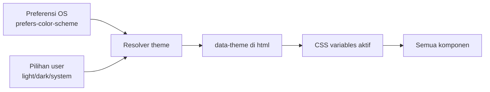
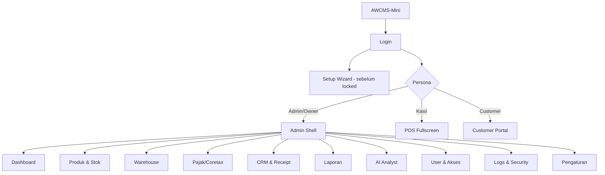
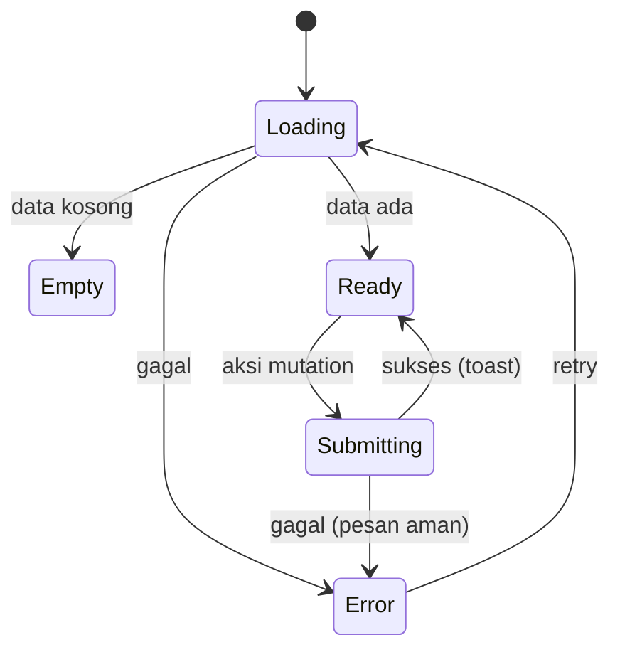
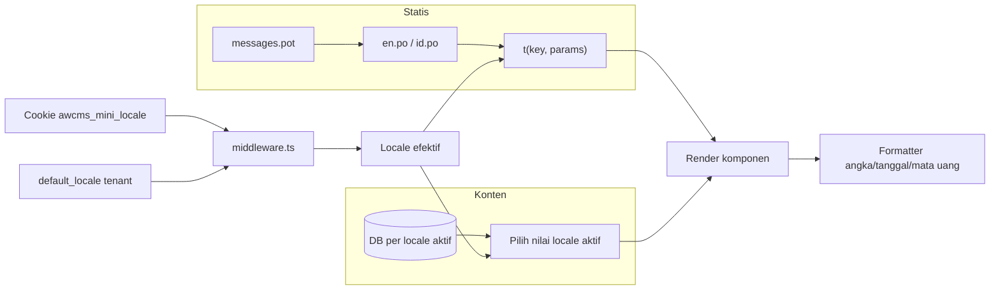

# Bagian 14 — UI/UX Design System dan Spesifikasi Layar

> **Standar base + contoh domain.** Dokumen ini adalah **standar/pola reusable** base AWCMS-Mini. Contoh yang dipakai memakai domain retail/POS bergaya AWPOS sebagai ilustrasi — ganti detail domainnya dengan kebutuhan aplikasi turunan Anda. Lihat [README paket dokumen](README.md) §Reusable vs domain turunan.

## Tujuan

Dokumen ini melengkapi kebutuhan **desain UI/UX** AWCMS-Mini yang sebelumnya hanya tersirat di SOP (doc 08) dan blueprint (doc 11). Berisi design principle, design token, component library, information architecture, spesifikasi layar (wireframe), state pattern, aksesibilitas, i18n, dan theming — agar frontend dapat diimplementasikan konsisten.

Terkait: `15_frontend_architecture_integration.md` (arsitektur & wiring), `08_sop_operasional_user_guide.md` (alur operasional). Skill penegak: **`awcms-mini-ui-screen`** (`.claude/skills/`).

## Prinsip desain UI/UX

1. **Offline-first terlihat** — status koneksi & sync selalu jelas; aksi tetap bisa saat offline.
2. **Keyboard-first untuk operator** — semua aksi POS dapat tanpa mouse.
3. **Role-aware** — navigasi & aksi menyesuaikan permission (bukan kontrol utama; backend tetap validasi).
4. **State eksplisit** — setiap layar punya loading, empty, error, dan success state.
5. **Aman** — tidak menampilkan data sensitif penuh; mengikuti masking (doc 04).
6. **Aksesibel** — target WCAG 2.1 AA, kontras cukup, fokus terlihat, navigasi keyboard.
7. **Responsif** — admin desktop-first, operator fullscreen, customer portal mobile-first.
8. **Konsisten** — semua layar memakai token & komponen yang sama.

## Design tokens

Token diimplementasikan sebagai CSS custom properties, di-scope ke `:root` dan override via `:root[data-theme="dark"]`. Nilai berikut adalah **placeholder brand-neutral** yang boleh diganti brand tenant.

### Warna semantik

| Token                      | Light     | Dark      | Fungsi                  |
| -------------------------- | --------- | --------- | ----------------------- |
| `--color-bg`               | `#f7f8fa` | `#0e1116` | Latar aplikasi          |
| `--color-surface`          | `#ffffff` | `#161b22` | Kartu/panel             |
| `--color-surface-2`        | `#eef1f5` | `#1f262e` | Panel sekunder          |
| `--color-border`           | `#d8dee6` | `#2b333c` | Garis/pembatas          |
| `--color-text`             | `#1a1f26` | `#e6edf3` | Teks utama              |
| `--color-text-muted`       | `#5b6672` | `#9aa7b2` | Teks sekunder           |
| `--color-primary`          | `#2563eb` | `#3b82f6` | Aksi utama              |
| `--color-primary-contrast` | `#ffffff` | `#ffffff` | Teks di atas primary    |
| `--color-success`          | `#16a34a` | `#22c55e` | Sukses/posted           |
| `--color-warning`          | `#d97706` | `#f59e0b` | Peringatan/held         |
| `--color-danger`           | `#dc2626` | `#ef4444` | Error/stok kurang       |
| `--color-info`             | `#0891b2` | `#06b6d4` | Info/sync               |
| `--color-focus`            | `#2563eb` | `#60a5fa` | Cincin fokus            |
| `--color-primary-strong`   | `#2563eb` | `#3472d8` | Fill solid + teks putih |
| `--color-success-strong`   | `#12873d` | `#178841` | Fill solid + teks putih |
| `--color-danger-strong`    | `#dc2626` | `#d73d3d` | Fill solid + teks putih |

> **`-strong` vs token polos** (Issue #434 — audit UX/UI): `--color-primary`/`--color-success`/`--color-danger` polos ditujukan untuk dipakai sebagai _teks/ikon/border_ di atas `--color-surface`/`--color-surface-2` — kontras yang diperlukan berbeda dari kasus _fill solid_ + `--color-primary-contrast` (putih) di atasnya (tombol CTA, banner error, status pill solid). Diukur (formula WCAG relative-luminance): token polos dengan teks putih hanya 3.19–3.76:1 di beberapa kombinasi (di bawah AA 4.5:1). Token `-strong` adalah varian yang di-gelapkan secukupnya (khusus tema gelap; tema terang sebagian sudah lulus tanpa perlu digelapkan) agar teks putih di atasnya selalu ≥4.5:1 — pakai token ini, bukan yang polos, setiap kali `--color-primary-contrast` dirender langsung di atas fill warna semantik.

### Skala lain

| Kategori    | Token                                  | Nilai                                     |
| ----------- | -------------------------------------- | ----------------------------------------- |
| Font family | `--font-sans`                          | system-ui, Inter, sans-serif              |
| Font mono   | `--font-mono`                          | ui-monospace, monospace (harga/SKU/angka) |
| Font size   | `--fs-xs..2xl`                         | 12 · 14 · 16 · 18 · 20 · 24 · 32 px       |
| Spacing     | `--sp-1..8`                            | 4 · 8 · 12 · 16 · 24 · 32 · 48 · 64 px    |
| Radius      | `--radius-sm/md/lg/full`               | 4 · 8 · 12 · 9999 px                      |
| Shadow      | `--shadow-sm/md/lg`                    | elevasi kartu/dialog                      |
| Z-index     | `--z-nav/drawer/dropdown/dialog/toast` | 100 · 150 · 200 · 300 · 400               |
| Breakpoint  | `sm/md/lg/xl`                          | 640 · 768 · 1024 · 1280 px                |

### Theming



Aturan: default `system`; pilihan personal per-browser disimpan di localStorage (selalu menang bila ada) dengan fallback ke preferensi tenant `awcms_mini_tenants.default_theme` (dapat diubah admin di `/admin/settings`) untuk browser yang belum pernah memilih; `data-theme` di-set pada `<html>` sebelum paint untuk mencegah flash.

### Motion & animasi (UX/UI audit lanjutan)

Animasi bersifat **micro-interaction** — halus, cepat, memperjelas perubahan state; bukan pertunjukan. Semua durasi & easing memakai **motion token** di `tokens.css`, dan semua keyframe memakai prefiks `awcms-`, supaya konsisten dan bisa dinetralkan serempak.

| Token                                                               | Nilai                     | Fungsi                                         |
| ------------------------------------------------------------------- | ------------------------- | ---------------------------------------------- |
| `--motion-duration-fast/base/slow`                                  | 120 · 200 · 320 ms        | Durasi transition/animation                    |
| `--motion-ease-standard`                                            | `cubic-bezier(0.2,0,0,1)` | Transisi state umum (hover, warna, elevasi)    |
| `--motion-ease-out`                                                 | `cubic-bezier(0,0,0.2,1)` | Elemen yang **masuk** (banner, dialog, drawer) |
| `--motion-ease-in`                                                  | `cubic-bezier(0.4,0,1,1)` | Elemen yang **keluar**                         |
| `@keyframes awcms-fade-in` / `awcms-slide-up-in` / `awcms-scale-in` | —                         | Entrance bersama (konten, banner, dialog)      |

Aturan wajib:

- **Kontrol interaktif** (`button`/`a`/`input`/`select`/`textarea`/`summary`/`[role=button]`/`.status-badge`) mendapat transition global pendek di `tokens.css` — jangan mendeklarasikan transition warna/hover per-halaman lagi; cukup ubah nilai target (mis. `background` saat `:hover`) dan transition-nya sudah otomatis.
- **`prefers-reduced-motion: reduce`** WAJIB dihormati — `tokens.css` sudah punya satu blok global yang menetralkan SEMUA animation/transition (0.01ms). Karena itu tiap animasi baru **harus** lewat token/keyframe di atas (bukan durasi/keyframe hardcode), supaya ikut ternetralkan tanpa menyentuh blok itu.
- **Tanpa layout shift** — animasikan hanya `opacity`/`transform`/warna/`box-shadow`; jangan animasikan `width`/`height`/`top`/`left` yang menggeser tata letak (doc §Perceived performance).
- Komponen shared yang sudah beranimasi: `StateNotice`/`ActionBanner` (slide-up-in saat muncul), `ConfirmDialog` (scale-in + backdrop fade saat `showModal()`), `AdminLayout` (konten fade-in per-navigasi, drawer transform pakai `--motion-ease-out`), `DataTable` (row hover). Ikuti pola ini saat menambah komponen baru.

## Component library

Komponen dasar di `src/components/ui`, dipakai lintas persona.

| Komponen                                  | Catatan penting                                                                                                                                                                                                                                                                                                                                                                                                                                                                                                                                                                                                               |
| ----------------------------------------- | ----------------------------------------------------------------------------------------------------------------------------------------------------------------------------------------------------------------------------------------------------------------------------------------------------------------------------------------------------------------------------------------------------------------------------------------------------------------------------------------------------------------------------------------------------------------------------------------------------------------------------- |
| Button                                    | varian primary/secondary/ghost/danger; state loading & disabled                                                                                                                                                                                                                                                                                                                                                                                                                                                                                                                                                               |
| Input / NumberInput                       | label, hint, error; NumberInput untuk qty/harga (mono)                                                                                                                                                                                                                                                                                                                                                                                                                                                                                                                                                                        |
| Select / Combobox                         | Combobox mendukung search produk/customer                                                                                                                                                                                                                                                                                                                                                                                                                                                                                                                                                                                     |
| Checkbox / Radio / Switch                 | switch untuk consent & feature toggle                                                                                                                                                                                                                                                                                                                                                                                                                                                                                                                                                                                         |
| Dialog / Drawer                           | fokus terperangkap, `Esc` menutup — `ConfirmDialog.astro` (Issue #693) adalah implementasi konkret pertama: `<dialog>` native (`showModal()` menyediakan focus trap + Esc-to-close bawaan browser), didorong oleh `src/lib/ui/confirm-dialog-client.ts`'s `openConfirmDialog()`. Menggantikan pola `window.confirm`/`window.prompt` untuk aksi destruktif (lihat §Migrated reference pages). Sidebar admin sendiri (drawer mobile di `AdminLayout.astro`) BUKAN `<dialog>` — tetap `<nav>` statis di desktop, jadi focus trap-nya ditulis manual (lihat komentar `AdminLayout.astro`'s `<script>`), bukan lewat komponen ini. |
| Toast                                     | sukses/error/info; non-blocking                                                                                                                                                                                                                                                                                                                                                                                                                                                                                                                                                                                               |
| Table / DataGrid                          | sort, pagination keyset, kolom sticky, row density — `DataTable.astro` (Issue #693) adalah shell scroll-container + `<caption>` aksesibel + empty-row standar; row rendering (badge, form, tombol per baris) tetap tanggung jawab pemanggil (lihat komentar komponen)                                                                                                                                                                                                                                                                                                                                                         |
| Badge / StatusPill                        | status lifecycle (draft/held/posted/quarantine) berkode warna — `StatusBadge.astro` (Issue #693), varian `success/warning/danger/info/neutral`, memakai token `-strong` untuk fill+teks putih (Issue #434) kecuali `warning` yang memakai teks gelap tetap agar AA di kedua tema (lihat komentar komponen)                                                                                                                                                                                                                                                                                                                    |
| ArchiveFilter                             | toggle/filter `aktif`, `arsip`, `semua` untuk role berizin                                                                                                                                                                                                                                                                                                                                                                                                                                                                                                                                                                    |
| Card / Panel                              | kontainer konten                                                                                                                                                                                                                                                                                                                                                                                                                                                                                                                                                                                                              |
| FormField                                 | membungkus label+input+error konsisten — `FormField.astro` (Issue #693) diimplementasikan sebagai wrapper label/hint/error dengan slot default untuk kontrol asli (caller tetap mengatur `type`/`name`/`required`)                                                                                                                                                                                                                                                                                                                                                                                                            |
| Tabs                                      | detail entity (produk, transfer, profile)                                                                                                                                                                                                                                                                                                                                                                                                                                                                                                                                                                                     |
| Pagination                                | keyset (next/prev), bukan offset besar — `Pagination.astro` (Issue #693): dua tombol prev/next yang men-dispatch `CustomEvent("awcms:paginate")`; belum diadopsi layar manapun (belum ada layar admin dengan >1 halaman data hari ini) tapi tersedia sebagai primitive siap pakai                                                                                                                                                                                                                                                                                                                                             |
| `FilterBar` (Issue #693)                  | toolbar kontainer untuk kontrol filter list (`role="search"` + label wajib); tidak menangani logic filter itu sendiri — tetap tanggung jawab halaman, sama seperti `DataTable`                                                                                                                                                                                                                                                                                                                                                                                                                                                |
| `ActionBanner` (Issue #693)               | banner feedback sukses/error pasca-mutation (`role="alert"`) — ekstraksi dari `<div id="action-banner">` yang sebelumnya diduplikasi manual di setiap layar admin; tetap kompatibel dengan `showBanner()` di `admin-form-client.ts` tanpa perubahan pemanggil                                                                                                                                                                                                                                                                                                                                                                 |
| SearchBar                                 | debounce, hasil <300ms (doc 07)                                                                                                                                                                                                                                                                                                                                                                                                                                                                                                                                                                                               |
| EmptyState / ErrorState / LoadingSkeleton | wajib untuk tiap list/detail                                                                                                                                                                                                                                                                                                                                                                                                                                                                                                                                                                                                  |
| KeyboardHint                              | menampilkan shortcut aktif di POS                                                                                                                                                                                                                                                                                                                                                                                                                                                                                                                                                                                             |
| SyncIndicator / OfflineBanner             | status koneksi & antrean sync                                                                                                                                                                                                                                                                                                                                                                                                                                                                                                                                                                                                 |
| MoneyText / MaskedText                    | format IDR & masking data sensitif                                                                                                                                                                                                                                                                                                                                                                                                                                                                                                                                                                                            |
| `StateNotice` (Issue #434)                | denied/error banner bersama; `kind="error"` menutup cabang Error state pattern di layar SSR (lihat §State pattern wajib)                                                                                                                                                                                                                                                                                                                                                                                                                                                                                                      |

Helper klien non-visual `src/lib/ui/admin-form-client.ts` (Issue #434) — `submitJson`/`showBanner`/`lockElement` dipakai bersama oleh `<script>` tiap layar admin untuk fetch+banner+anti-double-submit; bukan komponen Astro, tapi sumber kebenaran yang sama untuk pola "kunci tombol pemicu selama mutation in-flight" di §Form UX. `src/lib/ui/confirm-dialog-client.ts` (Issue #693) adalah pasangan non-visualnya untuk `ConfirmDialog.astro` — lihat entri Dialog/Drawer di atas.

### Migrated reference pages (Issue #693)

Dua layar admin besar (800–1122 baris) dimigrasikan sebagai contoh pemakaian primitive di atas, tanpa full redesign — pola ini yang diikuti saat memigrasikan layar admin besar lain nanti (belum semua layar dimigrasikan sekaligus, sesuai prinsip atomic-per-issue):

- **`src/pages/admin/access-users.astro`** (1011 baris) — dua `DataTable` (users, roles), `StatusBadge` (status user), `ActionBanner`, `FormField` (form create-user/create-role/edit-role), dan `ConfirmDialog` (hapus role — sebelumnya `window.prompt` tanpa langkah konfirmasi eksplisit sama sekali).
- **`src/pages/admin/tenant/domains.astro`** (1076 baris) — dipilih untuk bentuk mutasi yang BERBEDA dari `access-users`: tiga alur konfirmasi-lalu-aksi destruktif/high-risk terpisah (verify, set-primary, delete-dengan-alasan), sebelumnya tiga kombinasi berbeda dari `window.confirm`/`window.prompt` mentah tanpa validasi inline sama sekali, sekarang semuanya lewat satu `ConfirmDialog` yang sama. Juga memakai `DataTable`, `StatusBadge`, `ActionBanner`.

Kedua migrasi TIDAK mengubah pola SSR-read-langsung/mutation-lewat-API yang sudah ada (doc 15) — hanya markup/CSS/script client yang diganti ke primitive bersama.

## Information architecture (navigasi role-aware)



Item menu difilter oleh permission efektif user (lihat doc 17). Menu tanpa akses disembunyikan, tetapi endpoint tetap dilindungi ABAC.

## Layout shell

### Admin shell (desktop-first, responsive drawer di bawah `--bp-md`)

```text
┌───────────────────────────────────────────────────────────┐
│ Topbar: [Logo] [Tenant badge] [Search] [Sync●] [🔔] [👤]  │
├───────────┬───────────────────────────────────────────────┤
│ Sidebar   │  Breadcrumb                                    │
│  Dashboard│  ┌─────────────────────────────────────────┐  │
│  Produk   │  │  Konten (list/detail/form)              │  │
│  Warehouse│  │  - LoadingSkeleton / EmptyState / Error │  │
│  Pajak    │  │                                         │  │
│  Laporan  │  └─────────────────────────────────────────┘  │
│  User     │                                               │
└───────────┴───────────────────────────────────────────────┘
```

**Responsif (Issue #693)**: di bawah `--bp-md` (768px), sidebar di atas berubah jadi off-canvas drawer — disembunyikan (`transform: translateX(-100%)`) sampai tombol hamburger topbar (`#admin-nav-toggle`, `aria-expanded`/`aria-controls`) ditekan. Saat terbuka: scrim (`#admin-sidebar-scrim`) menutup drawer bila diklik, `Esc` menutup dan mengembalikan fokus ke tombol toggle, fokus berpindah ke item nav pertama saat dibuka, dan sisa halaman (topbar/main) diberi `inert` selama drawer terbuka (focus trap manual — lihat komentar `<script>` `AdminLayout.astro`). Skip-link (`.skip-link`, sudah ada sejak Issue #434) dan `aria-current="page"` pada link aktif tidak berubah — keduanya tetap berfungsi identik di kedua breakpoint. Di `--bp-md` ke atas, sidebar tetap statis-selalu-tampil seperti sebelumnya, tombol toggle disembunyikan (`display: none`, otomatis keluar dari urutan tab).

**Tenant badge, bukan tenant switcher (Issue #693)**: topbar menampilkan `TenantBadge.astro` — badge non-interaktif (`<div role="status">`) pada deployment single-tenant, BUKAN kontrol dropdown `disabled` (stub lama `TenantSwitcher.astro`, Issue 8.1). Alasan: `awcms_mini_identities.tenant_id` masih 1:1 per tenant (tidak ada cross-tenant identity linking) sehingga tidak ada kapabilitas switch tenant sungguhan untuk role/permission manapun hari ini — kontrol interaktif yang tampil (walau disabled) akan menyiratkan kapabilitas keamanan yang sebenarnya tidak ada dan tidak diperiksa di manapun, persis pelanggaran acceptance criterion "No authorization decision relies on hidden/disabled UI alone". Kontrol switcher SUNGGUHAN hanya boleh dirender bila `availableTenants` (prop komponen) berisi daftar yang dihitung SERVER-side dari data otorisasi nyata — lihat docblock `TenantBadge.astro` dan `src/modules/identity-access/README.md` §Tenant badge.

### POS fullscreen (keyboard-first)

```text
┌───────────────────────────────────────────────────────────┐
│ Kasir: <nama> · Office: <office> · Sync● · [F1 Bantuan]    │
├──────────────────────────────┬────────────────────────────┤
│ [F2] Cari/scan produk........ │  Keranjang                 │
│ ┌──────────────────────────┐ │  1. Produk A  x2   20.000  │
│ │ Hasil pencarian          │ │  2. Produk B  x1   15.000  │
│ └──────────────────────────┘ │  ------------------------- │
│                              │  Subtotal        35.000    │
│                              │  Diskon [F6]      0        │
│                              │  Pajak            3.850     │
│                              │  TOTAL           38.850    │
├──────────────────────────────┴────────────────────────────┤
│ [F4] Qty  [F6] Diskon  [F8] Hold  [F9] Bayar  [F10] Posting│
└───────────────────────────────────────────────────────────┘
```

### Customer portal (mobile-first)

```text
┌─────────────────────┐
│  Receipt #INV-000123 │
│  Toko · 2026-07-04   │
├─────────────────────┤
│  Item ............   │
│  Total   38.850     │
│  [⬇ Download PDF]    │
│  Consent WA  [switch]│
│  Consent Email[switch]│
└─────────────────────┘
```

## Screen inventory

| Route                        | Persona         | Tujuan                                                                         | Komponen utama                      | API utama                                                                                                  |
| ---------------------------- | --------------- | ------------------------------------------------------------------------------ | ----------------------------------- | ---------------------------------------------------------------------------------------------------------- |
| `/login`                     | Semua           | Autentikasi                                                                    | FormField, Button                   | `POST /auth/login`                                                                                         |
| `/setup`                     | Owner awal      | Setup wizard                                                                   | Stepper, FormField                  | `GET/POST /setup/*`                                                                                        |
| `/admin`                     | Admin/Owner     | Dashboard                                                                      | Card, Chart, Table                  | `GET /reports/*`                                                                                           |
| `/admin/products`            | Admin/Inventory | List/CRUD produk                                                               | DataGrid, SearchBar, Dialog         | `/inventory/products`                                                                                      |
| `/admin/stock`               | Admin/Inventory | Stok & opening balance                                                         | DataGrid, NumberInput               | `/inventory/stock-balances`                                                                                |
| `/admin/warehouse`           | Gudang          | Transfer, bin, cycle count                                                     | Tabs, StatusPill                    | `/warehouses`, `/warehouse-transfers`                                                                      |
| `/admin/tax`                 | Tax Officer     | VAT invoice, Coretax                                                           | DataGrid, MaskedText                | `/tax/*`                                                                                                   |
| `/admin/crm`                 | CRM Staff       | Kontak, receipt, outbox                                                        | Table, Switch                       | `/crm/*`                                                                                                   |
| `/admin/reports`             | Analyst/Owner   | Laporan                                                                        | Chart, Table                        | `/reports/*`                                                                                               |
| `/admin/ai`                  | Analyst/Owner   | AI analyst chat                                                                | Chat, Card                          | `/ai/business-analyst/chat`                                                                                |
| `/admin/access-users`        | Admin/Owner     | User & akses                                                                   | Table, FormField                    | `/users/*`, `/roles/*`, `/permissions`, `/access/assignments`                                              |
| `/admin/sync`                | Admin/Owner     | Node, konflik, antrean sync                                                    | Table, StatusPill, FormField        | `/sync/nodes`, `/sync/conflicts/*`, `/sync/object-queue/*`                                                 |
| `/admin/logs`                | Auditor/Admin   | Logs & security                                                                | DataGrid, Badge                     | `/logs/*`, `/security/*`                                                                                   |
| `/admin/modules`             | Admin/Owner     | List, filter modul + health                                                    | DataGrid, StatusPill                | `/modules`, `/modules/{moduleKey}/health`                                                                  |
| `/admin/modules/{moduleKey}` | Admin/Owner     | Detail, dependency, settings, permission sync, navigation, jobs, health, audit | Tabs/Section, FormField, StatusPill | `/modules/{moduleKey}`, `/tenant/modules/{moduleKey}/*`, `/modules/{moduleKey}/{permissions,jobs,health*}` |
| `/pos`                       | Kasir           | Transaksi POS                                                                  | POS shell, Combobox                 | `/sales/*`                                                                                                 |
| `/customer/receipts/{token}` | Customer        | Receipt & consent                                                              | Card, Switch                        | `/crm/receipts/*`                                                                                          |

## State pattern wajib



- **Loading**: skeleton, bukan spinner kosong untuk list.
- **Empty**: pesan + call-to-action (mis. "Belum ada produk. Tambah produk").
- **Error**: pesan user-friendly (petakan error code doc 05), tanpa detail teknis.
- **Optimistic**: keranjang POS update instan; rollback bila server menolak.
- **Offline**: banner + antrean; aksi tetap tersimpan lokal (doc 15).
- **Archived/deleted**: list default menyembunyikan item; role berizin dapat membuka filter arsip, melihat badge `Diarsipkan`, dan menjalankan restore.

## Aksesibilitas (WCAG 2.1 AA)

- Kontras teks minimal 4.5:1 (cek token).
- Semua kontrol dapat difokus & dioperasikan keyboard; urutan tab logis.
- Cincin fokus terlihat (`--color-focus`), jangan `outline:none` tanpa pengganti.
- Label eksplisit untuk setiap input; error diumumkan (`aria-live`).
- Dialog memerangkap fokus; `Esc` menutup; fokus kembali ke pemicu.
- Target sentuh ≥ 44px untuk portal mobile.
- Jangan mengandalkan warna saja untuk status (tambah ikon/teks).

## Internationalization (i18n)

> **Status:** diimplementasikan (Issue #433, milestone M9). `src/lib/i18n/` (parser `.po` murni tanpa dependency, catalog loader, `t()`, resolusi locale, formatter), katalog `i18n/{messages.pot,en.po,id.po}`, `LanguageSwitcher.astro`, dan migrasi `016_awcms_mini_tenant_default_locale_english_schema.sql` (default `'en'` untuk tenant baru). Diverifikasi live: switch locale mengubah seluruh teks SSR (shell **dan** konten halaman), termasuk fallback ke `default_locale` tenant lama yang masih `'id'`.

i18n memakai **dua lapisan terpisah** sesuai sumber teksnya:

**1. String UI statis** (chrome aplikasi: label, tombol, judul, pesan error, navigasi) → **file katalog `.po`/`.pot` standar gettext**, di-**bundle bersama aplikasi**, bukan di database. Satu template `messages.pot` + satu berkas per locale (`en.po`, `id.po`). Kunci pesan `namespace.key` (mis. `auth.login.submit`, `error.access_denied`). Semua string UI dirender lewat helper `t(key, params)`; **tidak ada teks hardcode**.

**2. Data input pengguna** (konten yang diketik user dan perlu tampil multi-bahasa, mis. nama/deskripsi/catatan yang di-i18n-kan aplikasi turunan) → disimpan **di database untuk setiap locale aktif** (satu nilai per bahasa aktif), **bukan** di `.po`. Pola penyimpanan per-bahasa didokumentasikan di `docs/awcms-mini/04_erd_data_dictionary.md` §Konten multi-bahasa. `.po` hanya untuk teks statis pengembang, DB untuk konten dinamis pengguna.

- **Locale minimal**: **en** dan **id** (arsitektur siap ms/ar — kolom `default_locale` tetap `text` bebas, bukan `enum`/`CHECK`, agar ms/ar bisa ditambah tanpa migration schema; UI hanya menampilkan locale yang benar-benar punya katalog). **Default = `en`** (`awcms_mini_tenants.default_locale`, migration `016` mengubah default kolom dari `'id'` ke `'en'` untuk tenant baru — tenant lama yang sudah `'id'` tidak diubah).
- **Resolusi locale**: cookie `awcms_mini_locale` (diset language switcher) → `default_locale` tenant → fallback `en`. Diresolusi di `src/middleware.ts` **sebelum** halaman `/admin/*` mana pun (termasuk `AdminLayout`) dirender — bukan di dalam layout, karena frontmatter halaman berjalan lebih dulu daripada frontmatter layout yang membungkusnya; me-resolve di layout saja terbukti terlambat untuk konten halaman itu sendiri saat verifikasi live (shell ter-render Indonesia, konten dashboard tetap Inggris).
- **Cookie, bukan localStorage**: berbeda dari toggle tema (CSS murni, bisa "diperbaiki" di klien sebelum paint), locale mengubah teks yang sudah di-render SSR — server harus tahu locale **sebelum** merender, dan hanya cookie yang ikut terkirim bersama request.
- **Language switcher** (`LanguageSwitcher.astro`) menampilkan **ikon bendera** per bahasa + nama asli bahasa itu sendiri, bukan diterjemahkan ke locale aktif (mis. 🇬🇧 English, 🇮🇩 Bahasa Indonesia — konvensi standar agar user tetap menemukan bahasanya walau UI saat ini tak terbaca olehnya); memilih men-set cookie lalu reload penuh (bukan swap instan seperti tema).
- **Pesan error ter-i18n**: kode error (doc 05) dipetakan ke key `error.*` (`src/lib/i18n/error-messages.ts`); untuk banner aksi client-side, peta `{code: pesan}` di-inject sebagai `<script type="application/json">` di halaman (katalog `.po` hanya bisa dibaca server-side via `Bun.file`).
- **Format lokal**: angka/mata uang (IDR + pemisah ribuan sesuai locale) dan tanggal (`Asia/Jakarta`, `Intl.DateTimeFormat`/`NumberFormat`) sadar-locale — `src/lib/i18n/format.ts`.

### Extraction, parity, dan obsolete key (Issue #694)

`i18n/messages.pot` **tidak lagi ditulis tangan** — `scripts/i18n-extract.ts` (`bun run i18n:extract`) men-scan seluruh `.astro`/`.ts`/`.tsx` di `src/` untuk setiap pemanggilan `t("key")`, lalu menulis ulang `messages.pot` (terurut alfabetis, satu komentar `#: file:line` per key, deterministik — dua run berturut-turut terhadap source yang sama menghasilkan byte yang identik).

**Menambah string UI baru**:

1. Pakai `t("namespace.key", params?)` di source seperti biasa.
2. Jalankan `bun run i18n:extract` — key baru otomatis masuk `i18n/messages.pot`.
3. Isi `msgstr` untuk key baru itu di `i18n/en.po` **dan** `i18n/id.po` (langkah manual — extraction hanya mengurus inventaris key, bukan menerjemahkan).
4. Commit ketiga berkas (`messages.pot`, `en.po`, `id.po`) bersamaan.
5. `bun run i18n:pot:check` (bagian dari `bun run check`) memverifikasi `messages.pot` yang di-commit identik dengan hasil regenerasi dari source — kalau lupa langkah 2, gate ini gagal di CI. `bun run i18n:parity:check` (Issue #685, diperluas Issue #694) memverifikasi: (a) key set `en.po`/`id.po`/`messages.pot` identik, (b) setiap key yang punya placeholder `{name}`-style di `en.po` punya placeholder yang sama persis di `id.po` (dan sebaliknya) — translator yang lupa menyalin `{name}` ke terjemahan akan gagal di CI, bukan diam-diam tampil sebagai teks `{name}` mentah ke user.

**Pola dynamic key** (`t(\`namespace.${variable}\`)`, `t(entry.labelKey)`, `t(key)`dari map seperti`ERROR_CODE_KEYS`) tidak bisa ditemukan lewat scan string literal biasa — `scripts/i18n-extract.ts`'s `DYNAMIC_KEY_FAMILIES`table (untuk pola template-literal, dipetakan ke suffix konkret dari domain enum aslinya) dan scan`labelKey:`/`ERROR_CODE_KEYS`eksplisit menangani ini, supaya key yang benar-benar dipakai tidak salah ditandai "obsolete". Menambah pola dynamic key baru di source **harus** diikuti entry baru di`DYNAMIC_KEY_FAMILIES` (`scripts/i18n-extract.ts`) — kalau tidak, `bun run i18n:extract`/`i18n:pot:check` gagal dengan pesan error yang menyebutkan prefix yang tidak dikenali.

**Key obsolete** (ada di `en.po`/`id.po` tapi sudah tidak ditemukan `bun run i18n:extract` di source manapun) dilaporkan sebagai peringatan oleh `bun run i18n:extract` (bukan dihapus otomatis). Sebelum menghapus, pastikan key itu memang tidak dipakai secara dinamis (cek `DYNAMIC_KEY_FAMILIES`/`labelKey`/`ERROR_CODE_KEYS` di atas); kalau memang sudah tidak dipakai, tandai entrinya dengan prefix `#~ ` (konvensi gettext untuk entry obsolete) di `en.po`/`id.po`/`messages.pot` alih-alih menghapus langsung, supaya translator tahu apa yang baru saja dipensiunkan.

**Plural forms**: katalog ini **tidak** memakai `msgid_plural`/`msgstr[n]` gettext sama sekali (diverifikasi — nol kemunculan di ketiga berkas) — keputusan desain saat ini, bukan kelalaian; `src/lib/i18n/po-parser.ts` juga belum mengimplementasikan parsing plural form. `bun run i18n:parity:check` menyertakan tripwire yang gagal kalau `msgid_plural` pernah muncul, supaya pengenalan fitur ini disadari eksplisit (dan diimplementasikan penuh: parser + `translate.ts`'s pemilihan runtime) alih-alih diam-diam salah di-parse.



## Peta keyboard POS

| Shortcut | Fungsi                      |
| -------- | --------------------------- |
| F1       | Bantuan/shortcut            |
| F2       | Fokus search/barcode        |
| F4       | Ubah quantity item terpilih |
| F6       | Diskon (sesuai izin)        |
| F8       | Hold transaksi              |
| F9       | Pembayaran                  |
| F10      | Posting transaksi           |
| Enter    | Tambah item terpilih        |
| ↑/↓      | Navigasi hasil/keranjang    |
| Esc      | Tutup dialog                |

## Acceptance criteria UI/UX

- Design token terpasang & theming light/dark/system tanpa flash.
- Komponen dasar tersedia dengan state loading/disabled/error.
- Admin shell, POS fullscreen, dan customer portal render sesuai layout.
- Setiap list/detail memiliki loading/empty/error state.
- Navigasi difilter permission; endpoint tetap dilindungi ABAC.
- POS dapat dioperasikan penuh via keyboard.
- Kontras & fokus memenuhi AA.
- Semua string melalui i18n; angka/mata uang/tanggal terformat lokal.
- Data sensitif tampil ter-mask sesuai role.
- Soft-deleted resource tidak muncul di list/search default; archive filter dan restore hanya muncul bila permission efektif mengizinkan.
