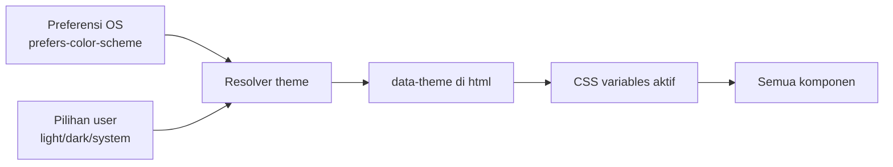
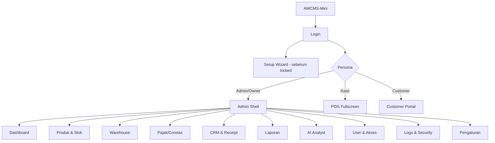
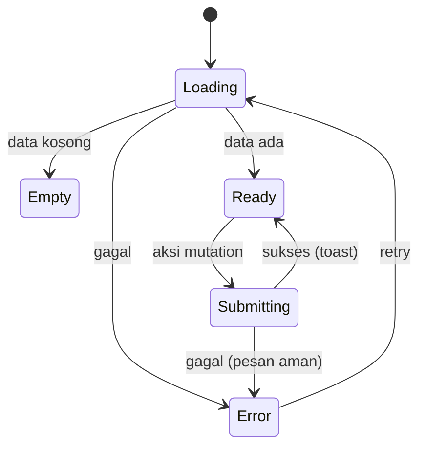
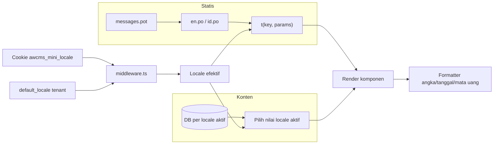

# Bagian 14 — UI/UX Design System dan Spesifikasi Layar

> **Standar base + contoh domain.** Dokumen ini adalah **standar/pola reusable** base AWCMS-Mini. Contoh yang dipakai memakai domain retail/POS bergaya AWPOS sebagai ilustrasi — ganti detail domainnya dengan kebutuhan aplikasi turunan Anda. Lihat [README paket dokumen](README.md) §Reusable vs domain turunan.

## Tujuan

Dokumen ini melengkapi kebutuhan **desain UI/UX** AWCMS-Mini yang sebelumnya hanya tersirat di SOP (doc 08) dan blueprint (doc 11). Berisi design principle, design token, component library, information architecture, spesifikasi layar (wireframe), state pattern, aksesibilitas, i18n, dan theming — agar frontend dapat diimplementasikan konsisten.

Terkait: `15_frontend_architecture_integration.md` (arsitektur & wiring), `08_sop_operasional_user_guide.md` (alur operasional). Skill penegak: **`awcms-mini-ui-screen`** (`.claude/skills/`).

## Prinsip desain UI/UX

1. **Offline-first terlihat** — status koneksi & sync selalu jelas; aksi tetap bisa saat offline.
2. **Keyboard-first untuk operator** — semua aksi POS dapat tanpa mouse.
3. **Role-aware** — navigasi & aksi menyesuaikan permission (bukan kontrol utama; backend tetap validasi).
4. **State eksplisit** — setiap layar punya loading, empty, error, dan success state.
5. **Aman** — tidak menampilkan data sensitif penuh; mengikuti masking (doc 04).
6. **Aksesibel** — target WCAG 2.1 AA, kontras cukup, fokus terlihat, navigasi keyboard.
7. **Responsif** — admin desktop-first, operator fullscreen, customer portal mobile-first.
8. **Konsisten** — semua layar memakai token & komponen yang sama.

## Design tokens

Token diimplementasikan sebagai CSS custom properties, di-scope ke `:root` dan override via `:root[data-theme="dark"]`. Nilai berikut adalah **placeholder brand-neutral** yang boleh diganti brand tenant.

### Warna semantik

| Token                      | Light     | Dark      | Fungsi               |
| -------------------------- | --------- | --------- | -------------------- |
| `--color-bg`               | `#f7f8fa` | `#0e1116` | Latar aplikasi       |
| `--color-surface`          | `#ffffff` | `#161b22` | Kartu/panel          |
| `--color-surface-2`        | `#eef1f5` | `#1f262e` | Panel sekunder       |
| `--color-border`           | `#d8dee6` | `#2b333c` | Garis/pembatas       |
| `--color-text`             | `#1a1f26` | `#e6edf3` | Teks utama           |
| `--color-text-muted`       | `#5b6672` | `#9aa7b2` | Teks sekunder        |
| `--color-primary`          | `#2563eb` | `#3b82f6` | Aksi utama           |
| `--color-primary-contrast` | `#ffffff` | `#ffffff` | Teks di atas primary |
| `--color-success`          | `#16a34a` | `#22c55e` | Sukses/posted        |
| `--color-warning`          | `#d97706` | `#f59e0b` | Peringatan/held      |
| `--color-danger`           | `#dc2626` | `#ef4444` | Error/stok kurang    |
| `--color-info`             | `#0891b2` | `#06b6d4` | Info/sync            |
| `--color-focus`            | `#2563eb` | `#60a5fa` | Cincin fokus         |

### Skala lain

| Kategori    | Token                           | Nilai                                     |
| ----------- | ------------------------------- | ----------------------------------------- |
| Font family | `--font-sans`                   | system-ui, Inter, sans-serif              |
| Font mono   | `--font-mono`                   | ui-monospace, monospace (harga/SKU/angka) |
| Font size   | `--fs-xs..2xl`                  | 12 · 14 · 16 · 18 · 20 · 24 · 32 px       |
| Spacing     | `--sp-1..8`                     | 4 · 8 · 12 · 16 · 24 · 32 · 48 · 64 px    |
| Radius      | `--radius-sm/md/lg/full`        | 4 · 8 · 12 · 9999 px                      |
| Shadow      | `--shadow-sm/md/lg`             | elevasi kartu/dialog                      |
| Z-index     | `--z-nav/dropdown/dialog/toast` | 100 · 200 · 300 · 400                     |
| Breakpoint  | `sm/md/lg/xl`                   | 640 · 768 · 1024 · 1280 px                |

### Theming



Aturan: default `system`; pilihan personal per-browser disimpan di localStorage (selalu menang bila ada) dengan fallback ke preferensi tenant `awcms_mini_tenants.default_theme` (dapat diubah admin di `/admin/settings`) untuk browser yang belum pernah memilih; `data-theme` di-set pada `<html>` sebelum paint untuk mencegah flash.

## Component library

Komponen dasar di `src/components/ui`, dipakai lintas persona.

| Komponen                                  | Catatan penting                                                 |
| ----------------------------------------- | --------------------------------------------------------------- |
| Button                                    | varian primary/secondary/ghost/danger; state loading & disabled |
| Input / NumberInput                       | label, hint, error; NumberInput untuk qty/harga (mono)          |
| Select / Combobox                         | Combobox mendukung search produk/customer                       |
| Checkbox / Radio / Switch                 | switch untuk consent & feature toggle                           |
| Dialog / Drawer                           | fokus terperangkap, `Esc` menutup                               |
| Toast                                     | sukses/error/info; non-blocking                                 |
| Table / DataGrid                          | sort, pagination keyset, kolom sticky, row density              |
| Badge / StatusPill                        | status lifecycle (draft/held/posted/quarantine) berkode warna   |
| ArchiveFilter                             | toggle/filter `aktif`, `arsip`, `semua` untuk role berizin      |
| Card / Panel                              | kontainer konten                                                |
| FormField                                 | membungkus label+input+error konsisten                          |
| Tabs                                      | detail entity (produk, transfer, profile)                       |
| Pagination                                | keyset (next/prev), bukan offset besar                          |
| SearchBar                                 | debounce, hasil <300ms (doc 07)                                 |
| EmptyState / ErrorState / LoadingSkeleton | wajib untuk tiap list/detail                                    |
| KeyboardHint                              | menampilkan shortcut aktif di POS                               |
| SyncIndicator / OfflineBanner             | status koneksi & antrean sync                                   |
| MoneyText / MaskedText                    | format IDR & masking data sensitif                              |

## Information architecture (navigasi role-aware)



Item menu difilter oleh permission efektif user (lihat doc 17). Menu tanpa akses disembunyikan, tetapi endpoint tetap dilindungi ABAC.

## Layout shell

### Admin shell (desktop-first)

```text
┌───────────────────────────────────────────────────────────┐
│ Topbar: [Logo] [Tenant switcher] [Search] [Sync●] [🔔] [👤]│
├───────────┬───────────────────────────────────────────────┤
│ Sidebar   │  Breadcrumb                                    │
│  Dashboard│  ┌─────────────────────────────────────────┐  │
│  Produk   │  │  Konten (list/detail/form)              │  │
│  Warehouse│  │  - LoadingSkeleton / EmptyState / Error │  │
│  Pajak    │  │                                         │  │
│  Laporan  │  └─────────────────────────────────────────┘  │
│  User     │                                               │
└───────────┴───────────────────────────────────────────────┘
```

### POS fullscreen (keyboard-first)

```text
┌───────────────────────────────────────────────────────────┐
│ Kasir: <nama> · Office: <office> · Sync● · [F1 Bantuan]    │
├──────────────────────────────┬────────────────────────────┤
│ [F2] Cari/scan produk........ │  Keranjang                 │
│ ┌──────────────────────────┐ │  1. Produk A  x2   20.000  │
│ │ Hasil pencarian          │ │  2. Produk B  x1   15.000  │
│ └──────────────────────────┘ │  ------------------------- │
│                              │  Subtotal        35.000    │
│                              │  Diskon [F6]      0        │
│                              │  Pajak            3.850     │
│                              │  TOTAL           38.850    │
├──────────────────────────────┴────────────────────────────┤
│ [F4] Qty  [F6] Diskon  [F8] Hold  [F9] Bayar  [F10] Posting│
└───────────────────────────────────────────────────────────┘
```

### Customer portal (mobile-first)

```text
┌─────────────────────┐
│  Receipt #INV-000123 │
│  Toko · 2026-07-04   │
├─────────────────────┤
│  Item ............   │
│  Total   38.850     │
│  [⬇ Download PDF]    │
│  Consent WA  [switch]│
│  Consent Email[switch]│
└─────────────────────┘
```

## Screen inventory

| Route                        | Persona         | Tujuan                      | Komponen utama               | API utama                                                     |
| ---------------------------- | --------------- | --------------------------- | ---------------------------- | ------------------------------------------------------------- |
| `/login`                     | Semua           | Autentikasi                 | FormField, Button            | `POST /auth/login`                                            |
| `/setup`                     | Owner awal      | Setup wizard                | Stepper, FormField           | `GET/POST /setup/*`                                           |
| `/admin`                     | Admin/Owner     | Dashboard                   | Card, Chart, Table           | `GET /reports/*`                                              |
| `/admin/products`            | Admin/Inventory | List/CRUD produk            | DataGrid, SearchBar, Dialog  | `/inventory/products`                                         |
| `/admin/stock`               | Admin/Inventory | Stok & opening balance      | DataGrid, NumberInput        | `/inventory/stock-balances`                                   |
| `/admin/warehouse`           | Gudang          | Transfer, bin, cycle count  | Tabs, StatusPill             | `/warehouses`, `/warehouse-transfers`                         |
| `/admin/tax`                 | Tax Officer     | VAT invoice, Coretax        | DataGrid, MaskedText         | `/tax/*`                                                      |
| `/admin/crm`                 | CRM Staff       | Kontak, receipt, outbox     | Table, Switch                | `/crm/*`                                                      |
| `/admin/reports`             | Analyst/Owner   | Laporan                     | Chart, Table                 | `/reports/*`                                                  |
| `/admin/ai`                  | Analyst/Owner   | AI analyst chat             | Chat, Card                   | `/ai/business-analyst/chat`                                   |
| `/admin/access-users`        | Admin/Owner     | User & akses                | Table, FormField             | `/users/*`, `/roles/*`, `/permissions`, `/access/assignments` |
| `/admin/sync`                | Admin/Owner     | Node, konflik, antrean sync | Table, StatusPill, FormField | `/sync/nodes`, `/sync/conflicts/*`, `/sync/object-queue/*`    |
| `/admin/logs`                | Auditor/Admin   | Logs & security             | DataGrid, Badge              | `/logs/*`, `/security/*`                                      |
| `/pos`                       | Kasir           | Transaksi POS               | POS shell, Combobox          | `/sales/*`                                                    |
| `/customer/receipts/{token}` | Customer        | Receipt & consent           | Card, Switch                 | `/crm/receipts/*`                                             |

## State pattern wajib



- **Loading**: skeleton, bukan spinner kosong untuk list.
- **Empty**: pesan + call-to-action (mis. "Belum ada produk. Tambah produk").
- **Error**: pesan user-friendly (petakan error code doc 05), tanpa detail teknis.
- **Optimistic**: keranjang POS update instan; rollback bila server menolak.
- **Offline**: banner + antrean; aksi tetap tersimpan lokal (doc 15).
- **Archived/deleted**: list default menyembunyikan item; role berizin dapat membuka filter arsip, melihat badge `Diarsipkan`, dan menjalankan restore.

## Aksesibilitas (WCAG 2.1 AA)

- Kontras teks minimal 4.5:1 (cek token).
- Semua kontrol dapat difokus & dioperasikan keyboard; urutan tab logis.
- Cincin fokus terlihat (`--color-focus`), jangan `outline:none` tanpa pengganti.
- Label eksplisit untuk setiap input; error diumumkan (`aria-live`).
- Dialog memerangkap fokus; `Esc` menutup; fokus kembali ke pemicu.
- Target sentuh ≥ 44px untuk portal mobile.
- Jangan mengandalkan warna saja untuk status (tambah ikon/teks).

## Internationalization (i18n)

> **Status:** diimplementasikan (Issue #433, milestone M9). `src/lib/i18n/` (parser `.po` murni tanpa dependency, catalog loader, `t()`, resolusi locale, formatter), katalog `i18n/{messages.pot,en.po,id.po}`, `LanguageSwitcher.astro`, dan migrasi `016_awcms_mini_tenant_default_locale_english_schema.sql` (default `'en'` untuk tenant baru). Diverifikasi live: switch locale mengubah seluruh teks SSR (shell **dan** konten halaman), termasuk fallback ke `default_locale` tenant lama yang masih `'id'`.

i18n memakai **dua lapisan terpisah** sesuai sumber teksnya:

**1. String UI statis** (chrome aplikasi: label, tombol, judul, pesan error, navigasi) → **file katalog `.po`/`.pot` standar gettext**, di-**bundle bersama aplikasi**, bukan di database. Satu template `messages.pot` + satu berkas per locale (`en.po`, `id.po`). Kunci pesan `namespace.key` (mis. `auth.login.submit`, `error.access_denied`). Semua string UI dirender lewat helper `t(key, params)`; **tidak ada teks hardcode**.

**2. Data input pengguna** (konten yang diketik user dan perlu tampil multi-bahasa, mis. nama/deskripsi/catatan yang di-i18n-kan aplikasi turunan) → disimpan **di database untuk setiap locale aktif** (satu nilai per bahasa aktif), **bukan** di `.po`. Pola penyimpanan per-bahasa didokumentasikan di `docs/awcms-mini/04_erd_data_dictionary.md` §Konten multi-bahasa. `.po` hanya untuk teks statis pengembang, DB untuk konten dinamis pengguna.

- **Locale minimal**: **en** dan **id** (arsitektur siap ms/ar — kolom `default_locale` tetap `text` bebas, bukan `enum`/`CHECK`, agar ms/ar bisa ditambah tanpa migration schema; UI hanya menampilkan locale yang benar-benar punya katalog). **Default = `en`** (`awcms_mini_tenants.default_locale`, migration `016` mengubah default kolom dari `'id'` ke `'en'` untuk tenant baru — tenant lama yang sudah `'id'` tidak diubah).
- **Resolusi locale**: cookie `awcms_mini_locale` (diset language switcher) → `default_locale` tenant → fallback `en`. Diresolusi di `src/middleware.ts` **sebelum** halaman `/admin/*` mana pun (termasuk `AdminLayout`) dirender — bukan di dalam layout, karena frontmatter halaman berjalan lebih dulu daripada frontmatter layout yang membungkusnya; me-resolve di layout saja terbukti terlambat untuk konten halaman itu sendiri saat verifikasi live (shell ter-render Indonesia, konten dashboard tetap Inggris).
- **Cookie, bukan localStorage**: berbeda dari toggle tema (CSS murni, bisa "diperbaiki" di klien sebelum paint), locale mengubah teks yang sudah di-render SSR — server harus tahu locale **sebelum** merender, dan hanya cookie yang ikut terkirim bersama request.
- **Language switcher** (`LanguageSwitcher.astro`) menampilkan **ikon bendera** per bahasa + nama asli bahasa itu sendiri, bukan diterjemahkan ke locale aktif (mis. 🇬🇧 English, 🇮🇩 Bahasa Indonesia — konvensi standar agar user tetap menemukan bahasanya walau UI saat ini tak terbaca olehnya); memilih men-set cookie lalu reload penuh (bukan swap instan seperti tema).
- **Pesan error ter-i18n**: kode error (doc 05) dipetakan ke key `error.*` (`src/lib/i18n/error-messages.ts`); untuk banner aksi client-side, peta `{code: pesan}` di-inject sebagai `<script type="application/json">` di halaman (katalog `.po` hanya bisa dibaca server-side via `Bun.file`).
- **Format lokal**: angka/mata uang (IDR + pemisah ribuan sesuai locale) dan tanggal (`Asia/Jakarta`, `Intl.DateTimeFormat`/`NumberFormat`) sadar-locale — `src/lib/i18n/format.ts`.



## Peta keyboard POS

| Shortcut | Fungsi                      |
| -------- | --------------------------- |
| F1       | Bantuan/shortcut            |
| F2       | Fokus search/barcode        |
| F4       | Ubah quantity item terpilih |
| F6       | Diskon (sesuai izin)        |
| F8       | Hold transaksi              |
| F9       | Pembayaran                  |
| F10      | Posting transaksi           |
| Enter    | Tambah item terpilih        |
| ↑/↓      | Navigasi hasil/keranjang    |
| Esc      | Tutup dialog                |

## Acceptance criteria UI/UX

- Design token terpasang & theming light/dark/system tanpa flash.
- Komponen dasar tersedia dengan state loading/disabled/error.
- Admin shell, POS fullscreen, dan customer portal render sesuai layout.
- Setiap list/detail memiliki loading/empty/error state.
- Navigasi difilter permission; endpoint tetap dilindungi ABAC.
- POS dapat dioperasikan penuh via keyboard.
- Kontras & fokus memenuhi AA.
- Semua string melalui i18n; angka/mata uang/tanggal terformat lokal.
- Data sensitif tampil ter-mask sesuai role.
- Soft-deleted resource tidak muncul di list/search default; archive filter dan restore hanya muncul bila permission efektif mengizinkan.
