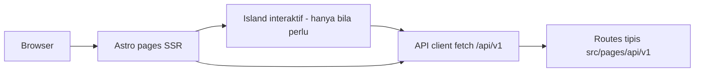
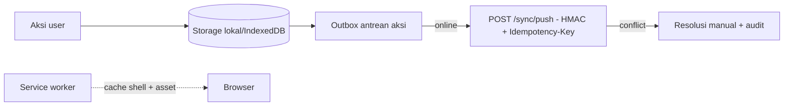

# Bagian 15 — Arsitektur Frontend dan Integrasi

## Tujuan

Menetapkan arsitektur frontend base: Astro SSR, API client, auth flow, state, dan pola offline-first untuk aplikasi turunan.

## Arsitektur



Prinsip:

1. **SSR-first** — halaman dirender server; JavaScript klien hanya untuk island interaktif.
2. Satu **API client** dengan envelope-aware fetch; tidak ada `fetch` mentah tersebar.
3. Semua data dari `/api/v1` — UI tidak query database langsung.

## API client standard

```ts
async function apiFetch<T>(path: string, init?: RequestInit): Promise<T> {
  const response = await fetch(`/api/v1${path}`, {
    ...init,
    headers: {
      "Content-Type": "application/json",
      "X-Request-ID": crypto.randomUUID(),
      ...init?.headers,
    },
  });
  const body = await response.json();
  if (!body.success) throw new ApiClientError(body.error); // code+message+details
  return body.data as T;
}
```

- Error `AUTH_REQUIRED`/`TOKEN_EXPIRED` → redirect login.
- `details[].field` dipetakan ke pesan error field form.
- Mutation high-risk mengirim `Idempotency-Key` (UUID per aksi, dipertahankan saat retry).

## Auth flow

1. Login → server set cookie sesi `HttpOnly` + `Secure` (production) + `SameSite=Lax`.
2. Middleware Astro memverifikasi sesi → `locals.tenantContext`.
3. Halaman SSR membaca `locals` — tidak menyimpan token di `localStorage`.

## State management

- Server state = sumber kebenaran; island kecil pakai state lokal.
- Tidak ada global store sampai terbukti perlu; form memakai state form + optimistic update hanya untuk aksi idempotent.

## Pola offline-first (untuk aplikasi turunan)



1. Aksi ditulis ke storage lokal + outbox, UI merespons segera.
2. Saat online, outbox di-push (idempotent — aman di-retry).
3. Conflict tidak diselesaikan otomatis di klien; ditampilkan untuk resolusi manual.
4. Service worker meng-cache app shell; data sensitif tidak di-cache tanpa enkripsi.

Base menyediakan kontrak (`sync_storage`, idempotency, event envelope); implementasi worker/IndexedDB menyusul di aplikasi yang membutuhkan (mis. POS kasir AWPOS).

## Error & loading standard

- Setiap fetch punya state loading/empty/error eksplisit.
- Error `DATABASE_BUSY` → tampilkan "sistem sibuk" + retry backoff; jangan retry otomatis mutation non-idempotent.
- `correlationId` dari envelope ditampilkan pada error page untuk pelaporan.
