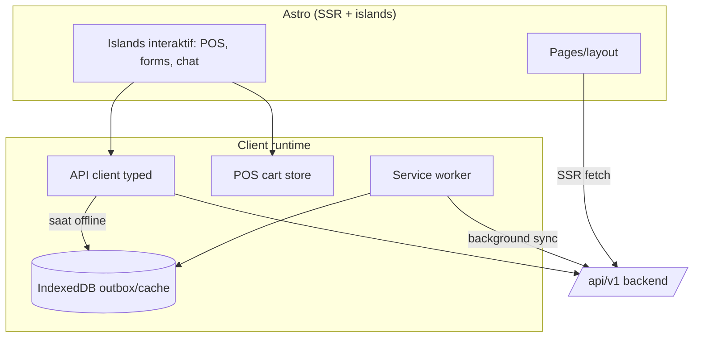
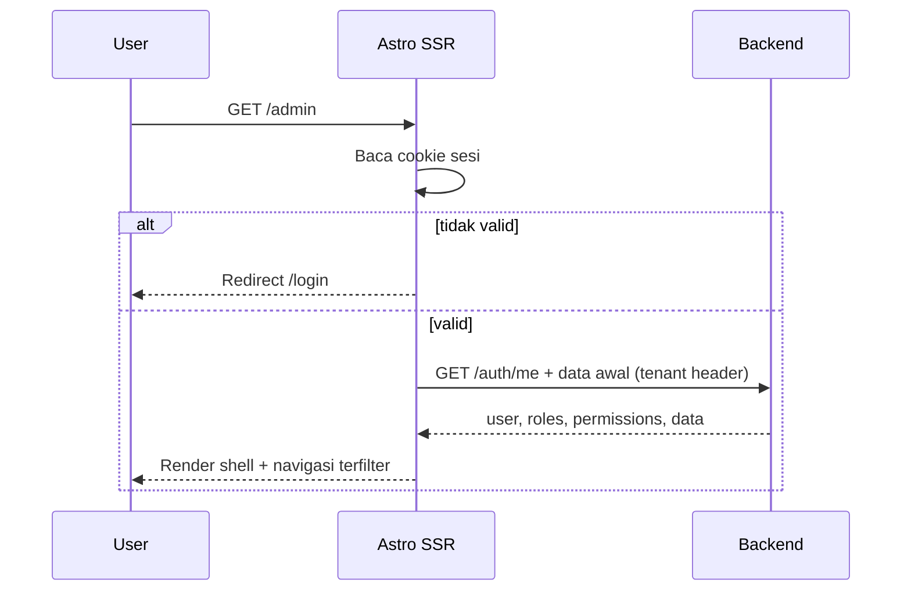
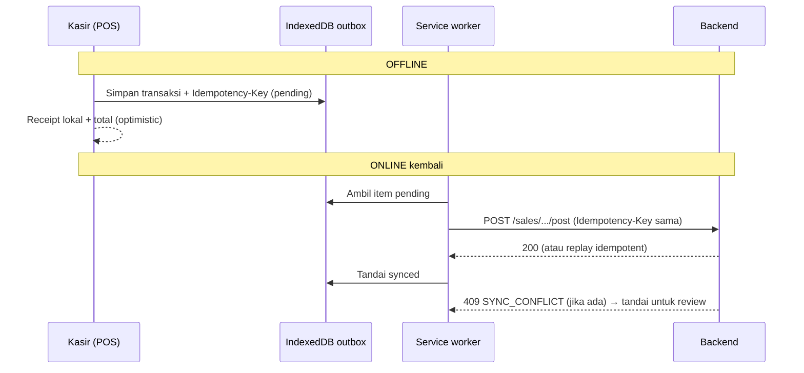

# Bagian 15 — Arsitektur Frontend dan Integrasi Frontend–Backend

> **Standar base + contoh domain.** Dokumen ini adalah **standar/pola reusable** base AWCMS-Mini. Contoh yang dipakai memakai domain retail/POS bergaya AWPOS sebagai ilustrasi — ganti detail domainnya dengan kebutuhan aplikasi turunan Anda. Lihat [README paket dokumen](README.md) §Reusable vs domain turunan.

## Tujuan

Dokumen ini melengkapi **arsitektur frontend** dan **integrasi frontend ↔ backend** yang sebelumnya belum terdefinisi: strategi rendering Astro, API client, autentikasi/sesi, **mekanisme offline-first (service worker + IndexedDB + outbox)**, state, form/validasi, dan kontrak layar→endpoint→event.

Terkait: `14_ui_ux_design_system.md` (desain), `16_backend_data_access_integration.md` (sisi backend/DB), `05_openapi_asyncapi_detail.md` (kontrak API/event). Skill penegak: **`awcms-mini-ui-screen`** (`.claude/skills/`).

## Keputusan arsitektur frontend

| Aspek          | Keputusan                                                                                                         |
| -------------- | ----------------------------------------------------------------------------------------------------------------- |
| Framework      | Astro 7, output **server (SSR)** dijalankan di runtime Bun                                                        |
| Interaktivitas | **Astro islands** + TypeScript; framework island opsional (mis. Preact) hanya untuk pulau kompleks (POS, chat AI) |
| Styling        | CSS variables (design token doc 14), scoped styles                                                                |
| Rendering      | Halaman authed = SSR; customer portal = SSR; aset statis di-cache SW                                              |
| Data fetching  | SSR initial load + client mutation via API client                                                                 |
| Offline        | PWA: service worker + IndexedDB outbox untuk POS/receipt                                                          |
| State          | Lokal per-island + store ringan untuk keranjang POS; hindari SPA global besar                                     |

Alasan: SSR menjaga waktu muat cepat di LAN, aman untuk cookie httpOnly, dan tetap ringan; islands membatasi JS hanya di area interaktif. Backend/SSR dijalankan dengan **Bun** sebagai platform runtime; Node.js bukan target platform server utama.

## Astro SSR di atas runtime Bun

Astro **berjalan penuh di Bun** untuk semua fase: `bun install`, dev, build, dan runtime. Panggil bin Astro/Vite via `bun --bun astro …` (dev/build/preview) agar Bun yang mengeksekusi, bukan binary `node` (shebang bin default `#!/usr/bin/env node`).

Nuansa satu-satunya: Astro **belum punya adapter SSR Bun first-party** (yang resmi: `@astrojs/node`, Cloudflare, Vercel, Netlify — verifikasi versi saat implementasi). Dua opsi tersanksi, keduanya tetap runtime Bun:

| Opsi                               | Cara                                                                                                                | Kapan                                                  |
| ---------------------------------- | ------------------------------------------------------------------------------------------------------------------- | ------------------------------------------------------ |
| **A. Pisahkan seam (rekomendasi)** | API/backend native `Bun.serve` (+Hono); Astro hanya frontend/SSR                                                    | Default base — paling "Bun-murni", cocok offline-first |
| **B. `@astrojs/node` di atas Bun** | `output: "server"` + adapter node standalone; jalankan `bun ./dist/server/entry.mjs`; build `bun --bun astro build` | Bila ingin SSR Astro terpadu tanpa server terpisah     |

Opsi B memakai paket ber-nama "node" tetapi **binary `node` tidak dipakai** — output-nya jalan di atas Node-compat Bun. Ini satu-satunya pemakaian paket "node" yang diizinkan; catat sebagai pengecualian di `AUDIT_STANDAR_PENGEMBANGAN_2026-07-04.md` bila dipilih (lihat doc 10 §Standar platform backend, doc 18 §Runtime & tooling). Output `static` (tanpa SSR) tidak butuh adapter dan bisa dilayani `Bun.serve` langsung.

## Lapisan frontend



## API client

Wrapper `fetch` bertipe di `src/lib/api-client.ts`.

Tanggung jawab:

1. Base URL `/api/v1`.
2. Inject header: `Authorization` (dari sesi), `X-AWCMS-Mini-Tenant-ID`, `X-Correlation-ID`, `Accept-Language`; `Idempotency-Key` untuk mutation high-risk.
3. Normalisasi response `{ success, data, meta }` / `{ success:false, error }`.
4. Map error code (doc 05) → pesan i18n + state UI (doc 14).
5. Retry aman untuk GET; mutation high-risk retry hanya dengan idempotency key sama.
6. Timeout + deteksi offline → fallback ke outbox (untuk aksi yang didukung offline).
7. Untuk resource soft-deletable, list default tidak mengirim `includeDeleted`; archive view mengirim `includeDeleted=true` hanya setelah permission efektif tersedia.

```ts
type ApiResult<T> =
  | { ok: true; data: T; meta?: { correlationId?: string; requestId?: string } }
  | {
      ok: false;
      error: { code: string; message: string; details?: unknown[] };
    };

async function apiFetch<T>(
  path: string,
  init?: RequestInit & { idempotencyKey?: string }
): Promise<ApiResult<T>> {
  /* ... */
}
```

## Autentikasi dan sesi

- Login `POST /auth/login` → server set **cookie httpOnly + SameSite=Lax** (akses token) dan menyediakan konteks user.
- Tenant aktif dipilih setelah login (bila user multi-tenant) → dikirim sebagai `X-AWCMS-Mini-Tenant-ID` dan disimpan di sesi.
- SSR membaca cookie untuk render terproteksi; 401 → redirect `/login`.
- `GET /auth/me` untuk hidrasi konteks (roles, default office, permission untuk filter navigasi).
- Logout `POST /auth/logout` → invalidasi sesi + hapus cookie.
- Token/secret **tidak pernah** disimpan di localStorage yang dapat diakses skrip pihak ketiga.



## Rute publik tenant-scoped (tanpa sesi)

Berbeda dari `/admin/*` (sesi cookie) dan API client terautentikasi
(header `X-AWCMS-Mini-Tenant-ID`) di atas — keduanya mengasumsikan
pemanggil sudah tahu tenant-nya. Rute publik untuk pengunjung anonim
(mis. halaman blog publik, RSS, sitemap — Issue #540, epic #536) **belum
punya contoh implementasi di base ini**; ADR-0009
(`docs/adr/0009-public-tenant-scoped-routes.md`) menetapkan polanya:
tenant di-resolve dari segmen path eksplisit yang membawa `tenantCode`
(`/<prefix>/{tenantCode}/...`, look up ke `awcms_mini_tenants` yang
RLS-free), **bukan** subdomain — subdomain butuh wildcard DNS/TLS yang
bertentangan dengan topologi LAN-first default (doc 18). `tenantCode`
tidak ditemukan/tenant tidak aktif → `404`, bukan bocor keberadaan
tenant.

## Offline-first (inti sistem)

POS **wajib** berjalan tanpa internet. Mekanisme:

1. **App shell + aset** di-cache service worker (cache-first) agar UI POS terbuka offline.
2. **Data master** (produk, harga, stok terakhir, customer yang relevan) di-cache ke IndexedDB saat online (stale-while-revalidate) untuk pencarian/scan offline.
3. **Transaksi** yang di-post saat offline ditulis ke **IndexedDB outbox** dengan `Idempotency-Key` yang digenerate klien + status `pending`.
4. **Background sync** (atau retry saat online) mengirim outbox ke backend; server idempotent (doc 10) mencegah duplikasi.
5. **SyncIndicator** menampilkan jumlah antrean & status; konflik high-risk ditandai untuk resolusi manual (doc 08).



Aturan offline:

- Hanya operasi yang aman offline yang didukung (checkout & posting POS, receipt lokal). Operasi yang butuh server otoritatif (approval, export pajak) **tidak** dijalankan offline.
- Stok yang ditampilkan offline adalah snapshot; server tetap otoritatif dan dapat menolak (`STOCK_NOT_AVAILABLE`) saat sync.
- Provider eksternal (WA/email/R2) selalu lewat outbox server, bukan dari klien.
- Soft delete yang terjadi offline disimpan sebagai mutation/tombstone dengan `Idempotency-Key`; UI lokal menyembunyikan resource sampai server menerima atau menolak saat sync.

## State management

- **POS cart store**: store ringan (signals/nanostores) per sesi checkout; sumber kebenaran total tetap server saat posting.
- **Server state**: di-fetch per halaman (SSR) + refetch pada mutation; hindari cache global yang basi.
- **Form state**: lokal di island; submit → API client.

## Form dan validasi

- Skema validasi bersama (mis. Zod) didefinisikan di `_shared` dan dipakai **klien & server** agar konsisten.
- Klien memvalidasi untuk UX cepat; **server tetap otoritatif** (doc 10 — semua input divalidasi backend).
- Error field dari `VALIDATION_ERROR.details` dipetakan ke FormField.

## Kontrak integrasi layar → endpoint → event

| Layar          | Aksi                | Endpoint                                                                   | Event dihasilkan                          |
| -------------- | ------------------- | -------------------------------------------------------------------------- | ----------------------------------------- |
| Setup wizard   | Inisialisasi        | `POST /setup/initialize`                                                   | `tenant.created`                          |
| Login          | Masuk               | `POST /auth/login`                                                         | `identity.login.succeeded`                |
| Produk         | CRUD                | `/inventory/products`                                                      | `inventory.product.created`               |
| Produk         | Soft delete/restore | `DELETE /inventory/products/{id}`, `POST /inventory/products/{id}/restore` | `inventory.product.soft_deleted/restored` |
| Stok awal      | Opening balance     | `/inventory/stock-adjustment-requests`                                     | `inventory.stock.adjustment.posted`       |
| POS            | Posting             | `POST /sales/checkout-sessions/{id}/post`                                  | `sales.transaction.posted`                |
| Receipt portal | Kirim/consent       | `POST /crm/receipts/{id}/send`                                             | `crm.message.sent`                        |
| Warehouse      | Transfer            | `/warehouse-transfers/*`                                                   | `warehouse.transfer.shipped/received`     |
| Pajak          | VAT/Coretax         | `/tax/*`                                                                   | `tax.vat_invoice.generated`               |
| Sync           | Push/pull           | `/sync/push`, `/sync/pull`                                                 | `sync.conflict.detected`                  |

## Keamanan frontend

- Tidak ada secret/API key provider di klien (doc 10, doc 18).
- CSP ketat; sanitasi input; hindari `innerHTML` tak aman (XSS).
- Cookie httpOnly + SameSite untuk token; CSRF token untuk mutation berbasis cookie.
- Navigasi/aksi disembunyikan sesuai permission, **bukan** kontrol utama — backend ABAC tetap wajib.
- Data sensitif ditampilkan ter-mask (doc 04); jangan cache PII mentah di IndexedDB.
- Archive view tidak boleh menjadi bypass tenant/ABAC; soft-deleted PII tetap masked dan tidak disimpan mentah di IndexedDB.

## Acceptance criteria

- Astro SSR render halaman authed; islands hanya di area interaktif.
- API client menyuntik header wajib & idempotency; error termetakan ke UI.
- Login berbasis cookie httpOnly; 401 redirect; navigasi terfilter permission.
- POS terbuka & memposting transaksi **offline**, lalu tersinkron tanpa duplikasi.
- SyncIndicator menampilkan antrean & status; konflik ditandai.
- Validasi klien mengikuti skema bersama; server tetap otoritatif.
- Tidak ada secret di klien; PII mentah tidak di-cache.
- Archive/list restore flow memakai permission efektif, `includeDeleted`, dan state UI yang jelas.
