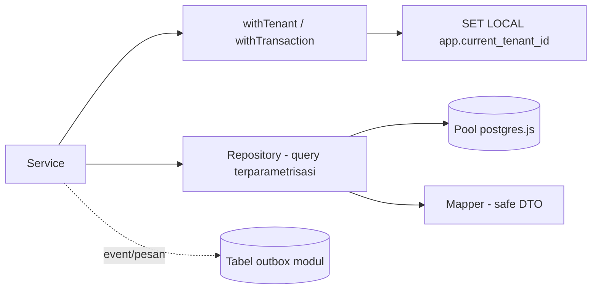
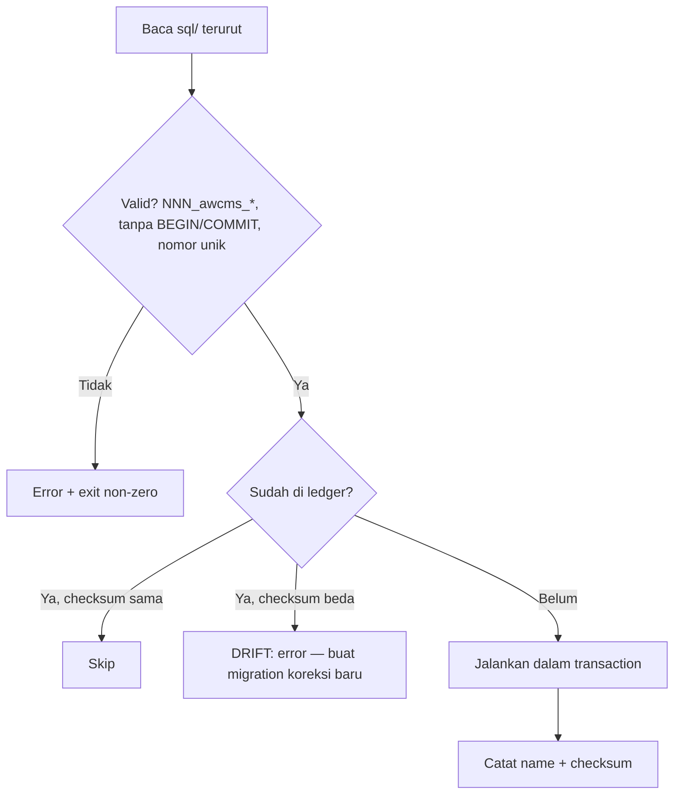

# Bagian 16 — Backend Data Access dan Integrasi Database

## Keputusan teknis (terimplementasi)

| Aspek          | Keputusan                                                                                          |
| -------------- | -------------------------------------------------------------------------------------------------- |
| Driver         | `postgres` (postgres.js) — parameterized, pooled, Bun/Node                                         |
| Pola akses     | Repository per modul (`infrastructure/`)                                                           |
| RLS context    | `withTenant()` → `set_config('app.current_tenant_id', $1, true)` (= `SET LOCAL`, terparametrisasi) |
| Transaction    | `withTransaction`/`withTenant` (`sql.begin`)                                                       |
| Event/provider | Transactional outbox (pola; tabel dibuat modul yang butuh)                                         |
| Migration      | Runner berurutan + checksum (`awcms_schema_migrations`)                                            |
| Idempotency    | `awcms_idempotency_keys` + `createIdempotencyStore`                                                |
| Pool           | `DATABASE_POOL_MAX`, statement timeout, `prepare:false` saat PgBouncer                             |

## Lapisan akses data



## RLS context (kritis multi-tenant)

```ts
// src/lib/database/transaction.ts
await withTenant(tenantId, async (tx) => {
  // semua query di sini tunduk policy tenant_id
});
```

Catatan penting:

- `set_config(..., true)` = transaction-scoped (`SET LOCAL`) — aman untuk **PgBouncer transaction pooling**, konteks tidak bocor antar koneksi, dan terparametrisasi (tanpa interpolasi string).
- `tenantId` divalidasi `assertUuid` dan berasal dari auth middleware — bukan header publik mentah.
- Policy memakai `current_setting('app.current_tenant_id', true)` → NULL saat konteks kosong → tidak ada baris bocor.
- Tabel di-`FORCE ROW LEVEL SECURITY` — owner non-superuser pun tunduk policy. **Superuser bypass RLS**: koneksi aplikasi production harus memakai role non-superuser.
- RLS adalah lapis kedua; repository tetap memfilter `tenant_id` eksplisit.

## Transaction & locking

1. Semua mutation multi-table dalam transaction; RLS context di awal.
2. `SELECT ... FOR UPDATE` untuk baris yang diubah bersamaan; urutkan lock berdasarkan ID untuk mengurangi deadlock.
3. Jangan panggil provider eksternal (WA/email/R2/AI) di dalam transaction.
4. `DATABASE_STATEMENT_TIMEOUT_MS` mencegah transaksi menggantung.
5. Deadlock retry aman karena idempotency.

## Transactional outbox (pola untuk modul yang butuh)

Event domain/pesan provider ditulis **dalam transaction yang sama** dengan mutation (tabel outbox milik modul, mis. `awcms_sync_outbox`), lalu worker terpisah mengirimnya dengan retry/backoff. Provider tidak pernah dipanggil di dalam transaction.

## Migration runner (terimplementasi)



Perintah: `bun run db:migrate` / `db:migrate:status`. Perilaku drift/idempotensi teruji (`tests/lib/migrations.test.ts` + verifikasi nyata).

## Idempotency store

`createIdempotencyStore(sql)` → `find/start/complete` di `awcms_idempotency_keys` (unik per tenant+key, simpan request hash + response). Logika replay/conflict murni di `_shared/idempotency.ts`. Retention 7–30 hari — bersihkan via job maintenance.

## Repository & mapper rules

1. Tagged template `sql\`...\`` — tidak ada interpolasi input user.
2. Filter `tenant_id` eksplisit di semua query tenant-scoped.
3. Mapper mengubah row → DTO aman (buang/mask kolom sensitif) sebelum keluar dari infrastructure.
4. Pagination **keyset** (`WHERE (created_at, id) < (...)`) untuk data besar — bukan offset besar.
5. Hindari N+1 — join/batch.

## Pooling & backpressure (Sprint 4)

Work class membatasi konkurensi per jenis beban: `critical_transaction` > `interactive` > `reporting` > `background_sync` > `maintenance`. Antrean penuh/timeout → `503 DATABASE_BUSY` + event `database.pool.saturated`. Health: `GET /api/v1/database/pool/health` + `bun run db:pool:health` (sudah tersedia).

## Acceptance criteria

- Semua akses tenant-scoped via `withTenant` + filter eksplisit; RLS FORCE aktif dan teruji.
- Migration berurutan, checksum tercatat, tidak double-run, drift = error.
- Idempotency store mencegah duplikasi mutation high-risk.
- Provider eksternal tidak dipanggil dalam transaction.
- Repository terparametrisasi; mapper mengeluarkan DTO aman.
