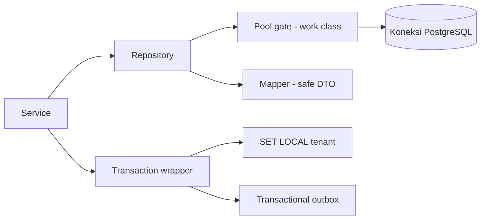
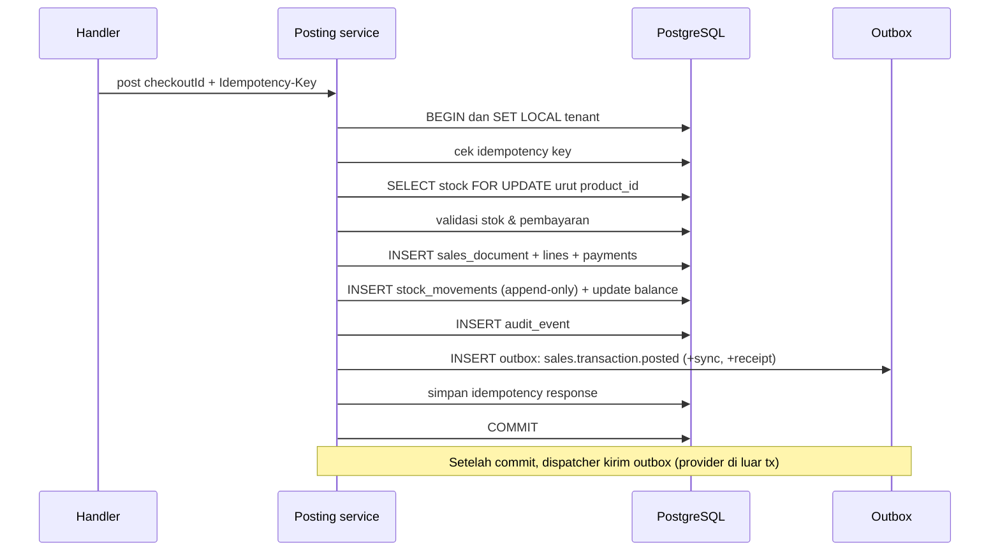
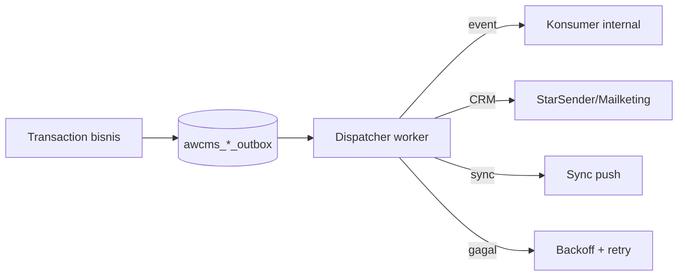
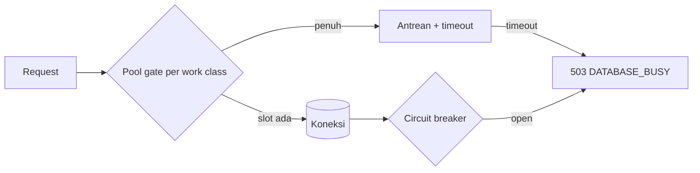
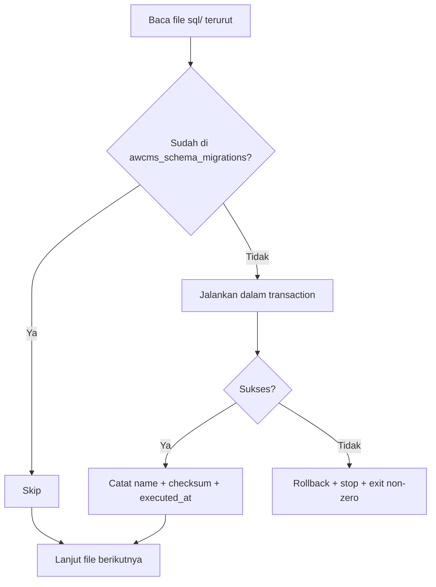

# Bagian 16 — Backend Data Access dan Integrasi Database

## Tujuan

Dokumen ini melengkapi **integrasi backend ↔ database** yang sebelumnya hanya berupa aturan: driver & lapisan query konkret, connection pooling & backpressure, mekanisme RLS context (`SET LOCAL`), transaction wrapper & locking, transactional outbox, migration runner, dan idempotency store.

Terkait: `10_template_kode_coding_standard.md` (aturan), `04_erd_data_dictionary.md` (schema/RLS), `15_frontend_architecture_integration.md` (sisi frontend).

## Keputusan teknis

| Aspek          | Keputusan                                                               |
| -------------- | ----------------------------------------------------------------------- |
| Driver         | `postgres` (postgres.js) atau `Bun.sql` — parameterized, mendukung pool |
| Pola akses     | Repository per modul (`infrastructure/repository.ts`)                   |
| RLS context    | `SET LOCAL app.current_tenant_id` di dalam transaction                  |
| Transaction    | Wrapper eksplisit; `FOR UPDATE` untuk stok; timeout                     |
| Event/provider | **Transactional outbox** (event, pesan CRM, sync)                       |
| Migration      | Runner berurutan + checksum (`awcms_schema_migrations`)                 |
| Pool           | Work-class + antrean + circuit breaker; PgBouncer opsional              |

## Lapisan akses data



Aturan: service memanggil repository; repository hanya query terparametrisasi + mapper; tidak ada business logic di repository (doc 10).

## RLS context (kritis untuk multi-tenant)

Setiap transaksi tenant-scoped **wajib** menetapkan tenant di awal, lalu semua query mengikuti policy RLS (doc 04).

```sql
BEGIN;
SET LOCAL app.current_tenant_id = $1;   -- $1 = tenant aktif dari auth
-- ... query dijalankan dengan RLS aktif ...
COMMIT;
```

Catatan penting:

- Gunakan **`SET LOCAL`** (bukan `SET` sesi) agar aman dengan **PgBouncer transaction pooling** — konteks tidak bocor antar transaksi/koneksi.
- Nilai berasal dari auth middleware, **bukan** header publik mentah.
- RLS adalah pertahanan lapis kedua; query tetap memfilter `tenant_id` secara eksplisit.

```ts
async function withTenant<T>(
  tenantId: string,
  fn: (tx: Tx) => Promise<T>,
): Promise<T> {
  return transaction(async (tx) => {
    await tx.unsafe(
      `SET LOCAL app.current_tenant_id = '${assertUuid(tenantId)}'`,
    );
    return fn(tx);
  });
}
```

## Transaction wrapper dan locking

1. Transaction untuk semua mutation multi-table.
2. Set RLS context di awal transaction.
3. `SELECT ... FOR UPDATE` untuk baris stok/bin balance yang berubah.
4. **Urutkan lock berdasarkan `product_id`** untuk mengurangi deadlock.
5. **Jangan** memanggil provider eksternal di dalam transaction (WA/email/R2/AI).
6. Statement timeout untuk mencegah transaksi menggantung.
7. Deadlock retry aman karena idempotency (doc 10).

### Posting POS (integrasi end-to-end)



## Transactional outbox

Event domain, pesan CRM, dan sync **ditulis dalam transaction yang sama** dengan perubahan data, lalu dikirim oleh worker terpisah. Ini menjamin konsistensi tanpa memanggil provider di dalam transaction.



Tabel terkait: `awcms_sync_outbox`, `awcms_message_outbox`, `awcms_object_sync_queue`. Status: `pending → sent/failed`, dengan `next_retry_at`.

## Connection pooling dan backpressure

Work class membatasi konkurensi per jenis beban agar transaksi kasir tetap prioritas.

| Work class             | Contoh                        | Prioritas |
| ---------------------- | ----------------------------- | --------- |
| `critical_transaction` | Posting POS, transfer receive | Tertinggi |
| `interactive`          | CRUD admin, search            | Tinggi    |
| `reporting`            | Laporan, dashboard            | Sedang    |
| `background_sync`      | Sync push/pull, outbox        | Rendah    |
| `maintenance`          | Migration, backup             | Terjadwal |



- Health endpoint `GET /database/pool/health` melaporkan saturasi (doc 05).
- Saturasi memicu event `database.pool.saturated` (doc 05) dan `503 DATABASE_BUSY`.
- PgBouncer opsional (transaction mode): hindari prepared statement bermasalah; gunakan `SET LOCAL`.

## Migration runner

Ikuti standar penamaan `NNN_awcms_<area>_<desc>.sql` (doc 09/10) — lihat skill `awcms-mini-new-migration`.



- Checksum mendeteksi file yang berubah setelah applied (peringatkan/tolak).
- Tidak double-run; error menghentikan proses (doc 06 Issue 0.2).

## Idempotency store

- Tabel `awcms_idempotency_keys` menyimpan `key`, request hash, status, response/resource.
- Alur di skill `awcms-mini-idempotency` (doc 10). Retention 7–30 hari (doc 04).

## Repository dan mapper

1. Query terparametrisasi; **tidak** ada string interpolation input user.
2. Query tenant-scoped memfilter `tenant_id` eksplisit.
3. Mapper mengubah row → DTO aman (masking, buang kolom sensitif) sebelum ke service/API.
4. Pagination **keyset** (`WHERE (tenant_id, created_at, id) < ...`) untuk data besar, bukan offset besar.
5. Hindari N+1: gunakan join/batch.

## Tipe data & konvensi

| Domain            | Tipe PostgreSQL                      |
| ----------------- | ------------------------------------ |
| ID                | `uuid` (default `gen_random_uuid()`) |
| Waktu             | `timestamptz`                        |
| Uang/quantity     | `numeric`                            |
| Payload fleksibel | `jsonb`                              |
| Enum-like         | `text` + `CHECK`                     |

Nama tabel/kolom `snake_case`, prefiks `awcms_` (doc 04/10).

## Acceptance criteria

- Semua akses tenant-scoped memakai `withTenant`/`SET LOCAL` + filter `tenant_id`; RLS aktif.
- Posting POS atomic, mengunci stok, dan menulis outbox dalam satu transaction.
- Provider eksternal tidak dipanggil di dalam transaction.
- Pool work-class + backpressure aktif; health endpoint melaporkan saturasi; `503` saat penuh.
- Migration berjalan berurutan, tidak double-run, checksum tercatat, error menghentikan proses.
- Idempotency store mencegah duplikasi mutation high-risk.
- Repository terparametrisasi; mapper mengeluarkan DTO aman; pagination keyset untuk data besar.
