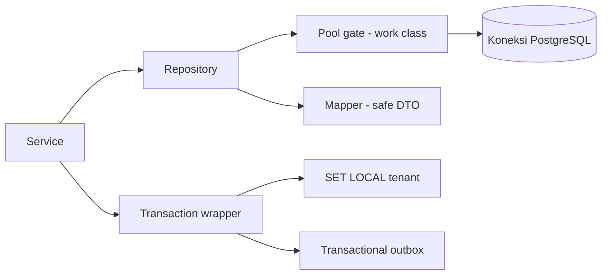
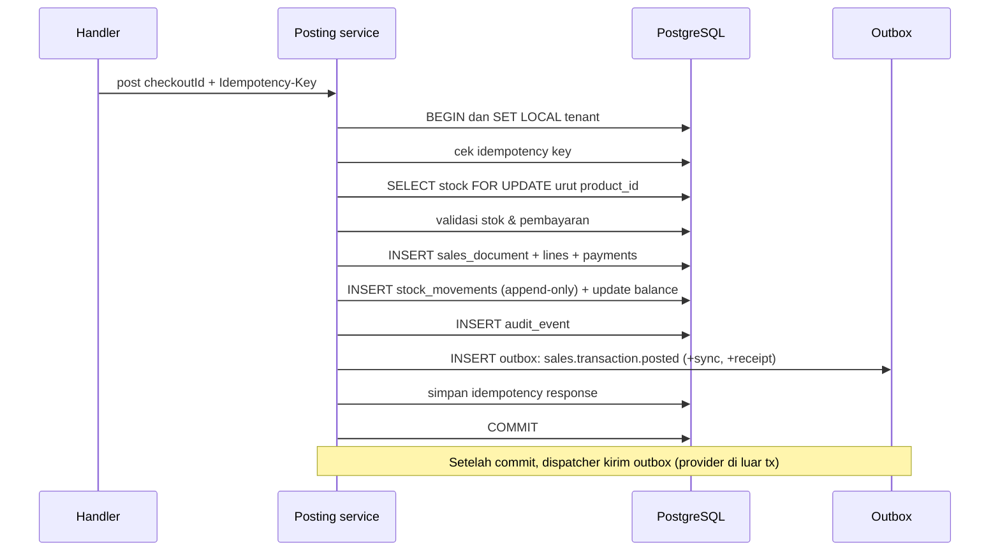
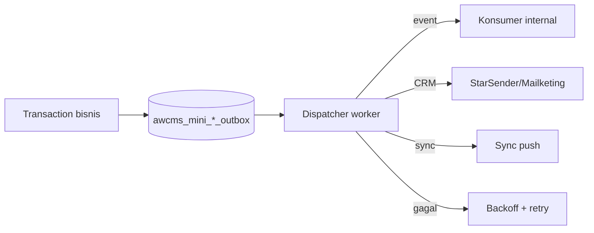
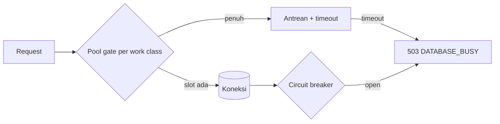
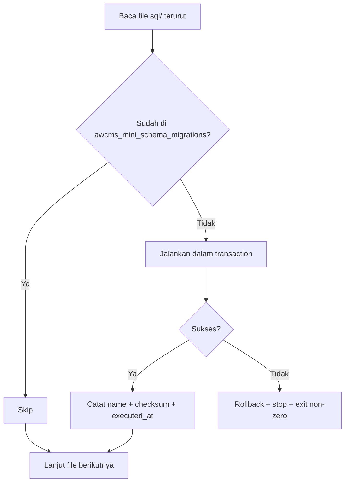

# Bagian 16 — Backend Data Access dan Integrasi Database

> **Standar base + contoh domain.** Dokumen ini adalah **standar/pola reusable** base AWCMS-Mini. Contoh yang dipakai memakai domain retail/POS bergaya AWPOS sebagai ilustrasi — ganti detail domainnya dengan kebutuhan aplikasi turunan Anda. Lihat [README paket dokumen](README.md) §Reusable vs domain turunan.

## Tujuan

Dokumen ini melengkapi **integrasi backend ↔ database** yang sebelumnya hanya berupa aturan: driver & lapisan query konkret, connection pooling & backpressure, mekanisme RLS context (`SET LOCAL`), transaction wrapper & locking, transactional outbox, migration runner, dan idempotency store.

Terkait: `10_template_kode_coding_standard.md` (aturan), `04_erd_data_dictionary.md` (schema/RLS), `15_frontend_architecture_integration.md` (sisi frontend).

## Keputusan teknis

| Aspek            | Keputusan                                                               |
| ---------------- | ----------------------------------------------------------------------- |
| Backend platform | **Bun runtime**; semua script backend dijalankan dengan `bun`           |
| Driver           | `postgres` (postgres.js) atau `Bun.sql` — parameterized, mendukung pool |
| Pola akses       | Repository per modul (`infrastructure/repository.ts`)                   |
| RLS context      | `SET LOCAL app.current_tenant_id` di dalam transaction                  |
| Transaction      | Wrapper eksplisit; `FOR UPDATE` untuk stok; timeout                     |
| Event/provider   | **Transactional outbox** (event, pesan CRM, sync)                       |
| Soft delete      | Repository default filter `deleted_at IS NULL`; restore/purge berizin   |
| Migration        | Runner berurutan + checksum (`awcms_mini_schema_migrations`)            |
| Pool             | Work-class + antrean + circuit breaker; PgBouncer opsional              |

## Lapisan akses data



Aturan: service memanggil repository; repository hanya query terparametrisasi + mapper; tidak ada business logic di repository (doc 10). Proses backend wajib berjalan di runtime Bun; Node.js bukan platform server utama.

## Kebijakan Bun-only dan pengecualian Node.js

Backend AWCMS-Mini menggunakan **Bun-only**:

- Jalankan backend, migration, test, build, preflight, dan script operasional melalui `bun` atau `bun run`.
- Gunakan `bun.lock` sebagai lockfile dan `packageManager: "bun@..."` sebagai deklarasi package manager.
- Dilarang menambah `node`, `npm`, `npx`, `pnpm`, `yarn`, adapter server Node.js, atau dependency yang memaksa proses backend berjalan di Node.js.
- Library yang kompatibel dengan Bun boleh dipakai, walaupun berasal dari ekosistem npm, selama tidak membutuhkan runtime Node.js sebagai platform server.
- **HTTP server** = `Bun.serve` native; **database driver** = `Bun.sql` atau `postgres` (postgres.js), bukan `pg`. Import `node:*` (mis. `node:crypto`) adalah API bawaan Bun dan **diizinkan**. Detail lengkap: doc 10 §Standar platform backend; SSR Astro di atas Bun: doc 15 §Astro SSR di atas runtime Bun.

Pengecualian Node.js hanya boleh bila semua kondisi berikut terpenuhi:

1. Bun belum mendukung capability yang diperlukan, atau library Bun-compatible belum tersedia.
2. Maintainer memberi izin eksplisit sebelum dependency/tooling ditambahkan.
3. Dokumen terkait mencatat alasan, alternatif Bun yang sudah dicoba, scope file/package, batas waktu atau kondisi pencabutan pengecualian, dan rencana migrasi kembali ke Bun.
4. Audit standar pengembangan diperbarui dengan entry pengecualian.
5. CI/preflight menandai pengecualian tersebut agar tidak menjadi pola default.

Tanpa lima syarat tersebut, perubahan yang menambahkan Node.js runtime/tooling dianggap tidak memenuhi Definition of Done.

## RLS context (kritis untuk multi-tenant)

Setiap transaksi tenant-scoped **wajib** menetapkan tenant di awal, lalu semua query mengikuti policy RLS (doc 04).

```sql
BEGIN;
SET LOCAL app.current_tenant_id = $1;   -- $1 = tenant aktif dari auth
-- ... query dijalankan dengan RLS aktif ...
COMMIT;
```

Catatan penting:

- Gunakan **`SET LOCAL`** (bukan `SET` sesi) agar aman dengan **PgBouncer transaction pooling** — konteks tidak bocor antar transaksi/koneksi.
- Nilai berasal dari auth middleware, **bukan** header publik mentah. Untuk rute publik tanpa sesi (ADR-0009, `docs/adr/0009-public-tenant-scoped-routes.md`), nilai tetap harus lewat lookup terverifikasi (`tenantCode → tenant_id` dari `awcms_mini_tenants`) — bukan menerima `tenant_id` mentah dari path/query sebagai kebenaran, prinsip yang sama persis.
- RLS adalah pertahanan lapis kedua; query tetap memfilter `tenant_id` secara eksplisit.

```ts
async function withTenant<T>(
  tenantId: string,
  fn: (tx: Tx) => Promise<T>
): Promise<T> {
  return transaction(async (tx) => {
    await tx.unsafe(
      `SET LOCAL app.current_tenant_id = '${assertUuid(tenantId)}'`
    );
    return fn(tx);
  });
}
```

## Transaction wrapper dan locking

1. Transaction untuk semua mutation multi-table.
2. Set RLS context di awal transaction.
3. `SELECT ... FOR UPDATE` untuk baris stok/bin balance yang berubah.
4. **Urutkan lock berdasarkan `product_id`** untuk mengurangi deadlock.
5. **Jangan** memanggil provider eksternal di dalam transaction (WA/email/R2/AI).
6. Statement timeout untuk mencegah transaksi menggantung.
7. Deadlock retry aman karena idempotency (doc 10).

### Posting POS (integrasi end-to-end)



## Transactional outbox

Event domain, pesan CRM, dan sync **ditulis dalam transaction yang sama** dengan perubahan data, lalu dikirim oleh worker terpisah. Ini menjamin konsistensi tanpa memanggil provider di dalam transaction.



Tabel terkait: `awcms_mini_sync_outbox`, `awcms_mini_message_outbox`, `awcms_mini_object_sync_queue`, `awcms_mini_email_messages` (Issue #494/#495, epic #492). Status: `pending → sent/failed`, dengan `next_retry_at`.

### Dispatcher claim-lease (email, sync object queue)

Pola konkret di balik "worker terpisah" pada diagram di atas — sama persis
untuk `email/application/email-dispatch.ts` (`bun run email:dispatch`) dan
`sync-storage/application/object-dispatch.ts`
(`bun run sync:objects:dispatch`):

1. **CLAIM** — satu transaksi pendek memindahkan baris yang eligible
   (`queued`/`retry_wait` untuk email; `pending` untuk object queue) ke
   status transient `sending`, dengan `UPDATE ... WHERE ... FOR UPDATE
SKIP LOCKED` sehingga pemanggilan bersamaan (dua cron tick tumpang
   tindih) aman tanpa duplikasi. `next_attempt_at`/`next_retry_at` dipakai
   ulang sebagai lease expiry selama status `sending` — tidak ada kolom
   lease terpisah.
2. **SEND** — provider (Mailketing/R2) dipanggil **di luar** transaksi apa
   pun (ADR-0006) untuk setiap baris yang di-claim.
3. **FINALIZE** — satu transaksi pendek per baris memindahkan `sending`
   ke status akhir: `sent` (sukses), `retry_wait` dengan backoff
   eksponensial (gagal, masih ada sisa retry), atau `failed` (retry habis
   atau kegagalan non-retryable). Setiap percobaan — sukses maupun gagal —
   dicatat di tabel riwayat percobaan (`awcms_mini_email_delivery_attempts`
   / analognya).

Circuit breaker per-provider (`src/lib/database/circuit-breaker.ts`)
membungkus fase SEND: setelah sejumlah kegagalan beruntun, breaker
`open` menghentikan panggilan provider berikutnya untuk sementara waktu
(mencegah retry-loop menghantam provider yang sedang outage) — email
dispatcher bahkan berhenti meng-claim baris sama sekali selagi breaker
`open` (`email.dispatch.breaker_open` log, Issue #499), object-dispatch
tetap meng-claim baris yang tak butuh upload sambil breaker terbuka.

## Connection pooling dan backpressure

Work class membatasi konkurensi per jenis beban agar transaksi operasional tetap prioritas.

| Work class             | Contoh                        | Prioritas |
| ---------------------- | ----------------------------- | --------- |
| `critical_transaction` | Posting POS, transfer receive | Tertinggi |
| `interactive`          | CRUD admin, search            | Tinggi    |
| `reporting`            | Laporan, dashboard            | Sedang    |
| `background_sync`      | Sync push/pull, outbox        | Rendah    |
| `maintenance`          | Migration, backup             | Terjadwal |



- Health endpoint `GET /database/pool/health` melaporkan saturasi (doc 05).
- Saturasi memicu event `database.pool.saturated` (doc 05) dan `503 DATABASE_BUSY`.
- PgBouncer opsional (transaction mode): hindari prepared statement bermasalah; gunakan `SET LOCAL`.

## Migration runner

Ikuti standar penamaan `NNN_awcms_mini_<area>_<desc>.sql` (doc 09/10) — lihat skill `awcms-mini-new-migration`.



- Checksum mendeteksi file yang berubah setelah applied (peringatkan/tolak).
- Tidak double-run; error menghentikan proses (doc 06 Issue 0.2).

## Idempotency store

- Tabel `awcms_mini_idempotency_keys` menyimpan `key`, request hash, status, response/resource.
- Alur di skill `awcms-mini-idempotency` (doc 10). Retention 7–30 hari (doc 04).
- Race concurrent-request dengan `Idempotency-Key` yang SAMA (dua request paralel lolos cek awal bareng di bawah READ COMMITTED) ditangani di satu titik: `saveIdempotencyRecord` (`src/modules/_shared/idempotency.ts`) memakai `INSERT ... ON CONFLICT (tenant_id, request_scope, idempotency_key) DO NOTHING RETURNING id`. Kalau kalah race, ia `SELECT` ulang row pemenang (dijamin sudah committed) dan membandingkan `request_hash`-nya — hash sama (payload identik) → melempar `IdempotencyRaceLostError` membawa response pemenang untuk di-replay; hash beda (genuine conflict) → tanpa payload replay. `withTenant` (`src/lib/database/tenant-context.ts`) menangkapnya di satu titik: rollback transaksi loser (mutation-nya tidak pernah persist), skip circuit breaker (bukan infra failure), log `idempotency.race_lost` (key di-hash SHA-256, bukan raw), lalu **replay response pemenang** kalau hash sama — menegakkan aturan "hash sama → replay" bahkan saat kalah race — atau `409 IDEMPOTENCY_CONFLICT` bersih kalau hash beda, bukan raw constraint error. Berlaku otomatis untuk semua endpoint idempotent tanpa perlu ubah routenya masing-masing.

## Repository dan mapper

1. Query terparametrisasi; **tidak** ada string interpolation input user.
2. Query tenant-scoped memfilter `tenant_id` eksplisit.
3. Mapper mengubah row → DTO aman (masking, buang kolom sensitif) sebelum ke service/API.
4. Pagination **keyset** (`WHERE (tenant_id, created_at, id) < ...`) untuk data besar, bukan offset besar.
5. Hindari N+1: gunakan join/batch.
6. Untuk tabel soft-deletable, repository list/detail default menambahkan `deleted_at IS NULL`; `includeDeleted`/`onlyDeleted` hanya setelah ABAC.

## Contoh multi-tabel: module registry (Issue #511–#521, epic #510)

Registry modul (`src/modules/module-management/`) memakai dua kelas akses data yang kontras, ilustrasi konkret dari aturan RLS di atas (baris 60-89):

- **Registry global, RLS-free** — `awcms_mini_modules`/`_dependencies`/`_navigation`/`_jobs`/`_health_checks`. Metadata code-derived, sama untuk semua tenant (sinkron dari `listModules()` lewat `syncModuleDescriptors`, sama alasan `awcms_mini_permissions` RLS-free) — jalan di koneksi app biasa, **tidak** butuh `withTenant`/`SET LOCAL app.current_tenant_id`.
- **State tenant-writable, RLS FORCE** — `awcms_mini_tenant_modules` (enable/disable per tenant) dan `awcms_mini_module_settings` (pengaturan non-secret per tenant). Setiap akses **wajib** lewat `withTenant`, sama seperti tabel tenant-scoped lainnya.
- **"Sync first" sebelum tulis tenant-scoped**: `enableTenantModule`/`disableTenantModule`/`updateModuleSettings`/`runModuleHealthCheck` semua memanggil `syncModuleDescriptors(tx)` di awal — dua tabel di atas punya FK ke `awcms_mini_modules.module_key`, jadi baris registry harus ada dulu sebelum insert baris tenant-scoped. Pola ini generik: kapan pun tabel tenant-scoped punya FK ke tabel registry code-derived, pastikan registry di-sync dalam transaction yang sama sebelum menulis, jangan mengasumsikan operator sudah menjalankan sync manual lebih dulu.

## Soft delete data access

Soft delete adalah update status data, bukan `DELETE` SQL pada jalur operasional.

```sql
UPDATE awcms_mini_products
SET deleted_at = now(),
    deleted_by = $actor_tenant_user_id,
    delete_reason = $reason,
    updated_at = now(),
    sync_version = sync_version + 1
WHERE tenant_id = $tenant_id
  AND id = $product_id
  AND deleted_at IS NULL;
```

Aturan:

- Jalankan di transaction dengan `SET LOCAL app.current_tenant_id`.
- Validasi ABAC action `delete`, lalu audit `*.soft_deleted`.
- Restore mengosongkan kolom delete, mengisi `restored_at/restored_by`, memvalidasi partial unique index, lalu audit `*.restored`.
- Purge/anonymize memakai workflow terpisah untuk retention/legal dan tidak boleh memutus FK transaksi, audit, atau tax records.
- Untuk sync, tulis tombstone ke outbox dalam transaction yang sama.

## Tipe data & konvensi

| Domain                | Tipe PostgreSQL                             |
| --------------------- | ------------------------------------------- |
| ID                    | `uuid` (default `gen_random_uuid()`)        |
| Waktu                 | `timestamptz`                               |
| Uang/quantity         | `numeric`                                   |
| Payload fleksibel     | `jsonb`                                     |
| Enum-like             | `text` + `CHECK`                            |
| Soft delete timestamp | `timestamptz` (`deleted_at`, `restored_at`) |

Nama tabel/kolom `snake_case`, prefiks `awcms_mini_` (doc 04/10).

## Acceptance criteria

- Semua akses tenant-scoped memakai `withTenant`/`SET LOCAL` + filter `tenant_id`; RLS aktif.
- Posting POS atomic, mengunci stok, dan menulis outbox dalam satu transaction.
- Provider eksternal tidak dipanggil di dalam transaction.
- Pool work-class + backpressure aktif; health endpoint melaporkan saturasi; `503` saat penuh.
- Migration berjalan berurutan, tidak double-run, checksum tercatat, error menghentikan proses.
- Idempotency store mencegah duplikasi mutation high-risk.
- Repository terparametrisasi; mapper mengeluarkan DTO aman; pagination keyset untuk data besar.
- Soft delete default filter aktif; restore/purge memakai ABAC, audit, dan tombstone outbox bila sync aktif.
