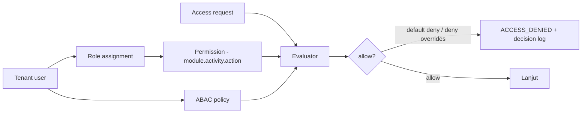
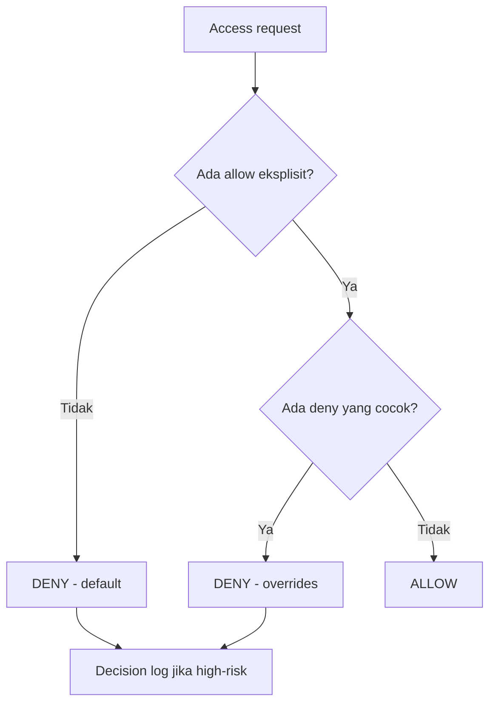
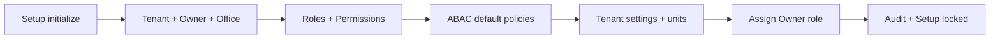

# Bagian 17 — Default Seed, RBAC, dan ABAC Policy

## Tujuan

Dokumen ini melengkapi data awal yang diperlukan agar **Setup Wizard (Issue 12.1)** dan **RBAC/ABAC (Issue 2.4)** dapat diimplementasikan: registry module/activity, daftar permission, matriks role → permission, ABAC default policy, dan seed default. Tanpa ini, akses tidak dapat dievaluasi secara konkret.

Terkait: `03_srs_detail_per_modul.md` (aturan akses), `10_template_kode_coding_standard.md` (ABAC guard), skill `awcms-mini-abac-guard`.

## Model akses

- **RBAC** memberi baseline permission per role.
- **ABAC** menyaring lebih lanjut berdasarkan atribut (office scope, kepemilikan resource, environment) dengan **default deny** dan **deny overrides allow**.

## Registry module & activity

`module_key.activity_code` mengidentifikasi kemampuan. Contoh utama:

| Module key                      | Activity code         | Action tersedia                      |
| ------------------------------- | --------------------- | ------------------------------------ |
| `tenant_admin`                  | `office_management`   | read, create, update                 |
| `identity_access`               | `user_management`     | read, create, update, assign         |
| `identity_access`               | `access_control`      | read, assign, configure              |
| `profile_identity`              | `profile_management`  | read, create, update                 |
| `profile_identity`              | `profile_merge`       | read, approve                        |
| `catalog_inventory`             | `product_management`  | read, create, update                 |
| `catalog_inventory`             | `price_management`    | read, update                         |
| `catalog_inventory`             | `stock_management`    | read, update, adjust                 |
| `sales_pos`                     | `checkout`            | read, create, update                 |
| `sales_pos`                     | `transaction_posting` | post                                 |
| `sales_pos`                     | `transaction_cancel`  | cancel, approve                      |
| `sales_pos`                     | `discount`            | update                               |
| `warehouse_management`          | `transfer`            | read, create, approve, send, receive |
| `warehouse_management`          | `cycle_count`         | read, create, approve                |
| `accounting_tax`                | `tax_profile`         | read, configure                      |
| `accounting_tax`                | `vat_invoice`         | read, create                         |
| `accounting_tax`                | `coretax_export`      | export, approve                      |
| `crm_communication`             | `contact`             | read, create, update                 |
| `crm_communication`             | `receipt_delivery`    | read, send                           |
| `sync_storage`                  | `sync`                | read, configure                      |
| `sync_storage`                  | `conflict_resolution` | read, approve                        |
| `ai_analyst`                    | `analysis`            | analyze                              |
| `management_reporting`          | `reports`             | read                                 |
| `workflow_approval`             | `approval`            | read, approve                        |
| `observability_logging`         | `logs`                | read                                 |
| `production_security_readiness` | `go_live`             | read, approve                        |

## Role default

| Role             | Ringkasan akses                                                                    |
| ---------------- | ---------------------------------------------------------------------------------- |
| Owner            | Semua module, termasuk approval & go-live                                          |
| Admin            | Setup, user, produk, stok, laporan, konfigurasi (bukan approval keuangan tertentu) |
| Kasir            | Checkout & posting POS; **tanpa** pajak/export/assign/approval                     |
| Manager          | Approval transaksi/stok/operasional                                                |
| Petugas Gudang   | Transfer, receiving, cycle count                                                   |
| Inventory Staff  | Produk, stok, adjustment terbatas                                                  |
| Tax Officer      | Pajak & Coretax                                                                    |
| CRM Staff        | Kontak & receipt delivery                                                          |
| Business Analyst | Laporan & AI analyst (read-only)                                                   |
| Auditor          | Audit trail & logs read-only                                                       |

## Matriks role → permission (ringkas)

Legenda action: R=read, C=create, U=update, P=post, X=cancel, A=approve, E=export, S=send, G=assign, N=analyze, F=configure.

| Module.activity                | Owner | Admin | Kasir | Manager | Gudang | Inv. Staff | Tax | CRM | Analyst | Auditor |
| ------------------------------ | ----- | ----- | ----- | ------- | ------ | ---------- | --- | --- | ------- | ------- |
| tenant_admin.office            | RCU   | RCU   | –     | R       | –      | –          | –   | –   | –       | R       |
| identity_access.user           | RCUG  | RCUG  | –     | –       | –      | –          | –   | –   | –       | R       |
| identity_access.access_control | RGF   | RGF   | –     | –       | –      | –          | –   | –   | –       | R       |
| profile_identity.profile       | RCU   | RCU   | R     | R       | –      | R          | R   | RCU | R       | R       |
| profile_identity.merge         | RA    | R     | –     | A       | –      | –          | –   | –   | –       | R       |
| catalog_inventory.product      | RCU   | RCU   | R     | R       | R      | RCU        | –   | –   | R       | R       |
| catalog_inventory.price        | RU    | RU    | R     | R       | –      | R          | –   | –   | R       | R       |
| catalog_inventory.stock        | RUadj | RUadj | R     | Radj    | RU     | RUadj      | –   | –   | R       | R       |
| sales_pos.checkout             | RCU   | RCU   | RCU   | R       | –      | –          | –   | –   | –       | R       |
| sales_pos.posting              | P     | P     | P     | P       | –      | –          | –   | –   | –       | R       |
| sales_pos.cancel               | XA    | X     | –     | XA      | –      | –          | –   | –   | –       | R       |
| sales_pos.discount             | U     | U     | U*    | U       | –      | –          | –   | –   | –       | R       |
| warehouse.transfer             | RCASR | RC    | –     | A       | RCSR   | RC         | –   | –   | –       | R       |
| warehouse.cycle_count          | RCA   | RC    | –     | A       | RC     | RC         | –   | –   | –       | R       |
| accounting_tax.tax_profile     | RF    | RF    | –     | –       | –      | –          | RF  | –   | –       | R       |
| accounting_tax.vat_invoice     | RC    | R     | –     | –       | –      | –          | RC  | –   | –       | R       |
| accounting_tax.coretax_export  | EA    | –     | –     | A       | –      | –          | E   | –   | –       | R       |
| crm.contact                    | RCU   | RCU   | R     | –       | –      | –          | –   | RCU | –       | R       |
| crm.receipt_delivery           | RS    | RS    | S     | –       | –      | –          | –   | RS  | –       | R       |
| sync.sync                      | RF    | RF    | –     | –       | –      | –          | –   | –   | –       | R       |
| sync.conflict                  | RA    | R     | –     | A       | –      | –          | –   | –   | –       | R       |
| ai_analyst.analysis            | N     | –     | –     | –       | –      | –          | –   | –   | N       | –       |
| reporting.reports              | R     | R     | –     | R       | R      | R          | R   | R   | R       | R       |
| workflow.approval              | RA    | R     | –     | RA      | –      | –          | –   | –   | –       | R       |
| logs.logs                      | R     | R     | –     | –       | –      | –          | –   | –   | –       | R       |
| security.go_live               | RA    | R     | –     | –       | –      | –          | –   | –   | –       | R       |

`*` Diskon kasir dibatasi ABAC (batas nominal/persentase sesuai kebijakan).

## ABAC default policy

Prinsip: **default deny**, **deny overrides allow**, RLS tetap wajib.

| #   | Policy              | Efek                                                                       |
| --- | ------------------- | -------------------------------------------------------------------------- |
| 1   | Default             | **Deny** semua yang tidak diizinkan eksplisit                              |
| 2   | Role allow          | Allow sesuai matriks role → permission                                     |
| 3   | Tenant isolation    | Deny bila `resource.tenant_id != context.tenant_id`                        |
| 4   | Office scope        | Deny bila resource office di luar office user (kecuali role lintas-office) |
| 5   | Cashier restriction | Deny `accounting_tax.*`, `coretax_export`, `identity_access.*` untuk Kasir |
| 6   | Discount limit      | Deny diskon kasir melebihi batas kebijakan                                 |
| 7   | Self-approval       | Deny bila `approver == requester` pada workflow                            |
| 8   | Tax masking         | Deny tampilkan tax identity penuh untuk non-tax role                       |
| 9   | AI safety           | Deny AI mengakses raw SQL/mutation/PII mentah                              |
| 10  | Export approval     | Deny Coretax export tanpa approval bila policy aktif                       |

Setiap **deny high-risk** dicatat di `awcms_abac_decision_logs` (doc 04).

## Seed default saat Setup Wizard

Setup wizard membuat data awal berikut (idempotent, sekali sebelum locked):

1. **Tenant** + owner **identity** + **tenant_user** owner.
2. **Office** pertama (`head_office`).
3. **Role default** (10 role di atas) + **permission** + **role_permission**.
4. **ABAC default policy** (10 policy di atas).
5. **Tenant settings**: `default_locale=id`, `default_theme=system`, timezone `Asia/Jakarta`, feature flag provider = off (doc 18).
6. **Unit dasar**: `pcs`, `box`, `kg`, `liter` (opsional, dapat ditambah).
7. **Assignment**: owner → role Owner.
8. **Audit**: `tenant.created`, `access.assignment` awal.

## Acceptance criteria

- Setup wizard menghasilkan tenant, owner, office, role default, permission, dan ABAC default; lalu terkunci.
- Evaluator menegakkan default deny & deny overrides allow sesuai matriks & policy.
- Kasir ditolak akses pajak/export/assign; cross-tenant & cross-office ditolak.
- Self-approval ditolak; export Coretax butuh approval bila policy aktif.
- Deny high-risk tercatat di decision log.
- Seed idempotent; tidak dapat dijalankan ulang setelah locked.
