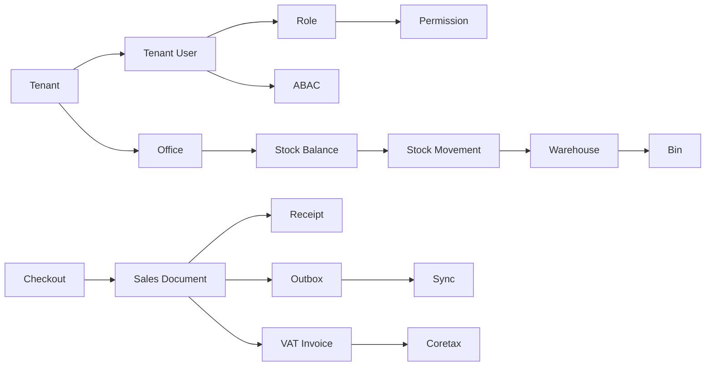

# Bagian 19 — Glossary dan Terminologi

> **Contoh domain (ilustratif).** Dokumen ini memakai domain retail/POS bergaya AWPOS sebagai contoh berjalan. **Pola & standar**-nya reusable untuk base AWCMS-Mini; **entitas, endpoint, layar, dan istilah domain** (produk, POS, gudang, pajak, CRM, AI, dsb.) adalah ilustrasi yang **diganti** oleh aplikasi turunan. Lihat [README paket dokumen](README.md) §Reusable vs domain turunan.

## Tujuan

Dokumen ini menjadi rujukan istilah AWCMS-Mini agar seluruh paket dokumen (01–18) dan implementasi memakai definisi yang sama. Istilah dikelompokkan: arsitektur, keamanan/akses, POS & inventory, warehouse, pajak/Coretax, CRM, sync/offline, database, dan frontend/UI.

## Peta konsep inti

## Arsitektur

| Istilah                           | Definisi                                                                                                                          |
| --------------------------------- | --------------------------------------------------------------------------------------------------------------------------------- |
| **AWCMS-Mini**                    | Standar aplikasi modular monolith yang dirancang paket dokumen ini.                                                               |
| **Modular monolith**              | Satu aplikasi yang dibagi menjadi modul berbatas jelas, siap dipecah ke microservice bila perlu, tetapi tidak dipisah sejak awal. |
| **Module descriptor**             | Metadata modul (`module.ts`): key, versi, dependency, path OpenAPI/AsyncAPI, event publish/subscribe.                             |
| **Offline-first / LAN-first**     | Prinsip bahwa sistem berjalan penuh di jaringan lokal tanpa internet; internet hanya untuk sync/provider opsional.                |
| **Domain event**                  | Fakta bisnis yang sudah terjadi (mis. `sales.transaction.posted`), dikirim via envelope AsyncAPI.                                 |
| **Envelope**                      | Struktur pembungkus standar event (eventId, eventType, tenantId, payload, metadata).                                              |
| **OpenAPI**                       | Kontrak REST API. **AsyncAPI**                                                                                                    | Kontrak domain event. |
| **Correlation ID / Causation ID** | ID untuk menelusuri satu request lintas log/event; causation menghubungkan event ke event pemicunya.                              |

## Keamanan dan akses

| Istilah                  | Definisi                                                                                                                  |
| ------------------------ | ------------------------------------------------------------------------------------------------------------------------- |
| **RBAC**                 | Role-Based Access Control — akses berdasarkan peran user.                                                                 |
| **ABAC**                 | Attribute-Based Access Control — akses berdasarkan atribut (module, activity, resource, office, environment).             |
| **Default deny**         | Semua akses ditolak kecuali diizinkan eksplisit.                                                                          |
| **Deny overrides allow** | Bila ada aturan deny yang cocok, ia mengalahkan semua allow.                                                              |
| **RLS**                  | Row-Level Security PostgreSQL — filter baris per tenant di level database.                                                |
| **Tenant context**       | Konteks tenant aktif yang diset di transaction (`app.current_tenant_id`) untuk RLS.                                       |
| **Decision log**         | Catatan keputusan ABAC (terutama deny high-risk).                                                                         |
| **Audit log**            | Catatan aksi high-risk untuk akuntabilitas (`awcms_mini_audit_events`).                                                   |
| **Masking / Redaction**  | Menyembunyikan sebagian/seluruh data sensitif pada tampilan (mask) dan pada log (redact).                                 |
| **HMAC**                 | Hash-based Message Authentication Code — tanda tangan integritas untuk sync.                                              |
| **Idempotency**          | Sifat mutation yang menghasilkan efek sama walau diulang dengan `Idempotency-Key` sama.                                   |
| **Soft delete**          | Penghapusan logis dengan `deleted_at`/actor/reason; list default menyembunyikan data, restore/purge butuh izin dan audit. |

## POS dan inventory

| Istilah                            | Definisi                                                                                                                 |
| ---------------------------------- | ------------------------------------------------------------------------------------------------------------------------ |
| **Checkout session**               | Draft transaksi operasional sebelum diposting (status draft/held).                                                       |
| **Posting**                        | Mengubah checkout menjadi transaksi final (sales document) secara atomic.                                                |
| **Sales document**                 | Transaksi POS yang sudah posted, **immutable** (append-only).                                                            |
| **Immutable**                      | Tidak dapat diubah/dihapus; koreksi lewat cancel/return/reversal/adjustment.                                             |
| **Tombstone**                      | Event/penanda bahwa resource di-soft-delete agar node sync lain ikut menyembunyikan data tanpa physical delete langsung. |
| **Stock balance**                  | Saldo stok per produk per office (on hand, reserved, available).                                                         |
| **Stock movement**                 | Mutasi stok **append-only** (opening, sale, return, adjustment, transfer).                                               |
| **Opening balance**                | Saldo stok awal saat implementasi.                                                                                       |
| **SKU / Barcode**                  | Kode unik produk per tenant / kode pindai.                                                                               |
| **Tracking type**                  | Cara pelacakan produk: none / lot / serial / lot_serial.                                                                 |
| **Reversal / Return / Adjustment** | Mekanisme koreksi resmi tanpa mengubah transaksi posted.                                                                 |

## Warehouse

| Istilah                    | Definisi                                                                           |
| -------------------------- | ---------------------------------------------------------------------------------- |
| **Warehouse / Zone / Bin** | Hierarki lokasi fisik gudang; bin = lokasi rak terkecil.                           |
| **Bin balance**            | Saldo stok detail per bin/lot/serial.                                              |
| **Lot / Batch**            | Kelompok stok dengan atribut sama (mis. tanggal produksi/expired).                 |
| **Serial**                 | Identitas unit tunggal yang dilacak individual.                                    |
| **Transfer order**         | Perintah pemindahan stok antar gudang (draft→...→received).                        |
| **In-transit**             | Stok yang sudah dikirim (shipped) tetapi belum diterima.                           |
| **Partial receipt**        | Penerimaan sebagian dari yang dikirim.                                             |
| **Quarantine**             | Lokasi karantina untuk barang rusak/expired.                                       |
| **Cycle count**            | Perhitungan stok berkala untuk menemukan variance.                                 |
| **Variance**               | Selisih antara stok sistem dan hasil hitung fisik.                                 |
| **FEFO**                   | First Expired First Out — prioritas keluar untuk stok yang lebih dulu kedaluwarsa. |

## Pajak / Coretax

| Istilah                         | Definisi                                                                                                                    |
| ------------------------------- | --------------------------------------------------------------------------------------------------------------------------- |
| **Coretax**                     | Sistem administrasi pajak DJP Indonesia; AWCMS-Mini bersifat **Coretax-ready** (XML/staging), bukan integrasi upload resmi. |
| **NPWP**                        | Nomor Pokok Wajib Pajak. **NIK**                                                                                            | Nomor Induk Kependudukan. |
| **NITKU / ID TKU**              | Nomor Identitas Tempat Kegiatan Usaha — identitas unit usaha untuk pajak.                                                   |
| **PPN / VAT**                   | Pajak Pertambahan Nilai / Value Added Tax.                                                                                  |
| **DPP**                         | Dasar Pengenaan Pajak — basis nilai untuk menghitung PPN.                                                                   |
| **VAT invoice (faktur)**        | Faktur pajak yang di-stage dari sales document posted.                                                                      |
| **Coretax batch**               | Kumpulan VAT invoice tervalidasi yang diekspor sebagai XML + checksum.                                                      |
| **Party / Product tax profile** | Konfigurasi pajak untuk pihak (customer/supplier) / produk.                                                                 |
| **Checksum**                    | Nilai verifikasi integritas file ekspor.                                                                                    |

## CRM dan receipt

| Istilah                     | Definisi                                                    |
| --------------------------- | ----------------------------------------------------------- |
| **Receipt PDF**             | Bukti transaksi digital yang dibuat lokal.                  |
| **Consent**                 | Persetujuan customer untuk dihubungi via WhatsApp/email.    |
| **Message outbox**          | Antrean pesan (WA/email) yang dikirim provider saat online. |
| **StarSender / Mailketing** | Provider opsional WhatsApp / email.                         |
| **Customer portal**         | Halaman customer untuk membuka receipt via token.           |
| **Receipt token**           | Token non-sequential untuk akses receipt tanpa login.       |

## Sync dan offline

| Istilah                    | Definisi                                                                                    |
| -------------------------- | ------------------------------------------------------------------------------------------- |
| **Sync node**              | Instance offline/LAN yang bersinkron dengan server pusat.                                   |
| **Outbox / Inbox**         | Antrean event keluar / masuk untuk sinkronisasi.                                            |
| **Transactional outbox**   | Pola menulis event dalam transaction yang sama dengan data, lalu dikirim worker terpisah.   |
| **Push / Pull**            | Mengirim / menarik event antar node dan server.                                             |
| **Checkpoint**             | Penanda posisi sinkronisasi terakhir.                                                       |
| **Conflict**               | Perbedaan data antar node yang perlu diselesaikan (high-risk = manual + audit).             |
| **Anti-replay / Skew**     | Perlindungan terhadap pengiriman ulang; skew = toleransi selisih waktu (default 300 detik). |
| **Object sync queue / R2** | Antrean upload file ke object storage (Cloudflare R2 opsional).                             |

## Database dan performa

| Istilah                     | Definisi                                                                                                                   |
| --------------------------- | -------------------------------------------------------------------------------------------------------------------------- |
| **Migration**               | Perubahan schema berurutan (`NNN_awcms_mini_<area>_<desc>.sql`) yang tercatat & audit-ready.                               |
| **Partial unique index**    | Unique index dengan kondisi, mis. `WHERE deleted_at IS NULL`, agar kode bisnis aktif tetap unik saat data lama diarsipkan. |
| **Schema migrations table** | `awcms_mini_schema_migrations` — catatan migration yang sudah dijalankan + checksum.                                       |
| **`SET LOCAL`**             | Menetapkan variabel hanya untuk transaction berjalan (aman dengan PgBouncer transaction pooling).                          |
| **`FOR UPDATE`**            | Mengunci baris terpilih hingga transaction selesai (mencegah race pada stok).                                              |
| **Connection pool**         | Kumpulan koneksi DB yang dipakai ulang.                                                                                    |
| **Work class**              | Kategori beban (critical_transaction, interactive, reporting, background_sync, maintenance) untuk prioritas pool.          |
| **Backpressure**            | Menahan/menolak beban saat pool jenuh (`503 DATABASE_BUSY`).                                                               |
| **Circuit breaker**         | Memutus akses sementara saat DB tidak sehat.                                                                               |
| **PgBouncer**               | Connection pooler eksternal (mode transaction) opsional.                                                                   |
| **Keyset pagination**       | Paginasi berbasis kunci (bukan offset besar) untuk data besar.                                                             |
| **Idempotency store**       | `awcms_mini_idempotency_keys` — penyimpanan hasil mutation high-risk.                                                      |

## Frontend dan UI

| Istilah                  | Definisi                                                                              |
| ------------------------ | ------------------------------------------------------------------------------------- |
| **SSR**                  | Server-Side Rendering — halaman dirender di server (Astro output server).             |
| **Island**               | Bagian interaktif yang di-hydrate di klien (Astro islands).                           |
| **PWA / Service worker** | Progressive Web App; service worker meng-cache app shell & mengelola background sync. |
| **IndexedDB**            | Penyimpanan klien untuk outbox transaksi offline & cache master.                      |
| **Design token**         | Variabel desain (warna, tipografi, spacing) sebagai CSS custom properties.            |
| **State pattern**        | Loading / empty / error / success yang wajib di tiap layar.                           |
| **Optimistic UI**        | Menampilkan hasil sebelum konfirmasi server, rollback bila ditolak.                   |
| **i18n / locale**        | Internasionalisasi; locale awal id/en.                                                |
| **WCAG 2.1 AA**          | Standar aksesibilitas target AWCMS-Mini.                                              |
| **Sync indicator**       | Komponen UI penunjuk status koneksi & antrean sync.                                   |

## Peran (persona)

| Peran                | Ringkas                                    |
| -------------------- | ------------------------------------------ |
| **Owner**            | Akses penuh & approval utama.              |
| **Admin**            | Kelola sistem, user, produk, laporan.      |
| **Kasir**            | Transaksi POS (tanpa pajak/export/assign). |
| **Manager**          | Approval transaksi/stok/operasional.       |
| **Petugas Gudang**   | Transfer, receiving, cycle count.          |
| **Inventory Staff**  | Produk, stok, adjustment terbatas.         |
| **Tax Officer**      | Pajak & Coretax.                           |
| **CRM Staff**        | Kontak & receipt delivery.                 |
| **Business Analyst** | Laporan agregat & AI analyst.              |
| **Auditor**          | Audit trail read-only.                     |

## Singkatan cepat

`ABAC` · `RBAC` · `RLS` · `POS` · `WMS` · `PDF` · `PPN/VAT` · `DPP` · `NPWP` · `NIK` · `NITKU` · `HMAC` · `FEFO` · `SSR` · `PWA` · `R2` · `SKU` · `DTO` · `SOP` · `PRD` · `SRS` · `ERD` · `DoD`.
