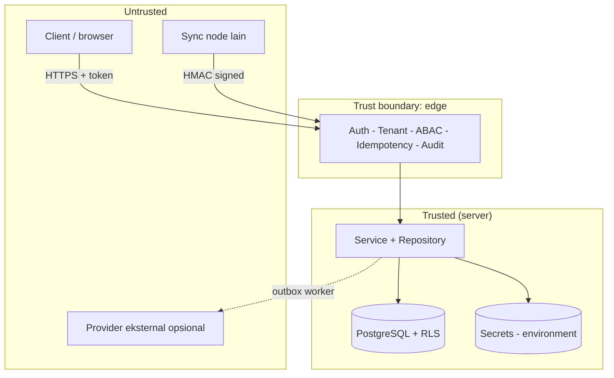
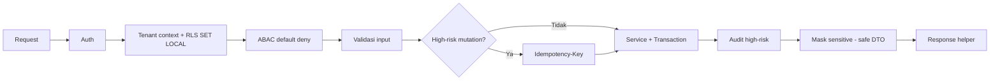

# Bagian 20 — Threat Model dan Arsitektur Keamanan

Dokumen ini merangkum **model ancaman** dan **arsitektur keamanan** AWCMS-Mini sebagai base. Ini adalah dokumen standar base (bukan contoh domain). Kebijakan pelaporan kerentanan ada di [`SECURITY.md`](../../SECURITY.md); keputusan yang mendasari ada di [`docs/adr/`](../adr/README.md).

## Aset yang dilindungi

| Aset                         | Contoh                                   | Sensitivitas        |
| ---------------------------- | ---------------------------------------- | ------------------- |
| Kredensial autentikasi       | password hash, token sesi, JWT secret    | Critical            |
| Identifier sensitif          | NPWP, NIK, email, nomor HP (hash + mask) | High                |
| Data lintas-tenant           | seluruh baris tenant-scoped              | High                |
| Jejak audit & security event | audit log, decision log                  | High (integritas)   |
| Secret provider/infra        | kunci R2, HMAC sync, DB URL              | Critical            |
| Kontrak & standar            | OpenAPI/AsyncAPI, migration              | Medium (integritas) |

## Batas kepercayaan (trust boundaries)

Prinsip: **semua input dari zona untrusted divalidasi dan tidak dipercaya**; nilai tenant/identitas berasal dari auth middleware, bukan header publik mentah.

## Model ancaman (STRIDE ringkas)

| Ancaman                    | Contoh                              | Mitigasi di base                                                                                 |
| -------------------------- | ----------------------------------- | ------------------------------------------------------------------------------------------------ |
| **Spoofing**               | Menyamar sebagai user/tenant/node   | Auth token tervalidasi; sync HMAC + anti-replay (ADR-0006); tenant context dari middleware       |
| **Tampering**              | Ubah data/koreksi retroaktif        | Immutability data posted; audit append-only; RLS `FORCE` (ADR-0003, ADR-0005)                    |
| **Repudiation**            | Menyangkal aksi                     | Audit high-risk + decision log dengan correlation ID (ADR-0004)                                  |
| **Information disclosure** | Bocor lintas-tenant / data sensitif | RLS berlapis + filter `tenant_id`; masking/redaction; error tanpa stack trace (ADR-0003)         |
| **Denial of service**      | Menjenuhkan DB/pool                 | Pool work-class + backpressure → `503 DATABASE_BUSY`; statement timeout                          |
| **Elevation of privilege** | Naik hak akses                      | ABAC default-deny, deny overrides allow; role DB non-superuser; self-approval ditolak (ADR-0004) |

## Kontrol keamanan berlapis

1. **Transport & sesi** — HTTPS di produksi, cookie `HttpOnly`/`Secure`/`SameSite`, TTL sesi, lockout login.
2. **Otorisasi** — RBAC + ABAC default-deny (ADR-0004) + RLS (ADR-0003).
3. **Integritas data** — transaksi, idempotency, immutability, soft delete (ADR-0005).
4. **Kerahasiaan** — hash+mask identifier, redaction log/audit, secret hanya dari environment.
5. **Ketersediaan** — pooling/backpressure, offline-first outbox (ADR-0006).
6. **Rantai pasok** — Bun-only (ADR-0002), Dependabot, CodeQL, lockfile terkunci.

## Penanganan secret

- Secret hanya dari **environment** (doc 18); `.env` di-ignore, `.env.example` hanya placeholder.
- Boot memvalidasi konfigurasi (fail-fast); flag aktif tanpa kredensial → gagal start.
- Redaction wajib untuk key sensitif sebelum masuk log/audit.
- CI menolak berkas `.env` yang ter-commit dan tooling non-Bun (`.github/workflows/ci.yml`).

## Data sensitif & privasi

- Identifier sensitif disimpan sebagai `value_hash` (lookup/dedup) + `masked_value` (tampilan); nilai mentah tidak disimpan.
- Klasifikasi data & retensi di `docs/awcms-mini/04_erd_data_dictionary.md`.
- Data yang di-soft-delete tetap tenant-scoped, tetap terkena RLS, dan tetap masuk retensi/legal hold.

## Automasi keamanan repositori

| Kontrol                                                             | Lokasi                         |
| ------------------------------------------------------------------- | ------------------------------ |
| Secret scanning + push protection                                   | GitHub (setelan repo)          |
| Dependabot alerts + updates                                         | `.github/dependabot.yml`       |
| CodeQL code scanning                                                | `.github/workflows/codeql.yml` |
| Lint + docs-check + typecheck + unit test + Bun-only/no-`.env` gate | `.github/workflows/ci.yml`     |
| Private vulnerability reporting                                     | `SECURITY.md`                  |

## Batasan (yang belum tercakup)

Kontrol di dokumen ini sudah terimplementasi nyata sejak seluruh 18 issue backlog doc06 tuntas (v0.22.0) dan diperkuat lebih lanjut oleh epic M9 (§Matrix kepatuhan di bawah, v0.23.4) — bukan lagi standar tanpa kode. Yang tetap di luar cakupan base ini (tanggung jawab lapisan deployment/aplikasi turunan, bukan celah yang terlewat): WAF, rate limiting di edge/proxy (app-level login rate limiting sendiri sudah ada sejak Issue #437, lihat matrix di bawah), manajemen secret terpusat (vault), pengerasan host, provisioning sertifikat TLS nyata, dan monitoring/SIEM terpusat (A.8.16 di matrix).

## Matrix kepatuhan OWASP / ASVS / ISO 27001 (Issue #437)

Audit kepatuhan yang memetakan kontrol proyek ke kerangka standar industri untuk kesiapan audit eksternal (skill `awcms-mini-security-hardening`), dilakukan 2026-07-06. Setiap baris memuat bukti konkret (path file/fungsi/query), bukan asumsi. Legenda status: ✅ terpenuhi · ⚠ gap · ➖ di luar scope base generik ini.

### OWASP Top 10 (2021)

| #   | Kategori                           | Status | Bukti                                                                                                                                                                                                                                                                                                                                                                                                                                                                                                                                                                                                                                                                                                                                                                                                                                                                                                                                                                                                                                                                                                                                                                                                                                                                                                                                                                                                                                                     | Remediasi                                                                                                      |
| --- | ---------------------------------- | ------ | --------------------------------------------------------------------------------------------------------------------------------------------------------------------------------------------------------------------------------------------------------------------------------------------------------------------------------------------------------------------------------------------------------------------------------------------------------------------------------------------------------------------------------------------------------------------------------------------------------------------------------------------------------------------------------------------------------------------------------------------------------------------------------------------------------------------------------------------------------------------------------------------------------------------------------------------------------------------------------------------------------------------------------------------------------------------------------------------------------------------------------------------------------------------------------------------------------------------------------------------------------------------------------------------------------------------------------------------------------------------------------------------------------------------------------------------------------- | -------------------------------------------------------------------------------------------------------------- |
| A01 | Broken Access Control              | ✅     | ABAC default-deny + deny-overrides: `src/modules/identity-access/domain/access-control.ts` `evaluateAccess()` (empty grant set → `matchedPolicy: "default_deny"`, digerbang `checkAbacDefaultDeny` di `scripts/security-readiness.ts`). RLS `ENABLE`+`FORCE` pada 31 tabel tenant-scoped (`sql/013_awcms_mini_enforce_rls_least_privilege.sql`; digerbang `checkRlsEnabled`). Role app (`awcms_mini_app`) bukan superuser/BYPASSRLS (`checkAppDbUserNotSuperuser`). IDOR: setiap query tenant-scoped melalui `withTenant()`/`SET LOCAL app.current_tenant_id` (`src/lib/database/tenant-context.ts`), tak ada `WHERE tenant_id` yang dilewati manual dari input. **Contoh two-tier (Issue #497)**: `POST /api/v1/email/announcements` menegakkan `email.notification.create` untuk target eksplisit (bounded) DAN `email.announcement.create` TAMBAHAN untuk target role/tenant (unbounded) — pola reusable untuk "bulk vs single action" mana pun butuh permission lebih kuat untuk cakupan lebih luas.                                                                                                                                                                                                                                                                                                                                                                                                                                                  | —                                                                                                              |
| A02 | Cryptographic Failures             | ✅     | Password argon2id via `Bun.password.hash` (default; `src/lib/auth/password.ts`, digerbang `checkPasswordHashingModern`). Token sesi opaque: `generateSessionToken()`/`hashSessionToken()` (`src/lib/auth/session-token.ts`) — hanya `sha256:` hash yang disimpan di `awcms_mini_sessions.token_hash`, token mentah tak pernah persisted. Identifier sensitif `value_hash`+`masked_value` (doc 04). Cookie `HttpOnly`+`SameSite=Lax`+`Secure` (env-gated `AUTH_COOKIE_SECURE`) di `src/pages/api/v1/auth/login.ts`.                                                                                                                                                                                                                                                                                                                                                                                                                                                                                                                                                                                                                                                                                                                                                                                                                                                                                                                                        | TLS di produksi bergantung deployment (nginx template `deploy/nginx/awcms-mini.conf.example` — lihat ASVS V9). |
| A03 | Injection                          | ✅     | Seluruh query lewat tagged template parametrik `Bun.SQL` (`tx\`...${value}...\``); grep repo tak menemukan string-concat SQL. `tx.unsafe`/`SET LOCAL`hanya untuk nilai yang sudah lolos`assertUuid()`(mis.`src/pages/api/v1/setup/initialize.ts`). Output HTML di-escape otomatis oleh Astro (`{}` expression).                                                                                                                                                                                                                                                                                                                                                                                                                                                                                                                                                                                                                                                                                                                                                                                                                                                                                                                                                                                                                                                                                                                                           | —                                                                                                              |
| A04 | Insecure Design                    | ✅     | Threat model ini sendiri (STRIDE). Immutability posted (ADR-0005). Idempotency mutation high-risk (skill `awcms-mini-idempotency`). Self-approval workflow ditolak (`workflow-approval` module). Fail-closed default: GUC tenant zero-UUID bila tak di-set (`sql/013`). **Issue #747 (managed definitions/delegation/escalation/recovery)**: published/active definisi workflow immutable (edit selalu membuat draft version baru, `application/workflow-definition-directory.ts`), instance ter-pin ke versi definisi persis saat mulai (FK immutable + kolom `workflow_definition_version`). Delegasi tidak pernah memperluas wewenang delegator (`domain/workflow-delegation.ts`'s `resolveEffectiveDeciderIds` dibatasi scope/effective-date, delegate tetap harus lolos guard permission+self-approval yang sama). Aksi recovery administratif (reassign/cancel/force-decision) permission-gated eksplisit (`workflow.recovery.*`), reason wajib, `Idempotency-Key`, audit lengkap, dan tidak pernah menimpa riwayat keputusan (append-only). Escalation job idempoten via guard `WHERE status='pending' AND escalation_step=<nilai dibaca>` (optimistic concurrency, `application/workflow-escalation.ts`) — tidak pernah mengeskalasi task yang sama dua kali untuk due event yang sama. Resolver/action kondisi kontribusi-modul adalah static registry (`infrastructure/condition-action-registry.ts`), tidak ada eval/scripting (doc 21 §3 Q5). | —                                                                                                              |
| A05 | Security Misconfiguration          | ✅     | Secret hanya dari `process.env`, `.env` di-gitignore, CI menolak `.env` ter-commit (`checkEnvNotTracked`). Error tanpa stack trace (`checkErrorsDontLeakStackTraces` — live-verified `POST /api/v1/sync/push` tanpa header HMAC → 400 bersih). **Gap ditemukan+ditutup Issue #437**: tidak ada security header (CSP/HSTS/X-Frame-Options/X-Content-Type-Options/Referrer-Policy/Permissions-Policy) di `src/middleware.ts` maupun template nginx sebelum PR ini — lihat §"Kontrol baru" di bawah.                                                                                                                                                                                                                                                                                                                                                                                                                                                                                                                                                                                                                                                                                                                                                                                                                                                                                                                                                         | Ditutup (lihat di bawah).                                                                                      |
| A06 | Vulnerable/Outdated Components     | ✅     | Bun-only (ADR-0002) — hanya 2 runtime dependency (`astro`, `@astrojs/node`) di `package.json`; lockfile `bun.lock` terkunci. Dependabot aktif (`.github/dependabot.yml`), CodeQL aktif (`.github/workflows/codeql.yml`, matrix `actions` + `javascript-typescript` sejak Issue #452 — SAST atas source TypeScript/Astro).                                                                                                                                                                                                                                                                                                                                                                                                                                                                                                                                                                                                                                                                                                                                                                                                                                                                                                                                                                                                                                                                                                                                 | —                                                                                                              |
| A07 | Identification & Auth Failures     | ✅     | Lockout setelah `AUTH_LOGIN_MAX_ATTEMPTS` (default 5) kegagalan berturut per identitas (`evaluateLoginAttempt`, `login-policy.ts`; digerbang `checkLoginLockoutImplemented`). Pesan generik anti-enumeration (`AUTH_INVALID_CREDENTIALS` sama untuk user tak ada vs password salah). Sesi TTL (`AUTH_SESSION_TTL_MIN`) + revoke eksplisit saat logout (`src/pages/api/v1/auth/logout.ts` menghapus baris `awcms_mini_sessions`). **Gap ditemukan+ditutup Issue #437**: lockout per-identitas tak menahan penyerang yang merotasi `loginIdentifier` dari sumber yang sama (enumerasi lintas-akun) — ditambahkan rate limit sumber+tenant (`src/lib/security/rate-limit.ts`). **Diperluas Issue #496**: `POST /auth/password/forgot`/`reset` — respons 200 generik identik ada/tidaknya akun, token reset di-hash (`sha256`, `awcms_mini_password_reset_tokens`), single-use (`used_at`), short-lived (`AUTH_PASSWORD_RESET_TOKEN_TTL_MIN`, default 30 menit), request baru men-supersede token lama, sesi identity di-revoke penuh setelah reset (`revokeAllSessionsForIdentity`), rate limit sumber+tenant terpisah dari login.                                                                                                                                                                                                                                                                                                                           | Ditutup (lihat di bawah).                                                                                      |
| A08 | Software & Data Integrity Failures | ✅     | Checksum sha256 file sync/objek diverifikasi sebelum upload (`verifyObjectChecksum`, `src/modules/sync-storage/domain/object-queue.ts`, dipanggil nyata oleh `object-storage-uploader.ts` sejak Issue #436). Audit append-only (tak ada `UPDATE`/`DELETE` pada `awcms_mini_audit_events` di seluruh `src/`). Migration checksum di runner (`scripts/db-migrate.ts`). CodeQL code scanning.                                                                                                                                                                                                                                                                                                                                                                                                                                                                                                                                                                                                                                                                                                                                                                                                                                                                                                                                                                                                                                                                | —                                                                                                              |
| A09 | Logging & Monitoring Failures      | ✅     | Audit high-risk + decision log + correlation ID (`src/modules/logging/application/audit-log.ts`, `src/modules/identity-access/application/decision-log.ts`, `X-Correlation-ID` di `src/middleware.ts`). Redaksi wajib sebelum log/audit: `src/modules/_shared/redaction.ts` (14 key sensitif: password, token, npwp, nik, phone, whatsapp, email, dst., rekursif) dipakai bersama oleh logger (`src/lib/logging/logger.ts`) dan audit trail.                                                                                                                                                                                                                                                                                                                                                                                                                                                                                                                                                                                                                                                                                                                                                                                                                                                                                                                                                                                                              | —                                                                                                              |
| A10 | SSRF                               | ✅     | URL provider R2 selalu dari `process.env.R2_ACCOUNT_ID` (env tepercaya), tak pernah dari input user (`object-storage-uploader.ts:88-89`); endpoint sync HMAC node juga dari konfigurasi, bukan payload request. Provider dipanggil di luar transaction DB (ADR-0006), circuit breaker per-provider (`src/lib/database/circuit-breaker.ts`). Sudah diverifikasi tuntas di Issue #436 — tidak diulang/diduplikasi di sini. **Pengecualian yang disengaja (Issue #591/#603)**: `awcms_mini_auth_providers.issuer_url` (generic tenant OIDC SSO) SATU-SATUNYA outbound URL di base ini yang berasal dari data tenant-configured, bukan env server — `generic-oidc-client.ts` fetch `.well-known/openid-configuration` dan JWKS/token endpoint hasil discovery-nya ke `issuer_url` itu. **Diputuskan sebagai accepted risk, bukan celah** — lihat §Batasan yang dicatat, bukan diabaikan di bawah untuk rasional lengkap.                                                                                                                                                                                                                                                                                                                                                                                                                                                                                                                                      | —                                                                                                              |

### OWASP ASVS (L1/L2 relevan)

| Area                            | Status | Bukti                                                                                                                                                                                                                                                                                                                                                                                       |
| ------------------------------- | ------ | ------------------------------------------------------------------------------------------------------------------------------------------------------------------------------------------------------------------------------------------------------------------------------------------------------------------------------------------------------------------------------------------- |
| V2 Auth                         | ✅     | Hashing modern (argon2id), lockout per-identitas + rate limit per-sumber (baru), token sesi baru setiap login (`generateSessionToken()` dipanggil ulang tiap `POST /auth/login`, mencegah session fixation), logout mencabut sesi (hapus baris DB, bukan cuma hapus cookie).                                                                                                                |
| V3 Session                      | ✅     | Cookie `HttpOnly`+`SameSite=Lax`+`Secure` (prod, env-gated `AUTH_COOKIE_SECURE=true` — didokumentasikan di doc 18); token opaque server-side (`sha256:` hash saja yang disimpan); `expiresAt`/`AUTH_SESSION_TTL_MIN`.                                                                                                                                                                       |
| V4 Access Control               | ✅     | Default deny (`checkAbacDefaultDeny`), dicek per-request (middleware + `access-guard.ts` tiap endpoint, bukan sekali di login), RLS defense-in-depth (`checkRlsEnabled`+`checkAppDbUserNotSuperuser`), IDOR dicegah via `withTenant()` konsisten.                                                                                                                                           |
| V5 Validation/Encoding          | ✅     | Validasi input tiap endpoint (mis. `validateSetupInitializeInput`, `user-management.ts` validator); output encoding otomatis Astro; CSRF via `security.checkOrigin` Astro bawaan (didokumentasikan `identity-access/README.md` §Catatan operasional — `Content-Type` wajib pada mutation, diverifikasi live saat Issue 8.1).                                                                |
| V7 Error/Logging                | ✅     | Error tanpa detail internal (`checkErrorsDontLeakStackTraces`, live-verified); log tanpa data sensitif (redaksi wajib, lihat A09).                                                                                                                                                                                                                                                          |
| V9 Communications               | ✅/➖  | TLS di produksi: template nginx (`deploy/nginx/awcms-mini.conf.example`) redirect HTTP→HTTPS + `server_tokens off`; **HSTS ditambahkan Issue #437** (`Strict-Transport-Security`, gated `APP_ENV=production` — lihat di bawah). Provisioning sertifikat nyata adalah tanggung jawab operator deployment (➖ di luar cakupan kode). HMAC untuk sync mesin-ke-mesin (`awcms-mini-sync-hmac`). |
| V12 Files                       | ✅     | Checksum sha256 diverifikasi sebelum upload (`verifyObjectChecksum`); path/objek tak pernah dari input tak tepercaya (key dari `awcms_mini_object_sync_queue`, bukan request body langsung).                                                                                                                                                                                                |
| V14 HTTP Security Configuration | ✅     | **Baru Issue #437**: CSP (Astro `security.csp` native, hash otomatis + 1 hash manual is:inline), `X-Content-Type-Options: nosniff`, `X-Frame-Options: DENY`, `Referrer-Policy: strict-origin-when-cross-origin`, `Permissions-Policy`, `Strict-Transport-Security` (prod). Sebelumnya tidak ada satupun — gap nyata, ditutup.                                                               |

### ISO/IEC 27001:2022 Annex A (relevan-kode)

| Kontrol                           | Status | Bukti                                                                                                                                                                                                                                                                                                |
| --------------------------------- | ------ | ---------------------------------------------------------------------------------------------------------------------------------------------------------------------------------------------------------------------------------------------------------------------------------------------------- |
| A.5.15 Access control             | ✅     | ABAC default-deny + RLS FORCE (lihat A01/V4).                                                                                                                                                                                                                                                        |
| A.5.17 Authentication information | ✅     | Password hash argon2id, tak pernah disimpan/di-log mentah; token sesi hash-only.                                                                                                                                                                                                                     |
| A.8.2 Privileged access rights    | ✅     | Empat role DB terpisah, semua least-privilege, tak satupun superuser/owner (`sql/013`, `sql/045` — Issue #683, epic #679; `checkAppDbUserNotSuperuser`, `checkRuntimeRoleGlobalTableGrants`). Lihat §Standar tambahan dipicu epic platform-hardening di bawah.                                       |
| A.8.5 Secure authentication       | ✅     | Lockout + rate limit (baru) + hashing modern + CSRF checkOrigin.                                                                                                                                                                                                                                     |
| A.8.12 Data leakage prevention    | ✅     | Masking/redaction identifier sensitif (doc 04) + `redaction.ts` untuk log/audit.                                                                                                                                                                                                                     |
| A.8.15 Logging                    | ✅     | Audit trail append-only + decision log + correlation ID berstruktur JSON — sejak Issue #447, `ApiMeta.correlationId` konsisten di seluruh respons `/api/*` (bukan satu endpoint demo), dan `awcms_mini_audit_events` punya retensi eksplisit + purge terjadwal (`bun run logs:audit:purge`, doc 04). |
| A.8.16 Monitoring                 | ⚠      | Log terstruktur ada; agregasi/alerting terpusat (SIEM) adalah tanggung jawab lapisan operasional/deployment turunan — di luar cakupan kode base ini (dicatat, bukan diabaikan).                                                                                                                      |
| A.8.24 Cryptography               | ✅     | Argon2id (password), SHA-256 (token sesi, checksum objek, hash CSP), HMAC (sync).                                                                                                                                                                                                                    |
| A.8.28 Secure coding              | ✅     | Guardrail doc 10 ditegakkan konsisten (tagged-template query, response helper standar, ABAC/RLS/audit/idempotency per endpoint); CodeQL.                                                                                                                                                             |
| A.8.31 Separation of environments | ✅     | `APP_ENV` (development/staging/production) menggerbang perilaku sensitif (cookie `Secure`, HSTS); role DB app vs migrasi terpisah (dua-peran, doc 18).                                                                                                                                               |

### Kontrol baru yang ditutup (Issue #437, critical/priority gap yang benar-benar ditemukan)

1. **Security response headers** (A05/V14/A.8.28) — sebelumnya nol. Ditambahkan `src/lib/security/security-headers.ts` (`X-Content-Type-Options`, `X-Frame-Options`, `Referrer-Policy`, `Permissions-Policy`, `Strict-Transport-Security` prod-gated), diterapkan di `src/middleware.ts` untuk setiap response. **CSP** memakai fitur bawaan Astro `security.csp` (`astro.config.mjs`), BUKAN nonce/hash manual — dua pendekatan manual dicoba lebih dulu dan dibatalkan setelah verifikasi **headless-Chrome/CDP nyata** (curl tak bisa mendeteksi pelanggaran CSP karena tak mengeksekusi JS/CSS): (a) nonce per-request — dihapus diam-diam oleh compiler Astro dari atribut `is:inline`; (b) hash SHA-256 manual untuk satu skrip `is:inline` yang diketahui — ternyata Astro juga meng-inline beberapa skrip/style lain per-komponen (`ThemeToggle.astro`, `LanguageSwitcher.astro`, tombol logout) yang luput dari allowlist manual dan **benar-benar memblokir fungsi** (tombol tema tak merespons klik) saat diverifikasi di browser sungguhan. Solusi akhir: fitur native Astro menghasilkan hash otomatis untuk semua yang di-inline-nya + **satu hash manual** untuk satu-satunya skrip `is:inline` tersisa (`src/lib/security/theme-init-script.ts`, dengan test `tests/theme-init-script.test.ts` yang mencegah drift antara isi skrip dan hash-nya).
2. **Rate limiting login** (A07/V2/A.8.5) — memperluas pola lockout `AUTH_LOGIN_MAX_ATTEMPTS` yang sudah ada (per-identitas) dengan limiter sumber+tenant baru (`src/lib/security/rate-limit.ts`, env `AUTH_LOGIN_RATE_LIMIT_MAX`/`AUTH_LOGIN_RATE_LIMIT_WINDOW_SEC`, default 20/60 detik) — menutup celah enumerasi lintas-identitas dari sumber yang sama. Diverifikasi live: percobaan ke-21 dari IP+tenant sama → `429 RATE_LIMITED` + header `Retry-After`; sumber IP berbeda tetap tak terpengaruh.
3. **False-positive pada gate `security:readiness` sendiri** — `checkNoHardcodedSecret` menandai `ERROR_CODE_KEYS.TOKEN_EXPIRED: "error.token_expired"` (`src/lib/i18n/error-messages.ts`) sebagai kemungkinan secret (nama variabel mengandung "TOKEN"), padahal nilainya adalah kunci katalog i18n. **Ditemukan dengan menjalankan gate ini sendiri** terhadap kode yang sudah ada — bukan hipotetis. Diperbaiki dengan heuristik tambahan `I18N_KEY_LIKE_VALUE_PATTERN` (string dot-namespace huruf kecil tanpa entropi acak bukan bentuk secret yang valid).
4. `scripts/security-readiness.ts` diperluas dua check baru: `checkSecurityHeadersPresent` (live, hit server nyata, cek 5 header termasuk `content-security-policy`) dan `checkLoginRateLimitImplemented` (murni, menegaskan `checkRateLimit()` menolak percobaan ke-4 setelah `maxAttempts=3`). Keduanya `warning` (defense-in-depth, bukan kontrol akses primer yang sudah `critical`).

### Gap non-critical dengan follow-up eksplisit (tidak diabaikan diam-diam)

- **A.8.16 Monitoring/alerting terpusat** (SIEM/observability platform) — di luar cakupan base generik ini; tanggung jawab lapisan operasional aplikasi turunan (mis. AWPOS) atau deployment (doc 07/18). Log terstruktur JSON sudah tersedia sebagai prasyaratnya. **Issue #447** menambah titik pemasangan (bukan implementasi SIEM itu sendiri, batas ini tidak berubah): `setLogSink()` (`src/lib/logging/logger.ts`) dan `setAuditExportHook()` (`src/modules/logging/application/audit-log.ts`), keduanya default no-op — aplikasi turunan bisa memasang consumer nyata tanpa mengubah kode inti.
- **Rate limiter in-memory per-proses** (`src/lib/security/rate-limit.ts`) — tidak dibagi antar instance pada deployment multi-instance (load balancer). Cukup untuk topologi default LAN-first single-instance (doc 18); deployment multi-instance yang butuh limit terbagi sebaiknya menambah rate limiting di edge/proxy (sudah dicatat sebagai tanggung jawab lapisan deployment di §Batasan di atas).
- **Provisioning sertifikat TLS nyata** — template nginx menyediakan redirect HTTP→HTTPS dan struktur konfigurasi, tapi penerbitan sertifikat (Let's Encrypt/self-signed) tetap manual oleh operator (dicatat di komentar template, bukan item baru dari Issue #437).

## Standar tambahan dipicu modul Email (Issue #493-#500, epic #492)

Modul email memperkenalkan dua trust boundary baru yang belum pernah
dibahas eksplisit oleh matrix di atas: **ketergantungan pada provider
eksternal** (Mailketing) dan **data recipient pihak ketiga** (alamat
email penerima, bukan data milik tenant sendiri). Bagian ini memetakan
standar tambahan yang relevan untuk keduanya — tidak mengulang kontrol
generik (hash+mask, redaction, RLS, ABAC) yang sudah dicakup di atas dan
berlaku sama untuk data email.

### OWASP API Security Top 10 (2023) — permukaan endpoint Email

| #    | Kategori                                                             | Status | Bukti                                                                                                                                                                                                                                                                                                                                                                                                                                                    |
| ---- | -------------------------------------------------------------------- | ------ | -------------------------------------------------------------------------------------------------------------------------------------------------------------------------------------------------------------------------------------------------------------------------------------------------------------------------------------------------------------------------------------------------------------------------------------------------------- |
| API2 | Broken Authentication                                                | ✅     | Setiap endpoint email (`/email/templates*`, `/email/announcements*`, `/email/messages*`, `/email/suppressions*`, `/auth/password/{forgot,reset}`) memakai `authorizeInTransaction`/`resolveAuthInputs` yang sama dengan seluruh API lain — tidak ada jalur auth terpisah/lebih lemah khusus email. `POST /auth/password/{forgot,reset}` (Issue #496) sengaja publik (pre-auth by design) tapi anti-enumeration (respons generik identik) + rate-limited. |
| API3 | Broken Object Property Level Authorization (excessive data exposure) | ✅     | Setiap respons daftar/detail pesan/suppression hanya menyertakan `to_address_masked`/`recipientMasked` — kolom `to_address`/raw recipient tidak pernah diserialisasi ke response DTO manapun (`email-message-directory.ts`, `suppression-directory.ts`). Preview announcement (`POST /email/announcements/preview`) mengembalikan `matchedCount`, bukan daftar penerima.                                                                                 |
| API4 | Unrestricted Resource Consumption                                    | ✅     | Daftar dibatasi (`LIMIT 100`/keyset cursor `EMAIL_MESSAGE_LIST_LIMIT`), bulk announcement dibatasi `MAX_EXPLICIT_USER_IDS` (500) untuk target `users`, `Idempotency-Key` wajib pada `POST /email/announcements` (mencegah duplikasi akibat retry client), rate limit sumber+tenant terpisah pada `POST /auth/password/forgot`/`reset` (`AUTH_PASSWORD_RESET_RATE_LIMIT_MAX`/`_WINDOW_SEC`).                                                              |

### ISO/IEC 27005 — risk treatment: dependensi provider eksternal

Risiko "provider email pihak ketiga tidak tersedia/berubah perilaku"
ditangani lewat kombinasi kontrol, bukan satu mitigasi tunggal:
circuit breaker per-provider (`email-mailketing` key, buka setelah 5
kegagalan beruntun, tutup otomatis setelah jendela pemulihan — mencegah
retry-storm ke provider yang sedang outage), retry/backoff eksponensial
dengan batas (`EMAIL_SEND_MAX_RETRIES`) sebelum status akhir `failed`
(bukan retry tanpa batas), dan pemanggilan provider selalu di luar
transaksi DB (ADR-0006) sehingga outage provider tidak pernah mengunci
atau menggagalkan transaksi bisnis yang tidak terkait. Runbook operasional
(provider outage, rotasi kredensial) ada di
`src/modules/email/README.md` §Incident response.

### ISO/IEC 22301 — kontinuitas saat provider tidak tersedia

Turunan langsung dari mitigasi 27005 di atas: `EMAIL_ENABLED=false` (atau
provider outage yang membuka circuit breaker) tidak pernah memblokir
fitur inti aplikasi lain — pesan yang gagal terkirim tetap tersimpan
`queued`/`retry_wait` di `awcms_mini_email_messages` (tidak hilang) dan
terkirim otomatis setelah provider pulih; tidak ada jalur kode yang
menjadikan pengiriman email sebagai prasyarat sinkron bagi transaksi
lain (password reset tetap membuat token yang valid meski email
belum/tidak terkirim; dispatcher adalah proses terpisah).

### ISO/IEC 27701 dan UU PDP — privasi data recipient

Data recipient (alamat email penerima notifikasi/announcement) adalah
data pihak ketiga, bukan data tenant sendiri — data minimization
ditegakkan struktural, bukan sekadar kebijakan: `to_address` disimpan
ternormalisasi untuk kebutuhan pengiriman (bukan pilihan, provider butuh
alamat asli), tapi **setiap** permukaan diagnostik/admin/audit hanya
pernah menyerlialisasikan `to_address_masked`/`recipient_hash`
(lihat §OWASP API3 di atas); preview/audit bulk announcement tidak
pernah mencatat daftar penerima, hanya jumlah; suppression list
(unsubscribe/bounce/complaint) memberi mekanisme penerima menarik
persetujuan yang ditegakkan otomatis oleh dispatcher (re-check saat
kirim, Issue #499) — bukan hanya saat enqueue.

### PP PSTE (Penyelenggaraan Sistem dan Transaksi Elektronik)

Kewajiban umum penyelenggara sistem elektronik (keamanan sistem,
perlindungan data pengguna) yang relevan sudah tercakup lewat kontrol di
atas (RLS, ABAC, hash+mask, audit, secret hygiene) — tidak ada kewajiban
PSTE spesifik-email tambahan di luar itu yang teridentifikasi untuk base
generik ini. Kewajiban sertifikasi/pendaftaran PSE (bila berlaku untuk
skala operator tertentu) adalah tanggung jawab lapisan operasional
aplikasi turunan, bukan sesuatu yang bisa dibuktikan dari kode.

## Standar tambahan dipicu modul Manajemen Modul (Issue #511-#521, epic #510)

Modul Management memperkenalkan trust boundary yang belum pernah dibahas
eksplisit oleh matrix di atas: **admin dapat mengubah ketersediaan/
konfigurasi modul lain untuk tenant-nya sendiri** (bukan cuma CRUD data
domain), dan **registry code-derived (dependency/jobs/navigation) yang
dulunya statis kini sebagian tersinkron ke database**. Bagian ini
memetakan tujuh risiko yang diminta eksplisit oleh Issue #522, tidak
mengulang kontrol generik (RLS, ABAC default-deny, redaction) yang sudah
dicakup di atas dan berlaku sama di sini.

### Privilege escalation lewat enable/disable modul

Setiap mutasi lifecycle (`enable`/`disable`) dan config (`settings.update`,
`health.check`) tetap lewat ABAC default-deny standar — tidak ada jalur
pintas. Yang membedakan modul ini: efek sebuah keputusan **menyebar ke
endpoint modul lain**, bukan cuma resource-nya sendiri. `authorizeInTransaction`
(guard bersama semua endpoint terproteksi) mengecek
`awcms_mini_tenant_modules` **sebelum** evaluasi ABAC/RBAC — menonaktifkan
modul memblokir `403 MODULE_DISABLED` untuk _permintaan apa pun_ ke modul
itu, terlepas permission yang dimiliki actor (`src/modules/identity-access/README.md`
§"Enforcement modul disabled"). Ini mencegah skenario "modul terlihat
nonaktif di UI tapi endpoint-nya tetap bisa diakses" — visibilitas
navigasi bukan otorisasi (issue's own security note).

### Module misconfiguration dan dependency abuse

Validasi dependency (Issue #515, `domain/tenant-module-lifecycle.ts`)
berjalan **server-side**, tidak bisa dilewati dari client: modul tidak
bisa diaktifkan bila dependency-nya hilang/nonaktif
(`MODULE_DEPENDENCY_MISSING`/`_DISABLED`), tidak bisa dinonaktifkan bila
modul lain yang masih aktif bergantung padanya
(`MODULE_REVERSE_DEPENDENCY_ACTIVE`), circular dependency terdeteksi
eksplisit (`MODULE_DEPENDENCY_CYCLE`), dan modul core (`isCore: true`)
tidak bisa dinonaktifkan sama sekali (`CORE_MODULE_CANNOT_BE_DISABLED`).
Graph dependency sendiri **selalu dibaca dari registry code
(`listModules()`)**, tidak pernah dari tabel database
(`awcms_mini_module_dependencies` hanya cache hasil sync terakhir) — actor
dengan akses database langsung tidak bisa memanipulasi graph yang
dipakai untuk keputusan enable/disable dengan mengubah tabel itu saja.

**Registry-wide DAG gate (Issue #680, epic #679)**: `MODULE_DEPENDENCY_CYCLE`
di atas hanya pernah diperiksa untuk SATU modul (yang sedang di-enable),
tidak pernah untuk seluruh registry sekaligus — celah ini pernah
membiarkan `tenant_admin`/`profile_identity`/`identity_access` punya
cycle 3-node nyata di descriptor code selama tidak ada yang mencoba
meng-enable ketiganya lewat jalur normal. `domain/module-dependency-graph.ts`'s
`validateModuleDependencyGraph` menutup celah itu — memeriksa SELURUH
`listModules()` sekaligus (self-dependency, duplicate, missing key,
cycle langsung/tidak langsung), dijalankan di `bun run modules:dag:check`
(bagian dari `bun run check`, jadi gagal build bila registry rusak) dan
`bun run modules:sync` (menolak menulis graph rusak ke DB).

### Kebocoran konfigurasi sensitif (module settings)

`awcms_mini_module_settings` tenant-scoped (RLS FORCE) tapi **tetap
divalidasi di application layer**, bukan cuma diandalkan pada isolasi
tenant: key berbentuk secret (mengandung `password`/`token`/`apikey`/
`secret`/`credential`, daftar sama `_shared/redaction.ts`'s
`REDACTION_KEYS`) **ditolak saat request** (`400 SETTINGS_SENSITIVE_KEY_REJECTED`),
bukan disimpan lalu di-redact saat dibaca — nilai yang tidak pernah
disimpan tidak bisa bocor kemudian. Cek nama key saja tidak menutup
kasus admin (sengaja atau tidak) menempelkan credential nyata ke field
yang namanya tidak mencurigakan (mis. `publicLabel`) — `_shared/redaction.ts`'s
`findSecretShapedValues` melengkapi dengan heuristik bentuk-value
(JWT, blok PEM private key, AWS access key id, header `Bearer`/`Basic`
mentah, connection string ber-`user:pass@`), sengaja konservatif supaya
label/URL/flag biasa tidak pernah salah tertolak, dan menolak
(`400 SETTINGS_SECRET_SHAPED_VALUE_REJECTED`) tanpa pernah menyertakan
value itu sendiri di pesan error (hanya path key). Audit trail (`settings_updated`)
hanya mencatat _nama key_ yang berubah (`addedKeys`/`changedKeys`/`removedKeys`),
tidak pernah nilainya — konsisten dengan prinsip data minimization yang
sama dipakai modul Email untuk data recipient (§ di atas).

### Provider outage (module health check)

Satu-satunya live network call di seluruh epic ini
(`resolveEmailProvider().healthCheck()`, dipanggil dari
`POST /modules/email/health/check`) sudah timeout-bounded dan
error-truncating sejak Issue #495 (dipakai ulang, bukan diimplementasi
baru) — kegagalan/outage provider tidak pernah melempar exception tak
tertangani (`{ok: false, error}` selalu, tidak pernah throw) dan tidak
pernah memblokir transaksi bisnis lain, karena endpoint ini bukan bagian
dari alur bisnis manapun (aksi admin eksplisit dan terpisah). `GET
/modules/{moduleKey}/health` (passive) tidak pernah memanggil provider
sama sekali — sesuai acceptance criteria issue ini "provider checks are
explicit and do not block normal business transactions".

### Stale/orphaned permission

Issue #517's `comparePermissions` melaporkan permission yang ada di
katalog (`awcms_mini_permissions`) tapi tidak lagi dideklarasikan
descriptor (`orphaned`) — **dilaporkan, tidak pernah dihapus otomatis**
(security note eksplisit issue #517: keputusan hapus/pertahankan tetap
di tangan operator manusia). Ini secara sengaja mencegah dua kelas
risiko sekaligus: penghapusan otomatis yang bisa memutus assignment role
yang masih valid (jika laporan salah/ada race), dan permission
"tersesat" tak bertuan yang tidak pernah terlihat oleh siapa pun karena
tidak ada mekanisme audit read-only untuk menemukannya.

### Admin lockout risk

Dua lapis mitigasi independen mencegah tenant mengunci diri sendiri dari
kemampuan administratif: (1) modul `module_management` sendiri
dideklarasikan `isCore: true` — tidak bisa dinonaktifkan sama sekali,
jadi kemampuan mengelola modul lain (termasuk mengaktifkan kembali
sesuatu yang salah dinonaktifkan) tidak pernah hilang; (2) dependency
graph mencegah menonaktifkan modul yang masih dibutuhkan modul aktif
lain (§Dependency abuse di atas) — kombinasi keduanya berarti tidak ada
urutan enable/disable yang valid yang bisa membuat tenant kehilangan
akses ke `/admin/modules` itu sendiri. Catatan: modul lain (`identity_access`,
`tenant_admin`, dll.) **tidak** dideklarasikan `isCore` — secara teori
bisa dinonaktifkan bila tidak ada dependent aktif lain, tapi dependency
graph (`identity_access` punya beberapa reverse dependent aktif secara
default) membuat skenario ini butuh langkah eksplisit berurutan yang
disengaja, bukan kecelakaan satu klik.

## Standar tambahan dipicu epic full-online auth security hardening (Issue #587-#593)

Epic ini menambahkan enam fitur hardening auth **online-only** (gate
bersama #587, Cloudflare Turnstile #588, MFA/TOTP #589, Google OIDC login
#590, generic tenant OIDC SSO #591, admin policy UI #592) di atas login
lokal/password + session opaque yang sudah dicakup matrix di atas — tidak
mengulang kontrol generik (RLS, ABAC default-deny, redaction, argon2id,
lockout+rate-limit) yang sudah berlaku sama untuk semua endpoint auth,
termasuk yang ditambah epic ini. Bagian ini memetakan tujuh kategori risiko
spesifik-epik yang diminta eksplisit oleh Issue #593; setiap baris memuat
bukti konkret (fungsi/file), bukan asumsi — sumber materinya adalah
implementasi #587-#592 yang sudah selesai (detail lengkap: skill
`awcms-mini-auth-online-hardening`).

**Guardrail yang berlaku di semua tujuh kategori di bawah**: setiap fitur
hanya aktif bila DUA gate setuju — gate deployment
`isFullOnlineSecurityActive(env)` (#587, `AUTH_ONLINE_SECURITY_ENABLED=true`
DAN `AUTH_ONLINE_SECURITY_PROFILE=full_online`) DAN flag fitur itu sendiri
(`TURNSTILE_ENABLED`/`AUTH_MFA_ENABLED`/`AUTH_GOOGLE_LOGIN_ENABLED`/
`AUTH_SSO_ENABLED`). Deployment offline/LAN/local yang tidak pernah
menyentuh var-var ini (default `.env.example`) tidak menjalankan kode
tambahan apa pun dari epic ini dan tidak butuh kredensial provider sama
sekali — `APP_ENV=production` **bukan** proxy untuk gate ini (lihat
`deployment-profiles.md` §Full-online auth security hardening).

| Kategori risiko                                        | Mitigasi                                                                                                                                                                                                                                                                                                                                                                                                                                                                                                                                                                                                                                                                                                                                                                                                                                                                                                                                                                                                                                                                                                                                                                                                                                                                             |
| ------------------------------------------------------ | ------------------------------------------------------------------------------------------------------------------------------------------------------------------------------------------------------------------------------------------------------------------------------------------------------------------------------------------------------------------------------------------------------------------------------------------------------------------------------------------------------------------------------------------------------------------------------------------------------------------------------------------------------------------------------------------------------------------------------------------------------------------------------------------------------------------------------------------------------------------------------------------------------------------------------------------------------------------------------------------------------------------------------------------------------------------------------------------------------------------------------------------------------------------------------------------------------------------------------------------------------------------------------------ |
| **Credential stuffing / brute force**                  | Lockout per-identitas (`AUTH_LOGIN_MAX_ATTEMPTS`) + rate limit sumber+tenant (`AUTH_LOGIN_RATE_LIMIT_MAX`, sudah ada sebelum epic ini) diperkuat oleh Cloudflare Turnstile (`enforceTurnstileIfRequired`, `src/lib/security/turnstile.ts`) di `POST /auth/login`, `/auth/password/forgot`, `/auth/password/reset`, `/setup/initialize` — token diverifikasi server-side ke Cloudflare siteverify SEBELUM password hashing/DB (biaya verifikasi murah dibuang duluan untuk request yang gagal bot-check). Fail-closed: token hilang/invalid/misconfigured semuanya ditolak, tidak pernah dilewati diam-diam.                                                                                                                                                                                                                                                                                                                                                                                                                                                                                                                                                                                                                                                                          |
| **Bot abuse (automated signup/login)**                 | Widget Turnstile di `/login` + verifikasi kriptografis server-side (bukan sekadar cek keberadaan token client) menutup permukaan yang tidak tercakup rate limit murni (bot yang merotasi IP/identitas tetap harus lolos bot-check per percobaan). CSP mengizinkan `https://challenges.cloudflare.com` tanpa syarat build-time (`astro.config.mjs`) sementara widget runtime tetap digerbang `isTurnstileRequired()` — CSP dan runtime gate sengaja dipisah karena CSP hanya bisa di-bake saat build, `TURNSTILE_ENABLED` didesain runtime-toggleable.                                                                                                                                                                                                                                                                                                                                                                                                                                                                                                                                                                                                                                                                                                                                |
| **OIDC callback abuse**                                | `GET .../callback` (Google #590 DAN generic SSO #591) memvalidasi ID token kriptografis PENUH (signature RS256 via WebCrypto `crypto.subtle`, `src/lib/auth/jwt-verify.ts` — tanpa library JWT eksternal) lalu issuer/audience/expiry/nonce (`google-oidc-policy.ts`'s `validateIdTokenClaims`, dipakai ulang verbatim oleh #591); provider account ditautkan via `sub`, TIDAK PERNAH via email mentah (auto-link email butuh `email_verified=true` DAN domain allow-list eksplisit, fail-closed bila kosong). `state` CSRF/replay-bound (`oauth-state-token.ts`, ≥32 byte random, di-hash at rest) membawa tenant id via prefix (`${tenantId}.${rawToken}`) karena redirect Google/provider adalah navigasi browser murni tanpa header tenant. **Regresi nyata yang sudah diperbaiki**: endpoint `start` tak terautentikasi awalnya langsung INSERT dengan `tenantId` query-param yang belum divalidasi, memicu FK violation yang mentrip `getDatabaseCircuitBreaker()` APLIKASI-LEBAR untuk 5 request acak dari penyerang tak terautentikasi (PR #598) — diperbaiki dengan `SELECT` keberadaan/status tenant SEBELUM INSERT ber-FK apa pun, pola yang sekarang wajib untuk setiap endpoint tak terautentikasi baru di epic ini.                                                    |
| **Provider outage (Cloudflare/Google/tenant OIDC)**    | Setiap panggilan provider eksternal (Turnstile siteverify, Google token exchange, OIDC discovery/JWKS/token per provider) timeout-bounded (`withTimeout`) DAN circuit breaker per-provider (`getProviderCircuitBreaker`, generic SSO bahkan per PROVIDER KEY: `sso-oidc-discovery:<key>`/`-jwks:<key>`/`-token:<key>` — provider satu tenant unhealthy tidak pernah memengaruhi tenant/provider lain). **Regresi nyata yang sudah diperbaiki** (PR #596): breaker awalnya menyamakan respons 4xx valid (Cloudflare/Google/provider BENAR menolak token/code attacker-controlled yang salah) dengan kegagalan transport genuine — breaker bersama lintas-tenant itu bisa dibuka siapa pun tanpa autentikasi dengan mengirim token sampah berulang, mengunci login/reset/setup SEMUA tenant. Diperbaiki: breaker HANYA `recordFailure()` pada 5xx/network-error/timeout, tidak pernah pada 2xx dengan `success:false`/4xx yang valid. Provider outage sungguhan tetap fail-closed untuk fitur online itu SENDIRI (mis. Turnstile-gated login ditolak selama breaker terbuka), TAPI tidak pernah mengunci break-glass local login (lihat baris SSO lockout di bawah) — outage provider eksternal harus tidak pernah jadi single point of failure untuk akses admin.                     |
| **MFA recovery abuse**                                 | Recovery code disimpan hash-only (sha256, tidak reversibel), single-use via compare-and-swap (`UPDATE ... WHERE used_at IS NULL RETURNING id`, bukan SELECT-lalu-UPDATE terpisah). Replay TOTP dicegah `last_used_step` per factor, juga compare-and-swap (`UPDATE ... WHERE last_used_step < $step`). **Regresi nyata yang sudah diperbaiki** (PR #597): versi awal `verifyMfaChallenge` melakukan SELECT lalu UPDATE terpisah di bawah READ COMMITTED — request verifikasi konkuren bisa melewati replay guard maupun batas `failed_attempts` sepenuhnya; diperbaiki dengan `SELECT ... FOR UPDATE` pada baris challenge plus compare-and-swap di semua state single-use terkait. `POST /auth/mfa/totp/verify` dibatasi rate (`AUTH_MFA_RATE_LIMIT_MAX`/`_WINDOW_SEC`). Reset password TIDAK PERNAH menonaktifkan MFA (diverifikasi test integrasi eksplisit) — bukan jalur bypass. **Trade-off yang diterima, dicatat bukan diabaikan**: `disable`/`recovery-codes/regenerate` hanya mensyaratkan sesi valid (tanpa step-up re-auth password/TOTP saat ini) — sesi yang dibajak cukup untuk mematikan MFA korban; diterima sebagai scope trade-off Issue #589, dicatat di skill `awcms-mini-auth-online-hardening` §MFA/TOTP untuk fitur online lanjutan yang menyentuh area ini. |
| **SSO lockout (tenant terkunci dari akunnya sendiri)** | `sso_required=true`/`password_login_enabled=false` (`awcms_mini_tenant_auth_policies`, #591) tidak bisa DISIMPAN (`409 BREAK_GLASS_REQUIRED`) kecuali minimal satu `break_glass_identity_ids` adalah identity `active` dengan tenant membership `active` — dicek FRESH dari DB di titik SAVE (`saveTenantAuthPolicy`/`countEligibleBreakGlassIdentities`), tidak dipercaya dari request body. Login password lokal TIDAK PERNAH dihapus/dinonaktifkan secara default oleh fitur mana pun di epic ini. **Celah residual yang ditutup Issue #593**: validasi save-time saja tidak menangkap break-glass identity yang dinonaktifkan (atau tenant membership-nya dicabut) OLEH AKSI LAIN setelah kebijakan disimpan — `scripts/security-readiness.ts`'s `checkSsoBreakGlassReady` (baru, critical) mem-verifikasi ULANG eligibility setiap tenant dari DB di waktu readiness/go-live, memakai ulang fungsi eligibility yang SAMA (`countEligibleBreakGlassIdentities`) supaya tidak ada dua aturan yang bisa divergen. Provider outage (baris di atas) juga tidak pernah mengunci break-glass login — break-glass selalu password lokal, tidak pernah bergantung provider eksternal apa pun.                                                                                            |
| **Offline dependency breakage**                        | Setiap fitur online-only digerbang DUA syarat independen (§Guardrail di atas) — `.env.example` default SEMUA fitur nonaktif dan provider-free; `bun run config:validate` PASS tanpa kredensial provider apa pun saat gate/fitur nonaktif (`checkOnlineAuthSecurityConfig`/`checkTurnstileConfig`/`checkMfaConfig`/`checkGoogleOidcConfig`/`checkSsoConfig`, semuanya "unset/off requires nothing"). Deployment offline/LAN yang tidak pernah menyentuh var-var epic ini menjalankan NOL query/panggilan tambahan dan berperilaku identik dengan sebelum epic ada (mis. `isPasswordLoginDisabledForIdentity` hanya dipanggil `login.ts` saat `isSsoRequired(env)` aktif). `bun run security:readiness` melaporkan status disabled sebagai `info`/`pass`, bukan kegagalan (`checkOnlineAuthSecurityReady` dkk.) — hanya misconfiguration SUNGGUHAN pada fitur yang benar-benar diaktifkan yang memblokir go-live.                                                                                                                                                                                                                                                                                                                                                                      |

### Batasan yang dicatat, bukan diabaikan (follow-up terpisah)

- **Step-up re-auth untuk disable MFA/regenerate recovery code** — trade-off
  Issue #589 di atas, belum ada follow-up issue eksplisit; dicatat di skill
  `awcms-mini-auth-online-hardening`.
- **Break-glass identity picker/data-hygiene di admin UI** — Issue #605,
  **selesai**: picker `admin/security.astro` sekarang memfilter kandidat ke
  identity+tenant-user `active`, dan `saveTenantAuthPolicy` memfilter
  `break_glass_identity_ids` yang dipersist ke hanya id yang dikonfirmasi
  eligible (lihat skill `awcms-mini-auth-online-hardening` §Break-glass
  picker/data-hygiene).
- **SSRF hardening untuk `issuer_url` OIDC tenant-configured (#591)** — Issue
  #603, **selesai sebagai keputusan didokumentasikan, bukan perubahan
  kode**: diputuskan TIDAK menambah IP-range denylist (resolve hostname,
  tolak private/loopback/link-local/metadata-endpoint) di
  `generic-oidc-client.ts`.

  **Koreksi setelah audit keamanan PR #609** (versi awal keputusan ini
  salah mengaitkan alasan dengan mode deployment LAN-first/offline —
  fitur ini justru HANYA aktif di profil `full_online`
  (`isFullOnlineSecurityActive`, doc 18), yaitu KEBALIKAN dari
  LAN-first/offline yang tidak pernah memuat kode ini sama sekali).
  Alasan yang benar: deployment `full_online` (cloud/registry) sering
  tetap perlu terhubung ke IdP enterprise tenant yang di-host on-prem
  dan hanya reachable lewat VPN/tunnel privat (pola "bring-your-own-IdP"
  yang umum di SaaS multi-tenant) — blanket private-IP block akan
  mematahkan skenario SAH ini.

  **Batas mitigasi yang sebenarnya (dikoreksi)**: gate ABAC
  (`identity_access.sso_providers.create`/`update`) dan audit log
  hanya membatasi siapa yang bisa MENGONFIGURASI `issuer_url` jahat —
  KEDUANYA TIDAK membatasi siapa yang bisa MEMICU fetch keluar
  setelahnya. `GET /api/v1/auth/sso/{providerKey}/start` yang memicu
  `discoverOidcConfiguration`/dst. bersifat **tanpa autentikasi**,
  hanya dibatasi rate limit per-sumber+tenant (`start.ts`). Risiko
  residual ini SENGAJA diterima bersama keputusan utama (tidak menambah
  IP blocking), tapi dicatat eksplisit di sini alih-alih dianggap sudah
  tertutup oleh ABAC. Tidak ada perubahan kode dari keputusan #603
  sendiri — murni dokumentasi risiko yang diterima secara eksplisit.

  **Hardening tambahan — Issue #610, selesai setelah DUA putaran security
  review** (menyempitkan, bukan menghilangkan, residual di atas — tidak
  membuka ulang keputusan "tanpa IP blocking"):

  - **Bug Critical yang ditemukan sekaligus diperbaiki (pre-existing sejak
    #591)**: setiap cache/circuit-breaker di `generic-oidc-client.ts`
    sebelumnya di-key HANYA oleh `providerKey`, padahal `provider_key`
    cuma unik PER TENANT — dua tenant berbeda yang menamai provider mereka
    sama (mis. `"okta"`) berbagi entry cache/breaker yang sama. Tenant
    admin jahat bisa mendaftarkan provider bernama umum menunjuk server
    attacker, memicu satu fetch, dan attacker's `authorization_endpoint`/
    `jwks_uri` ter-serve ke tenant LAIN yang punya provider senama —
    primitif pengambilalihan SSO lintas-tenant, bukan sekadar residual
    probing. Diperbaiki: semua cache/breaker kini di-key
    `${tenantId}:${providerKey}`.
  - **Draft awal PR ini sempat menambah rate limit agregat (bukan
    per-sumber) di `start.ts`** untuk membatasi prober lintas-IP — putaran
    review KEDUA menemukan budget bersama ini sendiri adalah DoS tanpa
    privilege (≥3 source IP cukup mengunci semua user sah tenant dari
    login SSO). Dihapus total; pertahanan sebenarnya adalah circuit
    breaker (kini benar di-scope tenant+provider) + negative-TTL cache di
    bawah, yang HANYA membatasi percobaan gagal, tak pernah bisa
    memblokir login sah.
  - `generic-oidc-client.ts` kini meng-cache percobaan discovery/JWKS yang
    GAGAL selama 30 detik (`discoveryFailureCache`/`jwksFailureCache`,
    di-key sama) — target yang tak pernah membalas JSON valid tidak lagi
    memicu fetch baru di setiap hit.
  - Rekomendasi infra-layer blokir egress `169.254.169.254` untuk
    deployment `full_online` didokumentasikan di `deployment-profiles.md`
    §Generic tenant OIDC SSO (tetap tanggung jawab operator, di luar
    cakupan aplikasi).
  - **Follow-up — selesai (Issue #612)**: `AUTH_SSO_MAX_PROVIDERS_PER_TENANT`
    (default 20) membatasi jumlah baris `awcms_mini_auth_providers` aktif
    per tenant (`createAuthProvider` → `409 SSO_PROVIDER_LIMIT_EXCEEDED`),
    supaya total volume probing tenant tidak lagi bisa dilipatgandakan tanpa
    batas dengan mendaftarkan banyak provider row.

  Detail lengkap: skill `awcms-mini-auth-online-hardening`
  §SSRF/`issuer_url`.

- **Circuit breaker exclusion untuk SQLSTATE class 22** — Issue #601,
  **selesai** (`isPostgresClientInputError` di `tenant-context.ts` kini
  mencakup kelas `22` dan `23`).

## Standar tambahan dipicu epic visitor analytics (Issue #617-#624)

Epic ini menambah **telemetry pengunjung berskala tinggi** (satu baris
per page-view/API call, jauh lebih tinggi volumenya dari audit event
yang hanya dicatat untuk aksi high-risk) yang menyentuh kelas data yang
belum pernah dibahas matrix di atas: alamat IP, user-agent, dan
(opsional) geolokasi. Detail lengkap kontrol, mode operasi, dan
pemetaan kepatuhan penuh ada di `docs/awcms-mini/visitor-analytics.md`
(dokumen baru, Issue #624) — bagian ini merangkum model ancaman inti,
tidak mengulang kontrol generik (RLS, ABAC default-deny, audit) yang
sudah berlaku sama di sini.

| Kategori risiko                                                                             | Mitigasi                                                                                                                                                                                                                                                                                                                                                                                                                                                                                                                                                   |
| ------------------------------------------------------------------------------------------- | ---------------------------------------------------------------------------------------------------------------------------------------------------------------------------------------------------------------------------------------------------------------------------------------------------------------------------------------------------------------------------------------------------------------------------------------------------------------------------------------------------------------------------------------------------------- |
| **Re-identifikasi pengunjung lewat IP/user-agent mentah**                                   | Privacy-first default: `VISITOR_ANALYTICS_RAW_IP_ENABLED`/`_RAW_USER_AGENT_ENABLED`/`_GEO_ENABLED` semuanya mati secara default (Issue #617) — hanya `ip_hash`/`user_agent_hash` (HMAC-SHA256 keyed `VISITOR_ANALYTICS_HASH_SALT`, Issue #619) dan field browser/device/OS hasil parse tersimpan. Raw value, bila diaktifkan eksplisit, dibatasi retensi pendek (`VISITOR_ANALYTICS_RAW_DETAIL_RETENTION_DAYS`, default 30 hari) dan dibersihkan job purge terjadwal (Issue #624, lihat baris purge di bawah).                                             |
| **Existence oracle lintas-tenant lewat FK yang tidak dilindungi RLS**                       | Ditemukan security-auditor di Issue #618 (FK `identity_id`/`visitor_session_id` tidak ditegakkan RLS Postgres — dokumentasi resmi `CREATE POLICY`), **ditutup di Issue #620**: `identity_id` selalu di-derive server-side dari sesi terautentikasi pemanggil sendiri, `visitor_session_id` selalu dari row yang baru saja dicari/dibuat fungsi collector sendiri di dalam tenant context-nya — tidak pernah dari UUID mentah yang bisa dikontrol client. Lihat skill `awcms-mini-visitor-analytics` §Schema untuk detail penuh.                            |
| **Data sensitif bocor lewat query-string yang ikut ter-log**                                | `sanitizePath` (Issue #619) membuang minimum 11 parameter sensitif (`token`/`code`/`password`/`secret`/`email`/`phone`/`authorization`/`access_token`/`refresh_token`/`reset_token`/`mfaChallengeToken`) sebelum path masuk `path_sanitized` — fail SAFE (buang seluruh query string, bukan echo raw input) untuk input yang gagal di-parse `URL()` (post-review fix, PR #627).                                                                                                                                                                            |
| **Geolokasi diam-diam tidak aktif meski dikira aktif (operator mismatch)**                  | `resolveGeoEnrichment` (Issue #623) mensyaratkan DUA gate (`VISITOR_ANALYTICS_GEO_ENABLED` DAN `VISITOR_ANALYTICS_TRUST_CLOUDFLARE`) — salah satu mati menghasilkan semua field `null` (fail-safe, tidak pernah geolokasi keliru dari header yang tidak tepercaya). `bun run security:readiness`'s `checkVisitorAnalyticsGeoTrustedSourceReady` (Issue #624, critical) menangkap kombinasi "geo diaktifkan tanpa trust Cloudflare" sebelum go-live, supaya operator tidak mengira fitur aktif padahal diam-diam kosong.                                    |
| **Header forwarded ambigu meracuni IP/geolokasi**                                           | `resolveAnalyticsClientIp` (Issue #623) menolak `X-Forwarded-For`/`CF-Connecting-IP` yang membawa >1 nilai comma-separated (anomali → log warning → fallback ke sumber berikutnya), pola sama `X-Forwarded-Host` di epic tenant-domain-routing. Proxy tepercaya yang benar wajib MENIMPA (bukan menambahkan) header ini di setiap request (kontrak sama `PUBLIC_TRUST_PROXY`, doc 18).                                                                                                                                                                     |
| **Retensi data yang tidak proporsional dengan sensitivitas**                                | Prinsip urutan retensi ditegakkan: raw detail (30 hari default) < event (90 hari default) < rollup agregat (730 hari default) — dari Issue #617's config. Issue #624 menambah `checkVisitorAnalyticsRetentionOrderingReady` (warning) yang memverifikasi urutan ini setiap `security:readiness`, dan `checkVisitorAnalyticsRawIpRetentionReady` (critical) yang GAGAL bila raw IP aktif dengan retensi raw detail melebihi retensi event.                                                                                                                  |
| **Purge terjadwal gagal/berhenti diam-diam**                                                | `bun run analytics:purge` (Issue #624, `scripts/visitor-analytics-purge.ts`) memanggil `purgeVisitorAnalyticsData` yang SAMA dengan `POST /api/v1/analytics/retention/purge` (Issue #621, tidak pernah re-derive rule purge) untuk setiap tenant `active`, mencatat audit `critical` `retention_purged` per tenant yang benar-benar terpurge (bukan log silent), dan exit non-zero bila terjadi error — operator penjadwal (cron/systemd timer) melihat kegagalan lewat exit code, bukan berhenti diam-diam.                                               |
| **Rollup dihitung dobel saat job dijalankan ulang**                                         | `rollupVisitorAnalyticsForDate` (Issue #624) UPSERT penuh (`ON CONFLICT (tenant_id, date, area) DO UPDATE SET ... = EXCLUDED...`) — setiap run merekomputasi total dari `awcms_mini_visit_events` mentah dan MENIMPA, tidak pernah menambah ke nilai lama. Rerun tanggal yang sama menghasilkan baris identik; diverifikasi `tests/integration/visitor-analytics-rollup.integration.test.ts`.                                                                                                                                                              |
| **Instalasi baru mengumpulkan telemetry tanpa keputusan sadar operator (audit 2026-07-11)** | `VISITOR_ANALYTICS_ENABLED` default sekarang `false` (sebelumnya `true` di Issue #617) — koleksi tidak pernah mulai tanpa operator secara eksplisit mengaktifkannya, setelah operator menetapkan dasar hukum/tujuan pemrosesan sendiri (UU PDP; software ini bukan dasar hukum itu sendiri). Deployment existing yang sudah men-set var ini `true` eksplisit tidak terdampak — lihat `docs/awcms-mini/visitor-analytics.md` §Default opt-in dan upgrade path.                                                                                              |
| **Cookie anonim persisten bertahan lama tanpa batas meski modul dinonaktifkan**             | `awcms_mini_visitor_key` sebelumnya hardcoded ~2 tahun; sekarang configurable (`VISITOR_ANALYTICS_VISITOR_KEY_COOKIE_TTL_DAYS`, 30 hari default) DAN direvokasi secara aktif (`shouldRevokeVisitorKeyCookie`, `domain/visitor-key-cookie.ts`) begitu `VISITOR_ANALYTICS_ENABLED` bukan `"true"` — browser yang sudah membawa identifier lama tidak menyimpannya tanpa batas hanya karena tidak ada lagi yang memperbaruinya. `bun run security:readiness`'s `checkVisitorAnalyticsVisitorKeyCookieTtlReady` (warning) menandai TTL yang melebihi 400 hari. |

### Batasan yang dicatat, bukan diabaikan (visitor analytics)

- **`VISITOR_ANALYTICS_RAW_USER_AGENT_ENABLED` saat ini no-op** — belum
  ada kolom raw-user-agent (migration 039 hanya `user_agent_hash` +
  `user_agent_parsed`); flag ini divalidasi (`checkVisitorAnalyticsRawUserAgentRetentionReady`,
  warning) untuk kesiapan retensi hari flag ini benar-benar diwire ke
  kolom nyata, bukan karena ia melakukan sesuatu hari ini.
- **Region/city/timezone selalu `null`** — belum ada database GeoIP
  lokal/offline (di luar cakupan Issue #623); hanya country code dari
  header Cloudflare `CF-IPCountry` yang pernah terisi.
- **`VISITOR_ANALYTICS_HASH_SALT` default kosong tetap lulus
  `security:readiness`** (warning, bukan critical) — hash tetap valid
  secara fungsional tanpa salt, hanya lebih rentan korelasi lintas-
  deployment lewat tabel precompute; menaikkan ini ke critical akan
  menggagalkan setiap deployment default yang sudah ada tanpa manfaat
  keamanan yang proporsional.

## Standar tambahan dipicu epic platform-hardening (Issue #683, epic #679)

Migration 013 memberi `awcms_mini_app` DML penuh (`SELECT/INSERT/UPDATE/
DELETE`) di SEMUA tabel `public.awcms_mini_*` secara otomatis (`ALTER
DEFAULT PRIVILEGES`) — benar untuk ~76 tabel tenant-scoped (RLS FORCE'd,
itu batas keamanan sesungguhnya, ADR-0003), tapi juga menjangkau tabel
GLOBAL (non-RLS): saat migration 013/045 berjalan, itu 9 tabel (katalog
permission, ledger migrasi, kunci setup singleton, tabel root tenant, dan
registry modul + 4 turunannya). Satu role yang sama yang melayani setiap
request tenant biasa punya akses tulis penuh ke data yang seharusnya
hanya ditulis oleh migration/setup wizard — itulah yang dipersempit
migration 045 di bawah.

Registry tabel GLOBAL (non-RLS) sekarang berjumlah **11**
(`RLS_FREE_TABLES`, `scripts/security-readiness.ts`): 9 tabel di atas
ditambah dua tabel referensi wilayah administratif Indonesia
(`awcms_mini_idn_region_datasets`, `awcms_mini_idn_admin_regions`,
migration 054, Issue #657) yang ditambahkan belakangan. Kedua tabel baru
ini TIDAK mengalami periode akses tulis penuh yang dialami 9 tabel
sebelumnya — migration 054 langsung mengikuti pola least-privilege
migration 045 sejak awal (`REVOKE ALL ... FROM awcms_mini_app` di
migration yang sama persis setelah `CREATE TABLE`), jadi `awcms_mini_app`
mengakhiri migration 054 dengan nol grant di kedua tabel itu.

`sql/045_awcms_mini_db_role_separation.sql` memisahkan menjadi EMPAT
role, masing-masing hanya diberi hak yang benar-benar dipakai jalur
kodenya (diverifikasi per-jalur lewat grep, bukan diasumsikan — lihat
header migration untuk evidence lengkap):

| Role                | Env var               | Dipakai oleh                                                                                                                                                                                                                 |
| ------------------- | --------------------- | ---------------------------------------------------------------------------------------------------------------------------------------------------------------------------------------------------------------------------- |
| Migration owner     | `DATABASE_URL` (CLI)  | `bun run db:migrate` saja — satu-satunya yang bisa `ALTER`/`DROP`/`GRANT`.                                                                                                                                                   |
| `awcms_mini_app`    | `DATABASE_URL`        | Setiap HTTP request biasa. Dipersempit di 11 tabel global — 9 via matriks di header migration 045, ditambah 2 tabel referensi wilayah administratif Indonesia (Issue #657) via revoke langsung di migration 054 (nol grant). |
| `awcms_mini_worker` | `WORKER_DATABASE_URL` | 7 script cron/systemd-timer tanpa endpoint HTTP. Nol akses ke 11 tabel global kecuali `SELECT` di `awcms_mini_tenants`.                                                                                                      |
| `awcms_mini_setup`  | `SETUP_DATABASE_URL`  | Hanya `POST /api/v1/setup/initialize`. Defense-in-depth di atas kunci singleton `awcms_mini_setup_state` yang sudah ada.                                                                                                     |

`WORKER_DATABASE_URL`/`SETUP_DATABASE_URL` opsional — fallback ke
`DATABASE_URL` (`awcms_mini_app`, sudah dipersempit) bila tidak di-set,
jadi deployment yang tidak ingin mengelola 4 connection string tetap
lebih aman dari sebelumnya, hanya kehilangan lapisan isolasi tambahan.

Regression guard: `bun run security:readiness`'s
`checkRuntimeRoleGlobalTableGrants` (critical) membaca grant nyata dari
`pg_class.relacl` untuk ketiga role runtime dan menolak migration masa
depan yang tanpa sengaja memberi grant tambahan di salah satu dari 11
tabel global tersebut (termasuk dua tabel referensi wilayah Issue #657,
yang diberi entri nol-grant eksplisit di `ALLOWED_GLOBAL_TABLE_GRANTS`) —
melengkapi (bukan mengganti) `checkRlsEnabled`/
`checkAppDbUserNotSuperuser` yang sudah ada untuk tabel tenant-scoped.
Dibuktikan hidup lewat
`tests/integration/db-role-separation.integration.test.ts` — koneksi
nyata sebagai ketiga role, memverifikasi statement yang seharusnya
ditolak Postgres BENAR ditolak (`permission denied`, bukan hanya
diasumsikan dari metadata grant).

### Batasan yang dicatat, bukan diabaikan (platform-hardening — DB role separation)

- **`RETURNING id` butuh `SELECT`, bukan cuma `INSERT`** — ditemukan
  langsung lewat integration test di atas sebelum pernah di-deploy:
  Postgres menolak `INSERT ... RETURNING <kolom>` bila role hanya
  punya `INSERT` tanpa `SELECT` pada kolom itu. `awcms_mini_setup`
  karena itu diberi `SELECT` (bukan cuma `INSERT`) di setiap tabel yang
  ditulis `bootstrapPlatformTenant` DENGAN `RETURNING id`
  (`awcms_mini_tenants`/`_offices`/`_profiles`/`_identities`/
  `_tenant_users`/`_roles`) — RLS tetap membatasi `SELECT` itu hanya ke
  satu tenant yang baru dibuat dalam transaksi yang sama, bukan
  pelonggaran akses baca yang lebih luas.
- **Tabel tenant-scoped TIDAK ikut dipersempit** — `ALTER DEFAULT
PRIVILEGES` yang sudah ada (migration 013) tetap otomatis memberi
  `awcms_mini_app` DML penuh di setiap tabel tenant-scoped BARU di masa
  depan, sengaja dipertahankan karena RLS FORCE adalah batas keamanan
  sesungguhnya di sana (ADR-0003) — mempersempit grant DB di lapisan
  itu tidak menambah keamanan nyata, hanya menambah beban migrasi
  setiap tabel baru. Yang tidak tercakup convenience ini justru 11 tabel
  GLOBAL (non-RLS) — termasuk 2 tabel referensi wilayah administratif
  Indonesia yang ditambahkan belakangan (`awcms_mini_idn_region_datasets`,
  `awcms_mini_idn_admin_regions`, migration 054, Issue #657) — itulah yang
  dijaga `checkRuntimeRoleGlobalTableGrants`.

## Standar tambahan dipicu epic platform-hardening (Issue #686, epic #679)

Sebelum issue ini, mayoritas handler `/api/*` memanggil `request.json()`/
`request.text()` langsung, tanpa batas ukuran level aplikasi — batas
reverse-proxy (bila ada) tidak melindungi akses direct/local (deployment
offline/LAN tanpa nginx sama sekali, doc 18 §Topologi deployment
LAN-first), dan tidak ada batas sama sekali untuk body yang mengirim via
chunked transfer encoding atau membohongi `Content-Length`-nya.

`src/lib/security/request-body-limit.ts`'s `readJsonBody`/`readTextBody`/
`readFormBody` sekarang menjadi SATU-SATUNYA jalur baca body di seluruh
`/api/*` (71 titik panggil di 57 file dimigrasi, diverifikasi grep
menunjukkan nol `request.json()`/`.text()`/`.formData()` langsung
tersisa) — menegakkan `Content-Length` yang dideklarasikan SEBELUM byte
apa pun dibaca (short-circuit murah untuk kasus jujur), DAN penghitungan
byte streaming yang membatalkan baca begitu total terlampaui (menangkap
body chunked/tanpa `Content-Length`, atau `Content-Length` yang
berbohong lebih kecil dari byte sesungguhnya — declared length TIDAK
PERNAH dipercaya sendirian). Dua tier (`default` 128 KiB, `large` 5 MiB)
plus plafon keras `BODY_SIZE_HARD_CEILING_BYTES` (10 MiB) yang tidak
boleh dilampaui tier mana pun — ditegakkan tes unit
(`tests/unit/request-body-limit.test.ts`'s "tier configuration
invariant"), bukan hanya didokumentasikan, sehingga tier baru yang salah
ketik nilai besarnya gagal `bun test` sebelum sempat merge.

Sengaja BUKAN diimplementasikan sebagai Astro middleware yang
me-rewrite/mengganti `context.request` — memanggil `next(request)` di
middleware Astro memicu `pipeline.tryRewrite` (re-routing sungguhan
per-request, dimaksudkan untuk internal rewrite gaya i18n, bukan
transformasi body transparan). Sebagai gantinya, setiap handler memanggil
fungsi reader secara eksplisit — bentuk yang sama dengan pola pemeriksaan
keamanan opt-in lain di codebase ini (`checkRateLimit`,
`enforceTurnstileIfRequired`), dan memungkinkan setiap endpoint memilih
tier ukurannya sendiri. `checkContentLengthCeiling`
(`src/middleware.ts`) tetap ada sebagai backstop TERPISAH, murah,
hanya-global: menolak `Content-Length` yang dideklarasikan melebihi
plafon keras SEBELUM request menyentuh handler mana pun — defense-in-
depth untuk endpoint masa depan yang lupa memanggil reader di atas,
bukan pengganti pemeriksaan per-handler (tidak bisa menangkap body
chunked/tanpa `Content-Length` sama sekali, karena itu perlu benar-benar
mengonsumsi stream).

`deploy/nginx/awcms-mini.conf.example`'s `client_max_body_size 10m`
diselaraskan dengan plafon keras aplikasi yang sama — murni
defense-in-depth di lapisan proxy opsional, bukan satu-satunya
perlindungan (banyak deployment LAN-first jalan tanpa nginx sama
sekali).

### Batasan yang dicatat, bukan diabaikan (platform-hardening — request body limits)

- **Middleware-level backstop tidak unit-testable** — `src/middleware.ts`
  mengimpor `astro:middleware` (virtual module yang hanya tersedia di
  dalam pipeline build/dev Astro sendiri), sama batasan yang sudah
  didokumentasikan untuk `collectRequestAnalytics` (Issue #620). Coverage
  untuk logika sesungguhnya datang dari `checkContentLengthCeiling`'s
  tes unit langsung (fungsi murni, bukan wrapper middleware-nya) plus
  verifikasi manual dev-server + curl.
- **Endpoint upload/media tidak terpengaruh** — `media/news-images/
upload-sessions/*` tetap di tier `default` (128 KiB) karena byte
  gambar sesungguhnya tidak pernah lewat handler Astro sama sekali —
  jalur presigned R2 (Keputusan kunci #2, skill `awcms-mini-news-portal`)
  sudah lebih dulu memastikan itu; body JSON kecil (kunci objek,
  checksum) di endpoint ini tidak butuh tier lebih besar.

## Standar tambahan dipicu epic platform-hardening (Issue #687, epic #679)

Remediasi NARROW, bukan pengganti fondasi structured-logging/audit-trail
Issue 10.1/#403/#447 (`src/lib/logging/logger.ts`,
`src/modules/logging/application/audit-log.ts`). Evidence sebelum issue
ini: banyak halaman admin Astro (`src/pages/admin/**/*.astro`, 24 file)
dan script worker (`scripts/*.ts`, termasuk `scripts/api-spec-check.ts`
yang lolos dari inventarisasi awal) memanggil `console.error(label,
error)` mentah atau meng-ekstrak `error.message` dengan tangan
(`error instanceof Error ? error.message : String(error)`) lalu
mencetaknya langsung — kanal kebocoran yang berbeda dari yang sudah
ditutup `redactSensitiveAttributes` (yang hanya bekerja pada KEY objek,
bukan teks bebas seperti pesan exception).

Dua helper baru, satu jalur konsisten menggantikan ~40 titik panggil
bespoke:

- `logAdminPageError(label, error, context)`
  (`src/lib/logging/error-log.ts`) — dipakai setiap SSR admin page
  frontmatter; meneruskan `Astro.locals.correlationId` (sudah tersedia
  sejak Issue 10.1/#447) sehingga kegagalan tetap correlation-aware,
  lalu memanggil `log("error", ...)` dengan detail exception yang sudah
  disanitasi.
- `logScriptFailure(label, error)` (`src/lib/logging/error-log.ts`) —
  dipakai setiap `catch` di CLI worker (`scripts/*.ts`); mempertahankan
  bentuk pesan operator persis sama (`"<script> FAILED — <detail>"`) dan
  `process.exitCode = 1`, hanya detailnya sekarang sudah disanitasi.

Keduanya dibangun di atas `src/lib/logging/error-sanitizer.ts`:
`sanitizeErrorForLog` (representasi terstruktur, termasuk rantai
`.cause` bertingkat, dibatasi 5 level) dan `safeErrorDetail` (ringkasan
satu baris untuk output CLI) — keduanya memanggil
`redactSecretsInText` (`src/modules/_shared/redaction.ts`) baru:
pelengkap teks-bebas dari `redactSensitiveAttributes` yang berbasis
KEY, untuk pola BENTUK NILAI (JWT, blok PEM private key, AWS access
key, `Bearer`/`Basic` auth header, connection-string dengan kredensial
`user:pass@`, dan pasangan `key=value`/`key: value` yang key-nya
credential-shaped) di dalam `.message`/`.stack` exception itu sendiri.

`REDACTION_KEYS` (redaksi berbasis key object) diperluas dengan
`"cookie"`. **Temuan penting**: `"ip"` TIDAK bisa masuk daftar itu
sebagai substring biasa — pengecekan `.includes()` yang sudah ada akan
ikut meredaksi setiap key yang sekadar MENGANDUNG huruf "ip" berurutan
(`description`, `shipping`, `recipient`, `equipment`, `membership`
semuanya cocok). Sebagai gantinya `"ip"` dan sinonim nyatanya
(`ipAddress`, `ip_address`, `clientIp`, `remoteAddr`,
`x-forwarded-for`, dst.) masuk allowlist EXACT-MATCH terpisah
(dibandingkan setelah karakter non-alfanumerik dibuang) — lihat
`tests/audit-log.test.ts`'s fixture negatif (`description`/`shipping`/
`recipient` TIDAK boleh ter-redact) sebagai regression guard.

Gate baru `bun run logging:lint:check`
(`scripts/logging-lint-check.ts`, bagian dari `bun run check`) mencegah
pola lama muncul kembali di direktori yang tercakup —
**`src/pages/admin/**`, `src/pages/api/v1/**`, `scripts/**`, `src/lib/**`,
dan `src/modules/**`** (lihat `SCAN_ROOTS` di skrip itu untuk daftar
pasti; JANGAN anggap ini lengkap tanpa mengecek konstanta itu langsung —
cakupan bisa berubah): (1) ekstraksi `instanceof Error`/`String(...)`
yang variabelnya lalu mengalir ke `console.error`/`console.warn` —
sengaja TIDAK melarang pola ekstraksi itu sendiri di mana pun
(`src/pages/api/v1/**` punya 11 pemakaian sah untuk mencocokkan nama
constraint DB secara internal, tidak pernah dicetak/dikembalikan mentah,
yang akan jadi false positive kalau dilarang total); (2) panggilan
`console.error`/`console.warn` yang menerima objek error mentah langsung
(termasuk sebagai satu-satunya argumen, tanpa label) atau mengakses
`.message`/`.stack` inline tanpa melalui salah satu fungsi sanitasi yang
direview (`ALLOWED_SANITIZER_CALLS` di skrip itu). Nama variabel
tertangkap oleh nama, bukan analisis `catch`-clause sungguhan —
`error`/`err`/`exception`/`exc`/`ex`/`e` (`CAUGHT_VALUE_NAMES`) yang
dikenali; sebuah nama lain yang tidak lazim tetap lolos dari check (2)
ini (masih tertangkap check (1) kalau juga memakai idiom ekstraksi
mentah).

### PR #712 follow-up (security review sebelum merge — CRITICAL/HIGH yang diperbaiki)

Review keamanan atas PR #712 (Issue #687) menemukan beberapa celah nyata
sebelum merge, semuanya sudah diperbaiki di branch yang sama:

- **DSN dengan `:`/`@` di dalam password** — regex redaksi connection
  string sebelumnya (`[^:@/\s]+` untuk bagian password) GAGAL total
  mencocokkan bila password mengandung `:` (tidak ter-redak sama sekali),
  dan salah memilih `@` PERTAMA (bukan TERAKHIR) bila password
  mengandung `@` (sebagian besar password asli bocor mentah setelah tag
  `[REDACTED]`). Diperbaiki: kelas karakter password sekarang hanya
  mengecualikan `/` dan whitespace (`[^/\s]+`), dan sifat _greedy_ regex
  secara alami mundur (backtrack) ke `@` TERAKHIR yang valid — baik di
  `redactSecretsInText` (`_shared/redaction.ts`) maupun kembarannya
  `findSecretShapedValues`'s `SECRET_VALUE_PATTERNS`.
- **Blok PEM private key terpotong (tanpa marker END)** — pola
  BEGIN...END berpasangan gagal cocok sama sekali kalau teks
  error/stack terpotong sebelum mencapai marker END (batas
  buffer/provider), sehingga SELURUH body key mentah lolos tanpa
  redaksi. Diperbaiki: pola fallback baru meredaksi dari marker BEGIN
  sampai akhir teks kalau tidak ada END yang cocok di teks yang sama —
  sengaja bisa over-redact teks tidak terkait setelahnya di skenario
  langka ini (arah yang aman, bukan meninggalkan key mentah).
- **JWT dengan signature pendek/kosong** — segmen ketiga (signature)
  sebelumnya wajib >= 5 karakter, sehingga JWT yang terpotong (baris log
  terpotong) lolos redaksi meski header/payload-nya (sering memuat
  klaim `sub`/`tenant_id`/`roles`) tetap bocor. Diperbaiki: segmen ketiga
  sekarang `*` (nol atau lebih).
- **`logging:lint:check` tidak menjangkau `src/lib`/`src/modules`** —
  instance nyata `console.error` dengan `error.message` mentah di
  `src/lib/logging/logger.ts` (sink-error handler, sejak Issue #447,
  tidak disentuh PR #687) lolos dari gate karena `SCAN_ROOTS` awal hanya
  tiga direktori. Diperbaiki: instance itu sendiri sekarang memakai
  `safeErrorDetail`, DAN `SCAN_ROOTS` diperluas mencakup `src/lib/**` dan
  `src/modules/**` (yang terakhir nol pemakaian `console.error`/`warn`
  saat diperiksa, jadi penambahannya tidak menimbulkan false positive).
- **Nama variabel catch selain `error`/`err`** — `catch (e)`/`catch
(ex)`/`catch (exc)` sebelumnya lolos total dari check (2) karena
  regex hanya mengenali `error`/`err`. Diperbaiki: daftar nama yang
  dikenali diperluas (lihat paragraf di atas) — masih berbasis nama,
  bukan analisis catch-clause sungguhan, didokumentasikan sebagai
  keterbatasan yang disengaja, bukan diam-diam diasumsikan aman.
- **`console.error(error)` tanpa label** — argumen tunggal (tanpa koma)
  sebelumnya lolos dari `RAW_ERROR_ARGUMENT` karena regex mensyaratkan
  koma di depan. Diperbaiki: regex sekarang menerima `(` ATAU `,`
  sebelum nama yang dikenali.

Test regresi untuk setiap temuan di atas ada di `tests/audit-log.test.ts`,
`tests/unit/error-sanitizer.test.ts`, dan
`tests/unit/logging-lint-check.test.ts`.

### Troubleshooting operator-safe

Operator yang membaca output `bun run <script>` atau baris log JSON
`log()` (stdout, `{"level":"error",...}`) TIDAK seharusnya melihat nilai
password/token/cookie/authorization header/connection-string/JWT mentah
untuk setiap bentuk secret yang tercakup pola `redactSecretsInText`/
`isSensitiveKey` (`src/modules/_shared/redaction.ts`) — nilai itu diganti
`[REDACTED]`/`[REDACTED_JWT]`/`[REDACTED_PRIVATE_KEY]`/
`[REDACTED_AWS_KEY]` sebelum baris dicetak. **Ini heuristik berbasis
pola, BUKAN DLP (data loss prevention) menyeluruh** — sama seperti
disclaimer eksplisit `SECRET_VALUE_PATTERNS`/`redactSecretsInText`'s
sendiri di `_shared/redaction.ts`: trivial dilewati oleh siapa pun yang
sengaja ingin menyelundupkan secret (memecah JWT jadi beberapa field,
membungkusnya dengan teks/encoding lain, memberi spasi di tengah pola),
dan hanya menutup kasus "secret ikut kebawa tanpa sengaja", bukan setiap
jalur eksfiltrasi yang disengaja. PR #712 (security review) menemukan
dan memperbaiki beberapa celah nyata pada pola-pola ini (DSN dengan
`:`/`@` di password, PEM terpotong, JWT signature pendek — lihat
§"PR #712 follow-up" di atas); anggap redaksi ini defense-in-depth yang
kuat untuk kasus jujur, bukan jaminan absolut untuk setiap kemungkinan
bentuk secret. Kalau pesan error tidak cukup jelas untuk mendiagnosis:

1. **Cari `correlationId`-nya** — setiap baris `log()` dari admin page
   dan setiap respons `/api/*` membawa `correlationId` yang sama
   (header `X-Correlation-ID` dan `meta.correlationId`); cocokkan
   dengan `GET /logs/audit` (skill `awcms-mini-observability`) untuk
   melihat aksi/aktor yang terkait request yang sama.
2. **Rantai `.cause` tetap ada, hanya disanitasi per level** —
   `sanitizeErrorForLog` tidak membuang informasi struktural (error
   asli -> penyebab -> penyebab lebih dalam), hanya nilai secret-shaped
   di tiap level yang diganti. Nama file/baris di `.stack` tetap utuh
   kecuali kebetulan cocok pola secret.
3. **Detail lengkap TIDAK PERNAH hilang, hanya tidak pernah ada di
   response HTTP publik** — response API (`fail()`) tidak pernah
   membawa `error.message`/`error.stack` mentah (diverifikasi tidak ada
   celah, lihat inventarisasi Issue #687); detail lengkap ada di baris
   `log()` server-side, yang aksesnya sudah dibatasi ke operator
   (bukan di kanal yang bisa dilihat client/publik).
4. **False positive `bun run logging:lint:check`** — kalau menemukan
   kasus nyata yang tidak bisa ditulis ulang untuk lolos gate ini,
   tambahkan `"relative/path:line"` ke `LOGGING_LINT_EXEMPTIONS` di
   `scripts/logging-lint-check.ts` dengan alasan tercatat di komentar,
   jangan hapus/lemahkan pattern generiknya.

## Standar tambahan dipicu epic platform-hardening (Issue #698, epic #679)

Konsep BARU, komplementer terhadap (bukan pengganti) fondasi structured
logging/audit trail Issue 10.1/#447 di atas: `src/lib/observability/metrics-port.ts`
menambah counter/histogram/gauge berkardinalitas rendah untuk request
HTTP, saturasi pool DB, status/backlog job, dan outcome/latency/circuit
state provider. Detail arsitektur, tabel kardinalitas/privasi per metrik,
dan SLI/SLO ada di [`observability-metrics.md`](observability-metrics.md)
— bagian ini hanya mencatat guardrail keamanan/privasi yang mengikat
model ancaman.

**Guardrail non-negotiable (badan isu #698)**:

- **Tidak boleh ada tenant ID, route dengan ID tak terbatas, email/IP,
  object key, token, prompt, atau isi percakapan di LABEL metrik apa
  pun.** Ini beda dari redaksi nilai (`redactSensitiveAttributes`/
  `redactSecretsInText` di atas, yang untuk teks bebas di log/audit) —
  di sini masalahnya CARDINALITY EXPLOSION (satu series per tenant/id
  selamanya) DAN privasi di level label metrik itu sendiri. Mekanisme
  konkret: `METRIC_DEFINITIONS`'s `allowedLabelKeys` membuang (bukan
  menolak dengan error) key label mana pun yang tidak dideklarasikan
  untuk metrik itu sebelum sampai ke adapter mana pun — bahkan bug di
  call site tidak bisa membuat label tak-terduga sampai ke adapter.
- **Kasus paling berisiko**: `getProviderCircuitBreaker`'s registry key
  bisa tenant-scoped (`sso-oidc-discovery:<tenantId>:<providerKey>`,
  Issue #610). `deriveProviderFamilyLabel` (`circuit-breaker.ts`)
  memotong ke prefix literal sebelum `:` pertama — mengubahnya jadi
  `"sso-oidc-discovery"` saja. Fungsi yang sama dipakai baik oleh label
  metrik `provider` MAUPUN endpoint dependency-health di bawah, jadi
  keduanya tidak pernah berbeda perilaku.
- **Metrics BUKAN sumber otorisasi.** Tidak ada kode di modul ini atau
  pemanggilnya yang membaca nilai metrik untuk membuat keputusan
  ABAC/RLS/autentikasi — metrics murni observasional.
- **Offline/LAN tetap berjalan tanpa collector eksternal apa pun** —
  adapter default adalah no-op total (`createNoopMetricsPort`); setiap
  deployment yang tidak pernah memanggil `setMetricsPort` tidak
  membutuhkan koneksi keluar apa pun untuk fitur ini.

**Endpoint baru** `GET /api/v1/logs/observability/dependency-health`
(migration `047_awcms_mini_observability_metrics_permission.sql`,
permission `logging.observability.read`) adalah endpoint TERAUTENTIKASI
pertama yang membedakan "local dependency" (database) dari "optional
external provider" secara eksplisit di respons — berbeda dari
`/api/v1/health`/`/api/v1/database/pool/health` yang publik dan tidak
membedakan. `optionalProviders[].family` memakai fungsi bounding yang
sama seperti label metrik `provider`, tidak pernah raw registry key atau
tenant ID — dibuktikan oleh
`tests/integration/observability-dependency-health.integration.test.ts`
("never contain the raw tenant-scoped key/tenant id").

Baris A.8.16 di matrix kepatuhan di atas TIDAK berubah statusnya (⚠) —
metrics agregat bukan SIEM/alerting terpusat; tetap tanggung jawab
lapisan operasional aplikasi turunan untuk memasang adapter nyata
(Prometheus/OpenTelemetry, lihat `observability-metrics.md`) dan
alerting di atasnya.

## Standar tambahan dipicu epic platform-evolution (Issue #745, epic #738)

Modul `data_lifecycle` menambah **registry tabel bervolume tinggi
kontribusi-modul** dan **mesin lifecycle** (retensi/partisi/arsip/legal
hold/purge). Detail lengkap kontrol, arsitektur engine, dan pemetaan
kepatuhan penuh (UU PDP/PP PSTE/ISO 27001/27002/27005/27701/22301) ada
di `docs/awcms-mini/data-lifecycle.md` — bagian ini merangkum model
ancaman inti, tidak mengulang kontrol generik (RLS, ABAC default-deny,
audit) yang sudah berlaku sama di sini.

| Kategori risiko                                                        | Mitigasi                                                                                                                                                                                                                                                                                                                                                                                                                                                                                                                                                                                                                                                                                                                                                                                                                                      |
| ---------------------------------------------------------------------- | --------------------------------------------------------------------------------------------------------------------------------------------------------------------------------------------------------------------------------------------------------------------------------------------------------------------------------------------------------------------------------------------------------------------------------------------------------------------------------------------------------------------------------------------------------------------------------------------------------------------------------------------------------------------------------------------------------------------------------------------------------------------------------------------------------------------------------------------- |
| **Legal hold dilewati diam-diam oleh kebijakan tenant**                | `evaluateLegalHoldForDescriptor` (`domain/legal-hold.ts`) dicek SEBELUM cabang archive/purge apa pun di `planLifecycleDryRun`, dan sebelum eksekusi nyata di `archive-purge-job.ts` — tidak ada `retentionDaysOverride` atau cabang kode yang bisa melewatinya. `legalHold.applicable` pada descriptor SENGAJA hanya metadata dokumentasi, tidak dikonsultasi mesin enforcement — modul pemilik tabel tidak bisa mendeklarasikan tabelnya sendiri "kebal hold" untuk menghindar. Diuji `tests/integration/data-lifecycle-dry-run.integration.test.ts` ("cannot be bypassed by a retentionDaysOverride").                                                                                                                                                                                                                                      |
| **Default-deny release dilewati lewat permission tunggal**             | `data_lifecycle.legal_hold.create` dan `.release` adalah permission KODE TERPISAH (`data-lifecycle-permissions.ts`) — dijaga struktural oleh `security:readiness`'s `checkDataLifecycleLegalHoldReleaseSeparate` (critical), yang gagal bila keduanya pernah digabung jadi satu key yang sama di masa depan.                                                                                                                                                                                                                                                                                                                                                                                                                                                                                                                                  |
| **Purge lintas-tenant tak sengaja lewat query gabungan**               | Job iterasi tenant SATU PER SATU lewat transaksi `withTenant` terpisah (RLS FORCE + filter `tenant_id` eksplisit di setiap query) — tidak pernah satu query DELETE/SELECT lintas-tenant. "Dedicated system job yang aman mengiterasi tenant" (persyaratan issue #745) adalah pola `iterateTenantsInBatches`/loop tenant yang sudah ada, bukan mekanisme baru. Diuji `tests/integration/data-lifecycle-archive-purge-job.integration.test.ts` ("cross-tenant isolation").                                                                                                                                                                                                                                                                                                                                                                      |
| **Purge tak terbatas mengunci tabel besar**                            | `batchLimit` wajib per descriptor (`MAX_LIFECYCLE_BATCH_LIMIT` 50.000, ditegakkan `lifecycle-registry.ts`'s validator), setiap DELETE dibungkus `LIMIT` + subquery `RETURNING`, advisory lock (shared worker runner, PR #713) mencegah dua invocation konkuren memproses backlog yang sama.                                                                                                                                                                                                                                                                                                                                                                                                                                                                                                                                                   |
| **Injeksi SQL lewat nama tabel/kolom dinamis**                         | `tableName`/`tenantColumn`/`cursorColumn` HANYA berasal dari `HighVolumeTableDescriptor` yang sudah divalidasi registry gate (tidak pernah request/user input) — `assertSafeIdentifier` di setiap titik pemakaian adalah defense-in-depth allowlist regex kedua (pola sama `visitor-analytics/application/analytics-queries.ts`'s `topJsonFieldCounts`), bukan satu-satunya lapisan pertahanan.                                                                                                                                                                                                                                                                                                                                                                                                                                               |
| **Kredensial bocor lewat lokasi/log arsip**                            | `ArchiveWriteResult.artifactLocation` selalu path/URI (pola sama `awcms_mini_social_accounts.token_reference` — referensi, bukan secret mentah); tidak ada mekanisme baru yang menulis raw secret ke manifest atau log.                                                                                                                                                                                                                                                                                                                                                                                                                                                                                                                                                                                                                       |
| **Baris batas cursor kehilangan presisi (microsecond vs millisecond)** | `timestamptz` PostgreSQL presisi mikrodetik, `Date` JavaScript hanya milidetik — round-trip lewat `Date` awalnya membuat baris batas gagal memenuhi perbandingan `<=`/`>` terhadap nilai dirinya sendiri, ditemukan lewat test volume besar SEBELUM merge (bukan di produksi): purge kehilangan tepat satu baris tiap siklus, dan archive resume mengarsipkan ulang baris terakhir sampai `DEFAULT_MAX_PASSES`. Diperbaiki via `CURSOR_BOUNDARY_SAFETY_MARGIN_MS` (1ms), lihat `src/modules/data-lifecycle/README.md` §Timestamp precision untuk analisis lengkap. Bukan kerentanan keamanan (tidak ada eksposur data/lintas-tenant), tapi bug korektnes yang bisa berujung backlog tak-terpurge tanpa terdeteksi bila tidak ditemukan — dicatat di sini karena kelasnya (silent data-retention drift) relevan untuk audit kepatuhan retensi. |

### Batasan yang dicatat, bukan diabaikan (data lifecycle)

- **Hanya empat descriptor terdaftar** di PR ini (representative, bukan
  exhaustive) — lihat `docs/awcms-mini/data-lifecycle.md` §Batasan.
- **`scope: "global"` descriptor diterima registry tapi belum
  dieksekusi end-to-end** — dilewati (bukan salah eksekusi) oleh
  dry-run planner/archive-purge engine; tidak ada descriptor terdaftar
  hari ini yang mendeklarasikan `scope: "global"`.
- **Cursor tie window 1ms** tersisa setelah fix presisi di atas — dua
  baris berbeda yang benar-benar jatuh dalam jendela 1ms yang sama pada
  batas batch adalah edge case sempit yang tidak dieliminasi sepenuhnya
  secara teoretis, meski tidak dipicu pola tulis nyata descriptor
  manapun hari ini.
- **Adapter arsip object-storage eksternal belum ada** — `local_offline`
  saja diimplementasikan; `external_object_storage` adalah nilai tipe
  valid tanpa adapter nyata.
- **Tidak ada admin UI screen khusus** — mekanisme lengkap lewat API,
  layar `/admin/data-lifecycle` adalah follow-up yang masuk akal, bukan
  bagian acceptance criteria issue ini.

## Standar tambahan dipicu epic platform-evolution (Issue #742, epic #738 Wave 1)

`domain_event_runtime` — outbox transaksional generik multi-consumer.
Lihat `src/modules/domain-event-runtime/README.md` untuk desain lengkap;
bagian ini hanya mencatat model ancaman/mitigasi yang mengikat.

**Invariant transaksional (STRIDE — Tampering/Denial of Service)**:

- Event hanya bisa di-dispatch setelah transaksi sumbernya commit —
  `appendDomainEvent` murni menulis DB (tanpa panggilan eksternal, ADR-0006)
  di DALAM transaksi pemanggil; rollback pemanggil menghapus event DAN
  seluruh delivery row-nya sekaligus (tidak pernah "event yatim" dari
  transaksi yang gagal).
- Kegagalan consumer TIDAK PERNAH me-rollback transaksi sumber yang sudah
  commit — dispatcher berjalan di transaksi terpisah, jauh setelah event
  di-commit.
- Duplicate delivery tidak boleh menduplikasi side effect — ditegakkan
  MEKANIS (bukan hanya konvensi dokumentasi) lewat
  `awcms_mini_domain_event_consumer_effects`'s
  `INSERT ... ON CONFLICT DO NOTHING RETURNING id` (`applyConsumerEffectOnce`),
  dibuktikan test integrasi "redelivering an already-delivered row
  (simulated worker restart) does not duplicate the side effect".
- Tidak ada panggilan provider/broker di dalam transaksi DB — dua reference
  consumer modul ini murni DB-only; port broker opsional
  (`infrastructure/broker-adapter-port.ts`) belum diimplementasikan sama
  sekali (tidak ada jalur kode yang melanggar aturan ini karena jalur itu
  belum ada).

**Tenant isolation (STRIDE — Elevation of Privilege/Information Disclosure)**:

Keenam tabel migration 056 tenant-scoped dengan `ENABLE`+`FORCE ROW LEVEL
SECURITY` dan predikat standar `tenant_id = current_setting('app.current_
tenant_id')::uuid` — tidak ada tabel RLS-free baru. Setiap query aplikasi
di `application/domain-event-directory.ts`/`delivery-replay.ts`/
`consumer-state-directory.ts` memfilter `tenant_id` secara eksplisit di
samping RLS (defense in depth, doc 16). Dibuktikan test integrasi
multi-tenant: tenant tanpa permission `domain_event_runtime.*` mendapat
403 (bukan silently kosong), dan tenant B tidak bisa melihat/replay event
atau delivery milik tenant A (404, bukan 403 — RLS + filter tenant_id
eksplisit membuatnya benar-benar tidak terlihat, konsisten dengan pola
"resource belongs to different tenant" modul lain).

**Payload hygiene (STRIDE — Information Disclosure)**:

`domain/envelope.ts`'s `validateDomainEventPayload` MENOLAK (bukan
redaksi-lalu-simpan) payload yang mengandung nama key berbentuk credential
(`password`/`token`/`apiKey`/`secret`/`credential`/`authorization`) atau
value berbentuk credential apa pun (reuse `findSecretShapedValues`, JWT/PEM
key/AWS key id/Bearer header/connection string) — payload semacam itu
tidak pernah tersimpan sama sekali. PII biasa (email/telepon/NPWP/NIK)
SENGAJA tidak ditolak di titik ini (lihat README modul §Security notes
untuk alasan lengkap: memaksa referensi `profile_identity` alih-alih
duplikasi PII adalah keputusan level-producer, bukan blokir mekanis
generik) — dimitigasi di sisi baca lewat `domain/payload-redaction.ts`
(redaksi penuh `REDACTION_KEYS`, termasuk PII) yang diterapkan ke SETIAP
respons API/admin yang membawa payload (list/detail event, detail
delivery/DLQ), sementara handler consumer internal tetap menerima payload
mentah (dibutuhkan untuk menjalankan side effect nyata).

**Replay (STRIDE — Elevation of Privilege/Repudiation)**:

Endpoint replay (`POST /api/v1/domain-events/deliveries/{id}/replay`)
permission-gated (`domain_event_runtime.deliveries.replay`, TIDAK
otomatis dari `deliveries.read`), reason wajib (1-500 karakter, divalidasi
di route DAN `CHECK` constraint DB sebagai backstop), idempotent
(`Idempotency-Key` standar — replay ganda dengan key+payload sama
mengembalikan baris replay yang SAMA, bukan menduplikasi), dan diaudit
(`recordAuditEvent` action `domain_event_runtime.delivery.replayed` DAN
baris terstruktur `awcms_mini_domain_event_replays` untuk lineage). Replay
menolak (409 `DOMAIN_EVENT_SCHEMA_INCOMPATIBLE`) bila consumer terdaftar
sudah tidak lagi mendeklarasikan dukungan untuk `event_version` milik
delivery yang mau di-replay — mencegah handler versi baru dipanggil diam-
diam dengan payload berbentuk lama yang mungkin sudah tidak valid untuknya.

**Dead-letter inspection (STRIDE — Information Disclosure)**:

`GET .../deliveries?status=dead_letter` dan `GET .../deliveries/{id}`
mengembalikan metadata aman (kode/pesan error yang SUDAH disanitasi lewat
`sanitizeErrorForLog`/`redactSecretsInText` sebelum pernah disimpan ke
kolom `last_error_message`/`dead_letter_reason` — tidak pernah stack trace
mentah) dan proyeksi payload yang diredaksi (`payload-redaction.ts`) — tidak
ada jalur API yang mengembalikan payload event mentah tak-teredaksi.

**Batasan yang dicatat, bukan diabaikan**: retensi/purge keenam tabel
migration 056 belum dibangun di issue ini — dicatat sebagai titik integrasi
untuk `data_lifecycle` (kandidat System Foundation, epic #738 Wave 1),
bukan diklaim sudah ditangani. Konsumen/produsen nyata untuk modul lain
(blog_content, social_publishing, email, dst.) sengaja belum di-wire —
hanya dua reference consumer self-contained yang ada di issue ini; risiko
keamanan integrasi lintas-modul nyata akan dinilai ulang saat wiring nyata
itu terjadi di issue lanjutan, bukan diklaim sudah tercakup di sini.

## Standar tambahan dipicu epic platform-evolution (Issue #746, epic #738 Wave 2)

Modul `identity_access` menambah **business-scope assignments** dan
**segregation-of-duties (SoD) policy hooks**. Detail lengkap kontrol dan
arsitektur ada di `src/modules/identity-access/README.md` §Business-scope
assignments & segregation-of-duties (SoD) hooks — bagian ini merangkum
model ancaman inti, tidak mengulang kontrol generik (RLS, ABAC
default-deny, audit) yang sudah berlaku sama di sini.

| Kategori risiko                                                                                    | Mitigasi                                                                                                                                                                                                                                                                                                                                                                                                                                                                                                                                                                                                                                                                                                                                                                                                                                                                                                                                                                                                                                                                                                                                         |
| -------------------------------------------------------------------------------------------------- | ------------------------------------------------------------------------------------------------------------------------------------------------------------------------------------------------------------------------------------------------------------------------------------------------------------------------------------------------------------------------------------------------------------------------------------------------------------------------------------------------------------------------------------------------------------------------------------------------------------------------------------------------------------------------------------------------------------------------------------------------------------------------------------------------------------------------------------------------------------------------------------------------------------------------------------------------------------------------------------------------------------------------------------------------------------------------------------------------------------------------------------------------ |
| **Business-scope melemahkan isolasi tenant (ADR-0013 §2)**                                         | `scope_type`/`scope_id` HANYA disimpan/dibaca dalam transaksi `withTenant` (RLS FORCE) — tidak pernah predicate RLS kedua, tidak pernah menggantikan `tenant_id`. `BusinessScopeHierarchyPort.resolveScope` menerima `tenantId` eksplisit dan defensif tenant-scoped (`WHERE tenant_id = ...`); resolusi scope milik tenant lain SELALU mengembalikan `resolved: false`, tidak pernah membocorkan keberadaan baris tenant lain.                                                                                                                                                                                                                                                                                                                                                                                                                                                                                                                                                                                                                                                                                                                  |
| **Scope tidak dikenal/tidak resolve dieksploitasi untuk bypass**                                   | `resolved: false` (unknown scope type, id tidak ada, atau lintas-tenant) SELALU default-deny untuk aksi high-risk — diverifikasi `tests/unit/business-scope-assignment.test.ts`/integration chokepoint test. Identity-access tidak pernah menebak/mengasumsikan hierarchy untuk scope type yang tidak dikenalnya.                                                                                                                                                                                                                                                                                                                                                                                                                                                                                                                                                                                                                                                                                                                                                                                                                                |
| **Self-grant/self-approval bypass SoD**                                                            | Grantor == subject pada `createBusinessScopeAssignment` selalu ditolak (`self_grant_denied`); approver == requester pada `approveSoDConflictException` selalu ditolak (`self_approval_denied`), keduanya re-check dari baris DB, TIDAK PERNAH dipercaya dari request body — pola sama `tenant-sso.ts`'s break-glass re-check.                                                                                                                                                                                                                                                                                                                                                                                                                                                                                                                                                                                                                                                                                                                                                                                                                    |
| **SoD conflict mechanism dibangun tapi tidak ditegakkan di jalur nyata**                           | `checkHighRiskSoDConflicts` dipanggil dari `authorizeInTransaction` — chokepoint yang dipakai 124 dari 137 route file terproteksi (BUKAN "semua endpoint di codebase ini" — 13 route file pre-existing memanggil `evaluateAccess()`/`isHighRiskAction()` langsung, termasuk 3 endpoint high-risk yang TIDAK disentuh issue ini: `profiles/[id]` delete/restore/purge dan `workflows/tasks/[id]/decisions.ts` approve; klaim yang akurat dan batasannya didokumentasikan eksplisit di `application/high-risk-sod-guard.ts` dan `identity-access/README.md`, ditemukan sebagai overclaim oleh reviewer PR #776 dan dikoreksi sebelum merge). Tidak ada `SoDRuleDescriptor` fixture hari ini yang mereferensikan permission ke-13 endpoint itu, jadi tidak ada celah aktif — tapi rule SoD masa depan yang menyasar salah satunya TIDAK akan ditegakkan lewat mekanisme ini sampai endpoint itu dimigrasi ke `authorizeInTransaction`. Dibuktikan `tests/integration/business-scope-sod-chokepoint.integration.test.ts` melawan endpoint NYATA milik modul lain (`data_lifecycle`'s legal-hold release) yang TIDAK diubah issue ini.                |
| **Exception/override jadi celah permanen**                                                         | `awcms_mini_sod_conflict_exceptions.effective_to` WAJIB diisi (CHECK constraint + validasi domain) — tidak ada override tanpa batas waktu. Status `approved` adalah cache; `effective_to` vs `now()` adalah gerbang sesungguhnya (`isSoDConflictExceptionCurrentlyValid`), sehingga exception kedaluwarsa berhenti mengotorisasi bahkan sebelum job expiry berjalan. Job terjadwal (`identity-access:business-scope:expiry`) mentransisikan status secara eksplisit + audit.                                                                                                                                                                                                                                                                                                                                                                                                                                                                                                                                                                                                                                                                     |
| **Konflik SoD dipegang lewat RBAC biasa dilewati (security-auditor finding, PR #776, diperbaiki)** | Versi awal `checkHighRiskSoDConflicts`/`createBusinessScopeAssignment` HANYA bereaksi pada permission yang dipegang lewat business-scope assignment — permission yang dipegang lewat role RBAC biasa (mis. role "owner" setup wizard yang menggenggam SEMUA permission, termasuk pasangan konflik `data_lifecycle.legal_hold.create`/`.release` yang `severity: "critical"`) LOLOS tanpa evaluasi sama sekali. Diperbaiki: `resolveSoDAssignmentFacts` (`business-scope-facts.ts`) kini menggabungkan KEDUA sumber — fact business-scope-assignment (scope asli) DAN fact RBAC biasa (`scopeType`/`scopeId: null`, dianggap cocok di scope manapun untuk rule `same_scope_only`, sama seperti exception blanket). Ini SENGAJA berarti tenant existing yang role-nya sudah menggenggam kedua sisi conflict kini benar-benar terpengaruh saat fitur ini rilis — perilaku yang benar untuk rule yang didaftarkan `severity: "critical"`, bukan regresi yang harus dihindari. Diuji lewat skenario "conflict dipegang lewat RBAC biasa saja, tanpa business-scope assignment" di `tests/integration/business-scope-assignments.integration.test.ts`. |
| **Identifier scope dipalsukan dari request tanpa validasi**                                        | Setiap `scopeType`/`scopeId` pada create assignment WAJIB lolos `BusinessScopeHierarchyPort.resolveScope` (validasi lewat capability pemilik, bukan dipercaya dari body) sebelum baris pernah ditulis — issue #746 security requirement "Scope identifiers are validated through the owning capability and cannot be trusted from request input alone".                                                                                                                                                                                                                                                                                                                                                                                                                                                                                                                                                                                                                                                                                                                                                                                          |
| **Kebocoran PII lewat proyeksi list conflict/exception**                                           | `GET .../conflicts` mengembalikan proyeksi aman (rule key, subject id, trigger, outcome, reason, timestamp) — tidak ada payload request/resource. Keyset-paginated, permission-gated (`business_scope_conflicts.read`), error standar tanpa stack trace.                                                                                                                                                                                                                                                                                                                                                                                                                                                                                                                                                                                                                                                                                                                                                                                                                                                                                         |

### Batasan yang dicatat, bukan diabaikan (business-scope & SoD)

- **`defaultBusinessScopeHierarchyPortAdapter` tetap FLAT untuk
  `scopeType: "office"`** — modul `organization_structure` (Issue #749,
  ADR-0016) kini menyediakan resolusi hierarki NYATA untuk
  `scopeType: "legal_entity"`/`"organization_unit"` lewat adapternya
  sendiri (`organizationStructureHierarchyPortAdapter`), tapi
  `identity_access` tidak secara otomatis memakainya untuk `"office"` —
  kedua adapter hidup berdampingan, composition root memilih per
  `scopeType` mana yang di-inject (lihat detail lengkap di bagian
  organization_structure di bawah).
- **Tiga rule fixture SoD** (bukan katalog domain lengkap) — dua dimiliki
  `identity_access` sendiri (maker/checker atas mekanisme exception itu
  sendiri, dan atas assignment create/revoke pada scope yang sama), satu
  dikontribusikan `data_lifecycle` (`legal_hold.create`/`.release`,
  pasangan permission nyata yang sudah ada sejak Issue #745) — base tidak
  menambah rule domain-spesifik (finance/procurement/payroll) apa pun,
  konsisten dengan out-of-scope issue #746.
- **Chokepoint `authorizeInTransaction` dipakai 124 dari 137 route file
  terproteksi** — 13 route file pre-existing (termasuk `profiles/[id]`
  delete/restore/purge dan `workflows/tasks/[id]/decisions.ts` approve)
  masih memanggil `evaluateAccess()` langsung, di luar mekanisme SoD ini;
  lihat tabel di atas untuk detail dan status "tidak ada celah aktif hari
  ini, tapi rule masa depan yang menyasar salah satunya butuh migrasi
  endpoint itu dulu".
- **Tidak ada admin UI picker hierarki organisasi** — form assignment
  hari ini memakai input UUID scope_id manual dengan hint field scope
  type; picker berbasis hierarki menyusul begitu `organization_structure`
  ada.

## Standar tambahan dipicu epic platform-evolution (Issue #748, epic #738 Wave 2)

Melengkapi `profile_identity` menjadi siklus hidup party kanonik penuh —
lihat `src/modules/profile-identity/README.md` untuk detail lengkap.

### Cross-tenant matching/merge (STRIDE — Spoofing/Information Disclosure/Tampering)

Persyaratan eksplisit issue: **cross-tenant matching/merge dilarang
keras**. Dua lapis pertahanan, bukan satu:

1. `FORCE ROW LEVEL SECURITY` pada seluruh tabel `profile_identity` —
   koneksi role aplikasi normal tidak pernah melihat baris tenant lain.
2. `domain/merge.ts`'s `assertSameTenant`/`CrossTenantMergeError` —
   dipanggil ulang di `application/merge-workflow.ts`'s
   `createMergeRequest` DAN `executeMergeRequest`, terhadap baris yang
   di-fetch ulang di DALAM transaksi yang sama, tidak pernah mempercayai
   `tenant_id` yang dibawa objek/request lama. `fetchPartyForMerge`
   sengaja tidak memfilter `tenant_id` pada `WHERE`-nya — bukan lubang,
   melainkan supaya lapis kedua ini genuinely teruji lewat koneksi
   privileged (bypass RLS) di test, bukan cuma didokumentasikan sebagai
   defense-in-depth yang tidak pernah benar-benar dieksekusi
   (`tests/integration/profile-identity.integration.test.ts`'s test
   "application-layer guard: assertSameTenant/CrossTenantMergeError fires
   even when RLS is bypassed").

Duplicate-candidate scan (`duplicate-candidate-directory.ts`) juga selalu
ter-scope `tenant_id` yang sama pada kedua sisi query pencocokan — tidak
ada jalur yang membandingkan profile lintas tenant.

### Merge sebagai mutasi high-risk (doc 10)

Eksekusi merge mensyaratkan: `Idempotency-Key` (defense terhadap double-
submit key sama), row lock `SELECT ... FOR UPDATE` pada
`profile_merge_requests` (defense terhadap eksekusi konkuren dengan key
BERBEDA — panggilan kedua melihat `status = 'completed'` dan
mengembalikan hasil yang sudah ada, bukan mengeksekusi ulang), permission
tersendiri (`profile_merge.merge`, terpisah dari `.approve` — approver
tidak otomatis bisa eksekusi), approval wajib untuk SETIAP merge (bukan
hanya yang "high-risk" menurut heuristik — `computeRequiresApproval()`
selalu `true`, superset ketat yang menghindari heuristik risiko yang bisa
keliru), guard self-approval generik (requester tidak bisa menyetujui
request-nya sendiri), audit (`recordAuditEvent` severity `critical` pada
eksekusi), dan lineage immutable (`awcms_mini_profile_merge_history`,
append-only, terpisah dari baris status mutable).

### Identifier: masking dan tidak ada endpoint reveal (STRIDE — Information Disclosure)

Setiap identifier yang keluar lewat API/admin UI selalu `masked_value`
(reuse `domain/identifier.ts`'s `maskIdentifier`, sama dengan foundation
Issue 2.2) — issue ini TIDAK menambah endpoint "reveal nilai mentah".
Kapabilitas reveal tetap fitur terpisah untuk masa depan (sama seperti
`identifier_masked_reveal` audit action yang sudah dideklarasikan sejak
migration 003 tapi belum pernah diimplementasikan).

### Proyeksi eksplisit allow-list (bukan blocklist)

`domain/projection.ts` mendefinisikan tiga kontrak (`PartyFullDTO`/
`PartyMaskedAdminDTO`/`PartyPublicSafeDTO`) sebagai ALLOW-LIST eksplisit
tiap-tiap — field baru yang ditambahkan ke tabel di masa depan TIDAK
otomatis bocor ke proyeksi yang lebih sempit hanya karena lupa
di-blocklist. `PartyPublicSafeDTO` (3 field: `id`/`profileType`/
`displayName`) mengembalikan `null` untuk profile yang soft-deleted/
merged-away/`inactive` — tidak pernah memproyeksikan profile yang bukan
`active` secara publik.

### Business role tidak di-hardcode (persyaratan eksplisit issue)

`awcms_mini_profile_relationships.relationship_type` adalah teks bebas
(bukan `CHECK` enum peran bisnis) — `domain/relationship.ts` bahkan
menolak secara eksplisit sejumlah kata peran bisnis yang jelas
(customer/supplier/employee/donor/...) sebagai guard defensif terhadap
regresi base ini menjadi domain-specific. Perwakilan resmi (authorized
representative) dimodelkan sebagai relasi biasa dengan
`is_authorized_representative`, bukan mekanisme/tabel terpisah.

### Batasan yang dicatat, bukan diabaikan (profile-identity party lifecycle)

Un-merge otomatis penuh tidak dibangun (operator menalar/memulihkan
secara manual lewat `awcms_mini_profile_merge_history` + jejak repoint
`entity_links` — lihat README modul). Duplicate-candidate scan berjalan
on-demand per-profile (bukan job terjadwal tenant-wide) — kompleksitas
scan berskala besar/batch sengaja di luar cakupan issue ini. Endpoint
reveal identifier mentah belum ada (lihat di atas).

## Standar tambahan dipicu epic platform-evolution (Issue #749, epic #738 Wave 2)

Modul Official Optional Module baru `organization_structure` — legal
entity, hierarki unit organisasi efektif-tanggal, lokasi operasional,
dan assignment pihak/unit. Detail lengkap di
`src/modules/organization-structure/README.md` — bagian ini merangkum
model ancaman inti, tidak mengulang kontrol generik (RLS, ABAC
default-deny, audit) yang sudah berlaku sama di sini.

| Kategori risiko                                                                               | Mitigasi                                                                                                                                                                                                                                                                                                                                                                                                                                                                                                                                                                                                                                                                                                                           |
| --------------------------------------------------------------------------------------------- | ---------------------------------------------------------------------------------------------------------------------------------------------------------------------------------------------------------------------------------------------------------------------------------------------------------------------------------------------------------------------------------------------------------------------------------------------------------------------------------------------------------------------------------------------------------------------------------------------------------------------------------------------------------------------------------------------------------------------------------- |
| **Legal entity/organization unit dipakai sebagai batas isolasi tenant (ADR-0013 §2)**         | Setiap tabel modul ini `ENABLE`+`FORCE ROW LEVEL SECURITY` dengan predicate SELALU DAN HANYA `tenant_id` — `legal_entity_id`/`unit_type_id`/`parent_organization_unit_id` adalah FK biasa, tidak pernah predicate RLS kedua. Diuji eksplisit (`legal entity is demonstrably distinct from tenant`, integration test).                                                                                                                                                                                                                                                                                                                                                                                                              |
| **Cross-tenant reference (legal entity/unit/lokasi/assignment) dari request tanpa validasi**  | Setiap FK-like reference (`legalEntityId`, `unitTypeId`, `parentOrganizationUnitId`, `operationalLocationId`, `organizationUnitId`, `tenantUserId`) divalidasi ulang `WHERE tenant_id = ... AND id = ...` di application layer sebelum baris ditulis — tidak pernah dipercaya dari request body/FK saja. Diuji lewat 3 skenario cross-tenant integration test (unit->legal entity, reparent->parent unit, assignment->tenant user), plus RLS-direct-read-blocked assertion.                                                                                                                                                                                                                                                        |
| **Cycle/self-parent pada hierarki menciptakan loop tak terhingga atau data tidak konsisten**  | `reparentUnit` (SATU-SATUNYA jalur tulis) memvalidasi self-parent + cycle (walk ancestor bounded 500 langkah) SEBELUM commit, di dalam transaksi yang sama, dengan `pg_advisory_xact_lock` tenant-wide + `SELECT ... FOR UPDATE` pada edge unit yang diubah — menutup race dua reparent konkuren pada unit BERBEDA yang bersama-sama akan membentuk cycle (row-level lock saja tidak cukup karena menyentuh baris berbeda). Diuji lewat adversarial test PER jalur tulis nyata (create-edge, reparent, dan test race konkuren betulan lewat `Promise.all`), bukan hanya unit test fungsi murni — pola ini secara eksplisit menutup kelemahan "validator dibangun tapi tidak pernah di-wire" yang berulang di epic ini (#746/#747). |
| **Invalid-period backdating menciptakan overlap historis**                                    | Hierarchy/relationship edges SELALU `effective_from = now()` server-side (tidak pernah timestamp klien) — partial unique index `WHERE effective_to IS NULL` menjamin maksimal SATU edge/relationship terbuka per unit/pasangan di level database, membuat overlap struktural tidak mungkin terjadi, bukan sekadar dicegah aplikasi.                                                                                                                                                                                                                                                                                                                                                                                                |
| **Reorganisasi menimpa riwayat assignment/hierarki yang sudah lewat**                         | Reparent TIDAK PERNAH `UPDATE ... SET parent_organization_unit_id` in-place — selalu tutup baris terbuka (`effective_to = now()`) lalu INSERT baris baru. Mengakhiri assignment TIDAK PERNAH menghapus baris, hanya transisi `status = 'ended'`. Diuji eksplisit (`reparenting an existing edge closes the old period and opens a new one`).                                                                                                                                                                                                                                                                                                                                                                                       |
| **Capability port bocor data lintas-tenant lewat `BusinessScopeHierarchyPort`**               | `organizationStructureHierarchyPortAdapter.resolveScope` menerima `tenantId` eksplisit dan tenant-scoped (`tx` sudah `withTenant`); scope tidak dikenal/lintas-tenant SELALU `resolved: false` dengan ancestor/descendant kosong — sama seperti kontrak port yang sudah ada (Issue #746), diuji lewat test adapter nyata di integration suite.                                                                                                                                                                                                                                                                                                                                                                                     |
| **Reparent (high-risk) diulang tanpa sengaja (double-submit) menghasilkan audit/event ganda** | `POST .../hierarchy/reparent` wajib `Idempotency-Key`; request kedua dengan key sama dan body sama me-replay response tersimpan tanpa menulis baris kedua (diuji `admin/hierarchy/reparent`'s idempotency replay test); body berbeda dengan key sama ditolak `409 IDEMPOTENCY_CONFLICT`.                                                                                                                                                                                                                                                                                                                                                                                                                                           |

### Batasan yang dicatat, bukan diabaikan (organization_structure)

- **Tidak ada picker/widget tree visual di admin UI** — layar hierarki
  admin (`admin/organization-structure/hierarchy.astro`) menampilkan
  daftar unit datar + form reparent (unit + parent dropdown), bukan
  komponen tree interaktif drag-and-drop; widget visual adalah follow-up
  terdokumentasi.
- **Tidak ada UI edit penuh untuk legal entity/unit** — layar admin
  mendukung create + deactivate/restore penuh, tapi form edit inline
  (PATCH) belum diekspos di UI (endpoint API-nya sudah ada dan diuji).
- **Import seed hook lewat kontrak `data_exchange` (#750/#752) belum
  ada** — sengaja tidak dibangun di issue ini (hard dependency runtime
  ke modul yang belum admitted dilarang); endpoint CRUD modul ini sendiri
  cukup untuk seeding manual/scripted sampai `data_exchange` ada.
- **`"location"` tidak diekspos lewat `BusinessScopeHierarchyPort`** —
  keputusan desain (ADR-0016 §10), bukan gap: port ini tentang otorisasi
  scope bisnis, bukan lookup lokasi fisik.

## Standar tambahan dipicu epic platform-evolution (Issue #753, epic #738 Wave 3)

Perluasan modul `reporting` menambah **proyeksi read-model kontribusi-
modul** (incremental cursor_table/domain_event, idempotent rebuild,
freshness/staleness, rekonsiliasi sumber, ekspor terjadwal). Bagian ini
merangkum model ancaman inti spesifik proyeksi — tidak mengulang kontrol
generik (RLS, ABAC default-deny, audit, Idempotency-Key) yang sudah
berlaku sama di sini.

| Kategori risiko                                                                                                                                    | Mitigasi                                                                                                                                                                                                                                                                                                                                                                                                                                                                                                                                                                                                                                                                                                                                                                                                                                                                                                                                                                                                                                                                                                                                                                                                                                                                                                                                                                                                                                                                                                                                                                                                                                                                                                                                                                                                                                                                                                                                                                               |
| -------------------------------------------------------------------------------------------------------------------------------------------------- | -------------------------------------------------------------------------------------------------------------------------------------------------------------------------------------------------------------------------------------------------------------------------------------------------------------------------------------------------------------------------------------------------------------------------------------------------------------------------------------------------------------------------------------------------------------------------------------------------------------------------------------------------------------------------------------------------------------------------------------------------------------------------------------------------------------------------------------------------------------------------------------------------------------------------------------------------------------------------------------------------------------------------------------------------------------------------------------------------------------------------------------------------------------------------------------------------------------------------------------------------------------------------------------------------------------------------------------------------------------------------------------------------------------------------------------------------------------------------------------------------------------------------------------------------------------------------------------------------------------------------------------------------------------------------------------------------------------------------------------------------------------------------------------------------------------------------------------------------------------------------------------------------------------------------------------------------------------------------------------- |
| **Proyeksi basi memberi otorisasi basi (stale grant)**                                                                                             | Proyeksi adalah read model TURUNAN, bukan sumber kebenaran otorisasi (persyaratan keamanan eksplisit issue #753). Setiap endpoint `/api/v1/reports/projections*`/`/exports*` menjalankan `authorizeInTransaction` penuh saat request, terlepas dari seberapa basi datanya; `drillDownPath` mengarah ke endpoint live yang JUGA melakukan re-check ABAC independen, tidak pernah "trust" hasil proyeksi.                                                                                                                                                                                                                                                                                                                                                                                                                                                                                                                                                                                                                                                                                                                                                                                                                                                                                                                                                                                                                                                                                                                                                                                                                                                                                                                                                                                                                                                                                                                                                                                |
| **Permission per-descriptor (`ProjectionDescriptor.requiredPermission`) tidak ditegakkan, hanya gate coarse endpoint** (reviewer finding, PR #781) | Gate endpoint (`reporting.projections.read`/`.analyze`) di route hanyalah LAPISAN PERTAMA. `application/projection-directory.ts`'s `listProjectionSummariesForTenant`/`getProjectionSummaryForTenant`, dan route reconcile, SEKARANG juga menerima `grantedPermissionKeys` dan memfilter (list) / menolak 403 (single-key get, reconcile) berdasarkan `requiredPermission` MASING-MASING descriptor — pola sama `module-management/domain/navigation-registry.ts`'s `filterVisibleNavigationEntries`. Logika murni (tanpa I/O) ada di `domain/projection-permission-filter.ts`, diuji dengan DUA descriptor sintetis yang mendeklarasikan permission BERBEDA (`tests/unit/reporting-projection-permission-filter.test.ts`) — ketiga descriptor NYATA di PR ini kebetulan berbagi permission yang sama, jadi celah ini TIDAK exploitable hari ini, tapi akan exploitable begitu modul lain mendaftarkan proyeksi dengan permission lebih sempit tanpa fix ini.                                                                                                                                                                                                                                                                                                                                                                                                                                                                                                                                                                                                                                                                                                                                                                                                                                                                                                                                                                                                                          |
| **Rebuild double-count lewat crash/retry/race**                                                                                                    | Migration 066's partial unique index `(tenant_id, projection_key) WHERE status='running'` menjamin di tingkat database paling banyak SATU rebuild berjalan; reset (cursor+metric ke nol) dan pembuatan run baru terjadi dalam SATU transaksi bersama caller (audit log + idempotency record API). `createRebuildRun` pakai `INSERT ... ON CONFLICT DO NOTHING` (bukan exception unique-violation) agar transaksi caller tidak "poisoned" saat kalah race. Diuji adversarial: bounded pass -> simulasi crash -> resume -> total akhir persis benar, tidak pernah dobel/kurang (`tests/integration/reporting-projections.integration.test.ts`).                                                                                                                                                                                                                                                                                                                                                                                                                                                                                                                                                                                                                                                                                                                                                                                                                                                                                                                                                                                                                                                                                                                                                                                                                                                                                                                                          |
| **Live delivery yang di-skip saat rebuild berjalan hilang permanen bila rebuild di-cancel** (security-auditor finding, PR #781, CRITICAL)          | Desain awal: consumer event-driven SKIP diam-diam (tanpa throw) saat rebuild `'running'` — tapi `applyConsumerEffectOnce` sudah menulis marker idempotency SEBELUM memanggil side effect, jadi skip diam-diam meninggalkan marker ter-commit TANPA increment. Bila rebuild yang memblokirnya kemudian di-CANCEL sebelum re-scan-nya mencapai event itu, event tsb hilang PERMANEN (redelivery melihat marker sudah ada, di-skip lagi; rebuild yang di-cancel juga tidak pernah menghitungnya) — freshness tetap salah melaporkan `"current"` sepanjang waktu. **Fix**: `applyEventActivityProjectionIncrement` sekarang THROW (bukan `return` diam-diam) saat rebuild `'running'` — exception membatalkan SELURUH transaksi `processOneDelivery` (termasuk marker INSERT yang baru saja ditulis di transaksi yang sama), delivery kembali `pending` dan masuk jalur retry/backoff normal (classifyError plain Error = `"unknown"`, BUKAN `"not_retryable"`, tetap eligible retry; dead-letter bila retry budget habis tetap VISIBLE + recoverable lewat replay, bukan hilang diam-diam). **Tapi** throw-lalu-retry-buta sendiri menimbulkan bug BARU (dobel-hitung) bila rebuild yang memblokir tadi justru SELESAI normal (bukan cancel) — re-scan rebuild sendiri sudah menghitung event itu dari tabel sumber, retry buta akan menghitungnya LAGI. **Fix kedua**: perbandingan WATERMARK — cursor `EVENT_ACTIVITY_REBUILD_STREAM_KEY` (`awcms_mini_reporting_projection_cursors`) HANYA dimajukan oleh rebuild pass, tidak pernah oleh jalur live; retry membandingkan `event.occurredAt` terhadap cursor ini untuk membedakan "sudah tercakup rebuild manapun (selesai/cancel/gagal)" (skip, hindari dobel) dari "belum pernah tercakup" (increment). Diuji dua skenario adversarial di `tests/integration/reporting-projections.integration.test.ts`: rebuild selesai normal (harus TIDAK dobel-hitung) dan rebuild di-cancel (harus TETAP terhitung tepat sekali, tidak hilang). |
| **Rebuild dan live update konkuren (`cursor_table` strategy) dobel-hitung baris yang sama**                                                        | Steady-state incremental worker (`cursor_table`) SKIP total (no-op, bukan throw — aman untuk strategi ini karena TIDAK ada jalur retry yang bisa salah re-apply, berbeda dari `domain_event` di atas) untuk `(tenant, projection)` mana pun yang sedang punya rebuild `'running'` — rebuild me-re-derive TOTAL dari tabel sumber otoritatif via cursor YANG SAMA dengan steady-state, jadi baris apa pun yang ditulis selama jendela rebuild pasti sudah tercakup scan rebuild sendiri saat mencapainya, dan worker berikutnya melanjutkan dari cursor yang sama (tidak ada kandidat dobel-hitung sejak awal, beda dengan `domain_event` yang punya DUA jalur tulis independen).                                                                                                                                                                                                                                                                                                                                                                                                                                                                                                                                                                                                                                                                                                                                                                                                                                                                                                                                                                                                                                                                                                                                                                                                                                                                                                       |
| **Least-privilege `awcms_mini_worker` kurang grant (kelas bug berulang di epic ini)**                                                              | Migration 066 menambah grant EKSPLISIT persis pada tabel yang disentuh kedua job terjadwal, termasuk `SELECT` baru pada `awcms_mini_abac_decision_logs`/`awcms_mini_identities`/`awcms_mini_sync_nodes` yang SEBELUMNYA tidak ada di grant matrix worker sama sekali (celah nyata, bukan hipotetis — dikonfirmasi kosong di migration 045 sebelum PR ini). Dibuktikan lewat integration test `provisionWorkerRole()` yang menjalankan `runIncrementalUpdateForTenant`/dispatcher event lewat koneksi worker asli, bukan admin/superuser.                                                                                                                                                                                                                                                                                                                                                                                                                                                                                                                                                                                                                                                                                                                                                                                                                                                                                                                                                                                                                                                                                                                                                                                                                                                                                                                                                                                                                                               |
| **Injeksi SQL lewat nama tabel/kolom dinamis pada cursor stream**                                                                                  | `tableName`/`tenantColumn`/`cursorColumn`/`matchColumn` HANYA berasal dari `ProjectionDescriptor` yang sudah divalidasi registry gate (kode, bukan request/user input) — `assertSafeIdentifier` allowlist regex di setiap titik pemakaian adalah defense-in-depth kedua, pola sama `data_lifecycle`'s `archive-purge-job.ts`. Setiap VALUE (termasuk `matchValue`) tetap bound parameter sungguhan, tidak pernah string-concatenated.                                                                                                                                                                                                                                                                                                                                                                                                                                                                                                                                                                                                                                                                                                                                                                                                                                                                                                                                                                                                                                                                                                                                                                                                                                                                                                                                                                                                                                                                                                                                                  |
| **CSV formula injection pada file export**                                                                                                         | `local-export-adapter.ts`'s `csvEscape` menetralkan prefix formula (`=`/`+`/`-`/`@`/tab/CR) dengan prefix kutip tunggal sebelum escaping kutip ganda RFC4180 — defense-in-depth meski `metricLabels`/`metricKey` sendiri kode-terdeklarasi, bukan input tenant.                                                                                                                                                                                                                                                                                                                                                                                                                                                                                                                                                                                                                                                                                                                                                                                                                                                                                                                                                                                                                                                                                                                                                                                                                                                                                                                                                                                                                                                                                                                                                                                                                                                                                                                        |
| **Kebocoran isi source table lewat drift ke tabel export**                                                                                         | Export hanya berisi RINGKASAN metrik proyeksi (satu baris per metric key + label + nilai) — tidak pernah row-level source data mentah; tidak ada mekanisme di modul ini yang menulis payload event/row transaksional ke artefak export.                                                                                                                                                                                                                                                                                                                                                                                                                                                                                                                                                                                                                                                                                                                                                                                                                                                                                                                                                                                                                                                                                                                                                                                                                                                                                                                                                                                                                                                                                                                                                                                                                                                                                                                                                |
| **Download export lintas-tenant atau setelah kedaluwarsa**                                                                                         | `GET /api/v1/reports/exports/runs/{id}/download` re-check ABAC + tenant scope (RLS) SETIAP request, dan menolak `410 Gone` bila `expires_at` sudah lewat — checksum SHA-256 direkam di manifest saat pembuatan untuk verifikasi integritas terpisah dari kontrol akses.                                                                                                                                                                                                                                                                                                                                                                                                                                                                                                                                                                                                                                                                                                                                                                                                                                                                                                                                                                                                                                                                                                                                                                                                                                                                                                                                                                                                                                                                                                                                                                                                                                                                                                                |

### Batasan yang dicatat, bukan diabaikan (reporting projections)

- **Hanya tiga descriptor terdaftar** di PR ini (dua wrap laporan
  existing yang datanya append-only-safe, satu demonstrasi event-driven
  baru) — representative, bukan exhaustive; laporan lain (sync-health,
  email-health, sebagian module-usage) sengaja TIDAK dibungkus proyeksi
  karena sumbernya bukan append-only (lihat `src/modules/reporting/
README.md` §Projections untuk alasan lengkap per laporan).
- **`scope: "global"` descriptor diterima registry tapi belum
  dieksekusi end-to-end** — sama pola `data_lifecycle`; tidak ada
  descriptor terdaftar hari ini yang mendeklarasikan `scope: "global"`.
- **Cursor tie window** — sama limitasi 1ms terdokumentasi
  `data_lifecycle` (lihat `projection-incremental-worker.ts`'s komentar
  header), duplikasi kode helper yang sama, bukan cross-module import,
  agar `reporting` tidak menambah `dependencies` baru untuk satu helper
  kecil.
- **Reconcile tidak punya tolerance window** — mismatch dilaporkan
  eksak; sebuah proyeksi yang sekadar "delayed" (belum catch-up) secara
  sah melaporkan mismatch sampai pass incremental berikutnya — ini
  BENAR (reconciliation memang harus mendeteksi drift), bukan false
  positive, tapi berarti caller harus membaca freshness status
  berdampingan dengan hasil reconcile, bukan menggantikannya.
- **Scheduled export config tanpa endpoint "enable" terpisah** — hanya
  create + disable (soft-delete); mengaktifkan kembali berarti membuat
  config baru. Cukup untuk scope minimal issue ini; toggle
  enable/disable independen adalah follow-up yang masuk akal.
- **Manual export trigger berjalan sinkron dalam request HTTP** — payload
  export proyeksi ini kecil (ringkasan metrik, bukan row-level data)
  sehingga latency dapat diterima; ini BUKAN pola yang cocok untuk
  export data mentah bervolume besar (itu domain `data_exchange`, Issue
  #752, yang eksplisit dirancang jobs asinkron/staged/resumable).
- **Scheduled export `filter` field belum diterapkan** (reviewer +
  security-auditor finding, PR #781) — field ini diterima/disimpan/
  didokumentasikan di OpenAPI (bentuk generik `additionalProperties:
true`, belum ada skema field yang didefinisikan), tapi
  `generateProjectionExport` tidak pernah membacanya — setiap export
  SELALU berisi snapshot metrik penuh terlepas dari filter yang dikirim.
  `POST /api/v1/reports/exports` sekarang menolak (`400 NOT_IMPLEMENTED`)
  filter non-kosong, alih-alih diam-diam menerima lalu mengabaikannya
  (yang bisa memberi kesan keliru bahwa export sudah ter-scope) — belum
  terekspos di admin UI, jadi blast radius terbatas pada caller API
  langsung. Menerapkan filter sungguhan adalah follow-up terpisah yang
  perlu mendefinisikan skemanya dulu.
- **Checksum export tidak di-reverify ulang saat download** —
  `GET .../exports/runs/{id}/download` mengembalikan `checksumSha256`
  dari manifest tersimpan, bukan checksum yang dihitung ulang dari byte
  file yang benar-benar dibaca saat itu. Celah defense-in-depth minor
  (tidak mendeteksi tampering on-disk pasca-generate), BUKAN kontrol
  akses primer — kontrol akses primer tetap ABAC + RLS tenant-scoped di
  atasnya.
- **Watermark event-driven mewarisi limitasi "cursor tie" yang sama
  dengan `data_lifecycle`** — perbandingan `event.occurredAt <=
rebuildCursor` (lihat mitigasi "Live delivery yang di-skip..." di
  atas) rentan pada jendela sempit yang sama: dua event BERBEDA yang
  betul-betul jatuh pada microsecond yang identik, di mana rebuild
  menghitung salah satu tapi cursor-nya (presisi milidetik JS `Date`)
  tampak mencakup keduanya. Edge case sempit yang sudah terdokumentasi
  di tempat lain (`projection-incremental-worker.ts`), bukan dieliminasi
  di sini juga — tidak dipicu pola tulis nyata `sample.recorded` hari
  ini.
