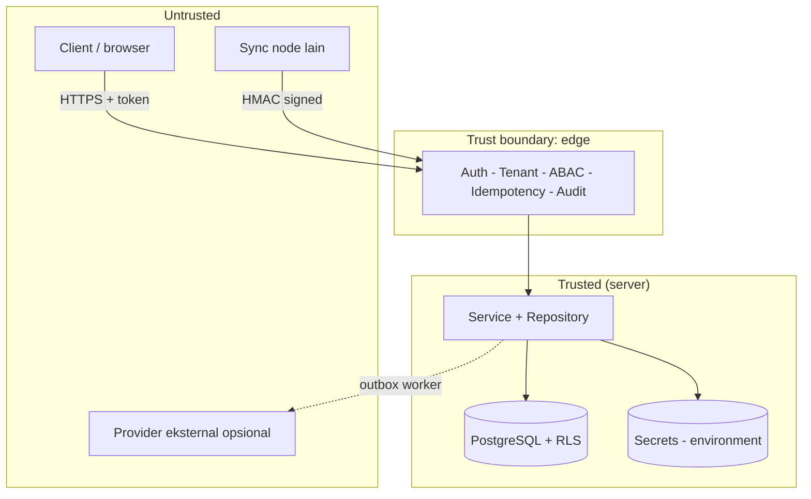
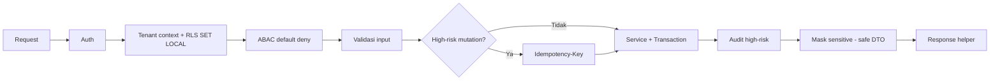

# Bagian 20 — Threat Model dan Arsitektur Keamanan

Dokumen ini merangkum **model ancaman** dan **arsitektur keamanan** AWCMS-Mini sebagai base. Ini adalah dokumen standar base (bukan contoh domain). Kebijakan pelaporan kerentanan ada di [`SECURITY.md`](../../SECURITY.md); keputusan yang mendasari ada di [`docs/adr/`](../adr/README.md).

## Aset yang dilindungi

| Aset                         | Contoh                                   | Sensitivitas        |
| ---------------------------- | ---------------------------------------- | ------------------- |
| Kredensial autentikasi       | password hash, token sesi, JWT secret    | Critical            |
| Identifier sensitif          | NPWP, NIK, email, nomor HP (hash + mask) | High                |
| Data lintas-tenant           | seluruh baris tenant-scoped              | High                |
| Jejak audit & security event | audit log, decision log                  | High (integritas)   |
| Secret provider/infra        | kunci R2, HMAC sync, DB URL              | Critical            |
| Kontrak & standar            | OpenAPI/AsyncAPI, migration              | Medium (integritas) |

## Batas kepercayaan (trust boundaries)

Prinsip: **semua input dari zona untrusted divalidasi dan tidak dipercaya**; nilai tenant/identitas berasal dari auth middleware, bukan header publik mentah.

## Model ancaman (STRIDE ringkas)

| Ancaman                    | Contoh                              | Mitigasi di base                                                                                 |
| -------------------------- | ----------------------------------- | ------------------------------------------------------------------------------------------------ |
| **Spoofing**               | Menyamar sebagai user/tenant/node   | Auth token tervalidasi; sync HMAC + anti-replay (ADR-0006); tenant context dari middleware       |
| **Tampering**              | Ubah data/koreksi retroaktif        | Immutability data posted; audit append-only; RLS `FORCE` (ADR-0003, ADR-0005)                    |
| **Repudiation**            | Menyangkal aksi                     | Audit high-risk + decision log dengan correlation ID (ADR-0004)                                  |
| **Information disclosure** | Bocor lintas-tenant / data sensitif | RLS berlapis + filter `tenant_id`; masking/redaction; error tanpa stack trace (ADR-0003)         |
| **Denial of service**      | Menjenuhkan DB/pool                 | Pool work-class + backpressure → `503 DATABASE_BUSY`; statement timeout                          |
| **Elevation of privilege** | Naik hak akses                      | ABAC default-deny, deny overrides allow; role DB non-superuser; self-approval ditolak (ADR-0004) |

## Kontrol keamanan berlapis

1. **Transport & sesi** — HTTPS di produksi, cookie `HttpOnly`/`Secure`/`SameSite`, TTL sesi, lockout login.
2. **Otorisasi** — RBAC + ABAC default-deny (ADR-0004) + RLS (ADR-0003).
3. **Integritas data** — transaksi, idempotency, immutability, soft delete (ADR-0005).
4. **Kerahasiaan** — hash+mask identifier, redaction log/audit, secret hanya dari environment.
5. **Ketersediaan** — pooling/backpressure, offline-first outbox (ADR-0006).
6. **Rantai pasok** — Bun-only (ADR-0002), Dependabot, CodeQL, lockfile terkunci.

## Penanganan secret

- Secret hanya dari **environment** (doc 18); `.env` di-ignore, `.env.example` hanya placeholder.
- Boot memvalidasi konfigurasi (fail-fast); flag aktif tanpa kredensial → gagal start.
- Redaction wajib untuk key sensitif sebelum masuk log/audit.
- CI menolak berkas `.env` yang ter-commit dan tooling non-Bun (`.github/workflows/ci.yml`).

## Data sensitif & privasi

- Identifier sensitif disimpan sebagai `value_hash` (lookup/dedup) + `masked_value` (tampilan); nilai mentah tidak disimpan.
- Klasifikasi data & retensi di `docs/awcms-mini/04_erd_data_dictionary.md`.
- Data yang di-soft-delete tetap tenant-scoped, tetap terkena RLS, dan tetap masuk retensi/legal hold.

## Automasi keamanan repositori

| Kontrol                                                             | Lokasi                         |
| ------------------------------------------------------------------- | ------------------------------ |
| Secret scanning + push protection                                   | GitHub (setelan repo)          |
| Dependabot alerts + updates                                         | `.github/dependabot.yml`       |
| CodeQL code scanning                                                | `.github/workflows/codeql.yml` |
| Lint + docs-check + typecheck + unit test + Bun-only/no-`.env` gate | `.github/workflows/ci.yml`     |
| Private vulnerability reporting                                     | `SECURITY.md`                  |

## Batasan (yang belum tercakup)

Kontrol di dokumen ini sudah terimplementasi nyata sejak seluruh 18 issue backlog doc06 tuntas (v0.22.0) dan diperkuat lebih lanjut oleh epic M9 (§Matrix kepatuhan di bawah, v0.23.4) — bukan lagi standar tanpa kode. Yang tetap di luar cakupan base ini (tanggung jawab lapisan deployment/aplikasi turunan, bukan celah yang terlewat): WAF, rate limiting di edge/proxy (app-level login rate limiting sendiri sudah ada sejak Issue #437, lihat matrix di bawah), manajemen secret terpusat (vault), pengerasan host, provisioning sertifikat TLS nyata, dan monitoring/SIEM terpusat (A.8.16 di matrix).

## Matrix kepatuhan OWASP / ASVS / ISO 27001 (Issue #437)

Audit kepatuhan yang memetakan kontrol proyek ke kerangka standar industri untuk kesiapan audit eksternal (skill `awcms-mini-security-hardening`), dilakukan 2026-07-06. Setiap baris memuat bukti konkret (path file/fungsi/query), bukan asumsi. Legenda status: ✅ terpenuhi · ⚠ gap · ➖ di luar scope base generik ini.

### OWASP Top 10 (2021)

| #   | Kategori                           | Status | Bukti                                                                                                                                                                                                                                                                                                                                                                                                                                                                                                                                                                                                                                                                                                                                                                                                                                                                                                                                                                                                                                                                                                                           | Remediasi                                                                                                      |
| --- | ---------------------------------- | ------ | ------------------------------------------------------------------------------------------------------------------------------------------------------------------------------------------------------------------------------------------------------------------------------------------------------------------------------------------------------------------------------------------------------------------------------------------------------------------------------------------------------------------------------------------------------------------------------------------------------------------------------------------------------------------------------------------------------------------------------------------------------------------------------------------------------------------------------------------------------------------------------------------------------------------------------------------------------------------------------------------------------------------------------------------------------------------------------------------------------------------------------- | -------------------------------------------------------------------------------------------------------------- |
| A01 | Broken Access Control              | ✅     | ABAC default-deny + deny-overrides: `src/modules/identity-access/domain/access-control.ts` `evaluateAccess()` (empty grant set → `matchedPolicy: "default_deny"`, digerbang `checkAbacDefaultDeny` di `scripts/security-readiness.ts`). RLS `ENABLE`+`FORCE` pada 31 tabel tenant-scoped (`sql/013_awcms_mini_enforce_rls_least_privilege.sql`; digerbang `checkRlsEnabled`). Role app (`awcms_mini_app`) bukan superuser/BYPASSRLS (`checkAppDbUserNotSuperuser`). IDOR: setiap query tenant-scoped melalui `withTenant()`/`SET LOCAL app.current_tenant_id` (`src/lib/database/tenant-context.ts`), tak ada `WHERE tenant_id` yang dilewati manual dari input.                                                                                                                                                                                                                                                                                                                                                                                                                                                                | —                                                                                                              |
| A02 | Cryptographic Failures             | ✅     | Password argon2id via `Bun.password.hash` (default; `src/lib/auth/password.ts`, digerbang `checkPasswordHashingModern`). Token sesi opaque: `generateSessionToken()`/`hashSessionToken()` (`src/lib/auth/session-token.ts`) — hanya `sha256:` hash yang disimpan di `awcms_mini_sessions.token_hash`, token mentah tak pernah persisted. Identifier sensitif `value_hash`+`masked_value` (doc 04). Cookie `HttpOnly`+`SameSite=Lax`+`Secure` (env-gated `AUTH_COOKIE_SECURE`) di `src/pages/api/v1/auth/login.ts`.                                                                                                                                                                                                                                                                                                                                                                                                                                                                                                                                                                                                              | TLS di produksi bergantung deployment (nginx template `deploy/nginx/awcms-mini.conf.example` — lihat ASVS V9). |
| A03 | Injection                          | ✅     | Seluruh query lewat tagged template parametrik `Bun.SQL` (`tx\`...${value}...\``); grep repo tak menemukan string-concat SQL. `tx.unsafe`/`SET LOCAL`hanya untuk nilai yang sudah lolos`assertUuid()`(mis.`src/pages/api/v1/setup/initialize.ts`). Output HTML di-escape otomatis oleh Astro (`{}` expression).                                                                                                                                                                                                                                                                                                                                                                                                                                                                                                                                                                                                                                                                                                                                                                                                                 | —                                                                                                              |
| A04 | Insecure Design                    | ✅     | Threat model ini sendiri (STRIDE). Immutability posted (ADR-0005). Idempotency mutation high-risk (skill `awcms-mini-idempotency`). Self-approval workflow ditolak (`workflow-approval` module). Fail-closed default: GUC tenant zero-UUID bila tak di-set (`sql/013`).                                                                                                                                                                                                                                                                                                                                                                                                                                                                                                                                                                                                                                                                                                                                                                                                                                                         | —                                                                                                              |
| A05 | Security Misconfiguration          | ✅     | Secret hanya dari `process.env`, `.env` di-gitignore, CI menolak `.env` ter-commit (`checkEnvNotTracked`). Error tanpa stack trace (`checkErrorsDontLeakStackTraces` — live-verified `POST /api/v1/sync/push` tanpa header HMAC → 400 bersih). **Gap ditemukan+ditutup Issue #437**: tidak ada security header (CSP/HSTS/X-Frame-Options/X-Content-Type-Options/Referrer-Policy/Permissions-Policy) di `src/middleware.ts` maupun template nginx sebelum PR ini — lihat §"Kontrol baru" di bawah.                                                                                                                                                                                                                                                                                                                                                                                                                                                                                                                                                                                                                               | Ditutup (lihat di bawah).                                                                                      |
| A06 | Vulnerable/Outdated Components     | ✅     | Bun-only (ADR-0002) — hanya 2 runtime dependency (`astro`, `@astrojs/node`) di `package.json`; lockfile `bun.lock` terkunci. Dependabot aktif (`.github/dependabot.yml`), CodeQL aktif (`.github/workflows/codeql.yml`, matrix `actions` + `javascript-typescript` sejak Issue #452 — SAST atas source TypeScript/Astro).                                                                                                                                                                                                                                                                                                                                                                                                                                                                                                                                                                                                                                                                                                                                                                                                       | —                                                                                                              |
| A07 | Identification & Auth Failures     | ✅     | Lockout setelah `AUTH_LOGIN_MAX_ATTEMPTS` (default 5) kegagalan berturut per identitas (`evaluateLoginAttempt`, `login-policy.ts`; digerbang `checkLoginLockoutImplemented`). Pesan generik anti-enumeration (`AUTH_INVALID_CREDENTIALS` sama untuk user tak ada vs password salah). Sesi TTL (`AUTH_SESSION_TTL_MIN`) + revoke eksplisit saat logout (`src/pages/api/v1/auth/logout.ts` menghapus baris `awcms_mini_sessions`). **Gap ditemukan+ditutup Issue #437**: lockout per-identitas tak menahan penyerang yang merotasi `loginIdentifier` dari sumber yang sama (enumerasi lintas-akun) — ditambahkan rate limit sumber+tenant (`src/lib/security/rate-limit.ts`). **Diperluas Issue #496**: `POST /auth/password/forgot`/`reset` — respons 200 generik identik ada/tidaknya akun, token reset di-hash (`sha256`, `awcms_mini_password_reset_tokens`), single-use (`used_at`), short-lived (`AUTH_PASSWORD_RESET_TOKEN_TTL_MIN`, default 30 menit), request baru men-supersede token lama, sesi identity di-revoke penuh setelah reset (`revokeAllSessionsForIdentity`), rate limit sumber+tenant terpisah dari login. | Ditutup (lihat di bawah).                                                                                      |
| A08 | Software & Data Integrity Failures | ✅     | Checksum sha256 file sync/objek diverifikasi sebelum upload (`verifyObjectChecksum`, `src/modules/sync-storage/domain/object-queue.ts`, dipanggil nyata oleh `object-storage-uploader.ts` sejak Issue #436). Audit append-only (tak ada `UPDATE`/`DELETE` pada `awcms_mini_audit_events` di seluruh `src/`). Migration checksum di runner (`scripts/db-migrate.ts`). CodeQL code scanning.                                                                                                                                                                                                                                                                                                                                                                                                                                                                                                                                                                                                                                                                                                                                      | —                                                                                                              |
| A09 | Logging & Monitoring Failures      | ✅     | Audit high-risk + decision log + correlation ID (`src/modules/logging/application/audit-log.ts`, `src/modules/identity-access/application/decision-log.ts`, `X-Correlation-ID` di `src/middleware.ts`). Redaksi wajib sebelum log/audit: `src/modules/_shared/redaction.ts` (14 key sensitif: password, token, npwp, nik, phone, whatsapp, email, dst., rekursif) dipakai bersama oleh logger (`src/lib/logging/logger.ts`) dan audit trail.                                                                                                                                                                                                                                                                                                                                                                                                                                                                                                                                                                                                                                                                                    | —                                                                                                              |
| A10 | SSRF                               | ✅     | URL provider R2 selalu dari `process.env.R2_ACCOUNT_ID` (env tepercaya), tak pernah dari input user (`object-storage-uploader.ts:88-89`); endpoint sync HMAC node juga dari konfigurasi, bukan payload request. Provider dipanggil di luar transaction DB (ADR-0006), circuit breaker per-provider (`src/lib/database/circuit-breaker.ts`). Sudah diverifikasi tuntas di Issue #436 — tidak diulang/diduplikasi di sini.                                                                                                                                                                                                                                                                                                                                                                                                                                                                                                                                                                                                                                                                                                        | —                                                                                                              |

### OWASP ASVS (L1/L2 relevan)

| Area                            | Status | Bukti                                                                                                                                                                                                                                                                                                                                                                                       |
| ------------------------------- | ------ | ------------------------------------------------------------------------------------------------------------------------------------------------------------------------------------------------------------------------------------------------------------------------------------------------------------------------------------------------------------------------------------------- |
| V2 Auth                         | ✅     | Hashing modern (argon2id), lockout per-identitas + rate limit per-sumber (baru), token sesi baru setiap login (`generateSessionToken()` dipanggil ulang tiap `POST /auth/login`, mencegah session fixation), logout mencabut sesi (hapus baris DB, bukan cuma hapus cookie).                                                                                                                |
| V3 Session                      | ✅     | Cookie `HttpOnly`+`SameSite=Lax`+`Secure` (prod, env-gated `AUTH_COOKIE_SECURE=true` — didokumentasikan di doc 18); token opaque server-side (`sha256:` hash saja yang disimpan); `expiresAt`/`AUTH_SESSION_TTL_MIN`.                                                                                                                                                                       |
| V4 Access Control               | ✅     | Default deny (`checkAbacDefaultDeny`), dicek per-request (middleware + `access-guard.ts` tiap endpoint, bukan sekali di login), RLS defense-in-depth (`checkRlsEnabled`+`checkAppDbUserNotSuperuser`), IDOR dicegah via `withTenant()` konsisten.                                                                                                                                           |
| V5 Validation/Encoding          | ✅     | Validasi input tiap endpoint (mis. `validateSetupInitializeInput`, `user-management.ts` validator); output encoding otomatis Astro; CSRF via `security.checkOrigin` Astro bawaan (didokumentasikan `identity-access/README.md` §Catatan operasional — `Content-Type` wajib pada mutation, diverifikasi live saat Issue 8.1).                                                                |
| V7 Error/Logging                | ✅     | Error tanpa detail internal (`checkErrorsDontLeakStackTraces`, live-verified); log tanpa data sensitif (redaksi wajib, lihat A09).                                                                                                                                                                                                                                                          |
| V9 Communications               | ✅/➖  | TLS di produksi: template nginx (`deploy/nginx/awcms-mini.conf.example`) redirect HTTP→HTTPS + `server_tokens off`; **HSTS ditambahkan Issue #437** (`Strict-Transport-Security`, gated `APP_ENV=production` — lihat di bawah). Provisioning sertifikat nyata adalah tanggung jawab operator deployment (➖ di luar cakupan kode). HMAC untuk sync mesin-ke-mesin (`awcms-mini-sync-hmac`). |
| V12 Files                       | ✅     | Checksum sha256 diverifikasi sebelum upload (`verifyObjectChecksum`); path/objek tak pernah dari input tak tepercaya (key dari `awcms_mini_object_sync_queue`, bukan request body langsung).                                                                                                                                                                                                |
| V14 HTTP Security Configuration | ✅     | **Baru Issue #437**: CSP (Astro `security.csp` native, hash otomatis + 1 hash manual is:inline), `X-Content-Type-Options: nosniff`, `X-Frame-Options: DENY`, `Referrer-Policy: strict-origin-when-cross-origin`, `Permissions-Policy`, `Strict-Transport-Security` (prod). Sebelumnya tidak ada satupun — gap nyata, ditutup.                                                               |

### ISO/IEC 27001:2022 Annex A (relevan-kode)

| Kontrol                           | Status | Bukti                                                                                                                                                                                                                                                                                                |
| --------------------------------- | ------ | ---------------------------------------------------------------------------------------------------------------------------------------------------------------------------------------------------------------------------------------------------------------------------------------------------- |
| A.5.15 Access control             | ✅     | ABAC default-deny + RLS FORCE (lihat A01/V4).                                                                                                                                                                                                                                                        |
| A.5.17 Authentication information | ✅     | Password hash argon2id, tak pernah disimpan/di-log mentah; token sesi hash-only.                                                                                                                                                                                                                     |
| A.8.2 Privileged access rights    | ✅     | Role DB `awcms_mini_app` least-privilege, bukan superuser/owner (`sql/013`, `checkAppDbUserNotSuperuser`).                                                                                                                                                                                           |
| A.8.5 Secure authentication       | ✅     | Lockout + rate limit (baru) + hashing modern + CSRF checkOrigin.                                                                                                                                                                                                                                     |
| A.8.12 Data leakage prevention    | ✅     | Masking/redaction identifier sensitif (doc 04) + `redaction.ts` untuk log/audit.                                                                                                                                                                                                                     |
| A.8.15 Logging                    | ✅     | Audit trail append-only + decision log + correlation ID berstruktur JSON — sejak Issue #447, `ApiMeta.correlationId` konsisten di seluruh respons `/api/*` (bukan satu endpoint demo), dan `awcms_mini_audit_events` punya retensi eksplisit + purge terjadwal (`bun run logs:audit:purge`, doc 04). |
| A.8.16 Monitoring                 | ⚠      | Log terstruktur ada; agregasi/alerting terpusat (SIEM) adalah tanggung jawab lapisan operasional/deployment turunan — di luar cakupan kode base ini (dicatat, bukan diabaikan).                                                                                                                      |
| A.8.24 Cryptography               | ✅     | Argon2id (password), SHA-256 (token sesi, checksum objek, hash CSP), HMAC (sync).                                                                                                                                                                                                                    |
| A.8.28 Secure coding              | ✅     | Guardrail doc 10 ditegakkan konsisten (tagged-template query, response helper standar, ABAC/RLS/audit/idempotency per endpoint); CodeQL.                                                                                                                                                             |
| A.8.31 Separation of environments | ✅     | `APP_ENV` (development/staging/production) menggerbang perilaku sensitif (cookie `Secure`, HSTS); role DB app vs migrasi terpisah (dua-peran, doc 18).                                                                                                                                               |

### Kontrol baru yang ditutup (Issue #437, critical/priority gap yang benar-benar ditemukan)

1. **Security response headers** (A05/V14/A.8.28) — sebelumnya nol. Ditambahkan `src/lib/security/security-headers.ts` (`X-Content-Type-Options`, `X-Frame-Options`, `Referrer-Policy`, `Permissions-Policy`, `Strict-Transport-Security` prod-gated), diterapkan di `src/middleware.ts` untuk setiap response. **CSP** memakai fitur bawaan Astro `security.csp` (`astro.config.mjs`), BUKAN nonce/hash manual — dua pendekatan manual dicoba lebih dulu dan dibatalkan setelah verifikasi **headless-Chrome/CDP nyata** (curl tak bisa mendeteksi pelanggaran CSP karena tak mengeksekusi JS/CSS): (a) nonce per-request — dihapus diam-diam oleh compiler Astro dari atribut `is:inline`; (b) hash SHA-256 manual untuk satu skrip `is:inline` yang diketahui — ternyata Astro juga meng-inline beberapa skrip/style lain per-komponen (`ThemeToggle.astro`, `LanguageSwitcher.astro`, tombol logout) yang luput dari allowlist manual dan **benar-benar memblokir fungsi** (tombol tema tak merespons klik) saat diverifikasi di browser sungguhan. Solusi akhir: fitur native Astro menghasilkan hash otomatis untuk semua yang di-inline-nya + **satu hash manual** untuk satu-satunya skrip `is:inline` tersisa (`src/lib/security/theme-init-script.ts`, dengan test `tests/theme-init-script.test.ts` yang mencegah drift antara isi skrip dan hash-nya).
2. **Rate limiting login** (A07/V2/A.8.5) — memperluas pola lockout `AUTH_LOGIN_MAX_ATTEMPTS` yang sudah ada (per-identitas) dengan limiter sumber+tenant baru (`src/lib/security/rate-limit.ts`, env `AUTH_LOGIN_RATE_LIMIT_MAX`/`AUTH_LOGIN_RATE_LIMIT_WINDOW_SEC`, default 20/60 detik) — menutup celah enumerasi lintas-identitas dari sumber yang sama. Diverifikasi live: percobaan ke-21 dari IP+tenant sama → `429 RATE_LIMITED` + header `Retry-After`; sumber IP berbeda tetap tak terpengaruh.
3. **False-positive pada gate `security:readiness` sendiri** — `checkNoHardcodedSecret` menandai `ERROR_CODE_KEYS.TOKEN_EXPIRED: "error.token_expired"` (`src/lib/i18n/error-messages.ts`) sebagai kemungkinan secret (nama variabel mengandung "TOKEN"), padahal nilainya adalah kunci katalog i18n. **Ditemukan dengan menjalankan gate ini sendiri** terhadap kode yang sudah ada — bukan hipotetis. Diperbaiki dengan heuristik tambahan `I18N_KEY_LIKE_VALUE_PATTERN` (string dot-namespace huruf kecil tanpa entropi acak bukan bentuk secret yang valid).
4. `scripts/security-readiness.ts` diperluas dua check baru: `checkSecurityHeadersPresent` (live, hit server nyata, cek 5 header termasuk `content-security-policy`) dan `checkLoginRateLimitImplemented` (murni, menegaskan `checkRateLimit()` menolak percobaan ke-4 setelah `maxAttempts=3`). Keduanya `warning` (defense-in-depth, bukan kontrol akses primer yang sudah `critical`).

### Gap non-critical dengan follow-up eksplisit (tidak diabaikan diam-diam)

- **A.8.16 Monitoring/alerting terpusat** (SIEM/observability platform) — di luar cakupan base generik ini; tanggung jawab lapisan operasional aplikasi turunan (mis. AWPOS) atau deployment (doc 07/18). Log terstruktur JSON sudah tersedia sebagai prasyaratnya. **Issue #447** menambah titik pemasangan (bukan implementasi SIEM itu sendiri, batas ini tidak berubah): `setLogSink()` (`src/lib/logging/logger.ts`) dan `setAuditExportHook()` (`src/modules/logging/application/audit-log.ts`), keduanya default no-op — aplikasi turunan bisa memasang consumer nyata tanpa mengubah kode inti.
- **Rate limiter in-memory per-proses** (`src/lib/security/rate-limit.ts`) — tidak dibagi antar instance pada deployment multi-instance (load balancer). Cukup untuk topologi default LAN-first single-instance (doc 18); deployment multi-instance yang butuh limit terbagi sebaiknya menambah rate limiting di edge/proxy (sudah dicatat sebagai tanggung jawab lapisan deployment di §Batasan di atas).
- **Provisioning sertifikat TLS nyata** — template nginx menyediakan redirect HTTP→HTTPS dan struktur konfigurasi, tapi penerbitan sertifikat (Let's Encrypt/self-signed) tetap manual oleh operator (dicatat di komentar template, bukan item baru dari Issue #437).
