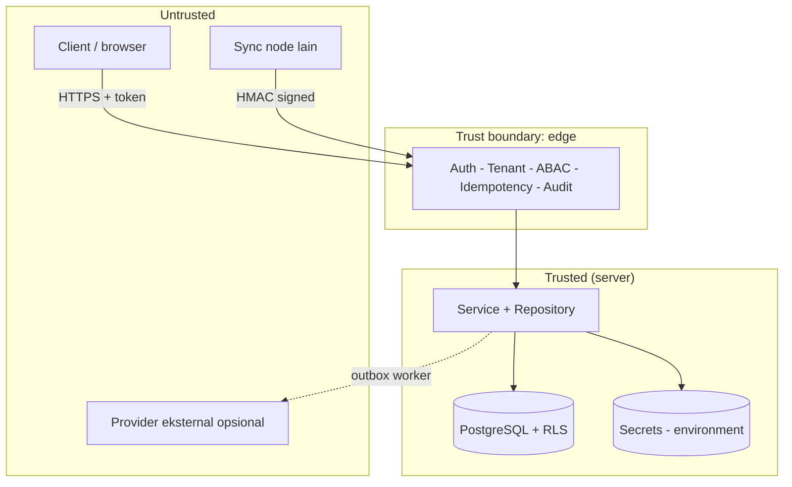
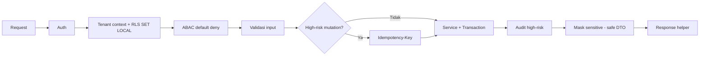

# Bagian 20 — Threat Model dan Arsitektur Keamanan

Dokumen ini merangkum **model ancaman** dan **arsitektur keamanan** AWCMS-Mini sebagai base. Ini adalah dokumen standar base (bukan contoh domain). Kebijakan pelaporan kerentanan ada di [`SECURITY.md`](../../SECURITY.md); keputusan yang mendasari ada di [`docs/adr/`](../adr/README.md).

## Aset yang dilindungi

| Aset                         | Contoh                                   | Sensitivitas        |
| ---------------------------- | ---------------------------------------- | ------------------- |
| Kredensial autentikasi       | password hash, token sesi, JWT secret    | Critical            |
| Identifier sensitif          | NPWP, NIK, email, nomor HP (hash + mask) | High                |
| Data lintas-tenant           | seluruh baris tenant-scoped              | High                |
| Jejak audit & security event | audit log, decision log                  | High (integritas)   |
| Secret provider/infra        | kunci R2, HMAC sync, DB URL              | Critical            |
| Kontrak & standar            | OpenAPI/AsyncAPI, migration              | Medium (integritas) |

## Batas kepercayaan (trust boundaries)

Prinsip: **semua input dari zona untrusted divalidasi dan tidak dipercaya**; nilai tenant/identitas berasal dari auth middleware, bukan header publik mentah.

## Model ancaman (STRIDE ringkas)

| Ancaman                    | Contoh                              | Mitigasi di base                                                                                 |
| -------------------------- | ----------------------------------- | ------------------------------------------------------------------------------------------------ |
| **Spoofing**               | Menyamar sebagai user/tenant/node   | Auth token tervalidasi; sync HMAC + anti-replay (ADR-0006); tenant context dari middleware       |
| **Tampering**              | Ubah data/koreksi retroaktif        | Immutability data posted; audit append-only; RLS `FORCE` (ADR-0003, ADR-0005)                    |
| **Repudiation**            | Menyangkal aksi                     | Audit high-risk + decision log dengan correlation ID (ADR-0004)                                  |
| **Information disclosure** | Bocor lintas-tenant / data sensitif | RLS berlapis + filter `tenant_id`; masking/redaction; error tanpa stack trace (ADR-0003)         |
| **Denial of service**      | Menjenuhkan DB/pool                 | Pool work-class + backpressure → `503 DATABASE_BUSY`; statement timeout                          |
| **Elevation of privilege** | Naik hak akses                      | ABAC default-deny, deny overrides allow; role DB non-superuser; self-approval ditolak (ADR-0004) |

## Kontrol keamanan berlapis

1. **Transport & sesi** — HTTPS di produksi, cookie `HttpOnly`/`Secure`/`SameSite`, TTL sesi, lockout login.
2. **Otorisasi** — RBAC + ABAC default-deny (ADR-0004) + RLS (ADR-0003).
3. **Integritas data** — transaksi, idempotency, immutability, soft delete (ADR-0005).
4. **Kerahasiaan** — hash+mask identifier, redaction log/audit, secret hanya dari environment.
5. **Ketersediaan** — pooling/backpressure, offline-first outbox (ADR-0006).
6. **Rantai pasok** — Bun-only (ADR-0002), Dependabot, CodeQL, lockfile terkunci.

## Penanganan secret

- Secret hanya dari **environment** (doc 18); `.env` di-ignore, `.env.example` hanya placeholder.
- Boot memvalidasi konfigurasi (fail-fast); flag aktif tanpa kredensial → gagal start.
- Redaction wajib untuk key sensitif sebelum masuk log/audit.
- CI menolak berkas `.env` yang ter-commit dan tooling non-Bun (`.github/workflows/ci.yml`).

## Data sensitif & privasi

- Identifier sensitif disimpan sebagai `value_hash` (lookup/dedup) + `masked_value` (tampilan); nilai mentah tidak disimpan.
- Klasifikasi data & retensi di `docs/awcms-mini/04_erd_data_dictionary.md`.
- Data yang di-soft-delete tetap tenant-scoped, tetap terkena RLS, dan tetap masuk retensi/legal hold.

## Automasi keamanan repositori

| Kontrol                                                             | Lokasi                         |
| ------------------------------------------------------------------- | ------------------------------ |
| Secret scanning + push protection                                   | GitHub (setelan repo)          |
| Dependabot alerts + updates                                         | `.github/dependabot.yml`       |
| CodeQL code scanning                                                | `.github/workflows/codeql.yml` |
| Lint + docs-check + typecheck + unit test + Bun-only/no-`.env` gate | `.github/workflows/ci.yml`     |
| Private vulnerability reporting                                     | `SECURITY.md`                  |

## Batasan (yang belum tercakup)

Base ini menyediakan **kontrol dan standar**; efektivitasnya bergantung pada implementasi nyata (kode belum ada sampai Issue 0.1 selesai). WAF, rate limiting edge, manajemen secret terpusat (vault), dan pengerasan host adalah tanggung jawab lapisan deployment/aplikasi turunan dan berada di luar cakupan dokumen ini.
