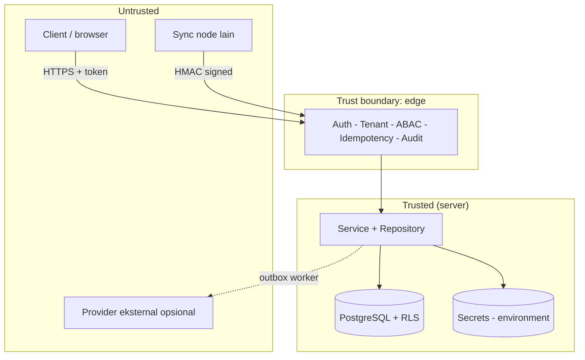
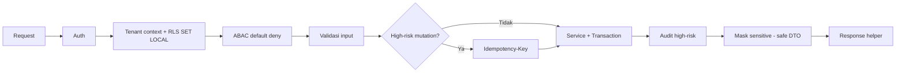

# Bagian 20 — Threat Model dan Arsitektur Keamanan

Dokumen ini merangkum **model ancaman** dan **arsitektur keamanan** AWCMS-Mini sebagai base. Ini adalah dokumen standar base (bukan contoh domain). Kebijakan pelaporan kerentanan ada di [`SECURITY.md`](../../SECURITY.md); keputusan yang mendasari ada di [`docs/adr/`](../adr/README.md).

## Aset yang dilindungi

| Aset                         | Contoh                                   | Sensitivitas        |
| ---------------------------- | ---------------------------------------- | ------------------- |
| Kredensial autentikasi       | password hash, token sesi, JWT secret    | Critical            |
| Identifier sensitif          | NPWP, NIK, email, nomor HP (hash + mask) | High                |
| Data lintas-tenant           | seluruh baris tenant-scoped              | High                |
| Jejak audit & security event | audit log, decision log                  | High (integritas)   |
| Secret provider/infra        | kunci R2, HMAC sync, DB URL              | Critical            |
| Kontrak & standar            | OpenAPI/AsyncAPI, migration              | Medium (integritas) |

## Batas kepercayaan (trust boundaries)

Prinsip: **semua input dari zona untrusted divalidasi dan tidak dipercaya**; nilai tenant/identitas berasal dari auth middleware, bukan header publik mentah.

## Model ancaman (STRIDE ringkas)

| Ancaman                    | Contoh                              | Mitigasi di base                                                                                 |
| -------------------------- | ----------------------------------- | ------------------------------------------------------------------------------------------------ |
| **Spoofing**               | Menyamar sebagai user/tenant/node   | Auth token tervalidasi; sync HMAC + anti-replay (ADR-0006); tenant context dari middleware       |
| **Tampering**              | Ubah data/koreksi retroaktif        | Immutability data posted; audit append-only; RLS `FORCE` (ADR-0003, ADR-0005)                    |
| **Repudiation**            | Menyangkal aksi                     | Audit high-risk + decision log dengan correlation ID (ADR-0004)                                  |
| **Information disclosure** | Bocor lintas-tenant / data sensitif | RLS berlapis + filter `tenant_id`; masking/redaction; error tanpa stack trace (ADR-0003)         |
| **Denial of service**      | Menjenuhkan DB/pool                 | Pool work-class + backpressure → `503 DATABASE_BUSY`; statement timeout                          |
| **Elevation of privilege** | Naik hak akses                      | ABAC default-deny, deny overrides allow; role DB non-superuser; self-approval ditolak (ADR-0004) |

## Kontrol keamanan berlapis

1. **Transport & sesi** — HTTPS di produksi, cookie `HttpOnly`/`Secure`/`SameSite`, TTL sesi, lockout login.
2. **Otorisasi** — RBAC + ABAC default-deny (ADR-0004) + RLS (ADR-0003).
3. **Integritas data** — transaksi, idempotency, immutability, soft delete (ADR-0005).
4. **Kerahasiaan** — hash+mask identifier, redaction log/audit, secret hanya dari environment.
5. **Ketersediaan** — pooling/backpressure, offline-first outbox (ADR-0006).
6. **Rantai pasok** — Bun-only (ADR-0002), Dependabot, CodeQL, lockfile terkunci.

## Penanganan secret

- Secret hanya dari **environment** (doc 18); `.env` di-ignore, `.env.example` hanya placeholder.
- Boot memvalidasi konfigurasi (fail-fast); flag aktif tanpa kredensial → gagal start.
- Redaction wajib untuk key sensitif sebelum masuk log/audit.
- CI menolak berkas `.env` yang ter-commit dan tooling non-Bun (`.github/workflows/ci.yml`).

## Data sensitif & privasi

- Identifier sensitif disimpan sebagai `value_hash` (lookup/dedup) + `masked_value` (tampilan); nilai mentah tidak disimpan.
- Klasifikasi data & retensi di `docs/awcms-mini/04_erd_data_dictionary.md`.
- Data yang di-soft-delete tetap tenant-scoped, tetap terkena RLS, dan tetap masuk retensi/legal hold.

## Automasi keamanan repositori

| Kontrol                                                             | Lokasi                         |
| ------------------------------------------------------------------- | ------------------------------ |
| Secret scanning + push protection                                   | GitHub (setelan repo)          |
| Dependabot alerts + updates                                         | `.github/dependabot.yml`       |
| CodeQL code scanning                                                | `.github/workflows/codeql.yml` |
| Lint + docs-check + typecheck + unit test + Bun-only/no-`.env` gate | `.github/workflows/ci.yml`     |
| Private vulnerability reporting                                     | `SECURITY.md`                  |

## Batasan (yang belum tercakup)

Kontrol di dokumen ini sudah terimplementasi nyata sejak seluruh 18 issue backlog doc06 tuntas (v0.22.0) dan diperkuat lebih lanjut oleh epic M9 (§Matrix kepatuhan di bawah, v0.23.4) — bukan lagi standar tanpa kode. Yang tetap di luar cakupan base ini (tanggung jawab lapisan deployment/aplikasi turunan, bukan celah yang terlewat): WAF, rate limiting di edge/proxy (app-level login rate limiting sendiri sudah ada sejak Issue #437, lihat matrix di bawah), manajemen secret terpusat (vault), pengerasan host, provisioning sertifikat TLS nyata, dan monitoring/SIEM terpusat (A.8.16 di matrix).

## Matrix kepatuhan OWASP / ASVS / ISO 27001 (Issue #437)

Audit kepatuhan yang memetakan kontrol proyek ke kerangka standar industri untuk kesiapan audit eksternal (skill `awcms-mini-security-hardening`), dilakukan 2026-07-06. Setiap baris memuat bukti konkret (path file/fungsi/query), bukan asumsi. Legenda status: ✅ terpenuhi · ⚠ gap · ➖ di luar scope base generik ini.

### OWASP Top 10 (2021)

| #   | Kategori                           | Status | Bukti                                                                                                                                                                                                                                                                                                                                                                                                                                                                                                                                                                                                                                                                                                                                                                                                                                                                                                                                                                                                                                                                                                                           | Remediasi                                                                                                      |
| --- | ---------------------------------- | ------ | ------------------------------------------------------------------------------------------------------------------------------------------------------------------------------------------------------------------------------------------------------------------------------------------------------------------------------------------------------------------------------------------------------------------------------------------------------------------------------------------------------------------------------------------------------------------------------------------------------------------------------------------------------------------------------------------------------------------------------------------------------------------------------------------------------------------------------------------------------------------------------------------------------------------------------------------------------------------------------------------------------------------------------------------------------------------------------------------------------------------------------- | -------------------------------------------------------------------------------------------------------------- |
| A01 | Broken Access Control              | ✅     | ABAC default-deny + deny-overrides: `src/modules/identity-access/domain/access-control.ts` `evaluateAccess()` (empty grant set → `matchedPolicy: "default_deny"`, digerbang `checkAbacDefaultDeny` di `scripts/security-readiness.ts`). RLS `ENABLE`+`FORCE` pada 31 tabel tenant-scoped (`sql/013_awcms_mini_enforce_rls_least_privilege.sql`; digerbang `checkRlsEnabled`). Role app (`awcms_mini_app`) bukan superuser/BYPASSRLS (`checkAppDbUserNotSuperuser`). IDOR: setiap query tenant-scoped melalui `withTenant()`/`SET LOCAL app.current_tenant_id` (`src/lib/database/tenant-context.ts`), tak ada `WHERE tenant_id` yang dilewati manual dari input. **Contoh two-tier (Issue #497)**: `POST /api/v1/email/announcements` menegakkan `email.notification.create` untuk target eksplisit (bounded) DAN `email.announcement.create` TAMBAHAN untuk target role/tenant (unbounded) — pola reusable untuk "bulk vs single action" mana pun butuh permission lebih kuat untuk cakupan lebih luas.                                                                                                                        | —                                                                                                              |
| A02 | Cryptographic Failures             | ✅     | Password argon2id via `Bun.password.hash` (default; `src/lib/auth/password.ts`, digerbang `checkPasswordHashingModern`). Token sesi opaque: `generateSessionToken()`/`hashSessionToken()` (`src/lib/auth/session-token.ts`) — hanya `sha256:` hash yang disimpan di `awcms_mini_sessions.token_hash`, token mentah tak pernah persisted. Identifier sensitif `value_hash`+`masked_value` (doc 04). Cookie `HttpOnly`+`SameSite=Lax`+`Secure` (env-gated `AUTH_COOKIE_SECURE`) di `src/pages/api/v1/auth/login.ts`.                                                                                                                                                                                                                                                                                                                                                                                                                                                                                                                                                                                                              | TLS di produksi bergantung deployment (nginx template `deploy/nginx/awcms-mini.conf.example` — lihat ASVS V9). |
| A03 | Injection                          | ✅     | Seluruh query lewat tagged template parametrik `Bun.SQL` (`tx\`...${value}...\``); grep repo tak menemukan string-concat SQL. `tx.unsafe`/`SET LOCAL`hanya untuk nilai yang sudah lolos`assertUuid()`(mis.`src/pages/api/v1/setup/initialize.ts`). Output HTML di-escape otomatis oleh Astro (`{}` expression).                                                                                                                                                                                                                                                                                                                                                                                                                                                                                                                                                                                                                                                                                                                                                                                                                 | —                                                                                                              |
| A04 | Insecure Design                    | ✅     | Threat model ini sendiri (STRIDE). Immutability posted (ADR-0005). Idempotency mutation high-risk (skill `awcms-mini-idempotency`). Self-approval workflow ditolak (`workflow-approval` module). Fail-closed default: GUC tenant zero-UUID bila tak di-set (`sql/013`).                                                                                                                                                                                                                                                                                                                                                                                                                                                                                                                                                                                                                                                                                                                                                                                                                                                         | —                                                                                                              |
| A05 | Security Misconfiguration          | ✅     | Secret hanya dari `process.env`, `.env` di-gitignore, CI menolak `.env` ter-commit (`checkEnvNotTracked`). Error tanpa stack trace (`checkErrorsDontLeakStackTraces` — live-verified `POST /api/v1/sync/push` tanpa header HMAC → 400 bersih). **Gap ditemukan+ditutup Issue #437**: tidak ada security header (CSP/HSTS/X-Frame-Options/X-Content-Type-Options/Referrer-Policy/Permissions-Policy) di `src/middleware.ts` maupun template nginx sebelum PR ini — lihat §"Kontrol baru" di bawah.                                                                                                                                                                                                                                                                                                                                                                                                                                                                                                                                                                                                                               | Ditutup (lihat di bawah).                                                                                      |
| A06 | Vulnerable/Outdated Components     | ✅     | Bun-only (ADR-0002) — hanya 2 runtime dependency (`astro`, `@astrojs/node`) di `package.json`; lockfile `bun.lock` terkunci. Dependabot aktif (`.github/dependabot.yml`), CodeQL aktif (`.github/workflows/codeql.yml`, matrix `actions` + `javascript-typescript` sejak Issue #452 — SAST atas source TypeScript/Astro).                                                                                                                                                                                                                                                                                                                                                                                                                                                                                                                                                                                                                                                                                                                                                                                                       | —                                                                                                              |
| A07 | Identification & Auth Failures     | ✅     | Lockout setelah `AUTH_LOGIN_MAX_ATTEMPTS` (default 5) kegagalan berturut per identitas (`evaluateLoginAttempt`, `login-policy.ts`; digerbang `checkLoginLockoutImplemented`). Pesan generik anti-enumeration (`AUTH_INVALID_CREDENTIALS` sama untuk user tak ada vs password salah). Sesi TTL (`AUTH_SESSION_TTL_MIN`) + revoke eksplisit saat logout (`src/pages/api/v1/auth/logout.ts` menghapus baris `awcms_mini_sessions`). **Gap ditemukan+ditutup Issue #437**: lockout per-identitas tak menahan penyerang yang merotasi `loginIdentifier` dari sumber yang sama (enumerasi lintas-akun) — ditambahkan rate limit sumber+tenant (`src/lib/security/rate-limit.ts`). **Diperluas Issue #496**: `POST /auth/password/forgot`/`reset` — respons 200 generik identik ada/tidaknya akun, token reset di-hash (`sha256`, `awcms_mini_password_reset_tokens`), single-use (`used_at`), short-lived (`AUTH_PASSWORD_RESET_TOKEN_TTL_MIN`, default 30 menit), request baru men-supersede token lama, sesi identity di-revoke penuh setelah reset (`revokeAllSessionsForIdentity`), rate limit sumber+tenant terpisah dari login. | Ditutup (lihat di bawah).                                                                                      |
| A08 | Software & Data Integrity Failures | ✅     | Checksum sha256 file sync/objek diverifikasi sebelum upload (`verifyObjectChecksum`, `src/modules/sync-storage/domain/object-queue.ts`, dipanggil nyata oleh `object-storage-uploader.ts` sejak Issue #436). Audit append-only (tak ada `UPDATE`/`DELETE` pada `awcms_mini_audit_events` di seluruh `src/`). Migration checksum di runner (`scripts/db-migrate.ts`). CodeQL code scanning.                                                                                                                                                                                                                                                                                                                                                                                                                                                                                                                                                                                                                                                                                                                                      | —                                                                                                              |
| A09 | Logging & Monitoring Failures      | ✅     | Audit high-risk + decision log + correlation ID (`src/modules/logging/application/audit-log.ts`, `src/modules/identity-access/application/decision-log.ts`, `X-Correlation-ID` di `src/middleware.ts`). Redaksi wajib sebelum log/audit: `src/modules/_shared/redaction.ts` (14 key sensitif: password, token, npwp, nik, phone, whatsapp, email, dst., rekursif) dipakai bersama oleh logger (`src/lib/logging/logger.ts`) dan audit trail.                                                                                                                                                                                                                                                                                                                                                                                                                                                                                                                                                                                                                                                                                    | —                                                                                                              |
| A10 | SSRF                               | ✅     | URL provider R2 selalu dari `process.env.R2_ACCOUNT_ID` (env tepercaya), tak pernah dari input user (`object-storage-uploader.ts:88-89`); endpoint sync HMAC node juga dari konfigurasi, bukan payload request. Provider dipanggil di luar transaction DB (ADR-0006), circuit breaker per-provider (`src/lib/database/circuit-breaker.ts`). Sudah diverifikasi tuntas di Issue #436 — tidak diulang/diduplikasi di sini. **Pengecualian yang disengaja (Issue #591/#603)**: `awcms_mini_auth_providers.issuer_url` (generic tenant OIDC SSO) SATU-SATUNYA outbound URL di base ini yang berasal dari data tenant-configured, bukan env server — `generic-oidc-client.ts` fetch `.well-known/openid-configuration` dan JWKS/token endpoint hasil discovery-nya ke `issuer_url` itu. **Diputuskan sebagai accepted risk, bukan celah** — lihat §Batasan yang dicatat, bukan diabaikan di bawah untuk rasional lengkap.                                                                                                                                                                                                            | —                                                                                                              |

### OWASP ASVS (L1/L2 relevan)

| Area                            | Status | Bukti                                                                                                                                                                                                                                                                                                                                                                                       |
| ------------------------------- | ------ | ------------------------------------------------------------------------------------------------------------------------------------------------------------------------------------------------------------------------------------------------------------------------------------------------------------------------------------------------------------------------------------------- |
| V2 Auth                         | ✅     | Hashing modern (argon2id), lockout per-identitas + rate limit per-sumber (baru), token sesi baru setiap login (`generateSessionToken()` dipanggil ulang tiap `POST /auth/login`, mencegah session fixation), logout mencabut sesi (hapus baris DB, bukan cuma hapus cookie).                                                                                                                |
| V3 Session                      | ✅     | Cookie `HttpOnly`+`SameSite=Lax`+`Secure` (prod, env-gated `AUTH_COOKIE_SECURE=true` — didokumentasikan di doc 18); token opaque server-side (`sha256:` hash saja yang disimpan); `expiresAt`/`AUTH_SESSION_TTL_MIN`.                                                                                                                                                                       |
| V4 Access Control               | ✅     | Default deny (`checkAbacDefaultDeny`), dicek per-request (middleware + `access-guard.ts` tiap endpoint, bukan sekali di login), RLS defense-in-depth (`checkRlsEnabled`+`checkAppDbUserNotSuperuser`), IDOR dicegah via `withTenant()` konsisten.                                                                                                                                           |
| V5 Validation/Encoding          | ✅     | Validasi input tiap endpoint (mis. `validateSetupInitializeInput`, `user-management.ts` validator); output encoding otomatis Astro; CSRF via `security.checkOrigin` Astro bawaan (didokumentasikan `identity-access/README.md` §Catatan operasional — `Content-Type` wajib pada mutation, diverifikasi live saat Issue 8.1).                                                                |
| V7 Error/Logging                | ✅     | Error tanpa detail internal (`checkErrorsDontLeakStackTraces`, live-verified); log tanpa data sensitif (redaksi wajib, lihat A09).                                                                                                                                                                                                                                                          |
| V9 Communications               | ✅/➖  | TLS di produksi: template nginx (`deploy/nginx/awcms-mini.conf.example`) redirect HTTP→HTTPS + `server_tokens off`; **HSTS ditambahkan Issue #437** (`Strict-Transport-Security`, gated `APP_ENV=production` — lihat di bawah). Provisioning sertifikat nyata adalah tanggung jawab operator deployment (➖ di luar cakupan kode). HMAC untuk sync mesin-ke-mesin (`awcms-mini-sync-hmac`). |
| V12 Files                       | ✅     | Checksum sha256 diverifikasi sebelum upload (`verifyObjectChecksum`); path/objek tak pernah dari input tak tepercaya (key dari `awcms_mini_object_sync_queue`, bukan request body langsung).                                                                                                                                                                                                |
| V14 HTTP Security Configuration | ✅     | **Baru Issue #437**: CSP (Astro `security.csp` native, hash otomatis + 1 hash manual is:inline), `X-Content-Type-Options: nosniff`, `X-Frame-Options: DENY`, `Referrer-Policy: strict-origin-when-cross-origin`, `Permissions-Policy`, `Strict-Transport-Security` (prod). Sebelumnya tidak ada satupun — gap nyata, ditutup.                                                               |

### ISO/IEC 27001:2022 Annex A (relevan-kode)

| Kontrol                           | Status | Bukti                                                                                                                                                                                                                                                                                                |
| --------------------------------- | ------ | ---------------------------------------------------------------------------------------------------------------------------------------------------------------------------------------------------------------------------------------------------------------------------------------------------- |
| A.5.15 Access control             | ✅     | ABAC default-deny + RLS FORCE (lihat A01/V4).                                                                                                                                                                                                                                                        |
| A.5.17 Authentication information | ✅     | Password hash argon2id, tak pernah disimpan/di-log mentah; token sesi hash-only.                                                                                                                                                                                                                     |
| A.8.2 Privileged access rights    | ✅     | Role DB `awcms_mini_app` least-privilege, bukan superuser/owner (`sql/013`, `checkAppDbUserNotSuperuser`).                                                                                                                                                                                           |
| A.8.5 Secure authentication       | ✅     | Lockout + rate limit (baru) + hashing modern + CSRF checkOrigin.                                                                                                                                                                                                                                     |
| A.8.12 Data leakage prevention    | ✅     | Masking/redaction identifier sensitif (doc 04) + `redaction.ts` untuk log/audit.                                                                                                                                                                                                                     |
| A.8.15 Logging                    | ✅     | Audit trail append-only + decision log + correlation ID berstruktur JSON — sejak Issue #447, `ApiMeta.correlationId` konsisten di seluruh respons `/api/*` (bukan satu endpoint demo), dan `awcms_mini_audit_events` punya retensi eksplisit + purge terjadwal (`bun run logs:audit:purge`, doc 04). |
| A.8.16 Monitoring                 | ⚠      | Log terstruktur ada; agregasi/alerting terpusat (SIEM) adalah tanggung jawab lapisan operasional/deployment turunan — di luar cakupan kode base ini (dicatat, bukan diabaikan).                                                                                                                      |
| A.8.24 Cryptography               | ✅     | Argon2id (password), SHA-256 (token sesi, checksum objek, hash CSP), HMAC (sync).                                                                                                                                                                                                                    |
| A.8.28 Secure coding              | ✅     | Guardrail doc 10 ditegakkan konsisten (tagged-template query, response helper standar, ABAC/RLS/audit/idempotency per endpoint); CodeQL.                                                                                                                                                             |
| A.8.31 Separation of environments | ✅     | `APP_ENV` (development/staging/production) menggerbang perilaku sensitif (cookie `Secure`, HSTS); role DB app vs migrasi terpisah (dua-peran, doc 18).                                                                                                                                               |

### Kontrol baru yang ditutup (Issue #437, critical/priority gap yang benar-benar ditemukan)

1. **Security response headers** (A05/V14/A.8.28) — sebelumnya nol. Ditambahkan `src/lib/security/security-headers.ts` (`X-Content-Type-Options`, `X-Frame-Options`, `Referrer-Policy`, `Permissions-Policy`, `Strict-Transport-Security` prod-gated), diterapkan di `src/middleware.ts` untuk setiap response. **CSP** memakai fitur bawaan Astro `security.csp` (`astro.config.mjs`), BUKAN nonce/hash manual — dua pendekatan manual dicoba lebih dulu dan dibatalkan setelah verifikasi **headless-Chrome/CDP nyata** (curl tak bisa mendeteksi pelanggaran CSP karena tak mengeksekusi JS/CSS): (a) nonce per-request — dihapus diam-diam oleh compiler Astro dari atribut `is:inline`; (b) hash SHA-256 manual untuk satu skrip `is:inline` yang diketahui — ternyata Astro juga meng-inline beberapa skrip/style lain per-komponen (`ThemeToggle.astro`, `LanguageSwitcher.astro`, tombol logout) yang luput dari allowlist manual dan **benar-benar memblokir fungsi** (tombol tema tak merespons klik) saat diverifikasi di browser sungguhan. Solusi akhir: fitur native Astro menghasilkan hash otomatis untuk semua yang di-inline-nya + **satu hash manual** untuk satu-satunya skrip `is:inline` tersisa (`src/lib/security/theme-init-script.ts`, dengan test `tests/theme-init-script.test.ts` yang mencegah drift antara isi skrip dan hash-nya).
2. **Rate limiting login** (A07/V2/A.8.5) — memperluas pola lockout `AUTH_LOGIN_MAX_ATTEMPTS` yang sudah ada (per-identitas) dengan limiter sumber+tenant baru (`src/lib/security/rate-limit.ts`, env `AUTH_LOGIN_RATE_LIMIT_MAX`/`AUTH_LOGIN_RATE_LIMIT_WINDOW_SEC`, default 20/60 detik) — menutup celah enumerasi lintas-identitas dari sumber yang sama. Diverifikasi live: percobaan ke-21 dari IP+tenant sama → `429 RATE_LIMITED` + header `Retry-After`; sumber IP berbeda tetap tak terpengaruh.
3. **False-positive pada gate `security:readiness` sendiri** — `checkNoHardcodedSecret` menandai `ERROR_CODE_KEYS.TOKEN_EXPIRED: "error.token_expired"` (`src/lib/i18n/error-messages.ts`) sebagai kemungkinan secret (nama variabel mengandung "TOKEN"), padahal nilainya adalah kunci katalog i18n. **Ditemukan dengan menjalankan gate ini sendiri** terhadap kode yang sudah ada — bukan hipotetis. Diperbaiki dengan heuristik tambahan `I18N_KEY_LIKE_VALUE_PATTERN` (string dot-namespace huruf kecil tanpa entropi acak bukan bentuk secret yang valid).
4. `scripts/security-readiness.ts` diperluas dua check baru: `checkSecurityHeadersPresent` (live, hit server nyata, cek 5 header termasuk `content-security-policy`) dan `checkLoginRateLimitImplemented` (murni, menegaskan `checkRateLimit()` menolak percobaan ke-4 setelah `maxAttempts=3`). Keduanya `warning` (defense-in-depth, bukan kontrol akses primer yang sudah `critical`).

### Gap non-critical dengan follow-up eksplisit (tidak diabaikan diam-diam)

- **A.8.16 Monitoring/alerting terpusat** (SIEM/observability platform) — di luar cakupan base generik ini; tanggung jawab lapisan operasional aplikasi turunan (mis. AWPOS) atau deployment (doc 07/18). Log terstruktur JSON sudah tersedia sebagai prasyaratnya. **Issue #447** menambah titik pemasangan (bukan implementasi SIEM itu sendiri, batas ini tidak berubah): `setLogSink()` (`src/lib/logging/logger.ts`) dan `setAuditExportHook()` (`src/modules/logging/application/audit-log.ts`), keduanya default no-op — aplikasi turunan bisa memasang consumer nyata tanpa mengubah kode inti.
- **Rate limiter in-memory per-proses** (`src/lib/security/rate-limit.ts`) — tidak dibagi antar instance pada deployment multi-instance (load balancer). Cukup untuk topologi default LAN-first single-instance (doc 18); deployment multi-instance yang butuh limit terbagi sebaiknya menambah rate limiting di edge/proxy (sudah dicatat sebagai tanggung jawab lapisan deployment di §Batasan di atas).
- **Provisioning sertifikat TLS nyata** — template nginx menyediakan redirect HTTP→HTTPS dan struktur konfigurasi, tapi penerbitan sertifikat (Let's Encrypt/self-signed) tetap manual oleh operator (dicatat di komentar template, bukan item baru dari Issue #437).

## Standar tambahan dipicu modul Email (Issue #493-#500, epic #492)

Modul email memperkenalkan dua trust boundary baru yang belum pernah
dibahas eksplisit oleh matrix di atas: **ketergantungan pada provider
eksternal** (Mailketing) dan **data recipient pihak ketiga** (alamat
email penerima, bukan data milik tenant sendiri). Bagian ini memetakan
standar tambahan yang relevan untuk keduanya — tidak mengulang kontrol
generik (hash+mask, redaction, RLS, ABAC) yang sudah dicakup di atas dan
berlaku sama untuk data email.

### OWASP API Security Top 10 (2023) — permukaan endpoint Email

| #    | Kategori                                                             | Status | Bukti                                                                                                                                                                                                                                                                                                                                                                                                                                                    |
| ---- | -------------------------------------------------------------------- | ------ | -------------------------------------------------------------------------------------------------------------------------------------------------------------------------------------------------------------------------------------------------------------------------------------------------------------------------------------------------------------------------------------------------------------------------------------------------------- |
| API2 | Broken Authentication                                                | ✅     | Setiap endpoint email (`/email/templates*`, `/email/announcements*`, `/email/messages*`, `/email/suppressions*`, `/auth/password/{forgot,reset}`) memakai `authorizeInTransaction`/`resolveAuthInputs` yang sama dengan seluruh API lain — tidak ada jalur auth terpisah/lebih lemah khusus email. `POST /auth/password/{forgot,reset}` (Issue #496) sengaja publik (pre-auth by design) tapi anti-enumeration (respons generik identik) + rate-limited. |
| API3 | Broken Object Property Level Authorization (excessive data exposure) | ✅     | Setiap respons daftar/detail pesan/suppression hanya menyertakan `to_address_masked`/`recipientMasked` — kolom `to_address`/raw recipient tidak pernah diserialisasi ke response DTO manapun (`email-message-directory.ts`, `suppression-directory.ts`). Preview announcement (`POST /email/announcements/preview`) mengembalikan `matchedCount`, bukan daftar penerima.                                                                                 |
| API4 | Unrestricted Resource Consumption                                    | ✅     | Daftar dibatasi (`LIMIT 100`/keyset cursor `EMAIL_MESSAGE_LIST_LIMIT`), bulk announcement dibatasi `MAX_EXPLICIT_USER_IDS` (500) untuk target `users`, `Idempotency-Key` wajib pada `POST /email/announcements` (mencegah duplikasi akibat retry client), rate limit sumber+tenant terpisah pada `POST /auth/password/forgot`/`reset` (`AUTH_PASSWORD_RESET_RATE_LIMIT_MAX`/`_WINDOW_SEC`).                                                              |

### ISO/IEC 27005 — risk treatment: dependensi provider eksternal

Risiko "provider email pihak ketiga tidak tersedia/berubah perilaku"
ditangani lewat kombinasi kontrol, bukan satu mitigasi tunggal:
circuit breaker per-provider (`email-mailketing` key, buka setelah 5
kegagalan beruntun, tutup otomatis setelah jendela pemulihan — mencegah
retry-storm ke provider yang sedang outage), retry/backoff eksponensial
dengan batas (`EMAIL_SEND_MAX_RETRIES`) sebelum status akhir `failed`
(bukan retry tanpa batas), dan pemanggilan provider selalu di luar
transaksi DB (ADR-0006) sehingga outage provider tidak pernah mengunci
atau menggagalkan transaksi bisnis yang tidak terkait. Runbook operasional
(provider outage, rotasi kredensial) ada di
`src/modules/email/README.md` §Incident response.

### ISO/IEC 22301 — kontinuitas saat provider tidak tersedia

Turunan langsung dari mitigasi 27005 di atas: `EMAIL_ENABLED=false` (atau
provider outage yang membuka circuit breaker) tidak pernah memblokir
fitur inti aplikasi lain — pesan yang gagal terkirim tetap tersimpan
`queued`/`retry_wait` di `awcms_mini_email_messages` (tidak hilang) dan
terkirim otomatis setelah provider pulih; tidak ada jalur kode yang
menjadikan pengiriman email sebagai prasyarat sinkron bagi transaksi
lain (password reset tetap membuat token yang valid meski email
belum/tidak terkirim; dispatcher adalah proses terpisah).

### ISO/IEC 27701 dan UU PDP — privasi data recipient

Data recipient (alamat email penerima notifikasi/announcement) adalah
data pihak ketiga, bukan data tenant sendiri — data minimization
ditegakkan struktural, bukan sekadar kebijakan: `to_address` disimpan
ternormalisasi untuk kebutuhan pengiriman (bukan pilihan, provider butuh
alamat asli), tapi **setiap** permukaan diagnostik/admin/audit hanya
pernah menyerlialisasikan `to_address_masked`/`recipient_hash`
(lihat §OWASP API3 di atas); preview/audit bulk announcement tidak
pernah mencatat daftar penerima, hanya jumlah; suppression list
(unsubscribe/bounce/complaint) memberi mekanisme penerima menarik
persetujuan yang ditegakkan otomatis oleh dispatcher (re-check saat
kirim, Issue #499) — bukan hanya saat enqueue.

### PP PSTE (Penyelenggaraan Sistem dan Transaksi Elektronik)

Kewajiban umum penyelenggara sistem elektronik (keamanan sistem,
perlindungan data pengguna) yang relevan sudah tercakup lewat kontrol di
atas (RLS, ABAC, hash+mask, audit, secret hygiene) — tidak ada kewajiban
PSTE spesifik-email tambahan di luar itu yang teridentifikasi untuk base
generik ini. Kewajiban sertifikasi/pendaftaran PSE (bila berlaku untuk
skala operator tertentu) adalah tanggung jawab lapisan operasional
aplikasi turunan, bukan sesuatu yang bisa dibuktikan dari kode.

## Standar tambahan dipicu modul Manajemen Modul (Issue #511-#521, epic #510)

Modul Management memperkenalkan trust boundary yang belum pernah dibahas
eksplisit oleh matrix di atas: **admin dapat mengubah ketersediaan/
konfigurasi modul lain untuk tenant-nya sendiri** (bukan cuma CRUD data
domain), dan **registry code-derived (dependency/jobs/navigation) yang
dulunya statis kini sebagian tersinkron ke database**. Bagian ini
memetakan tujuh risiko yang diminta eksplisit oleh Issue #522, tidak
mengulang kontrol generik (RLS, ABAC default-deny, redaction) yang sudah
dicakup di atas dan berlaku sama di sini.

### Privilege escalation lewat enable/disable modul

Setiap mutasi lifecycle (`enable`/`disable`) dan config (`settings.update`,
`health.check`) tetap lewat ABAC default-deny standar — tidak ada jalur
pintas. Yang membedakan modul ini: efek sebuah keputusan **menyebar ke
endpoint modul lain**, bukan cuma resource-nya sendiri. `authorizeInTransaction`
(guard bersama semua endpoint terproteksi) mengecek
`awcms_mini_tenant_modules` **sebelum** evaluasi ABAC/RBAC — menonaktifkan
modul memblokir `403 MODULE_DISABLED` untuk _permintaan apa pun_ ke modul
itu, terlepas permission yang dimiliki actor (`src/modules/identity-access/README.md`
§"Enforcement modul disabled"). Ini mencegah skenario "modul terlihat
nonaktif di UI tapi endpoint-nya tetap bisa diakses" — visibilitas
navigasi bukan otorisasi (issue's own security note).

### Module misconfiguration dan dependency abuse

Validasi dependency (Issue #515, `domain/tenant-module-lifecycle.ts`)
berjalan **server-side**, tidak bisa dilewati dari client: modul tidak
bisa diaktifkan bila dependency-nya hilang/nonaktif
(`MODULE_DEPENDENCY_MISSING`/`_DISABLED`), tidak bisa dinonaktifkan bila
modul lain yang masih aktif bergantung padanya
(`MODULE_REVERSE_DEPENDENCY_ACTIVE`), circular dependency terdeteksi
eksplisit (`MODULE_DEPENDENCY_CYCLE`), dan modul core (`isCore: true`)
tidak bisa dinonaktifkan sama sekali (`CORE_MODULE_CANNOT_BE_DISABLED`).
Graph dependency sendiri **selalu dibaca dari registry code
(`listModules()`)**, tidak pernah dari tabel database
(`awcms_mini_module_dependencies` hanya cache hasil sync terakhir) — actor
dengan akses database langsung tidak bisa memanipulasi graph yang
dipakai untuk keputusan enable/disable dengan mengubah tabel itu saja.

### Kebocoran konfigurasi sensitif (module settings)

`awcms_mini_module_settings` tenant-scoped (RLS FORCE) tapi **tetap
divalidasi di application layer**, bukan cuma diandalkan pada isolasi
tenant: key berbentuk secret (mengandung `password`/`token`/`apikey`/
`secret`/`credential`, daftar sama `_shared/redaction.ts`'s
`REDACTION_KEYS`) **ditolak saat request** (`400 SETTINGS_SENSITIVE_KEY_REJECTED`),
bukan disimpan lalu di-redact saat dibaca — nilai yang tidak pernah
disimpan tidak bisa bocor kemudian. Cek nama key saja tidak menutup
kasus admin (sengaja atau tidak) menempelkan credential nyata ke field
yang namanya tidak mencurigakan (mis. `publicLabel`) — `_shared/redaction.ts`'s
`findSecretShapedValues` melengkapi dengan heuristik bentuk-value
(JWT, blok PEM private key, AWS access key id, header `Bearer`/`Basic`
mentah, connection string ber-`user:pass@`), sengaja konservatif supaya
label/URL/flag biasa tidak pernah salah tertolak, dan menolak
(`400 SETTINGS_SECRET_SHAPED_VALUE_REJECTED`) tanpa pernah menyertakan
value itu sendiri di pesan error (hanya path key). Audit trail (`settings_updated`)
hanya mencatat _nama key_ yang berubah (`addedKeys`/`changedKeys`/`removedKeys`),
tidak pernah nilainya — konsisten dengan prinsip data minimization yang
sama dipakai modul Email untuk data recipient (§ di atas).

### Provider outage (module health check)

Satu-satunya live network call di seluruh epic ini
(`resolveEmailProvider().healthCheck()`, dipanggil dari
`POST /modules/email/health/check`) sudah timeout-bounded dan
error-truncating sejak Issue #495 (dipakai ulang, bukan diimplementasi
baru) — kegagalan/outage provider tidak pernah melempar exception tak
tertangani (`{ok: false, error}` selalu, tidak pernah throw) dan tidak
pernah memblokir transaksi bisnis lain, karena endpoint ini bukan bagian
dari alur bisnis manapun (aksi admin eksplisit dan terpisah). `GET
/modules/{moduleKey}/health` (passive) tidak pernah memanggil provider
sama sekali — sesuai acceptance criteria issue ini "provider checks are
explicit and do not block normal business transactions".

### Stale/orphaned permission

Issue #517's `comparePermissions` melaporkan permission yang ada di
katalog (`awcms_mini_permissions`) tapi tidak lagi dideklarasikan
descriptor (`orphaned`) — **dilaporkan, tidak pernah dihapus otomatis**
(security note eksplisit issue #517: keputusan hapus/pertahankan tetap
di tangan operator manusia). Ini secara sengaja mencegah dua kelas
risiko sekaligus: penghapusan otomatis yang bisa memutus assignment role
yang masih valid (jika laporan salah/ada race), dan permission
"tersesat" tak bertuan yang tidak pernah terlihat oleh siapa pun karena
tidak ada mekanisme audit read-only untuk menemukannya.

### Admin lockout risk

Dua lapis mitigasi independen mencegah tenant mengunci diri sendiri dari
kemampuan administratif: (1) modul `module_management` sendiri
dideklarasikan `isCore: true` — tidak bisa dinonaktifkan sama sekali,
jadi kemampuan mengelola modul lain (termasuk mengaktifkan kembali
sesuatu yang salah dinonaktifkan) tidak pernah hilang; (2) dependency
graph mencegah menonaktifkan modul yang masih dibutuhkan modul aktif
lain (§Dependency abuse di atas) — kombinasi keduanya berarti tidak ada
urutan enable/disable yang valid yang bisa membuat tenant kehilangan
akses ke `/admin/modules` itu sendiri. Catatan: modul lain (`identity_access`,
`tenant_admin`, dll.) **tidak** dideklarasikan `isCore` — secara teori
bisa dinonaktifkan bila tidak ada dependent aktif lain, tapi dependency
graph (`identity_access` punya beberapa reverse dependent aktif secara
default) membuat skenario ini butuh langkah eksplisit berurutan yang
disengaja, bukan kecelakaan satu klik.

## Standar tambahan dipicu epic full-online auth security hardening (Issue #587-#593)

Epic ini menambahkan enam fitur hardening auth **online-only** (gate
bersama #587, Cloudflare Turnstile #588, MFA/TOTP #589, Google OIDC login
#590, generic tenant OIDC SSO #591, admin policy UI #592) di atas login
lokal/password + session opaque yang sudah dicakup matrix di atas — tidak
mengulang kontrol generik (RLS, ABAC default-deny, redaction, argon2id,
lockout+rate-limit) yang sudah berlaku sama untuk semua endpoint auth,
termasuk yang ditambah epic ini. Bagian ini memetakan tujuh kategori risiko
spesifik-epik yang diminta eksplisit oleh Issue #593; setiap baris memuat
bukti konkret (fungsi/file), bukan asumsi — sumber materinya adalah
implementasi #587-#592 yang sudah selesai (detail lengkap: skill
`awcms-mini-auth-online-hardening`).

**Guardrail yang berlaku di semua tujuh kategori di bawah**: setiap fitur
hanya aktif bila DUA gate setuju — gate deployment
`isFullOnlineSecurityActive(env)` (#587, `AUTH_ONLINE_SECURITY_ENABLED=true`
DAN `AUTH_ONLINE_SECURITY_PROFILE=full_online`) DAN flag fitur itu sendiri
(`TURNSTILE_ENABLED`/`AUTH_MFA_ENABLED`/`AUTH_GOOGLE_LOGIN_ENABLED`/
`AUTH_SSO_ENABLED`). Deployment offline/LAN/local yang tidak pernah
menyentuh var-var ini (default `.env.example`) tidak menjalankan kode
tambahan apa pun dari epic ini dan tidak butuh kredensial provider sama
sekali — `APP_ENV=production` **bukan** proxy untuk gate ini (lihat
`deployment-profiles.md` §Full-online auth security hardening).

| Kategori risiko                                        | Mitigasi                                                                                                                                                                                                                                                                                                                                                                                                                                                                                                                                                                                                                                                                                                                                                                                                                                                                                                                                                                                                                                                                                                                                                                                                                                                                             |
| ------------------------------------------------------ | ------------------------------------------------------------------------------------------------------------------------------------------------------------------------------------------------------------------------------------------------------------------------------------------------------------------------------------------------------------------------------------------------------------------------------------------------------------------------------------------------------------------------------------------------------------------------------------------------------------------------------------------------------------------------------------------------------------------------------------------------------------------------------------------------------------------------------------------------------------------------------------------------------------------------------------------------------------------------------------------------------------------------------------------------------------------------------------------------------------------------------------------------------------------------------------------------------------------------------------------------------------------------------------ |
| **Credential stuffing / brute force**                  | Lockout per-identitas (`AUTH_LOGIN_MAX_ATTEMPTS`) + rate limit sumber+tenant (`AUTH_LOGIN_RATE_LIMIT_MAX`, sudah ada sebelum epic ini) diperkuat oleh Cloudflare Turnstile (`enforceTurnstileIfRequired`, `src/lib/security/turnstile.ts`) di `POST /auth/login`, `/auth/password/forgot`, `/auth/password/reset`, `/setup/initialize` — token diverifikasi server-side ke Cloudflare siteverify SEBELUM password hashing/DB (biaya verifikasi murah dibuang duluan untuk request yang gagal bot-check). Fail-closed: token hilang/invalid/misconfigured semuanya ditolak, tidak pernah dilewati diam-diam.                                                                                                                                                                                                                                                                                                                                                                                                                                                                                                                                                                                                                                                                          |
| **Bot abuse (automated signup/login)**                 | Widget Turnstile di `/login` + verifikasi kriptografis server-side (bukan sekadar cek keberadaan token client) menutup permukaan yang tidak tercakup rate limit murni (bot yang merotasi IP/identitas tetap harus lolos bot-check per percobaan). CSP mengizinkan `https://challenges.cloudflare.com` tanpa syarat build-time (`astro.config.mjs`) sementara widget runtime tetap digerbang `isTurnstileRequired()` — CSP dan runtime gate sengaja dipisah karena CSP hanya bisa di-bake saat build, `TURNSTILE_ENABLED` didesain runtime-toggleable.                                                                                                                                                                                                                                                                                                                                                                                                                                                                                                                                                                                                                                                                                                                                |
| **OIDC callback abuse**                                | `GET .../callback` (Google #590 DAN generic SSO #591) memvalidasi ID token kriptografis PENUH (signature RS256 via WebCrypto `crypto.subtle`, `src/lib/auth/jwt-verify.ts` — tanpa library JWT eksternal) lalu issuer/audience/expiry/nonce (`google-oidc-policy.ts`'s `validateIdTokenClaims`, dipakai ulang verbatim oleh #591); provider account ditautkan via `sub`, TIDAK PERNAH via email mentah (auto-link email butuh `email_verified=true` DAN domain allow-list eksplisit, fail-closed bila kosong). `state` CSRF/replay-bound (`oauth-state-token.ts`, ≥32 byte random, di-hash at rest) membawa tenant id via prefix (`${tenantId}.${rawToken}`) karena redirect Google/provider adalah navigasi browser murni tanpa header tenant. **Regresi nyata yang sudah diperbaiki**: endpoint `start` tak terautentikasi awalnya langsung INSERT dengan `tenantId` query-param yang belum divalidasi, memicu FK violation yang mentrip `getDatabaseCircuitBreaker()` APLIKASI-LEBAR untuk 5 request acak dari penyerang tak terautentikasi (PR #598) — diperbaiki dengan `SELECT` keberadaan/status tenant SEBELUM INSERT ber-FK apa pun, pola yang sekarang wajib untuk setiap endpoint tak terautentikasi baru di epic ini.                                                    |
| **Provider outage (Cloudflare/Google/tenant OIDC)**    | Setiap panggilan provider eksternal (Turnstile siteverify, Google token exchange, OIDC discovery/JWKS/token per provider) timeout-bounded (`withTimeout`) DAN circuit breaker per-provider (`getProviderCircuitBreaker`, generic SSO bahkan per PROVIDER KEY: `sso-oidc-discovery:<key>`/`-jwks:<key>`/`-token:<key>` — provider satu tenant unhealthy tidak pernah memengaruhi tenant/provider lain). **Regresi nyata yang sudah diperbaiki** (PR #596): breaker awalnya menyamakan respons 4xx valid (Cloudflare/Google/provider BENAR menolak token/code attacker-controlled yang salah) dengan kegagalan transport genuine — breaker bersama lintas-tenant itu bisa dibuka siapa pun tanpa autentikasi dengan mengirim token sampah berulang, mengunci login/reset/setup SEMUA tenant. Diperbaiki: breaker HANYA `recordFailure()` pada 5xx/network-error/timeout, tidak pernah pada 2xx dengan `success:false`/4xx yang valid. Provider outage sungguhan tetap fail-closed untuk fitur online itu SENDIRI (mis. Turnstile-gated login ditolak selama breaker terbuka), TAPI tidak pernah mengunci break-glass local login (lihat baris SSO lockout di bawah) — outage provider eksternal harus tidak pernah jadi single point of failure untuk akses admin.                     |
| **MFA recovery abuse**                                 | Recovery code disimpan hash-only (sha256, tidak reversibel), single-use via compare-and-swap (`UPDATE ... WHERE used_at IS NULL RETURNING id`, bukan SELECT-lalu-UPDATE terpisah). Replay TOTP dicegah `last_used_step` per factor, juga compare-and-swap (`UPDATE ... WHERE last_used_step < $step`). **Regresi nyata yang sudah diperbaiki** (PR #597): versi awal `verifyMfaChallenge` melakukan SELECT lalu UPDATE terpisah di bawah READ COMMITTED — request verifikasi konkuren bisa melewati replay guard maupun batas `failed_attempts` sepenuhnya; diperbaiki dengan `SELECT ... FOR UPDATE` pada baris challenge plus compare-and-swap di semua state single-use terkait. `POST /auth/mfa/totp/verify` dibatasi rate (`AUTH_MFA_RATE_LIMIT_MAX`/`_WINDOW_SEC`). Reset password TIDAK PERNAH menonaktifkan MFA (diverifikasi test integrasi eksplisit) — bukan jalur bypass. **Trade-off yang diterima, dicatat bukan diabaikan**: `disable`/`recovery-codes/regenerate` hanya mensyaratkan sesi valid (tanpa step-up re-auth password/TOTP saat ini) — sesi yang dibajak cukup untuk mematikan MFA korban; diterima sebagai scope trade-off Issue #589, dicatat di skill `awcms-mini-auth-online-hardening` §MFA/TOTP untuk fitur online lanjutan yang menyentuh area ini. |
| **SSO lockout (tenant terkunci dari akunnya sendiri)** | `sso_required=true`/`password_login_enabled=false` (`awcms_mini_tenant_auth_policies`, #591) tidak bisa DISIMPAN (`409 BREAK_GLASS_REQUIRED`) kecuali minimal satu `break_glass_identity_ids` adalah identity `active` dengan tenant membership `active` — dicek FRESH dari DB di titik SAVE (`saveTenantAuthPolicy`/`countEligibleBreakGlassIdentities`), tidak dipercaya dari request body. Login password lokal TIDAK PERNAH dihapus/dinonaktifkan secara default oleh fitur mana pun di epic ini. **Celah residual yang ditutup Issue #593**: validasi save-time saja tidak menangkap break-glass identity yang dinonaktifkan (atau tenant membership-nya dicabut) OLEH AKSI LAIN setelah kebijakan disimpan — `scripts/security-readiness.ts`'s `checkSsoBreakGlassReady` (baru, critical) mem-verifikasi ULANG eligibility setiap tenant dari DB di waktu readiness/go-live, memakai ulang fungsi eligibility yang SAMA (`countEligibleBreakGlassIdentities`) supaya tidak ada dua aturan yang bisa divergen. Provider outage (baris di atas) juga tidak pernah mengunci break-glass login — break-glass selalu password lokal, tidak pernah bergantung provider eksternal apa pun.                                                                                            |
| **Offline dependency breakage**                        | Setiap fitur online-only digerbang DUA syarat independen (§Guardrail di atas) — `.env.example` default SEMUA fitur nonaktif dan provider-free; `bun run config:validate` PASS tanpa kredensial provider apa pun saat gate/fitur nonaktif (`checkOnlineAuthSecurityConfig`/`checkTurnstileConfig`/`checkMfaConfig`/`checkGoogleOidcConfig`/`checkSsoConfig`, semuanya "unset/off requires nothing"). Deployment offline/LAN yang tidak pernah menyentuh var-var epic ini menjalankan NOL query/panggilan tambahan dan berperilaku identik dengan sebelum epic ada (mis. `isPasswordLoginDisabledForIdentity` hanya dipanggil `login.ts` saat `isSsoRequired(env)` aktif). `bun run security:readiness` melaporkan status disabled sebagai `info`/`pass`, bukan kegagalan (`checkOnlineAuthSecurityReady` dkk.) — hanya misconfiguration SUNGGUHAN pada fitur yang benar-benar diaktifkan yang memblokir go-live.                                                                                                                                                                                                                                                                                                                                                                      |

### Batasan yang dicatat, bukan diabaikan (follow-up terpisah)

- **Step-up re-auth untuk disable MFA/regenerate recovery code** — trade-off
  Issue #589 di atas, belum ada follow-up issue eksplisit; dicatat di skill
  `awcms-mini-auth-online-hardening`.
- **Break-glass identity picker/data-hygiene di admin UI** — Issue #605,
  **selesai**: picker `admin/security.astro` sekarang memfilter kandidat ke
  identity+tenant-user `active`, dan `saveTenantAuthPolicy` memfilter
  `break_glass_identity_ids` yang dipersist ke hanya id yang dikonfirmasi
  eligible (lihat skill `awcms-mini-auth-online-hardening` §Break-glass
  picker/data-hygiene).
- **SSRF hardening untuk `issuer_url` OIDC tenant-configured (#591)** — Issue
  #603, **selesai sebagai keputusan didokumentasikan, bukan perubahan
  kode**: diputuskan TIDAK menambah IP-range denylist (resolve hostname,
  tolak private/loopback/link-local/metadata-endpoint). AWCMS-Mini secara
  eksplisit mendukung deployment LAN-first/offline (doc 18
  §deployment-profiles) di mana provider OIDC tenant SAH beroperasi di IP
  privat (mis. Keycloak/ADFS on-prem di `10.x`/`192.168.x` yang hanya
  reachable lewat LAN) — blanket private-IP block akan mematahkan
  skenario deployment SAH ini, bukan cuma mencegah serangan. Mitigasi
  yang sudah ada dan tetap jadi kontrol utama: gate ABAC
  (`identity_access.sso_providers.create`/`update`) untuk mengonfigurasi
  provider, audit log setiap create/update provider (`sso_provider_created`/
  `sso_provider_updated`), dan segmentasi jaringan di level operator untuk
  service internal yang sungguh sensitif. Ini konsisten dengan model Okta/
  Auth0/Azure AD sendiri (semuanya mengizinkan admin-configured issuer URL
  tanpa pembatasan IP-range). Tidak ada perubahan kode dari keputusan ini —
  murni dokumentasi risiko yang diterima secara eksplisit.
- **Circuit breaker exclusion untuk SQLSTATE class 22** — Issue #601,
  **selesai** (`isPostgresClientInputError` di `tenant-context.ts` kini
  mencakup kelas `22` dan `23`).
