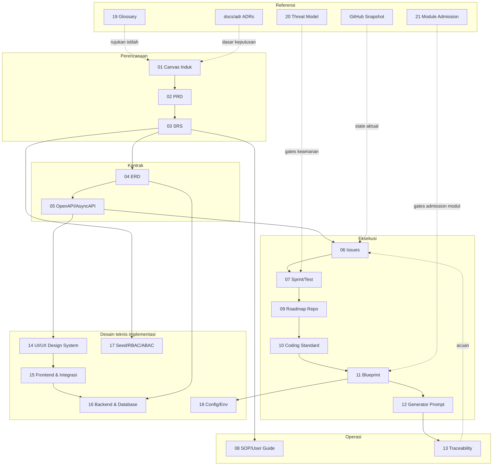

# AWCMS-Mini Documentation Package

Folder ini berisi paket dokumen master untuk pengembangan **AWCMS-Mini Modular Monolith Standard**. Struktur dan urutan dokumen mengikuti repo referensi AWPOS, dengan penyesuaian konteks menjadi base AWCMS-Mini untuk aplikasi domain berikutnya.

> Sebelum coding, baca [`../../AGENTS.md`](../../AGENTS.md) untuk aturan wajib dan alur kerja agent, serta gunakan **skill proyek** di [`../../.claude/skills/`](../../.claude/skills/README.md).

> **Penting — konten domain vs base.** Dokumen **01, 06, 09** dan `AGENTS.md` sudah **generik (base)**. Dokumen **02–19** memakai domain retail/POS bergaya **AWPOS** sebagai **contoh ilustratif**: **pola & standar**-nya reusable, tetapi **entitas, endpoint, layar, dan istilah domain** (produk, POS, gudang, pajak, CRM, AI, dsb.) adalah ilustrasi yang **diganti** aplikasi turunan. Tiap dokumen 02–19 memuat banner penanda di bagian atasnya. Keputusan arsitektural base dicatat di [`../adr/`](../adr/README.md).

## Peta dokumen

## Keputusan final stack

- **Bun** sebagai runtime.
- **Backend Bun-only**; Node.js hanya boleh lewat pengecualian tertulis bila Bun belum mendukung capability yang diperlukan.
- **Astro 7** sebagai web framework.
- **PostgreSQL** sebagai database utama.
- **Modular monolith** sebagai arsitektur utama.
- **Microservice-ready**, tetapi tidak dipisah sejak awal.
- **Offline-first / LAN-first**, dengan optional online sync.
- **Cloudflare R2 optional** untuk object/file storage.
- **Provider eksternal opsional** (pesan/notifikasi/AI) via feature flag + outbox — ini adalah _slot_ base; provider konkret (mis. StarSender/Mailketing/AI analyst pada AWPOS) adalah contoh domain turunan.
- **OpenAPI** untuk API contract.
- **AsyncAPI** untuk domain event contract.

## Dokumen (per lapisan)

Dokumen dikelompokkan mengikuti alur pengembangan agar mudah diimplementasi.

### Lapisan A — Perencanaan (why & what)

|  No | File                         | Isi                                              |
| --: | ---------------------------- | ------------------------------------------------ |
|   1 | `01_canvas_induk.md`         | Canvas induk tahapan pengembangan dan arsitektur |
|   2 | `02_prd_detail_per_modul.md` | Product Requirement Document detail per modul    |
|   3 | `03_srs_detail_per_modul.md` | Software Requirement Specification detail        |

### Lapisan B — Kontrak (interface)

|  No | File                            | Isi                                         |
| --: | ------------------------------- | ------------------------------------------- |
|   4 | `04_erd_data_dictionary.md`     | ERD, data dictionary, RLS, index, retention |
|   5 | `05_openapi_asyncapi_detail.md` | Kontrak REST API dan domain event           |

### Lapisan C — Eksekusi (how & process)

|  No | File                                        | Isi                                                |
| --: | ------------------------------------------- | -------------------------------------------------- |
|   6 | `06_github_issues_detail.md`                | GitHub issues atomic siap copy-paste               |
|   7 | `07_sprint_testing_production_readiness.md` | Sprint plan, testing, go-live checklist            |
|   9 | `09_roadmap_repository_commit.md`           | Roadmap repository, branch, commit, release        |
|  10 | `10_template_kode_coding_standard.md`       | Template kode dan coding standard                  |
|  11 | `11_implementation_blueprint.md`            | Skeleton repository dan blueprint per sprint       |
|  12 | `12_generator_prompt.md`                    | Prompt eksekusi coding agent                       |
|  13 | `13_final_master_index_traceability.md`     | Master index, traceability matrix, checklist final |

### Lapisan D — Desain teknis implementasi (build)

|  No | File                                      | Isi                                                       |
| --: | ----------------------------------------- | --------------------------------------------------------- |
|  14 | `14_ui_ux_design_system.md`               | Design system, token, komponen, layar, a11y, i18n         |
|  15 | `15_frontend_architecture_integration.md` | Arsitektur frontend, API client, auth, offline-first      |
|  16 | `16_backend_data_access_integration.md`   | Data access, pooling, RLS, transaction, outbox, migration |
|  17 | `17_default_seed_rbac_abac.md`            | Role default, permission matrix, ABAC policy, seed        |
|  18 | `18_configuration_env_reference.md`       | Referensi env, feature flag, topologi deployment          |

### Lapisan E — Operasi & referensi

|  No | File                                                  | Isi                                                                                                                                                                                                                                                                              |
| --: | ----------------------------------------------------- | -------------------------------------------------------------------------------------------------------------------------------------------------------------------------------------------------------------------------------------------------------------------------------- |
|   8 | `08_sop_operasional_user_guide.md`                    | SOP operasional dan user guide                                                                                                                                                                                                                                                   |
|  19 | `19_glossary_terminology.md`                          | Glossary & terminologi lintas dokumen                                                                                                                                                                                                                                            |
|  20 | `20_threat_model_security_architecture.md`            | Threat model (STRIDE), trust boundary, kontrol keamanan berlapis (dokumen base, bukan contoh domain)                                                                                                                                                                             |
|  21 | `21_module_admission_governance.md`                   | Kategori modul (Core/System/Official Optional/Derived/Integration), pohon keputusan admission, dan pemetaan 23 modul terdaftar (Issue #696)                                                                                                                                      |
|   – | `templates/module-proposal-template.md`               | Proposal ringan untuk modul System/Official Optional Module baru                                                                                                                                                                                                                 |
|   – | `templates/module-admission-decision-checklist.md`    | Checklist review PR untuk admission modul + provider eksternal baru                                                                                                                                                                                                              |
|   – | `database-migrations.md`                              | Panduan runner migrasi PostgreSQL Bun-native                                                                                                                                                                                                                                     |
|   – | `database-pooling.md`                                 | Connection pooling per work class, backpressure, circuit breaker, dan antrean timeout database (Issue 10.2, doc 16/05/20)                                                                                                                                                        |
|   – | `database-capacity-runbook.md`                        | Model kapasitas koneksi lintas-instance (deployment-aware), kalkulator, stage preflight `database:capacity`, dan SOP incident saturasi/connection-storm (Issue #743, epic #738 platform-evolution)                                                                               |
|   – | `deployment-profiles.md`                              | Profil deployment (development/staging/production/offline-LAN) dan model dua-peran basis data                                                                                                                                                                                    |
|   – | `observability-metrics.md`                            | Metrics port: counter/histogram/gauge berkardinalitas rendah untuk request/pool/job/provider, SLI/SLO awal, dan endpoint dependency-health (Issue #698, epic #679)                                                                                                               |
|   – | `deploy-coolify.md`                                   | Panduan deploy Coolify: single-VPS, multi-aplikasi, opsi PostgreSQL, checklist keamanan (Issue #462)                                                                                                                                                                             |
|   – | `production-preflight-runbook.md`                     | Rehearsal staging, bukti backup, apply migrasi bergerbang, dan rollback untuk `bun run production:preflight` (Issue #684, epic #679)                                                                                                                                             |
|   – | `production-readiness.md`                             | Implementasi checklist production security readiness: preflight, RLS, RBAC/ABAC default-deny, soft delete/immutability (Issue 10.3, doc 07/03/16/20)                                                                                                                             |
|   – | `resilience-dr-verification.md`                       | `bun run resilience:dr-drill`: verifikasi disaster-recovery, katalog skenario failure-injection, dan model keamanannya (Issue #699, epic #679)                                                                                                                                   |
|   – | `branch-protection.md`                                | Daftar required status check yang direkomendasikan untuk branch protection `main` (belum diaktifkan) — CI quality/security gate yang sudah berjalan di setiap PR (Issue #685, epic #679)                                                                                         |
|   – | `release-process.md`                                  | Rilis otomatis: Changesets gate, SBOM, keyless signing, provenance/attestation, environment approval, dry-run, rollback/yank (Issue #692, epic #679)                                                                                                                             |
|   – | `derived-application-guide.md`                        | Panduan membangun aplikasi turunan di atas base (9 langkah + 5 contoh ilustratif + checklist keamanan)                                                                                                                                                                           |
|   – | `lingkup-di-luar-base-repo.md`                        | Isu & kapabilitas yang sengaja TIDAK dikerjakan di base (descope POS/retail 2026-07-04 → AWPOS; `not planned` 2026-07-13 master-data cahyadsn #654/#658-664 + hermes-agent #668-678; batas ERP/legacy/adapter provider) + ke mana membangunnya                                   |
|   – | `examples/minimal-domain-module.md`                   | Contoh konkret satu modul domain minimal (Issue #463)                                                                                                                                                                                                                            |
|   – | `examples/wizard-form-pattern.md`                     | Reusable multi-step wizard form pattern: komponen, helper, pola i18n (Issue #479)                                                                                                                                                                                                |
|   – | `examples/wizard-derived-module-example.md`           | Contoh pemakaian wizard end-to-end pada modul domain turunan (Issue #482)                                                                                                                                                                                                        |
|   – | `derived-app-pilot-plan.md`                           | Rencana pilot aplikasi turunan pertama — rekomendasi AWPOS (Issue #465)                                                                                                                                                                                                          |
|   – | `news-portal/full-online-r2-architecture.md` dkk.     | Arsitektur full-online R2-only media berita, SOP upload, security checklist, incident response, backup/lifecycle, panduan editor (Issue #631)                                                                                                                                    |
|   – | `news-portal/social-sharing.md`                       | Social sharing manual (native share/copy-link + 6 platform statis), beda dengan auto posting, batasan Instagram (Issue #642)                                                                                                                                                     |
|   – | `news-portal/social-publishing-architecture.md`       | Arsitektur auto posting sosial: outbox/connector, gerbang full-online, token reference, adapter registry, retry/idempotency (epic `social_publishing` #643-#646)                                                                                                                 |
|   – | `news-portal/social-publishing-sop.md`                | SOP setup per provider (Meta/LinkedIn/Telegram), approval editorial, retry/reauthorization, takedown policy (Issue #647)                                                                                                                                                         |
|   – | `news-portal/social-provider-limitations.md`          | Batasan nyata per provider (Meta/LinkedIn/Telegram) + kenapa Instagram/WhatsApp tidak punya auto posting (Issue #647)                                                                                                                                                            |
|   – | `news-portal/social-publishing-security-checklist.md` | Token storage, heuristic anti-raw-secret, redaction, incident response token bocor/post tidak sah, kepatuhan (Issue #647)                                                                                                                                                        |
|   – | `../../openapi/` dan `../../asyncapi/`                | Baseline kontrak OpenAPI/AsyncAPI dan validator `api:spec:check`                                                                                                                                                                                                                 |
|   – | `api-reference.md`                                    | Referensi API & event GENERATED (`bun run api:docs:generate`) dari kontrak OpenAPI/AsyncAPI ter-bundle — auth, tenant context, pagination, idempotency, error schema, seluruh operation/event, dan kebijakan deprecation (Issue #700, epic #679)                                 |
|   – | `repo-inventory.md`                                   | Inventory repo GENERATED (`bun run repo:inventory:generate`): modul, migration, tabel/RLS, test, dan route — sumber kebenaran mekanis, dicek `repo:inventory:check` (Issue #688, epic #679)                                                                                      |
|   – | `agent-memory.md`                                     | Snapshot memory agent GENERATED (`bun run memory:docs:sync`): memory Claude Code hidup di luar repo (`~/.claude/projects/<slug>/memory/`) sehingga hilang saat pindah device — dokumen ini membuatnya bisa dipulihkan (`bun run memory:docs:restore`), dicek `memory:docs:check` |
|   – | `../Pedoman_Penggunaan_Agent_Keluarga_AWCMS_v1.0.pdf` | Pedoman penggunaan AI agent lintas keluarga produk AWCMS (AWCMS, AWCMS-Mini, AWCMS-Micro, software turunan) — AWCMS-Mini menjadi sumber utama (baseline) pedoman ini                                                                                                             |

### Architecture Decision Records

| Folder                        | Isi                                                                                                                                                                      |
| ----------------------------- | ------------------------------------------------------------------------------------------------------------------------------------------------------------------------ |
| [`../adr/`](../adr/README.md) | Keputusan arsitektural base (modular monolith, Bun-only, RLS, RBAC/ABAC, soft delete, offline-first, kontrak, module admission, lapisan ekstensi/boundary tenant-bisnis) |

### Audit repo

| File                                       | Isi                                                                                                                                                                                                                                                                                                                                                    |
| ------------------------------------------ | ------------------------------------------------------------------------------------------------------------------------------------------------------------------------------------------------------------------------------------------------------------------------------------------------------------------------------------------------------ |
| `AUDIT_STANDAR_PENGEMBANGAN_2026-07-17.md` | **Dokumen hidup** — audit kepatuhan standar Bun/Astro 7/PostgreSQL, tabel pengecualian Node.js, log perawatan pasca-backlog, dan audit repo menyeluruh terakhir (v0.24.0, epic #818). **Nama file mengikuti tanggal perubahan terakhir: rename saat memperbarui** (mis. `..._2026-07-17.md` → `..._<tanggal-baru>.md`) dan perbarui seluruh rujukannya |

### Snapshot GitHub

| File                          | Isi                                                                                                                        |
| ----------------------------- | -------------------------------------------------------------------------------------------------------------------------- |
| `github/README.md`            | Proses pencatatan GitHub issue, aturan maksimal 100 issue per file, indeks snapshot, dan ringkasan live count saat refresh |
| `github/issues-open-001.md`   | Snapshot issue `OPEN` saat ini                                                                                             |
| `github/issues-closed-001.md` | Snapshot issue `CLOSED` saat ini                                                                                           |
| `github/labels-milestones.md` | Snapshot label dan milestone GitHub                                                                                        |
| `github/security.md`          | Snapshot setup GitHub Security, alert count, dan file security automation                                                  |

## Reading path (sesuai tujuan)

| Tujuan                       | Urutan baca                                          |
| ---------------------------- | ---------------------------------------------------- |
| Memahami produk & arsitektur | 01 → 02 → 03 → 19                                    |
| Mulai coding (foundation)    | AGENTS.md → 11 → 16 → 18 → 05 → 04                   |
| Implementasi modul backend   | 03 (modul) → 04 → 05 → 10 → 16 → 17                  |
| Implementasi UI/frontend     | 14 → 15 → 05 → 08                                    |
| Setup akses & multi-tenant   | 17 → 16 → 03                                         |
| Testing & go-live            | 07 → 12 → 13                                         |
| Operasional & handover       | 08 → 09 → 13                                         |
| Audit standar repo           | `AUDIT_STANDAR_PENGEMBANGAN_2026-07-17.md` → 09 → 11 |
| Sinkronisasi GitHub issue    | 06 → `github/README.md` → 09 → 13                    |

## AWCMS-Mini sebagai standar pengembangan

AWCMS-Mini sengaja disusun agar bisa dipakai sebagai **template/contoh** untuk mengembangkan aplikasi lain di atas base yang sama. Bagian yang **generik & reusable** (pola AWCMS-Mini) vs **spesifik domain turunan**:

| Reusable (pola AWCMS-Mini)                                         | Spesifik domain turunan                       |
| ------------------------------------------------------------------ | --------------------------------------------- |
| Struktur modular monolith + module contract (10, 11)               | Modul domain aplikasi (02, 03)                |
| Baseline keamanan RBAC + ABAC + RLS + audit (16, 17)               | Matriks role & policy domain (17)             |
| Konvensi migration, OpenAPI, AsyncAPI (04, 05, 16)                 | Schema & endpoint domain (04, 05)             |
| Soft delete tenant-safe untuk master/config/draft (04, 05, 10, 16) | Resource domain mana yang boleh restore/purge |
| Design system & shell UI (14, 15)                                  | Layar domain/operator/portal (14)             |
| Offline-first (service worker + outbox) (15, 16)                   | Alur transaksi/operasional domain (08)        |
| Skill proyek `.claude/skills/`                                     | —                                             |
| Standar commit/roadmap/preflight (09, 07)                          | —                                             |

Untuk membangun aplikasi baru di atas AWCMS-Mini: pertahankan lapisan reusable, ganti lapisan spesifik domain dengan kebutuhan aplikasi Anda, dan ikuti alur dokumen 01 → 20 (plus ADR di [`../adr/`](../adr/README.md)). Panduan langkah-demi-langkah (9 langkah berbasis skill nyata + 5 contoh aplikasi turunan + checklist keamanan): [`derived-application-guide.md`](derived-application-guide.md).

Kontrak repository AWCMS-Mini (AGENTS.md, README.md, CONTRIBUTING.md, `derived-application-guide.md`, skill proyek) juga menjadi **sumber utama** bagi [`../Pedoman_Penggunaan_Agent_Keluarga_AWCMS_v1.0.pdf`](../Pedoman_Penggunaan_Agent_Keluarga_AWCMS_v1.0.pdf) — pedoman penggunaan agent yang menggeneralisasi pola AWCMS-Mini agar berlaku lintas keluarga produk (AWCMS, AWCMS-Mini, AWCMS-Micro, dan software turunannya). Repo ini tetap sumber kebenaran paling spesifik ketika ada perbedaan.

## Versioning

SemVer + [Changesets](../../.changeset/README.md); riwayat di [`../../CHANGELOG.md`](../../CHANGELOG.md). Setiap PR yang mengubah perilaku wajib menambah changeset. Peta versi & workflow: `09_roadmap_repository_commit.md`.

## Prinsip implementasi

1. Baca dokumen dan repository sebelum mengedit.
2. Kerjakan atomic issue.
3. Jangan mengubah modul unrelated.
4. Jika schema berubah, tambahkan migration.
5. Jika API berubah, update OpenAPI.
6. Jika event berubah, update AsyncAPI.
7. Jika mutation high-risk, gunakan idempotency.
8. Jika data tenant-scoped, gunakan tenant context, ABAC, dan RLS.
9. Jika aktivitas high-risk, tulis audit log.
10. Jika data sensitif, mask/redact.
11. Jika resource bisa dihapus, gunakan soft delete + filter default `deleted_at IS NULL`; restore/purge harus berizin dan diaudit.

## Langkah berikutnya

**Base generik sudah selesai** (v0.23.5) — seluruh 18 issue backlog base (doc 06) + peningkatan pasca-backlog milestone M9 tuntas (ringkasan di [`../../README.md`](../../README.md) §Versioning dan log per-issue di `AUDIT_STANDAR_PENGEMBANGAN_2026-07-17.md`). Tenant/office, identity/login, RBAC/ABAC, Sync Storage, reporting, audit/logging, workflow approval, dan deployment profile **sudah** ada dan berjalan; jangan membangunnya ulang.

Kontribusi baru masuk salah satu dari dua jalur:

**A. Membangun aplikasi turunan / modul domain** (mis. AWPOS retail/POS, portal sekolah, sistem pengaduan, sistem manajemen mutu) di atas base ini:

1. Definisikan PRD/SRS domain (pola doc 02/03, ganti entitas retail/POS ilustratif dengan domain Anda).
2. Scaffold modul domain di `src/modules/` — skill `awcms-mini-new-module`.
3. Migration PostgreSQL + RLS tenant-scoped — skill `awcms-mini-new-migration`.
4. Seed RBAC/ABAC domain (doc 17) — permission/role/policy khusus domain.
5. Endpoint REST + OpenAPI — skill `awcms-mini-new-endpoint`; domain event + AsyncAPI — skill `awcms-mini-new-event`.
6. UI/admin screen sesuai design system (doc 14/15) — skill `awcms-mini-ui-screen`; string via i18n — skill `awcms-mini-i18n`; form multi-step — skill `awcms-mini-wizard-form`.
7. Audit/logging aksi high-risk — skill `awcms-mini-audit-log`; idempotency mutation high-risk — skill `awcms-mini-idempotency`.
8. Test berlapis — skill `awcms-mini-testing`; E2E browser sungguhan (Playwright + Bun) — skill `awcms-mini-browser-test`; review keamanan — skill `awcms-mini-security-review`.
9. Deployment & go-live — skill `awcms-mini-production-preflight`; pilih & jalankan profil deployment — skill `awcms-mini-deploy` (`deployment-profiles.md`, atau `deploy-coolify.md` bila Coolify).

Orkestrasi penuh satu unit kerja: skill `awcms-mini-implement-issue`. Pertahankan lapisan reusable (tabel §AWCMS-Mini sebagai standar pengembangan di atas), ganti hanya lapisan spesifik domain.

**B. Perawatan / peningkatan base** (performa, UX/a11y, integrasi, keamanan, observability): pakai skill peningkatan terkait dan catat di §Perawatan pasca-backlog pada `AUDIT_STANDAR_PENGEMBANGAN_2026-07-17.md`.

Dokumen `09_roadmap_repository_commit.md` dan `12_generator_prompt.md` tetap acuan konvensi commit/roadmap/generator — bukan lagi daftar urutan issue foundation yang sudah tuntas.
