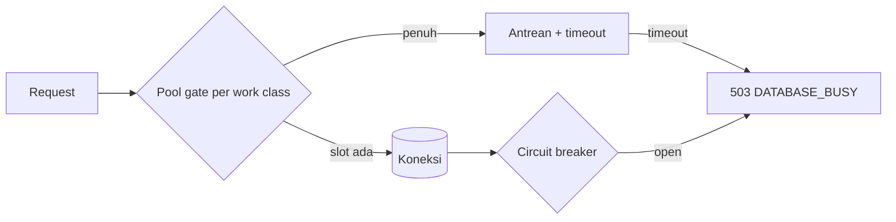

# Database Connection Pooling and Backpressure

Dokumen ini mencatat implementasi pooling/backpressure untuk Issue 10.2 (doc 16
§Connection pooling dan backpressure, doc 05 "DB Pool" / "DB Connectivity",
doc 20 threat model, ADR-0003–0005).

## Ringkasan



Tiga lapisan independen bekerja bersama:

1. **`Bun.SQL` pool config** (`src/lib/database/client.ts`) — pool koneksi
   fisik ke PostgreSQL.
2. **Work-class concurrency gate** (`src/lib/database/work-class.ts`) —
   semaphore aplikasi murni di depan pool, membatasi konkurensi per jenis
   beban.
3. **Circuit breaker** (`src/lib/database/circuit-breaker.ts`) — fail-fast
   saat transaksi database berturut-turut gagal.

Keduanya (gate + breaker) diintegrasikan lewat satu titik: `withTenant`
(`src/lib/database/tenant-context.ts`) — setiap endpoint yang sudah ada
memanggil `withTenant`, sehingga perlindungan ini otomatis berlaku tanpa
mengubah setiap route.

## 1. Bun.SQL pool config

`getDatabaseClient()` mengonfigurasi `Bun.SQL` dengan:

| Opsi                           | Sumber                          | Default |
| ------------------------------ | ------------------------------- | ------- |
| `max`                          | `DATABASE_POOL_MAX`             | `20`    |
| `prepare`                      | `DATABASE_PGBOUNCER !== "true"` | `true`  |
| `connection.statement_timeout` | `DATABASE_STATEMENT_TIMEOUT_MS` | `15000` |

Catatan implementasi: `onconnect` pada `Bun.SQL.Options` (lihat
`node_modules/bun-types/sql.d.ts`) bertipe `(err: Error | null) => void` — ia
hanya melaporkan sukses/gagalnya percobaan koneksi, **bukan** memberi akses ke
client untuk menjalankan SQL (contoh JSDoc `onconnect: (client) => ...` di
file tipe yang sama tidak konsisten dengan signature aktualnya). Cara yang
type-correct dan didokumentasikan untuk menerapkan GUC sesi seperti
`statement_timeout` pada setiap koneksi pooled adalah opsi `connection`
("Postgres client runtime configuration options", lihat
postgresql.org/docs/current/runtime-config-client.html). `onconnect` tetap
dipakai, hanya untuk mencatat kegagalan koneksi ke logger terstruktur.

## 2. Work-class concurrency gate

`src/lib/database/work-class.ts` adalah semaphore in-memory per proses (bukan
lintas-instance). Lima work class dan batas konkurensinya:

| Work class             | Contoh                        | Prioritas (doc 16) | Max |
| ---------------------- | ----------------------------- | ------------------ | --: |
| `critical_transaction` | Posting POS, transfer receive | Tertinggi          |  10 |
| `interactive`          | CRUD admin, search            | Tinggi             |   8 |
| `reporting`            | Laporan, dashboard            | Sedang             |   4 |
| `background_sync`      | Sync push/pull, outbox        | Rendah             |   4 |
| `maintenance`          | Migration, backup             | Terjadwal          |   1 |

Angka ini kecil dan tetap (tidak env-tunable) secara sengaja — jumlahnya jauh
di bawah `DATABASE_POOL_MAX` (default 20) sehingga masih ada headroom di pool
`Bun.SQL` itu sendiri, dan urutannya mengikuti tabel prioritas doc 16:
`critical_transaction` mendapat alokasi terbesar karena prioritas tertinggi;
`maintenance` diserialkan (`max: 1`) karena bukan concern HTTP interaktif di
base ini.

Ketika sebuah class penuh, pemanggil berikutnya masuk antrean FIFO sampai
slot bebas atau `timeoutMs` habis. Timeout menolak dengan
`WorkClassTimeoutError` (bukan string-matching pesan error), sehingga
pemanggil bisa memetakannya ke `503 DATABASE_BUSY` secara type-safe.

`critical_transaction` dan `maintenance` sudah ada di tipe/konfigurasi untuk
kebutuhan aplikasi turunan (mis. endpoint posting POS) tetapi **tidak
dipakai oleh endpoint manapun di base generik ini** — base ini tidak membuat
endpoint tiruan hanya untuk mengisi kedua class tersebut.

## 3. Circuit breaker

`src/lib/database/circuit-breaker.ts` adalah breaker 3-state standar
(`closed → open → half_open → closed`), murni fungsi dari `now: Date` yang
di-inject oleh pemanggil (tidak ada `Date.now()` tersembunyi), sehingga
sepenuhnya unit-testable tanpa menunggu waktu nyata.

- **Closed → Open**: setelah `failureThreshold` (5) kegagalan berturut-turut.
- **Open → Half-open**: setelah `openDurationMs` (30 detik) berlalu sejak
  breaker terbuka, tepat satu percobaan diizinkan lewat.
- **Half-open → Closed**: percobaan sukses.
- **Half-open → Open**: percobaan gagal; jendela `openDurationMs` dimulai
  ulang dari waktu kegagalan tersebut.

Satu instance breaker dipakai bersama di seluruh aplikasi (module-level
singleton `getDatabaseCircuitBreaker()`), bukan per-request — sehingga
kegagalan yang terakumulasi lintas request/tenant memicu satu keputusan
fail-fast untuk semua trafik.

## 4. Integrasi ke `withTenant`

```ts
withTenant(sql, tenantId, fn, {
  workClass: "background_sync", // default: "interactive"
  queueTimeoutMs: 2000 // default: 2000
});
```

Alur:

1. Cek `circuitBreaker.canAttempt(now)` — jika `false`, langsung
   `503 DATABASE_BUSY` (skip antrean sepenuhnya, fail-fast).
2. `acquireWorkClassSlot(workClass, queueTimeoutMs)` — jika timeout,
   catat `database.pool.saturated` via logger terstruktur Issue 10.1
   (`src/lib/logging/logger.ts`) dengan work class dan snapshot saturasi,
   lalu `503 DATABASE_BUSY`.
3. Jalankan transaction seperti biasa (`SET LOCAL app.current_tenant_id`,
   lalu `fn(tx)`).
4. `finally`: lepas slot work-class.
5. Sukses → `circuitBreaker.recordSuccess()`; transaction/`fn` melempar
   exception → `circuitBreaker.recordFailure()` lalu exception dilempar
   ulang (bukan `fail()` yang mengembalikan Response — response error
   ABAC/validasi dari `fn` yang tidak melempar tetap dihitung sebagai
   "sukses" pada level breaker, karena breaker mengukur kegagalan
   transaksi/koneksi database, bukan logika bisnis).

   Dua pengecualian di catch block yang **tidak** memanggil
   `recordFailure()` meski melempar exception, karena keduanya adalah
   outcome logika bisnis/concurrency yang wajar, bukan kegagalan
   infra database (Issue #599, awalnya untuk `IdempotencyRaceLostError`
   saja):
   - `IdempotencyRaceLostError` — race benign pada
     `saveIdempotencyRecord` (lihat skill `awcms-mini-idempotency`).
   - `Bun.SQL.PostgresError` dengan SQLSTATE kelas `23` (integrity
     constraint violation — `23503` foreign_key_violation, `23505`
     unique_violation, `23514` check_violation, dst.). Sebelum Issue
     #599, sebuah `INSERT`/`UPDATE` yang gagal karena FK/unique
     constraint (mis. caller mengirim `tenantId` yang tidak ada) ikut
     dihitung sebagai kegagalan infra dan bisa membuka breaker
     aplikasi-lebar hanya dari beberapa request dengan input invalid —
     lihat Issue #599 dan `.changeset/database-circuit-breaker-integrity-violations.md`.
   - `Bun.SQL.PostgresError` dengan SQLSTATE kelas `22` (data exception —
     `22P02` invalid_text_representation, `22003` numeric_value_out_of_range,
     dst.), ditambahkan Issue #601 sebagai generalisasi dari kelas `23` di
     atas — sama-sama "input caller yang salah bentuk", bukan kegagalan
     infra (mis. string bukan-UUID yang dibandingkan ke kolom `uuid`).
     Belum ada endpoint yang mengeksploitasi celah ini saat Issue #601
     dibuka (setiap identifier caller-supplied sudah divalidasi
     `assertUuid()` sebelum menyentuh SQL), tapi pengecualian ditambahkan
     sebagai penutup celah struktural, bukan menunggu endpoint baru
     mereproduksinya.

     Error class lain (koneksi terputus, timeout, syntax error, izin
     ditolak, dst.) tetap dihitung sebagai kegagalan seperti biasa.

Endpoint yang direklasifikasi dari default `"interactive"` (mengikuti
pemetaan contoh doc 16):

- `background_sync`: `src/pages/api/v1/sync/push.ts`, `pull.ts`, `status.ts`,
  `objects/index.ts`, `objects/status.ts`, `conflicts/index.ts`,
  `conflicts/[id]/resolve.ts`.
- `reporting`: `src/pages/api/v1/reports/*.ts`,
  `src/pages/api/v1/logs/audit.ts`.

Semua endpoint lain tetap default `"interactive"`.

Catatan tipe: signature `withTenant<T>` generik, tetapi pada praktiknya
setiap call site nyata memakai `T = Response` (setiap endpoint yang ada
langsung mengembalikan hasil `withTenant` dari handler-nya). Karena itu
`fail(...)` di dalam `withTenant` di-cast ke `T` — aman secara praktik
meskipun signature generik tidak menegakkannya secara statis, konsisten
dengan asumsi implisit `T = Response` yang sudah dipakai endpoint Issue
8.1/9.1.

## 5. Health endpoint

`GET /api/v1/database/pool/health` (tanpa auth, mengikuti presedan
`/api/v1/health` yang juga publik) melaporkan:

```json
{
  "success": true,
  "data": {
    "status": "healthy",
    "databaseReachable": true,
    "circuitBreakerState": "closed",
    "workClasses": [
      {
        "workClass": "critical_transaction",
        "active": 0,
        "max": 10,
        "queued": 0
      },
      { "workClass": "interactive", "active": 0, "max": 8, "queued": 0 },
      { "workClass": "reporting", "active": 0, "max": 4, "queued": 0 },
      { "workClass": "background_sync", "active": 0, "max": 4, "queued": 0 },
      { "workClass": "maintenance", "active": 0, "max": 1, "queued": 0 }
    ],
    "generatedAt": "2026-07-05T00:00:00.000Z"
  },
  "meta": {}
}
```

`status` dihitung: `unhealthy` jika DB tidak terjangkau atau breaker `open`;
`degraded` jika breaker `half_open` atau ada work class yang penuh
(`active >= max`) dengan antrean tidak kosong; selain itu `healthy`. Endpoint
ini hanya melaporkan agregat (jumlah/boolean), **tidak pernah** data tenant
atau isi query — cek DB dilakukan lewat satu `SELECT 1` langsung memakai
`getDatabaseClient()` (bukan `withTenant`, karena endpoint ini bukan
tenant-scoped), dibungkus try/catch agar outage DB tidak membuat health
check-nya sendiri crash.

## 6. Domain event `database.pool.saturated`

Didokumentasikan di `asyncapi/awcms-mini-domain-events.asyncapi.yaml`
(kategori "DB Connectivity", doc 05). **Belum ada dispatcher pub/sub nyata**
untuk domain event apa pun di repo ini — produsen konkret event ini adalah
baris log terstruktur `database.pool.saturated` yang ditulis oleh
`withTenant` lewat `src/lib/logging/logger.ts`, sama seperti seluruh event
AsyncAPI lain di repo ini yang baru berupa kontrak terdokumentasi sejak
Issue 0.3.

## 7. PgBouncer (transaction mode) — contoh konfigurasi

Sejak Issue 12.2, `docker-compose.yml` dan seluruh berkas deployment ada di
`deploy/`. Contoh konfigurasi PgBouncer sekarang tersimpan satu tempat
(canonical) di
[`../../deploy/pgbouncer/pgbouncer.ini.example`](../../deploy/pgbouncer/pgbouncer.ini.example)
— bagian ini hanya kutipan singkat, jangan duplikasi isi lengkapnya di sini
agar tidak ada dua salinan yang bisa berbeda seiring waktu:

```ini
; pgbouncer.ini.example (kutipan — lihat berkas lengkap di link di atas)
[databases]
awcms-mini = host=127.0.0.1 port=5432 dbname=awcms-mini

[pgbouncer]
pool_mode = transaction
default_pool_size = 20 ; selaras dengan DATABASE_POOL_MAX aplikasi ini
```

PgBouncer bersifat **opsional** — topologi LAN-first default (satu server
app + PostgreSQL, lihat `docker-compose.yml` root dan
[`deployment-profiles.md`](deployment-profiles.md)) tidak membutuhkannya;
service `pgbouncer` di compose digerbangi lewat Docker Compose `profiles`
sehingga hanya aktif bila diminta eksplisit.

Implikasi saat `DATABASE_PGBOUNCER=true`:

- `prepare: false` diset otomatis pada `Bun.SQL` (lihat §1) — prepared
  statement otomatis bermasalah di PgBouncer transaction mode karena setiap
  statement bisa dieksekusi di koneksi backend berbeda antar transaction.
- Kode aplikasi sudah aman: `withTenant` selalu memakai
  `SET LOCAL app.current_tenant_id` (bukan `SET` sesi biasa), yang scope-nya
  otomatis terbatas pada satu transaction — kompatibel dengan PgBouncer
  transaction mode.

## Gap yang belum ditutup

- Circuit breaker sulit dipicu secara live tanpa cara memaksa kegagalan
  koneksi database yang representatif; verifikasi utamanya adalah unit test
  (`tests/database-pooling.test.ts`), bukan skenario live.
- Saturasi work-class di level HTTP sulit diamati secara deterministik
  karena request cenderung selesai lebih cepat daripada observasi manual;
  lihat entri audit untuk apa yang berhasil/tidak berhasil diamati secara
  live.
