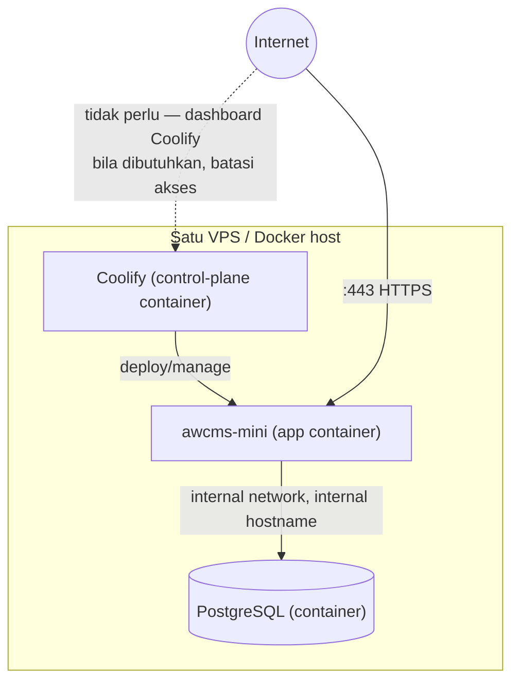
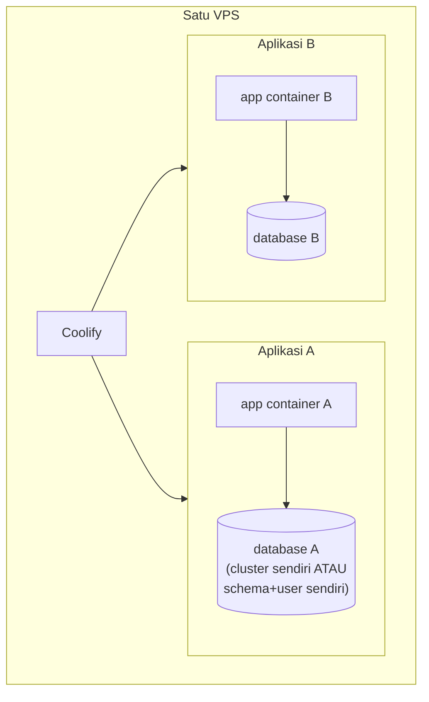

# Deploy Coolify

Issue #462. Panduan operasional untuk deploy AWCMS-Mini ke [Coolify](https://coolify.io)
memakai `Dockerfile.production` (Issue #454) sebagai jalur registry/CI-push,
berdampingan dengan `docker-compose.yml` yang tetap menjadi jalur
LAN-first/offline yang direkomendasikan (lihat
[`deployment-profiles.md`](deployment-profiles.md) §production (online) —
image registry). Dokumen ini **tidak menggantikan** dokumen itu — dokumen
ini menambahkan detail khusus Coolify: topologi satu VPS, topologi multi
aplikasi dalam satu VPS, opsi PostgreSQL, kapasitas praktis, dan checklist
keamanan.

## Dua pola deploy di Coolify

### Pola 1 — Build dari repo GitHub

Coolify meng-clone repo dan menjalankan `docker build -f
Dockerfile.production` sendiri pada setiap deploy (build di server Coolify
atau build server terpisah bila dikonfigurasi).

1. Coolify → **New Resource** → **Application** → **Public/Private
   Repository** (GitHub) → pilih repo `ahliweb/awcms-mini` (atau fork/repo
   turunan).
2. **Build Pack**: pilih **Dockerfile**, arahkan ke `Dockerfile.production`
   (bukan `Dockerfile` default — repo ini tidak punya `Dockerfile` di root,
   hanya `Dockerfile.production`, lihat catatan header berkas itu).
3. **Port**: `4321` (image `EXPOSE 4321`, `ENV PORT=4321`).
4. **Health Check Path**: `/api/v1/health` (lihat §Health check di bawah).
5. Set environment variable (§Environment variable minimal di bawah)
   sebelum deploy pertama.
6. Jalankan migration one-shot (§Migration one-shot di bawah) **sebelum**
   deploy pertama container app terhadap database baru.
7. Deploy. Coolify build image, jalankan container, cek health check path.

Cocok untuk: iterasi cepat, tidak perlu registry terpisah, Coolify
mengelola build pipeline sepenuhnya.

### Pola 2 — Pull image dari registry

CI (GitHub Actions atau lainnya) yang men-build
`docker build -f Dockerfile.production` dan push ke registry (GHCR, Docker
Hub, dsb.); Coolify hanya pull + run image jadi.

1. CI: `docker build -f Dockerfile.production -t
ghcr.io/<org>/awcms-mini:<tag> . && docker push
ghcr.io/<org>/awcms-mini:<tag>`.
2. Coolify → **New Resource** → **Application** → **Docker Image** → isi
   nama image + tag, kredensial registry bila privat.
3. Langkah **Port**/**Health Check Path**/environment variable/migration
   sama seperti Pola 1.

Cocok untuk: image immutable per rilis, build sekali dipakai di banyak
environment, atau saat build server Coolify ingin dijaga ringan (tidak
menjalankan `bun install && bun run build` untuk setiap app).

Repo ini **tidak** menambahkan workflow CI/CD registry otomatis (out of
scope Issue #462) — Pola 2 mengasumsikan operator sudah/akan menyiapkan
pipeline build-push sendiri di luar dokumen ini.

## Topologi single VPS / same Docker host

Pola default yang direkomendasikan untuk satu VPS kecil-menengah: Coolify,
aplikasi, dan PostgreSQL berjalan sebagai container Docker pada host yang
sama, dalam network internal Docker/Coolify yang sama.



Poin kunci:

- **Database tidak perlu public port** bila hanya diakses oleh app pada
  host/network Docker yang sama — gunakan hostname internal Coolify
  (mis. nama service database internal), bukan IP publik VPS, di
  `DATABASE_URL`.
- Public port database (`5432`) hanya dibuka bila benar-benar dibutuhkan
  (mis. akses admin dari luar untuk keperluan operasional) — dibatasi
  firewall/IP allowlist/VPN, dan memakai SSL bila koneksinya melewati
  jaringan publik.
- Dashboard Coolify sendiri sebaiknya dibatasi (firewall/VPN/IP allowlist)
  jika VPS menghadap internet langsung — dashboard adalah control-plane
  yang bisa mendeploy/menghapus semua aplikasi di host tersebut.
- Single VPS berarti single point of failure — bila host mati, Coolify,
  semua app, dan database di dalamnya ikut mati. Ini adalah trade-off yang
  disengaja untuk MVP/staging/demo/production kecil-menengah/klien
  single-server, bukan rekomendasi untuk beban tinggi atau kebutuhan HA
  (lihat §Kapan perlu memisahkan ke VPS/managed database lain).

## Topologi multi aplikasi dalam satu VPS

Satu instance Coolify bisa mengelola beberapa aplikasi/proyek pada VPS yang
sama — umum untuk operator yang menghosting beberapa klien atau beberapa
aplikasi turunan AWCMS-Mini pada satu server.



Aturan wajib per aplikasi:

- **Domain/subdomain sendiri**, env var/secret sendiri, deployment config
  sendiri di Coolify (project/app terpisah, bukan satu app dengan banyak
  domain).
- **Database terpisah per aplikasi**, atau minimal schema + role terpisah
  dengan privilege terbatas bila berbagi satu cluster PostgreSQL (lihat
  §Opsi PostgreSQL di bawah). Jangan pernah berbagi satu database/schema
  antar aplikasi yang berbeda.
- **Jangan reuse secret** antar aplikasi: `AUTH_JWT_SECRET`,
  `AWCMS_MINI_SYNC_HMAC_SECRET`, kredensial R2, dan password role database
  harus unik per aplikasi. Reuse secret berarti kompromi satu aplikasi bisa
  langsung dipakai menyerang aplikasi lain.
- **Jangan berbagi role superuser/`postgres` default** untuk runtime app
  manapun — setiap aplikasi tetap memakai model dua-peran (§Model dua-peran
  di `deployment-profiles.md`): role migrasi privileged terpisah dari role
  app least-privilege (`awcms_mini_app` atau role app-specific lain per
  aplikasi).
- **App-to-DB memakai internal network/internal hostname**, bukan URL
  publik, sama seperti topologi single-app di atas.
- **Backup dan restore per aplikasi/database** — retensi dan jadwal boleh
  berbeda per aplikasi, tapi setiap aplikasi harus bisa di-restore secara
  selektif tanpa menyentuh data aplikasi lain (lihat §Backup di bawah).

## Opsi PostgreSQL untuk multi aplikasi

| Opsi                                          | Deskripsi                                                                                                     | Cocok untuk                                                                                | Trade-off                                                                                                                                                                               |
| --------------------------------------------- | ------------------------------------------------------------------------------------------------------------- | ------------------------------------------------------------------------------------------ | --------------------------------------------------------------------------------------------------------------------------------------------------------------------------------------- |
| **1. Satu cluster, banyak database**          | Satu container/instance PostgreSQL, tiap aplikasi punya `CREATE DATABASE` + role sendiri di cluster yang sama | Beberapa aplikasi kecil-menengah pada VPS dengan resource terbatas                         | Hemat resource (satu proses Postgres); blast radius lebih besar — cluster down/corrupt berdampak ke semua aplikasi; perlu disiplin role/permission per database agar tidak lintas akses |
| **2. Satu container PostgreSQL per aplikasi** | Setiap aplikasi punya container Postgres sendiri, sepenuhnya terisolasi                                       | Klien/data yang perlu dipisah lebih tegas, aplikasi dengan beban/skema yang sangat berbeda | Isolasi terbaik; lebih boros resource (RAM/CPU/disk per instance Postgres, bukan satu shared)                                                                                           |
| **3. PostgreSQL eksternal/managed**           | Database di luar VPS Coolify — managed DB provider atau server Postgres terpisah                              | Production lebih besar, kebutuhan HA/replication/compliance tinggi, atau beban query berat | Tidak berbagi resource dengan Coolify/app lain; butuh koneksi jaringan aman (TLS, firewall/VPC) ke luar VPS; biaya operasional managed service                                          |

Aturan yang berlaku di ketiga opsi: role runtime aplikasi selalu
least-privilege (bukan superuser/owner cluster), `FORCE ROW LEVEL SECURITY`
tetap diterapkan sesuai model dua-peran, dan migrasi selalu dijalankan
sebagai langkah terpisah dengan role privileged — lihat
[`deployment-profiles.md`](deployment-profiles.md) §Model dua-peran basis
data untuk detail lengkap yang berlaku sama persis di Coolify.

## Batas kapasitas praktis (rule-of-thumb, bukan SLA)

| Resource VPS      | Perkiraan kapasitas aman                                                                          |
| ----------------- | ------------------------------------------------------------------------------------------------- |
| 2 CPU / 4 GB RAM  | 1-3 aplikasi ringan + 1 PostgreSQL kecil                                                          |
| 4 CPU / 8 GB RAM  | 3-8 aplikasi ringan/sedang + 1-3 PostgreSQL/database aktif                                        |
| 8 CPU / 16 GB RAM | Beberapa aplikasi lebih serius — tetap wajib monitoring resource dan backup terpisah per aplikasi |

Angka di atas adalah **rule-of-thumb**, bukan jaminan (SLA). Kapasitas
nyata bergantung pada beban query, ukuran database, frekuensi build
(Coolify build process ikut memakai CPU/RAM/disk saat deploy berjalan),
dan retensi backup/log yang aktif secara bersamaan pada host yang sama.

## Kapan perlu memisahkan database atau aplikasi ke VPS/managed database lain

Pertimbangkan memisahkan (database eksternal/managed, atau VPS terpisah)
bila salah satu dari berikut mulai terjadi:

- Traffic tinggi atau query database yang berat/lambat.
- Database bertumbuh cepat mendekati batas disk VPS.
- Butuh high availability/replication yang tidak praktis dijalankan sebagai
  container tunggal di satu VPS.
- Kebutuhan retensi backup/compliance/audit yang ketat.
- Resource VPS (CPU/RAM/disk/I/O) mulai penuh secara konsisten.
- Proses build/deploy satu aplikasi mulai mengganggu performa aplikasi lain
  pada VPS yang sama (resource contention nyata, bukan sekadar teoretis).
- Butuh isolasi blast radius yang lebih tegas antar klien/aplikasi (mis.
  kontrak SLA klien mensyaratkan infrastruktur terpisah).

## Environment variable minimal

Nilai berikut wajib disuntikkan lewat Coolify environment variable (bukan
dibakar ke image) untuk setiap aplikasi/deployment. Lihat `.env.example`
untuk daftar lengkap dan komentar tiap variabel:

| Variabel                                                         | Wajib       | Catatan                                                                                                                                                                           |
| ---------------------------------------------------------------- | ----------- | --------------------------------------------------------------------------------------------------------------------------------------------------------------------------------- |
| `DATABASE_URL`                                                   | Ya          | Role app least-privilege (`awcms_mini_app` atau setara), **bukan** role migrasi. Hostname internal bila app+DB satu network.                                                      |
| `AUTH_JWT_SECRET`                                                | Ya          | Unik per aplikasi — jangan reuse antar aplikasi/environment.                                                                                                                      |
| `AUTH_COOKIE_SECURE`                                             | Ya          | `true` untuk deployment Coolify (selalu di belakang HTTPS).                                                                                                                       |
| `APP_ENV`                                                        | Ya          | `production` (atau `staging` untuk instance staging).                                                                                                                             |
| `AWCMS_MINI_SYNC_HMAC_SECRET`, `AWCMS_MINI_SYNC_ENABLED`, `R2_*` | Kondisional | Wajib diisi bila sync/R2 dipakai — lihat `bun run config:validate` (Issue 12.2, `deployment-profiles.md` §Validasi konfigurasi) yang menegakkan aturan kondisional ini saat boot. |

`bun run config:validate` (dijalankan otomatis oleh
`bun run production:preflight`, lihat skill
`.claude/skills/awcms-mini-production-preflight/`) menghentikan start
dengan pesan jelas bila variabel wajib hilang atau kondisional tidak
konsisten — jalankan preflight ini sebelum mengandalkan deploy Coolify
pertama kali.

## Migration one-shot

Sama seperti dijelaskan di
[`deployment-profiles.md`](deployment-profiles.md) §Model dua-peran basis
data: `Dockerfile.production` **tidak** menjalankan migrasi — role runtime
image (`awcms_mini_app`) tidak punya hak DDL/GRANT.

Di Coolify, jalankan migrasi sebagai langkah terpisah **sebelum** deploy
pertama app terhadap database baru:

- **One-off command di Coolify** (bila tersedia untuk resource
  application/database Anda): jalankan `bun run db:migrate` dengan
  `DATABASE_URL` privileged (role migrasi/superuser), bukan URL runtime
  app.
- **Manual dari checkout lokal**: `DATABASE_URL=<url-privileged-migrasi>
bun run db:migrate` menunjuk ke hostname/port database Coolify (internal
  bila dijalankan dari host yang sama, atau public port sementara bila
  dijalankan dari luar — pastikan port ditutup lagi setelahnya bila dibuka
  khusus untuk migrasi).
- **CI job terpisah** sebelum trigger deploy Coolify, bila pipeline CI/CD
  registry sudah disiapkan operator (di luar scope dokumen ini).

Setiap aplikasi/database pada topologi multi-app punya migrasi one-shot
sendiri — jangan menjalankan migrasi satu aplikasi terhadap database
aplikasi lain.

## Health check

Endpoint: `GET /api/v1/health` — dipakai sebagai **Health Check Path** di
konfigurasi Coolify application (lihat §Dua pola deploy di atas). Coolify
memakai endpoint ini untuk menentukan container sehat sebelum menandai
deploy sukses/sebelum mengarahkan traffic.

```bash
curl https://<domain-aplikasi>/api/v1/health
```

Setiap aplikasi pada topologi multi-app dicek lewat endpoint health-nya
masing-masing — tidak ada health check bersama lintas aplikasi.

## Backup

`deploy/backup/backup-postgres.sh` dan `restore-postgres.sh` (lihat
[`../../deploy/backup/README.md`](../../deploy/backup/README.md)) berlaku
sama persis di Coolify — dijalankan lewat scheduled task Coolify (bila
tersedia) atau cron di VPS, menunjuk `DATABASE_URL` ke database yang
relevan.

Pada topologi multi-app: setiap aplikasi/database punya jadwal backup dan
`BACKUP_DIR` sendiri, sehingga restore satu aplikasi tidak pernah
menyentuh dump aplikasi lain. Retensi (`BACKUP_RETENTION_DAYS`) boleh
berbeda per aplikasi sesuai kebutuhan masing-masing. Lakukan restore drill
berkala (`restore-postgres.sh` tanpa `--target` selalu restore ke database
disposable `awcms_mini_restore_test`, bukan menimpa database live) untuk
setiap aplikasi/database yang dianggap penting.

Backup storage/R2 (bila dipakai) mengikuti scope R2 bucket/prefix per
aplikasi yang sudah diatur lewat `R2_BUCKET` dan variabel R2 lain di
environment variable masing-masing aplikasi — jangan berbagi bucket/prefix
antar aplikasi tanpa pemisahan path yang jelas.

## Dispatcher terjadwal (email)

`bun run email:dispatch` (Issue #499, lihat
[`deployment-profiles.md`](deployment-profiles.md) §Dispatcher email
terjadwal untuk detail lengkap) adalah CLI, bukan endpoint — di Coolify
dijalankan lewat **Scheduled Task** Coolify (bila plan/versi mendukung)
atau cron di VPS host, memanggil `docker exec <container-app> bun run
email:dispatch` setiap 1-2 menit. Sama seperti backup, pada topologi
multi-app setiap aplikasi punya jadwal dispatch sendiri sesuai
`EMAIL_ENABLED`/`DATABASE_URL` masing-masing — tidak ada dispatcher
bersama lintas aplikasi. Bila `EMAIL_ENABLED` aplikasi tersebut `false`,
perintah ini no-op (exit 0) sehingga aman dijadwalkan meski belum
diaktifkan.

`sync:objects:dispatch` (setiap 1-2 menit) dan `logs:audit:purge`/
`form-drafts:purge` (harian) dijadwalkan dengan pola **Scheduled
Task**/cron `docker exec` yang sama persis, hanya beda nama command —
lihat [`deployment-profiles.md`](deployment-profiles.md) §Job registry
lainnya (Issue #519) untuk daftar lengkap job dan mana yang on-demand
(bukan cron berulang).

## Rollback

- **Image registry (Pola 2)**: rollback = deploy ulang tag image
  sebelumnya di Coolify. Karena `Dockerfile.production` immutable per
  build, rollback aplikasi murni adalah operasi cepat.
- **Migration caution**: rollback image **tidak** otomatis membatalkan
  migrasi skema yang sudah diterapkan. Bila deploy baru menyertakan
  migrasi yang breaking, rollback image ke versi lama bisa membuat app
  lama berjalan melawan skema baru yang tidak kompatibel. Uji migrasi
  bersifat backward-compatible (expand-first) sebelum deploy, atau siapkan
  restore dari backup sebagai jalur rollback skema bila diperlukan.
- **Build-dari-repo (Pola 1)**: rollback = redeploy commit/tag Git
  sebelumnya di Coolify.

## Keamanan — single VPS dan multi aplikasi

Checklist ini berlaku untuk kedua topologi (single-app dan multi-app);
poin bertanda **(multi)** khusus relevan saat beberapa aplikasi berbagi
satu VPS/Coolify:

- SSH key-only, root login dibatasi sesuai kebijakan server/provider VPS.
- Firewall: hanya buka port yang perlu — `80`/`443` publik, SSH dibatasi
  IP/VPN bila memungkinkan, dashboard Coolify dibatasi bila VPS menghadap
  internet langsung.
- Buat akun admin Coolify segera setelah instalasi — jangan biarkan
  dashboard tanpa admin account terkonfigurasi.
- Database public port **disabled by default** — buka hanya bila
  diperlukan, dibatasi firewall/IP/VPN, dan pakai SSL bila lintas
  jaringan publik.
- App dan database dalam network internal yang sama memakai internal
  hostname, bukan public URL.
- Scheduled backup PostgreSQL ke S3-compatible storage/R2, plus restore
  drill berkala.
- Monitor CPU/RAM/disk/I/O — build, Coolify, app, database, backup, dan
  log semuanya berbagi resource host yang sama; siapkan resource
  limit/reservation bila salah satu aplikasi/database berisiko
  menghabiskan resource bersama.
- Log/audit retention aktif (`AUDIT_LOG_RETENTION_DAYS`,
  `bun run logs:audit:purge` — lihat `.env.example` §Inti).
- Update Docker/Coolify secara rutin.
- **(multi)** Secret per aplikasi tidak boleh reuse — lihat §Topologi multi
  aplikasi di atas.
- **(multi)** Isolasi database per aplikasi (database terpisah, atau
  minimal schema+role terpisah) — lihat §Opsi PostgreSQL.
- **(multi)** Backup/restore per aplikasi/database, bukan backup gabungan
  lintas aplikasi.

## Lihat juga

- [`deployment-profiles.md`](deployment-profiles.md) — profil environment
  lengkap, model dua-peran basis data, dan perbandingan
  `docker-compose.yml` vs `Dockerfile.production`.
- [`18_configuration_env_reference.md`](18_configuration_env_reference.md)
  — referensi environment variable lengkap.
- [`../../deploy/backup/README.md`](../../deploy/backup/README.md) —
  detail backup/restore.
- `Dockerfile.production` — image production registry-based (komentar
  header berkas menjelaskan alasan desain multi-stage-nya).
- [Dokumentasi resmi Coolify](https://coolify.io/docs) — instalasi,
  applications, databases, backups, dan resource monitoring di level
  platform (di luar scope dokumen ini, yang fokus ke konfigurasi
  AWCMS-Mini spesifik).
