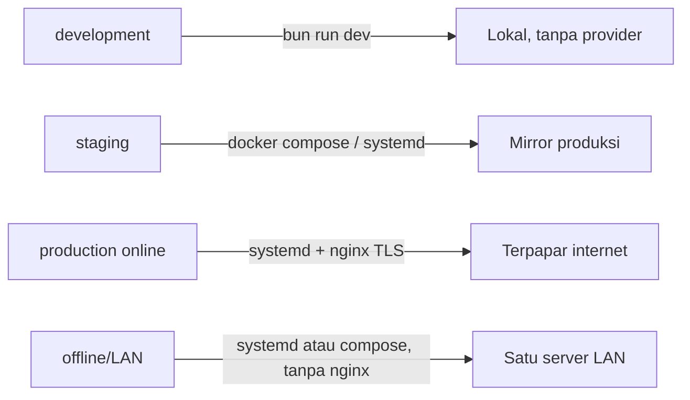

# Deployment Profiles

Dokumen ini mencatat implementasi profil deployment untuk Issue 12.2 (doc 18
§Profil per-environment, §Topologi deployment LAN-first, §Runtime & tooling
Bun-only). Melengkapi `docs/awcms-mini/18_configuration_env_reference.md`
dengan pemetaan konkret: berkas mana di `deploy/` dan `docker-compose.yml`
dipakai pada profil environment yang mana.

## Ringkasan



Empat profil (doc 18 §Profil per-environment) dan berkas `deploy/*` yang
relevan untuk masing-masing:

| Profil                  | Karakteristik (doc 18)                                                                                       | Berkas `deploy/`/root yang relevan                                                                                                                                                                                           |
| ----------------------- | ------------------------------------------------------------------------------------------------------------ | ---------------------------------------------------------------------------------------------------------------------------------------------------------------------------------------------------------------------------- |
| **development**         | Semua provider off, DB lokal, cookie tidak secure                                                            | `bun run dev` langsung (tidak perlu `deploy/*` atau `docker-compose.yml`); `.env` disalin dari `.env.example` apa adanya                                                                                                     |
| **staging**             | Meniru produksi, data uji, backup aktif                                                                      | Sama seperti production (di bawah), plus data/tenant uji                                                                                                                                                                     |
| **production (online)** | HTTPS, secret manager, backup+restore teruji, sync opsional                                                  | `deploy/systemd/awcms-mini.service.example`, `deploy/nginx/awcms-mini.conf.example` (TLS termination), `deploy/backup/*`, opsional `deploy/pgbouncer/*` bila banyak koneksi pendek                                           |
| **offline/LAN**         | Tanpa internet; sync/R2/WA/email off atau tertunda; POS/aplikasi operasional tetap jalan penuh; backup lokal | `deploy/systemd/awcms-mini.service.example` (atau `docker-compose.yml`) menjalankan app langsung di port 4321 — **nginx dapat dilewati sepenuhnya**, tidak ada eksposur publik; `deploy/backup/*` tetap wajib (backup lokal) |

Prinsip pemilihan: nginx (`deploy/nginx/`) hanya dibutuhkan saat butuh
terminasi TLS untuk klien di luar mesin/jaringan tepercaya atau saat
memfasadkan beberapa instance upstream — topologi LAN-first satu server
(doc 18) bisa langsung menyajikan aplikasi di port 4321 tanpa reverse
proxy sama sekali. PgBouncer (`deploy/pgbouncer/`) hanya untuk skenario
koneksi pendek bervolume tinggi (lihat
[`database-pooling.md`](database-pooling.md) §7) — bukan kebutuhan default.

## Profil online (public tenant routing) — config-only, Issue #556

Epic #555 menambahkan mode routing publik online-first di atas empat
profil di atas (bukan profil kelima yang terpisah — `production (online)`
tetap profil yang sama, sekarang bisa dikonfigurasi lebih eksplisit).
Issue #556 menambahkan env var (lihat
[`18_configuration_env_reference.md`](18_configuration_env_reference.md#public-routing-opsional-online-first--issue-556-epic-555)
§Public routing); schema tenant-domain (#557), module descriptor
`tenant_domain` (#558), resolver host-based (#559), dan rute publik
`/news` (#560) sudah menyusul dan sudah selesai — lihat
`.claude/skills/awcms-mini-tenant-domain-routing/SKILL.md` untuk status
lengkap per issue.

- **offline/LAN & development**: biarkan `PUBLIC_TENANT_RESOLUTION_MODE`
  tidak di-set (default). `config:validate` tetap lulus tanpa var
  tambahan apa pun — tidak ada perubahan pada topologi LAN-first yang
  sudah didokumentasikan di atas. Ini **bukan** hal yang sama dengan
  men-set `PUBLIC_TENANT_RESOLUTION_MODE=tenant_code_legacy` secara
  eksplisit: unset tetap memakai fallback env/setup default untuk `/news`,
  sedangkan `tenant_code_legacy` eksplisit membuat `/news` tidak pernah
  resolve tenant apa pun (operator secara sadar memilih "wajib
  `tenantCode` eksplisit di path, tidak ada tebakan default" — keputusan
  Issue #560, lihat `src/lib/tenant/public-host-tenant-resolver.ts`).
- **production (online)**, saat resolver host-based (Issue #559) sudah
  siap dipakai: set `PUBLIC_TENANT_RESOLUTION_MODE=host_default` dan
  `PUBLIC_PLATFORM_ROOT_DOMAIN=<root-domain-platform>` di environment
  systemd/compose/registry image (lihat pola secret injection di
  `production (online) — image registry` di bawah — env var, bukan
  hardcode ke image).
- **`PUBLIC_TRUST_PROXY`**: default aman **wajib** `false`. Set `true`
  **hanya** bila deployment ini benar-benar berjalan di belakang reverse
  proxy tepercaya yang mengisi ulang `X-Forwarded-Host` secara aman —
  yaitu tepat topologi `deploy/nginx/awcms-mini.conf.example` (TLS
  termination) di baris "production (online)" pada tabel di atas. Jangan
  set `true` pada topologi offline/LAN yang melewati nginx sepenuhnya
  (baris "offline/LAN" di atas: "nginx dapat dilewati sepenuhnya") — tanpa
  proxy tepercaya di depan, header `X-Forwarded-Host` bisa dipalsukan
  klien mana pun, dan resolver host-based Issue #559
  (`src/lib/tenant/public-host-tenant-resolver.ts`) memakainya untuk
  menentukan tenant. **Wajib**: nginx (atau proxy tepercaya apa pun di
  posisi ini) harus dikonfigurasi untuk **menimpa (overwrite)**
  `X-Forwarded-Host` sepenuhnya, bukan meneruskan/append nilai dari klien
  — kalau nginx-nya salah konfigurasi (append), resolver mendeteksi lebih
  dari satu nilai comma-separated pada header dan sengaja fallback ke
  `Host` biasa (tidak menebak nilai kiri/kanan mana yang tepercaya),
  dicatat sebagai anomali di log; ini bukan pengganti memperbaiki
  konfigurasi proxy yang salah.

## Cara menjalankan tiap profil

### development

```bash
cp .env.example .env
bun install
bun run db:migrate
bun run dev
```

### staging / production (online) — bare-metal (systemd)

```bash
bun install && bun run build
sudo cp deploy/systemd/awcms-mini.service.example /etc/systemd/system/awcms-mini.service
sudo cp deploy/nginx/awcms-mini.conf.example /etc/nginx/sites-available/awcms-mini.conf
# ... adaptasi placeholder di kedua berkas (lihat komentar header masing-masing) ...
sudo systemctl enable --now awcms-mini
sudo systemctl reload nginx
```

### offline/LAN — bare-metal (systemd, tanpa nginx)

Sama seperti di atas, minus langkah nginx — klien LAN mengakses aplikasi
langsung di `http://<ip-server-lan>:4321`.

### staging / production / offline-LAN — container (docker-compose.yml)

`docker-compose.yml` di root repo menjalankan stack LAN-first default:
`app` (image `oven/bun:1` — bukan `node`, sesuai doc 18 §Runtime & tooling)
dan `db` (`postgres:18.4`). PgBouncer tersedia sebagai service opsional
`pgbouncer`, digerbangi Compose `profiles` sehingga tidak pernah otomatis
aktif:

```bash
cp .env.example .env
export APP_UID=$(id -u) APP_GID=$(id -g)   # app berjalan sebagai user host, bukan root
docker compose up --build           # app + db saja
docker compose --profile pgbouncer up   # ikutkan pgbouncer opsional
curl http://localhost:4321/api/v1/health
```

`export APP_UID/APP_GID` wajib — tanpanya, `app` berjalan sebagai root di
dalam container dan `bun install`/`bun run build` menulis berkas
`node_modules/`/`dist/` bertahan sebagai milik root di repo hasil bind
mount, yang kemudian memblokir `bun install`/`bun run build` sisi **host**
pada checkout yang sama (ditemukan dan diperbaiki saat verifikasi live
issue ini — lihat komentar `user:` di `docker-compose.yml`).

Semua secret/config masuk lewat `env_file: .env` / `environment:` di
`docker-compose.yml` — tidak ada nilai hardcode (doc 10/18 "secret hanya
dari environment"). `DATABASE_URL` di-override otomatis oleh
`docker-compose.yml` agar menunjuk ke hostname service `db` (bukan
`localhost` seperti default `.env.example`, yang ditujukan untuk deployment
non-container) — lihat komentar di berkas itu.

Compose juga mewujudkan model dua-peran di bawah tanpa langkah manual:
service `migrate` (satu kali, sebagai superuser) menjalankan `db:migrate`,
service `app` menunggu `migrate` selesai
(`depends_on: … condition: service_completed_successfully`) lalu konek
sebagai peran least-privilege — jadi `docker compose up` mengurut sendiri:
`db` init membuat peran → `migrate` menerapkan skema + FORCE RLS + grant →
`app` mulai.

### production (online) — image registry (`Dockerfile.production`, opsional)

`docker-compose.yml` di atas **tetap jadi jalur yang direkomendasikan**
untuk topologi LAN-first satu-server (bind-mount + `bun install && bun run
build` saat container start — praktis untuk operator yang `git
pull`/rebuild in-place, lihat komentar header berkas itu). `Dockerfile.production`
adalah jalur **opsional lain**, untuk deployment berbasis image registry
(build sekali di CI, push image, pull+run identik di tiap environment) —
dipakai saat build-saat-startup tidak diinginkan (cold start lebih lambat,
image ingin immutable) atau saat orkestrator (Coolify, k8s, ECS, dsb.)
mengharapkan image siap-pakai, bukan bind-mount sumber.

Perbedaan kunci vs `docker-compose.yml`'s `app` service:

| Aspek       | `docker-compose.yml` (`app`)                                | `Dockerfile.production`                                                    |
| ----------- | ----------------------------------------------------------- | -------------------------------------------------------------------------- |
| Sumber kode | Bind-mount repo langsung (`volumes: - .:/app`)              | `COPY` ke dalam image saat build — immutable setelah dibuat                |
| Build       | Saat container start (`bun install && bun run build`)       | Saat `docker build` (multi-stage) — start container jadi instan            |
| User        | Host user (`APP_UID`/`APP_GID`) — perlu bind-mount writable | User bawaan image `oven/bun:1`, `bun` (non-root, uid 1000)                 |
| Migration   | Service `migrate` terpisah dalam compose yang sama          | Tidak disertakan — jalankan `bun run db:migrate` terpisah (lihat di bawah) |
| Cocok untuk | LAN-first satu server, operator `git pull` in-place         | Registry/CI-push, orkestrator container (Coolify/k8s/ECS)                  |

Build dan jalankan:

```bash
docker build -f Dockerfile.production -t awcms-mini:prod .
docker run -d --name awcms-mini \
  -p 4321:4321 \
  -e DATABASE_URL=postgres://awcms_mini_app:<password>@<db-host>:5432/awcms-mini \
  -e AUTH_JWT_SECRET=<secret> \
  -e AUTH_COOKIE_SECURE=true \
  -e APP_ENV=production \
  awcms-mini:prod
curl http://localhost:4321/api/v1/health
```

Secret (`DATABASE_URL`, `AUTH_JWT_SECRET`, HMAC sync, kredensial R2, dst.)
**selalu** disuntikkan saat `docker run`/lewat orkestrator (env var, secret
store, atau `--env-file`) — **tidak pernah** dibakar ke dalam image.
`.dockerignore` mengecualikan `.env`/`.env.*` dari build context sehingga
`.env` lokal operator tidak mungkin ikut ter-cache di satu layer.

Image ini **tidak** menjalankan migration — peran runtime-nya
(`awcms_mini_app`, least-privilege) tidak punya hak DDL/GRANT yang
migration butuhkan (model dua-peran di bawah). Jalankan `bun run
db:migrate` sebagai langkah terpisah (job CI, atau `docker run` sekali
pakai dengan `DATABASE_URL` privileged) terhadap database baru sebelum
container ini pertama kali dijalankan.

## Model dua-peran basis data (RLS enforcement)

Isolasi antar-tenant memakai PostgreSQL Row-Level Security (ADR-0003).
`ENABLE ROW LEVEL SECURITY` saja **tidak cukup**: PostgreSQL melewati RLS
untuk _pemilik_ tabel (kecuali `FORCE`) dan tanpa syarat untuk peran
SUPERUSER/BYPASSRLS. Karena itu deployment memakai dua peran (lihat
`sql/013`):

- **Peran migrasi (privileged owner/superuser)** — menjalankan
  `bun run db:migrate`. Butuh hak DDL/GRANT. Ini `POSTGRES_USER` di
  `docker-compose.yml` / URL privileged yang Anda pakai sekali untuk migrasi.
- **Peran aplikasi `awcms_mini_app` (least-privilege)** — peran yang
  di-koneksi aplikasi saat runtime (`DATABASE_URL` di `.env`). Bukan owner,
  bukan superuser, hanya grant DML; migrasi 013 menerapkan
  `FORCE ROW LEVEL SECURITY` pada 31 tabel tenant + default GUC fail-closed
  (`app.current_tenant_id` = UUID nol → tak cocok tenant mana pun → 0 baris)
  sehingga RLS benar-benar ditegakkan untuk peran ini.

Menjalankan aplikasi sebagai superuser membatalkan seluruh isolasi RLS —
`bun run security:readiness` sekarang **memblokir go-live** bila peran koneksi
`DATABASE_URL` ternyata superuser/BYPASSRLS, atau bila ada tabel tenant tanpa
`relforcerowsecurity` (cek "App DB connection role does not bypass RLS" dan
"RLS enabled AND forced on tenant-scoped tables"). Jalankan readiness dengan
`DATABASE_URL` peran aplikasi, bukan URL migrasi.

Membuat peran aplikasi:

- **Container:** otomatis — `deploy/postgres/10-create-app-role.sh` (hook
  `/docker-entrypoint-initdb.d`) membuatnya dari `AWCMS_MINI_APP_DB_PASSWORD`
  saat init cluster pertama, lalu migrasi 013 memberi grant + FORCE RLS.
- **Bare-metal/systemd:** sekali di awal, sebagai superuser —
  `CREATE ROLE awcms_mini_app LOGIN PASSWORD '…';` — lalu `bun run db:migrate`
  (URL superuser). Setelah itu app konek sebagai `awcms_mini_app`
  (`DATABASE_URL` di `.env`). Lihat `.env.example` §Database.

## Validasi konfigurasi sebelum boot (`bun run config:validate`)

Doc 18 §Prinsip konfigurasi #5: "Konfigurasi tervalidasi saat boot; nilai
wajib yang hilang menghentikan start dengan pesan jelas." Issue 12.2
menambahkan `scripts/validate-env.ts` (`bun run config:validate`):

- Wajib non-kosong: `APP_ENV`, `APP_URL`, `APP_TIMEZONE`, `DATABASE_URL`,
  `AUTH_JWT_SECRET`.
- Kondisional: bila `AWCMS_MINI_SYNC_ENABLED=true`, maka
  `AWCMS_MINI_SYNC_HMAC_SECRET` wajib diisi dan bukan placeholder
  `.env.example` (`change-me`) — memakai ulang deteksi placeholder yang
  sama dengan `checkSyncHmacSecretNotDefault` di `scripts/security-readiness.ts`
  (Issue 10.3), bukan logika terpisah yang bisa menyimpang.
- Kondisional: bila `R2_ENABLED=true`, maka `R2_ACCOUNT_ID`,
  `R2_ACCESS_KEY_ID`, `R2_SECRET_ACCESS_KEY`, `R2_BUCKET` wajib diisi.
- Kondisional (Issue #556, epic #555 — config-only, lihat §Profil online
  di bawah): bila `PUBLIC_TENANT_RESOLUTION_MODE` diisi, nilainya harus
  salah satu dari `host_default`/`env_default`/`setup_default`/
  `tenant_code_legacy`; `host_default` mewajibkan
  `PUBLIC_PLATFORM_ROOT_DOMAIN`, `env_default` mewajibkan minimal salah
  satu dari `PUBLIC_DEFAULT_TENANT_ID`/`PUBLIC_DEFAULT_TENANT_CODE`.
  `PUBLIC_CANONICAL_BASE_PATH`, bila diisi, harus absolute path (diawali
  `/`). Var ini semua **tidak wajib** untuk profil offline/LAN —
  meninggalkannya kosong tetap lulus `config:validate` (perilaku default
  legacy `/blog/{tenantCode}` tidak berubah).
- Tidak pernah mencetak nilai secret asli — hanya nama variabel yang
  hilang/tidak valid. Exit code bukan nol bila ada kegagalan.

`bun run production:preflight` (Issue 10.3) menjalankan `config:validate`
sebagai tahap pertama, sebelum `db:migrate` — konfigurasi harus valid
sebelum ada percobaan koneksi/migrasi apa pun.

## Dispatcher email terjadwal (`bun run email:dispatch`, Issue #499)

`scripts/email-dispatch.ts` (`bun run email:dispatch`) adalah CLI
terjadwal, **bukan** endpoint HTTP — sama persis pola
`scripts/object-sync-dispatch.ts` yang sudah didokumentasikan di
`src/modules/sync-storage/README.md`. Tidak melakukan apa pun (exit 0,
tanpa efek) bila `EMAIL_ENABLED` bukan `"true"` — profil mana pun yang
mematikan email (mis. offline/LAN) aman menjalankan perintah ini tanpa
efek samping.

| Profil                                       | Cara menjadwalkan                                                                                                                                                                                             |
| -------------------------------------------- | ------------------------------------------------------------------------------------------------------------------------------------------------------------------------------------------------------------- |
| **development**                              | Jalankan manual sesuai kebutuhan: `bun run email:dispatch`. `EMAIL_ENABLED` biasanya `false` di `.env` dev (lihat `.env.example`) — tidak perlu dijadwalkan sama sekali.                                      |
| **offline/LAN**                              | Email biasanya off atau tertunda (doc 18 §Profil per-environment "sync/R2/WA/email off atau tertunda"). Bila diaktifkan (mis. mail relay lokal), jadwalkan seperti profil systemd di bawah.                   |
| **staging/production (bare-metal, systemd)** | `cron` atau systemd timer terpisah dari service utama (`awcms-mini.service`) — lihat contoh crontab di bawah.                                                                                                 |
| **container (`docker-compose.yml`)**         | Jalankan sebagai `docker compose exec app bun run email:dispatch` lewat cron host, atau tambahkan service terjadwal terpisah (lihat contoh compose exec di bawah).                                            |
| **Coolify/VPS**                              | Scheduled Task Coolify (bila tersedia) atau cron di VPS yang menjalankan `docker exec <container-app> bun run email:dispatch` — lihat [`deploy-coolify.md`](deploy-coolify.md) §Dispatcher terjadwal (email). |

Contoh crontab (bare-metal/systemd, setiap 2 menit):

```cron
*/2 * * * * cd /opt/awcms-mini && /usr/local/bin/bun run email:dispatch >> /var/log/awcms-mini/email-dispatch.log 2>&1
```

Contoh untuk topologi container (`docker-compose.yml`), dari cron host:

```cron
*/2 * * * * cd /opt/awcms-mini && docker compose exec -T app bun run email:dispatch >> /var/log/awcms-mini/email-dispatch.log 2>&1
```

Catatan operasional:

- **Idempoten/aman dijalankan berulang** — pola claim-lease
  (`FOR UPDATE SKIP LOCKED`, Issue #495) membuat pemanggilan bersamaan
  atau tumpang tindih aman; tidak ada baris yang terkirim dua kali.
- **Retry/backoff tidak menjadi spam-loop**: entri yang gagal masuk
  `retry_wait` dengan `next_attempt_at` mundur eksponensial
  (`../../src/modules/email/domain/email-retry.ts`) sebelum diklaim lagi —
  interval jadwal cron (mis. 2 menit) jauh lebih sering daripada
  `next_attempt_at` pada percobaan lanjut, jadi dispatcher hanya
  benar-benar memanggil provider lagi setelah jendela backoff lewat, bukan
  di setiap tick cron.
- **Circuit breaker provider terbuka**: bila provider (mis. Mailketing)
  sedang outage, `dispatchEmailQueue` berhenti mengklaim apa pun sampai
  breaker pulih (`email.dispatch.breaker_open`, warning log) — cron tetap
  jalan setiap tick tanpa efek, tidak menambah beban ke provider yang
  sedang down.
- **Multi-instance**: jadwalkan hanya dari **satu** instance/cron entry per
  deployment (claim-lease aman terhadap tumpang tindih, tapi menjadwalkan
  dari banyak host sekaligus tetap pemborosan resource tanpa manfaat).

## Job registry lainnya (Issue #519)

Selain `email:dispatch` di atas, Module Management (epic #510) sekarang
mendaftarkan seluruh command operasional lain sebagai metadata trusted
per modul (`ModuleDescriptor.jobs`, dibaca lewat
`GET /api/v1/modules/{moduleKey}/jobs`) — lihat
`src/modules/module-management/README.md` §Module job registry untuk
daftar lengkap dan alasan tiap job dimiliki modul mana. Dua kategori:

**Dispatcher/purge terjadwal berulang** — pola cron identik dengan
`email:dispatch` di atas (ganti nama command pada contoh crontab),
idempoten/aman dijalankan berulang, no-op aman bila fiturnya nonaktif:

| Command                 | Modul        | Jadwal disarankan |
| ----------------------- | ------------ | ----------------- |
| `sync:objects:dispatch` | sync_storage | Setiap 1-2 menit  |
| `logs:audit:purge`      | logging      | Harian            |
| `form-drafts:purge`     | form_drafts  | Harian            |

Semua tiga bersifat operasi database murni (kecuali `sync:objects:dispatch`
yang menyentuh R2 bila `STORAGE_DRIVER` bukan `local`) — aman dijadwalkan
di profil offline/LAN sekalipun.

**On-demand/manual (bukan cron berulang)** — dijalankan operator sesuai
kebutuhan, bukan dijadwalkan terus-menerus:

- `email:provider:health` — smoke-test manual/deployment, butuh akses
  jaringan nyata ke provider.
- `email:templates:seed-defaults` — sekali per tenant, biasanya tepat
  setelah Setup Wizard.
- `security:readiness` — sebelum go-live, dan periodik (mis. mingguan) di
  staging/production untuk mendeteksi drift.
- `config:validate`/`production:preflight` — sebelum setiap deploy (lihat
  §Validasi konfigurasi sebelum boot di atas).

## Backup lokal (semua profil)

`deploy/backup/backup-postgres.sh` dan `deploy/backup/restore-postgres.sh`
— lihat [`../../deploy/backup/README.md`](../../deploy/backup/README.md)
untuk detail penggunaan, contoh crontab, dan model keamanan restore
(default selalu ke database uji sekali pakai, tidak pernah menimpa database
live tanpa flag `--target` eksplisit). Backup lokal wajib pada **semua**
profil non-development, termasuk offline/LAN (doc 18: "backup lokal").

## Lihat juga

- [`deploy-coolify.md`](deploy-coolify.md) — panduan deploy Coolify
  khusus: topologi single VPS, multi aplikasi dalam satu VPS, opsi
  PostgreSQL, dan checklist keamanan (Issue #462).
- [`18_configuration_env_reference.md`](18_configuration_env_reference.md)
  — referensi environment variable lengkap dan topologi LAN-first.
- [`database-pooling.md`](database-pooling.md) — kapan PgBouncer relevan.
- [`07_sprint_testing_production_readiness.md`](07_sprint_testing_production_readiness.md)
  — checklist production readiness dan go-live plan.
- `.claude/skills/awcms-mini-production-preflight/SKILL.md` — command
  preflight lengkap termasuk `config:validate`.
