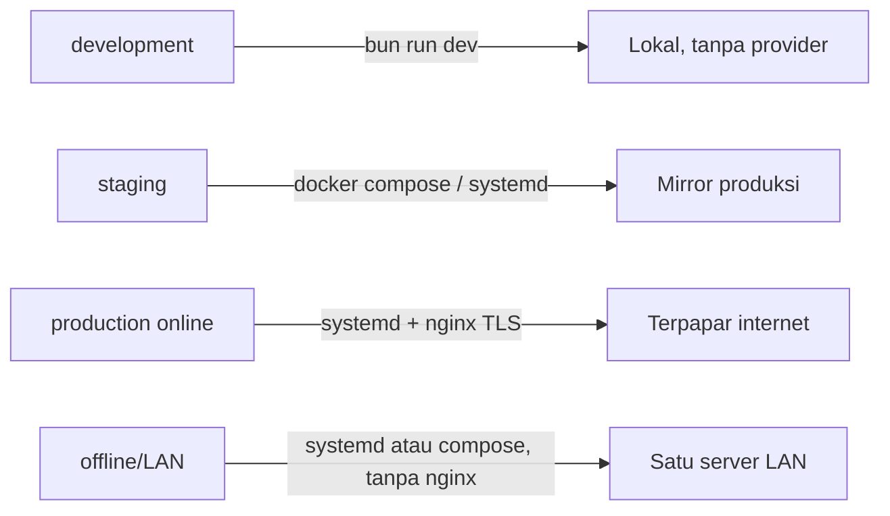

# Deployment Profiles

Dokumen ini mencatat implementasi profil deployment untuk Issue 12.2 (doc 18
§Profil per-environment, §Topologi deployment LAN-first, §Runtime & tooling
Bun-only). Melengkapi `docs/awcms-mini/18_configuration_env_reference.md`
dengan pemetaan konkret: berkas mana di `deploy/` dan `docker-compose.yml`
dipakai pada profil environment yang mana.

## Ringkasan



Empat profil (doc 18 §Profil per-environment) dan berkas `deploy/*` yang
relevan untuk masing-masing:

| Profil                  | Karakteristik (doc 18)                                                                                       | Berkas `deploy/`/root yang relevan                                                                                                                                                                                           |
| ----------------------- | ------------------------------------------------------------------------------------------------------------ | ---------------------------------------------------------------------------------------------------------------------------------------------------------------------------------------------------------------------------- |
| **development**         | Semua provider off, DB lokal, cookie tidak secure                                                            | `bun run dev` langsung (tidak perlu `deploy/*` atau `docker-compose.yml`); `.env` disalin dari `.env.example` apa adanya                                                                                                     |
| **staging**             | Meniru produksi, data uji, backup aktif                                                                      | Sama seperti production (di bawah), plus data/tenant uji                                                                                                                                                                     |
| **production (online)** | HTTPS, secret manager, backup+restore teruji, sync opsional                                                  | `deploy/systemd/awcms-mini.service.example`, `deploy/nginx/awcms-mini.conf.example` (TLS termination), `deploy/backup/*`, opsional `deploy/pgbouncer/*` bila banyak koneksi pendek                                           |
| **offline/LAN**         | Tanpa internet; sync/R2/WA/email off atau tertunda; POS/aplikasi operasional tetap jalan penuh; backup lokal | `deploy/systemd/awcms-mini.service.example` (atau `docker-compose.yml`) menjalankan app langsung di port 4321 — **nginx dapat dilewati sepenuhnya**, tidak ada eksposur publik; `deploy/backup/*` tetap wajib (backup lokal) |

Prinsip pemilihan: nginx (`deploy/nginx/`) hanya dibutuhkan saat butuh
terminasi TLS untuk klien di luar mesin/jaringan tepercaya atau saat
memfasadkan beberapa instance upstream — topologi LAN-first satu server
(doc 18) bisa langsung menyajikan aplikasi di port 4321 tanpa reverse
proxy sama sekali. PgBouncer (`deploy/pgbouncer/`) hanya untuk skenario
koneksi pendek bervolume tinggi (lihat
[`database-pooling.md`](database-pooling.md) §7) — bukan kebutuhan default.

## Cara menjalankan tiap profil

### development

```bash
cp .env.example .env
bun install
bun run db:migrate
bun run dev
```

### staging / production (online) — bare-metal (systemd)

```bash
bun install && bun run build
sudo cp deploy/systemd/awcms-mini.service.example /etc/systemd/system/awcms-mini.service
sudo cp deploy/nginx/awcms-mini.conf.example /etc/nginx/sites-available/awcms-mini.conf
# ... adaptasi placeholder di kedua berkas (lihat komentar header masing-masing) ...
sudo systemctl enable --now awcms-mini
sudo systemctl reload nginx
```

### offline/LAN — bare-metal (systemd, tanpa nginx)

Sama seperti di atas, minus langkah nginx — klien LAN mengakses aplikasi
langsung di `http://<ip-server-lan>:4321`.

### staging / production / offline-LAN — container (docker-compose.yml)

`docker-compose.yml` di root repo menjalankan stack LAN-first default:
`app` (image `oven/bun:1` — bukan `node`, sesuai doc 18 §Runtime & tooling)
dan `db` (`postgres:16`). PgBouncer tersedia sebagai service opsional
`pgbouncer`, digerbangi Compose `profiles` sehingga tidak pernah otomatis
aktif:

```bash
cp .env.example .env
export APP_UID=$(id -u) APP_GID=$(id -g)   # app berjalan sebagai user host, bukan root
docker compose up --build           # app + db saja
docker compose --profile pgbouncer up   # ikutkan pgbouncer opsional
curl http://localhost:4321/api/v1/health
```

`export APP_UID/APP_GID` wajib — tanpanya, `app` berjalan sebagai root di
dalam container dan `bun install`/`bun run build` menulis berkas
`node_modules/`/`dist/` bertahan sebagai milik root di repo hasil bind
mount, yang kemudian memblokir `bun install`/`bun run build` sisi **host**
pada checkout yang sama (ditemukan dan diperbaiki saat verifikasi live
issue ini — lihat komentar `user:` di `docker-compose.yml`).

Semua secret/config masuk lewat `env_file: .env` / `environment:` di
`docker-compose.yml` — tidak ada nilai hardcode (doc 10/18 "secret hanya
dari environment"). `DATABASE_URL` di-override otomatis oleh
`docker-compose.yml` agar menunjuk ke hostname service `db` (bukan
`localhost` seperti default `.env.example`, yang ditujukan untuk deployment
non-container) — lihat komentar di berkas itu.

## Validasi konfigurasi sebelum boot (`bun run config:validate`)

Doc 18 §Prinsip konfigurasi #5: "Konfigurasi tervalidasi saat boot; nilai
wajib yang hilang menghentikan start dengan pesan jelas." Issue 12.2
menambahkan `scripts/validate-env.ts` (`bun run config:validate`):

- Wajib non-kosong: `APP_ENV`, `APP_URL`, `APP_TIMEZONE`, `DATABASE_URL`,
  `AUTH_JWT_SECRET`.
- Kondisional: bila `AWCMS_MINI_SYNC_ENABLED=true`, maka
  `AWCMS_MINI_SYNC_HMAC_SECRET` wajib diisi dan bukan placeholder
  `.env.example` (`change-me`) — memakai ulang deteksi placeholder yang
  sama dengan `checkSyncHmacSecretNotDefault` di `scripts/security-readiness.ts`
  (Issue 10.3), bukan logika terpisah yang bisa menyimpang.
- Kondisional: bila `R2_ENABLED=true`, maka `R2_ACCOUNT_ID`,
  `R2_ACCESS_KEY_ID`, `R2_SECRET_ACCESS_KEY`, `R2_BUCKET` wajib diisi.
- Tidak pernah mencetak nilai secret asli — hanya nama variabel yang
  hilang/tidak valid. Exit code bukan nol bila ada kegagalan.

`bun run production:preflight` (Issue 10.3) menjalankan `config:validate`
sebagai tahap pertama, sebelum `db:migrate` — konfigurasi harus valid
sebelum ada percobaan koneksi/migrasi apa pun.

## Backup lokal (semua profil)

`deploy/backup/backup-postgres.sh` dan `deploy/backup/restore-postgres.sh`
— lihat [`../../deploy/backup/README.md`](../../deploy/backup/README.md)
untuk detail penggunaan, contoh crontab, dan model keamanan restore
(default selalu ke database uji sekali pakai, tidak pernah menimpa database
live tanpa flag `--target` eksplisit). Backup lokal wajib pada **semua**
profil non-development, termasuk offline/LAN (doc 18: "backup lokal").

## Lihat juga

- [`18_configuration_env_reference.md`](18_configuration_env_reference.md)
  — referensi environment variable lengkap dan topologi LAN-first.
- [`database-pooling.md`](database-pooling.md) — kapan PgBouncer relevan.
- [`07_sprint_testing_production_readiness.md`](07_sprint_testing_production_readiness.md)
  — checklist production readiness dan go-live plan.
- `.claude/skills/awcms-mini-production-preflight/SKILL.md` — command
  preflight lengkap termasuk `config:validate`.
