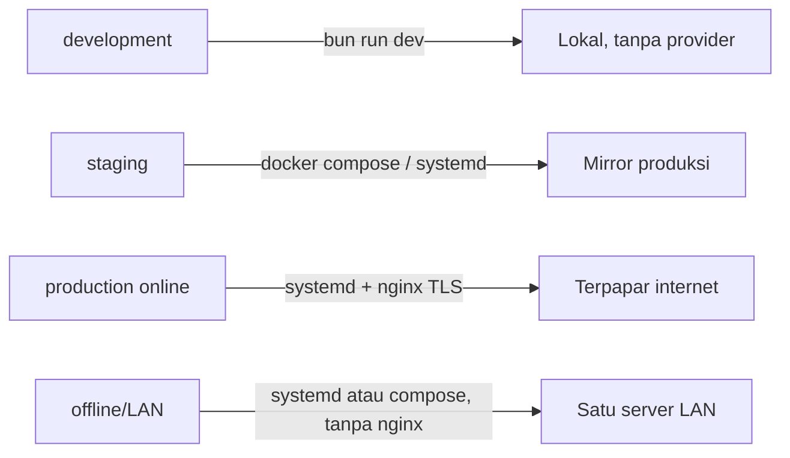
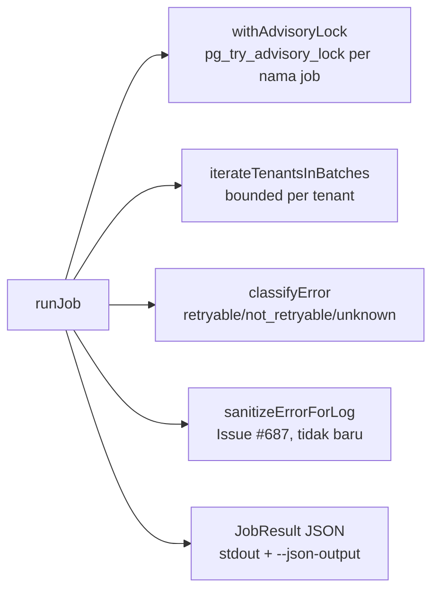

# Deployment Profiles

Dokumen ini mencatat implementasi profil deployment untuk Issue 12.2 (doc 18
§Profil per-environment, §Topologi deployment LAN-first, §Runtime & tooling
Bun-only). Melengkapi `docs/awcms-mini/18_configuration_env_reference.md`
dengan pemetaan konkret: berkas mana di `deploy/` dan `docker-compose.yml`
dipakai pada profil environment yang mana.

## Ringkasan



Empat profil (doc 18 §Profil per-environment) dan berkas `deploy/*` yang
relevan untuk masing-masing:

| Profil                  | Karakteristik (doc 18)                                                                                       | Berkas `deploy/`/root yang relevan                                                                                                                                                                                           |
| ----------------------- | ------------------------------------------------------------------------------------------------------------ | ---------------------------------------------------------------------------------------------------------------------------------------------------------------------------------------------------------------------------- |
| **development**         | Semua provider off, DB lokal, cookie tidak secure                                                            | `bun run dev` langsung (tidak perlu `deploy/*` atau `docker-compose.yml`); `.env` disalin dari `.env.example` apa adanya                                                                                                     |
| **staging**             | Meniru produksi, data uji, backup aktif                                                                      | Sama seperti production (di bawah), plus data/tenant uji                                                                                                                                                                     |
| **production (online)** | HTTPS, secret manager, backup+restore teruji, sync opsional                                                  | `deploy/systemd/awcms-mini.service.example`, `deploy/nginx/awcms-mini.conf.example` (TLS termination), `deploy/backup/*`, opsional `deploy/pgbouncer/*` bila banyak koneksi pendek                                           |
| **offline/LAN**         | Tanpa internet; sync/R2/WA/email off atau tertunda; POS/aplikasi operasional tetap jalan penuh; backup lokal | `deploy/systemd/awcms-mini.service.example` (atau `docker-compose.yml`) menjalankan app langsung di port 4321 — **nginx dapat dilewati sepenuhnya**, tidak ada eksposur publik; `deploy/backup/*` tetap wajib (backup lokal) |

Prinsip pemilihan: nginx (`deploy/nginx/`) hanya dibutuhkan saat butuh
terminasi TLS untuk klien di luar mesin/jaringan tepercaya atau saat
memfasadkan beberapa instance upstream — topologi LAN-first satu server
(doc 18) bisa langsung menyajikan aplikasi di port 4321 tanpa reverse
proxy sama sekali. PgBouncer (`deploy/pgbouncer/`) hanya untuk skenario
koneksi pendek bervolume tinggi (lihat
[`database-pooling.md`](database-pooling.md) §7) — bukan kebutuhan default.

## Profil online (public tenant routing) — config-only, Issue #556

Epic #555 menambahkan mode routing publik online-first di atas empat
profil di atas (bukan profil kelima yang terpisah — `production (online)`
tetap profil yang sama, sekarang bisa dikonfigurasi lebih eksplisit).
Issue #556 menambahkan env var (lihat
[`18_configuration_env_reference.md`](18_configuration_env_reference.md#public-routing-opsional-online-first--issue-556-epic-555)
§Public routing); schema tenant-domain (#557), module descriptor
`tenant_domain` (#558), resolver host-based (#559), dan rute publik
`/news` (#560) sudah menyusul dan sudah selesai — lihat
`.claude/skills/awcms-mini-tenant-domain-routing/SKILL.md` untuk status
lengkap per issue.

### Rute publik per profil — `/news` vs `/blog/{tenantCode}` (Issue #561)

Rute mana yang aktif secara _praktis_ untuk pengunjung anonim mengikuti
pilihan `PUBLIC_TENANT_RESOLUTION_MODE` di atas, bukan build/kode yang
berbeda — kedua rute (`/news` dan `/blog/{tenantCode}`) selalu ada di
setiap build (lihat `src/modules/blog-content/README.md` §`/news` (default)
vs `/blog/{tenantCode}` (legacy) dan
[ADR-0010](../adr/0010-public-host-tenant-routing.md)):

| Profil                                                                | Rute publik yang dipakai                                      | Resolusi tenant                                                                                                                                                            |
| --------------------------------------------------------------------- | ------------------------------------------------------------- | -------------------------------------------------------------------------------------------------------------------------------------------------------------------------- |
| **offline/LAN & development**                                         | `/blog/{tenantCode}` — legacy, tetap eksplisit tenant di path | Segmen path `tenantCode` (ADR-0009); `/news` tetap bisa diakses tapi hanya resolve lewat fallback env/setup default (langkah 2-4 resolver #559), tidak pernah host-mapping |
| **production (online)**, `PUBLIC_TENANT_RESOLUTION_MODE=host_default` | `/news` — default, tanpa `tenantCode` di path                 | `Host`/domain mapping (`awcms_mini_tenant_domains`, Issue #559); `/blog/{tenantCode}` tetap berfungsi paralel, tidak dinonaktifkan                                         |

Tidak ada redirect otomatis di antara keduanya dan `/blog/{tenantCode}`
**tidak** dihapus/dijadwalkan hapus pada profil mana pun — operator memilih
lewat konfigurasi env saja (`PUBLIC_TENANT_RESOLUTION_MODE`), bukan lewat
perubahan kode/build per profil. Deployment offline/LAN yang tidak pernah
men-set `PUBLIC_*` apa pun tetap berperilaku identik dengan sebelum epic
#555 ada.

- **offline/LAN & development**: biarkan `PUBLIC_TENANT_RESOLUTION_MODE`
  tidak di-set (default). `config:validate` tetap lulus tanpa var
  tambahan apa pun — tidak ada perubahan pada topologi LAN-first yang
  sudah didokumentasikan di atas. Ini **bukan** hal yang sama dengan
  men-set `PUBLIC_TENANT_RESOLUTION_MODE=tenant_code_legacy` secara
  eksplisit: unset tetap memakai fallback env/setup default untuk `/news`,
  sedangkan `tenant_code_legacy` eksplisit membuat `/news` tidak pernah
  resolve tenant apa pun (operator secara sadar memilih "wajib
  `tenantCode` eksplisit di path, tidak ada tebakan default" — keputusan
  Issue #560, lihat `src/lib/tenant/public-host-tenant-resolver.ts`).
- **production (online)**, saat resolver host-based (Issue #559) sudah
  siap dipakai: set `PUBLIC_TENANT_RESOLUTION_MODE=host_default` dan
  `PUBLIC_PLATFORM_ROOT_DOMAIN=<root-domain-platform>` di environment
  systemd/compose/registry image (lihat pola secret injection di
  `production (online) — image registry` di bawah — env var, bukan
  hardcode ke image).
- **`PUBLIC_TRUST_PROXY`**: default aman **wajib** `false`. Set `true`
  **hanya** bila deployment ini benar-benar berjalan di belakang reverse
  proxy tepercaya yang mengisi ulang `X-Forwarded-Host` secara aman —
  yaitu tepat topologi `deploy/nginx/awcms-mini.conf.example` (TLS
  termination) di baris "production (online)" pada tabel di atas. Jangan
  set `true` pada topologi offline/LAN yang melewati nginx sepenuhnya
  (baris "offline/LAN" di atas: "nginx dapat dilewati sepenuhnya") — tanpa
  proxy tepercaya di depan, header `X-Forwarded-Host` bisa dipalsukan
  klien mana pun, dan resolver host-based Issue #559
  (`src/lib/tenant/public-host-tenant-resolver.ts`) memakainya untuk
  menentukan tenant. **Wajib**: nginx (atau proxy tepercaya apa pun di
  posisi ini) harus dikonfigurasi untuk **menimpa (overwrite)**
  `X-Forwarded-Host` sepenuhnya, bukan meneruskan/append nilai dari klien
  — kalau nginx-nya salah konfigurasi (append), resolver mendeteksi lebih
  dari satu nilai comma-separated pada header dan sengaja fallback ke
  `Host` biasa (tidak menebak nilai kiri/kanan mana yang tepercaya),
  dicatat sebagai anomali di log; ini bukan pengganti memperbaiki
  konfigurasi proxy yang salah.

## Full-online auth security hardening (opsional, Issue #587-#593)

Gate terpisah dari profil routing publik di atas — **bukan** bagian dari
model deployment (`APP_ENV=production` sendiri **tidak** setara dengan
full-online; offline/LAN bisa production-grade secara operasional tanpa
pernah butuh fitur ini). Enam fitur online-only (Cloudflare Turnstile,
MFA/TOTP, Google OIDC login, generic tenant OIDC SSO, admin policy UI,
dan dokumentasi/kontrak penutup) semuanya digerbangi satu pasang var:
`AUTH_ONLINE_SECURITY_ENABLED` + `AUTH_ONLINE_SECURITY_PROFILE` (detail
lengkap: `18_configuration_env_reference.md` §Full-online auth security
hardening).

- **offline/LAN & development**: biarkan kedua var tidak di-set (default).
  `config:validate` lulus tanpa credential provider apa pun — login lokal
  berperilaku identik dengan sebelum epic #587 ada.
- **production (online)**, hanya bila operator benar-benar ingin
  mengaktifkan salah satu fitur hardening ini: set
  `AUTH_ONLINE_SECURITY_ENABLED=true` DAN
  `AUTH_ONLINE_SECURITY_PROFILE=full_online` — kombinasi lain gagal
  `config:validate`. Mengaktifkan gate ini sendiri tidak mengaktifkan fitur
  apa pun secara konkret; setiap fitur (#588-#592) punya flag env-nya
  sendiri di atas gate ini.
- **Cloudflare Turnstile (Issue #588, selesai)** adalah fitur pertama yang
  benar-benar diimplementasikan di atas gate ini: set tambahan
  `TURNSTILE_ENABLED=true` + `TURNSTILE_SITE_KEY`/`TURNSTILE_SECRET_KEY`
  untuk mengaktifkan bot protection di `POST /auth/login`,
  `/auth/password/forgot`, `/auth/password/reset`, dan
  `/setup/initialize`. `TURNSTILE_ENABLED` sendiri divalidasi independen
  dari gate `AUTH_ONLINE_SECURITY_*` (operator boleh isi credential
  Turnstile lebih dulu), tapi aktivasi runtime-nya tetap butuh keduanya.
- **MFA/TOTP (Issue #589, selesai)**: set tambahan `AUTH_MFA_ENABLED=true`
  - `AUTH_MFA_SECRET_ENCRYPTION_KEY` (base64, 32 byte AES-256 key) untuk
    mengaktifkan MFA/TOTP login challenge. Sama seperti Turnstile,
    `AUTH_MFA_ENABLED` divalidasi independen dari gate di atas, aktivasi
    runtime butuh keduanya. MFA **opt-in per identity** — mengaktifkan flag
    ini tidak memaksa MFA untuk identity yang belum pernah enroll
    (`POST /auth/mfa/totp/enroll/start` + `/enroll/verify`); identity dengan
    factor aktif akan dihentikan di `401 MFA_REQUIRED` saat login sampai
    menyelesaikan `POST /auth/mfa/totp/verify`.
- **Google OIDC login (Issue #590, selesai)**: set tambahan
  `AUTH_GOOGLE_LOGIN_ENABLED=true` + `AUTH_GOOGLE_CLIENT_ID`/
  `AUTH_GOOGLE_CLIENT_SECRET` (dari Google Cloud Console) untuk
  mengaktifkan tombol "Continue with Google" di `/login`. Sama seperti
  Turnstile/MFA, `AUTH_GOOGLE_LOGIN_ENABLED` divalidasi independen dari
  gate di atas, aktivasi runtime butuh keduanya. Provider account
  ditautkan via `sub` (subject OIDC), tidak pernah via email — auto-link
  by email hanya aktif bila operator eksplisit mengisi
  `AUTH_GOOGLE_ALLOWED_DOMAINS` (kosong = auto-link selalu ditolak). Bila
  Issue #589 (MFA) juga aktif untuk identity yang login lewat Google, MFA
  challenge tetap wajib diselesaikan sebelum session dibuat — Google
  login tidak pernah jadi jalan pintas melewati MFA.
- **Generic tenant OIDC SSO (Issue #591, selesai)**: set tambahan
  `AUTH_SSO_ENABLED=true` + `AUTH_SSO_CREDENTIAL_ENCRYPTION_KEY` (base64,
  32 byte AES-256 key, beda dari key MFA) untuk mengaktifkan
  `GET/POST /api/v1/auth/sso/{providerKey}/*`. Sama seperti fitur lain,
  `AUTH_SSO_ENABLED` divalidasi independen dari gate di atas, aktivasi
  runtime butuh keduanya. Berbeda dari Google (endpoint hardcoded), setiap
  provider (Okta, Azure AD, Keycloak, dst.) dikonfigurasi PER TENANT lewat
  admin API `/api/v1/identity/sso/providers` (issuer/client
  id/secret/scopes/allowed domains) — bukan env var deployment-wide;
  admin CRUD ini reachable regardless of gate ini (operator boleh
  provisioning provider lebih dulu). `sso_required=true`/
  `password_login_enabled=false` (`/api/v1/identity/sso/policy`) hanya
  bisa disimpan bila minimal satu break-glass local owner tetap tersedia
  — dicek di titik SAVE, bukan hanya login, supaya outage provider tidak
  pernah mengunci operator keluar dari akunnya sendiri. MFA (#589) tetap
  ditegakkan sama seperti Google.

  **Rekomendasi infra-layer untuk operator `full_online` (Issue #610,
  follow-up dari keputusan accepted-risk #603)**: `issuer_url` per-provider
  adalah data tenant-configured, bukan env server tepercaya (lihat skill
  `awcms-mini-auth-online-hardening` §SSRF/`issuer_url`) — sengaja TIDAK
  di-IP-range-block di level aplikasi supaya IdP on-prem enterprise
  tenant yang reachable lewat VPN privat tetap berfungsi. Karena profil
  `full_online` yang paling mungkin jalan di infrastruktur cloud, operator
  disarankan memblokir/membatasi egress container aplikasi ke endpoint
  metadata cloud (`169.254.169.254`) di level jaringan/firewall, atau
  menegakkan IMDSv2 dengan hop-limit=1 di sisi cloud provider — residual
  paling konkret untuk profil ini secara spesifik, di luar cakupan
  aplikasi (doc 20 §Batasan sudah menugaskan WAF/network policy ke
  lapisan deployment). Mitigasi app-level yang sudah ada: circuit breaker
  per `${tenantId}:${providerKey}` (bukan cuma per-`providerKey` — bug
  cross-tenant yang sudah ditemukan+diperbaiki, lihat skill
  `awcms-mini-auth-online-hardening` §SSRF/`issuer_url`) dan negative-TTL
  cache untuk percobaan discovery/JWKS yang gagal — keduanya HANYA
  membatasi percobaan gagal, sengaja TIDAK ada rate limit agregat
  HTTP-level di `/start` (draft awal sempat menambahnya, ditemukan sebagai
  DoS tanpa privilege oleh security-auditor, lalu dihapus — lihat skill
  yang sama untuk detail).

- **Admin policy UI (Issue #592, selesai)**: `/admin/security` — permukaan
  admin untuk melihat status keenam fitur di atas dan mengelola kebijakan
  auth (`sso_required`, `password_login_enabled`, break-glass identity list)
  serta CRUD provider tenant, tanpa endpoint API baru (memakai ulang #591's
  admin CRUD). Nonaktif di setiap deployment offline/LAN/local — hanya
  menampilkan info panel, tanpa form.
- **#593 (dokumentasi/kontrak/readiness penutup epic, selesai)**: penutup
  audit lintas #587-#592 ini sendiri. Satu readiness check baru yang dituntut
  eksplisit oleh issue ini: `bun run security:readiness`'s
  `checkSsoBreakGlassReady` (critical) mem-verifikasi ULANG dari database,
  di waktu readiness/go-live (bukan hanya di waktu kebijakan disimpan),
  bahwa setiap tenant dengan `sso_required=true` atau
  `password_login_enabled=false` masih punya minimal satu break-glass
  identity yang benar-benar eligible SEKARANG — operator yang menonaktifkan
  identity break-glass (atau mencabut tenant membership-nya) lewat aksi
  administratif LAIN setelah kebijakan disimpan tidak akan tertangkap oleh
  validasi save-time `saveTenantAuthPolicy` saja; jalankan
  `bun run security:readiness` secara berkala (bukan hanya sekali saat
  fitur ini pertama diaktifkan) untuk operator yang mengaktifkan
  `sso_required`/`password_login_enabled=false` di produksi.

## Visitor analytics (opsional, privacy-first — Issue #617-#624)

Modul `visitor_analytics` **default MATI di semua profil** sejak Issue
#624 repository audit addendum (2026-07-11) —
`VISITOR_ANALYTICS_ENABLED=false` kecuali operator secara eksplisit
mengaktifkannya (lihat `docs/awcms-mini/visitor-analytics.md` §Default
opt-in dan upgrade path untuk migration note deployment existing yang
sudah men-set var ini `true`). Statistik pengunjung agregat (human
pageviews, top paths/browsers/devices) sendiri tidak butuh koneksi
internet apa pun begitu diaktifkan — bekerja sama baik di offline/LAN
maupun online; hanya tiga sub-fitur yang benar-benar online-dependent
dan tetap default-mati begitu modul aktif
(`VISITOR_ANALYTICS_RAW_IP_ENABLED`/`_RAW_USER_AGENT_ENABLED`/
`_GEO_ENABLED`). Lihat `docs/awcms-mini/visitor-analytics.md` untuk
panduan lengkap privacy-first default, retensi, dan pemetaan kepatuhan;
ringkasan per profil:

- **offline/LAN & development**: set `VISITOR_ANALYTICS_ENABLED=true`
  saja bila statistik pengunjung dasar diinginkan (biarkan semua
  `VISITOR_ANALYTICS_*` lain tidak di-set). Dashboard `/admin/analytics`
  tetap berfungsi penuh tanpa IP mentah, user-agent mentah, atau
  geolokasi apa pun tersimpan — cocok untuk deployment yang tidak pernah
  tersambung internet publik. Bila var ini tidak pernah di-set, modul
  tetap sepenuhnya mati (tidak ada cookie, tidak ada baris session/event)
  — pilihan default yang aman untuk instalasi yang belum mengambil
  keputusan dasar hukum/tujuan pemrosesan.
- **staging/production (online), di belakang Cloudflare**: hanya bila
  operator memang menempatkan origin di belakang Cloudflare DAN
  memfirewall origin agar hanya bisa diakses lewat edge Cloudflare, boleh
  set `VISITOR_ANALYTICS_TRUST_CLOUDFLARE=true` untuk resolusi IP klien
  yang lebih akurat (`CF-Connecting-IP`) dan `VISITOR_ANALYTICS_GEO_ENABLED=true`
  untuk breakdown negara (`CF-IPCountry`, tanpa panggilan jaringan
  eksternal apa pun — lihat §Trusted proxy/Cloudflare mode di
  `visitor-analytics.md`). `bun run security:readiness`'s
  `checkVisitorAnalyticsGeoTrustedSourceReady` (Issue #624) gagal kalau
  geo diaktifkan tanpa trust Cloudflare — mencegah konfigurasi yang
  terlihat aktif tapi diam-diam tidak menghasilkan data apa pun.
- **staging/production (online), di belakang reverse proxy generik**
  (bukan Cloudflare): `VISITOR_ANALYTICS_TRUST_PROXY=true` untuk
  `X-Forwarded-For`, dengan syarat operasional yang sama dengan
  `PUBLIC_TRUST_PROXY` — proxy WAJIB menimpa (bukan menambahkan) header
  ini di setiap request.
- **Raw IP/raw user-agent** (`VISITOR_ANALYTICS_RAW_IP_ENABLED`/
  `_RAW_USER_AGENT_ENABLED`): default mati di semua profil, termasuk
  online — hanya nyalakan bila benar-benar dibutuhkan (mis. investigasi
  keamanan jangka pendek) dan `VISITOR_ANALYTICS_RAW_DETAIL_RETENTION_DAYS`
  tetap pendek (`bun run security:readiness`'s
  `checkVisitorAnalyticsRawIpRetentionReady`, critical, menolak retensi
  raw detail yang melebihi retensi event).
- **Job terjadwal** (`analytics:rollup`, `analytics:purge`) — lihat
  §Job registry lainnya di bawah untuk jadwal cron yang disarankan; kedua
  job aman dijalankan di profil offline/LAN sekalipun (operasi database
  lokal murni, tidak pernah memanggil provider eksternal).

## News portal full-online R2-only media (opsional, Issue #631)

Epic `news_portal` (Issue #631-#642, #649) menambah mode **full-online
R2-only** untuk gambar berita — mandat "gambar hanya di Cloudflare R2,
tidak pernah di filesystem lokal" **hanya berlaku bila mode ini
diaktifkan secara eksplisit**. Issue #631 (dokumentasi arsitektur,
selesai) mendefinisikan seluruh keputusan; Issue #632-#635 (implementasi
preset/registry/upload/readiness, belum dikerjakan) yang benar-benar
menambahkan env var `NEWS_MEDIA_R2_*` ke `.env.example`/doc 18 — lihat
`docs/awcms-mini/news-portal/full-online-r2-architecture.md` §4 untuk
konvensi penamaan lengkap dan
`.claude/skills/awcms-mini-news-portal/SKILL.md` untuk status per issue.

- **offline/LAN & development**: biarkan `NEWS_MEDIA_R2_ENABLED` tidak
  di-set (default, begitu #632 mengimplementasikannya). Mode ini
  **tidak berlaku** untuk offline/LAN — bukan sekadar default mati,
  tapi memang di luar cakupan penggunaan mode ini sama sekali (lihat
  `full-online-r2-architecture.md` §1).
- **production (online)**, hanya bila operator memang menjalankan
  portal berita publik dengan kredensial R2 aktif: aktifkan preset
  (Issue #632) dan pastikan bucket + kredensial R2 media **berbeda**
  dari `R2_BUCKET`/`R2_*` yang sudah dipakai `sync-storage` (§Storage di
  atas) — ini bukan rekomendasi, tapi penegakan wajib di
  `config:validate`/`security:readiness` begitu Issue #635 selesai
  (lihat `docs/awcms-mini/news-portal/r2-security-checklist.md` §7).
  Alasan pemisahan bucket: `sync-storage`'s R2 usage adalah object
  queue **privat** untuk sinkronisasi offline/LAN, sedangkan media
  berita **publik** by design (custom domain, CORS) — menyatukan
  keduanya berisiko membocorkan objek sync privat lewat konfigurasi
  publik yang ditujukan untuk media berita.
- **Tidak ada fallback lokal**: berbeda dari `STORAGE_DRIVER=local`
  (default base generik) yang tetap didukung penuh untuk kebutuhan lain,
  mode R2-only news media secara eksplisit **melarang** fallback
  filesystem lokal untuk gambar berita — kegagalan upload R2 gagal
  secara eksplisit ke editor, bukan diam-diam ditulis ke
  `LOCAL_STORAGE_PATH`.

## Cara menjalankan tiap profil

### development

```bash
cp .env.example .env
bun install
bun run db:migrate
bun run dev
```

### staging / production (online) — bare-metal (systemd)

```bash
bun install && bun run build
sudo cp deploy/systemd/awcms-mini.service.example /etc/systemd/system/awcms-mini.service
sudo cp deploy/nginx/awcms-mini.conf.example /etc/nginx/sites-available/awcms-mini.conf
# ... adaptasi placeholder di kedua berkas (lihat komentar header masing-masing) ...
sudo systemctl enable --now awcms-mini
sudo systemctl reload nginx
```

### offline/LAN — bare-metal (systemd, tanpa nginx)

Sama seperti di atas, minus langkah nginx — klien LAN mengakses aplikasi
langsung di `http://<ip-server-lan>:4321`.

### staging / production / offline-LAN — container (docker-compose.yml)

`docker-compose.yml` di root repo menjalankan stack LAN-first default:
`app` (image `oven/bun:1.3.14` — pinned, Issue #682, bukan `node`, sesuai
doc 18 §Runtime & tooling) dan `db` (`postgres:18.4`). PgBouncer tersedia
sebagai service opsional `pgbouncer`, digerbangi Compose `profiles`
sehingga tidak pernah otomatis aktif:

```bash
cp .env.example .env
export APP_UID=$(id -u) APP_GID=$(id -g)   # app berjalan sebagai user host, bukan root
docker compose up --build           # app + db saja
docker compose --profile pgbouncer up   # ikutkan pgbouncer opsional
curl http://localhost:4321/api/v1/health
```

**Container hardening (Issue #682)**: `db` dan `pgbouncer` tidak lagi
mempublikasikan port host secara default — hanya `app`'s `4321:4321`
tetap terbuka (satu-satunya kebutuhan topologi yang nyata). Untuk akses
`psql`/GUI client lokal dari host, salin
`docker-compose.override.yml.example` ke `docker-compose.override.yml`
(auto-loaded, sudah di-`.gitignore`) — mengikat kedua port ke
`127.0.0.1` saja. Semua service (`db`/`migrate`/`app`/`pgbouncer`) juga
menjalankan `cap_drop: [ALL]` (plus `cap_add` minimal untuk `db`'s
entrypoint sendiri: `CHOWN`/`FOWNER`/`SETUID`/`SETGID`/`DAC_OVERRIDE`,
live-verified sebagai set minimum yang dibutuhkan `postgres:18.4`),
`security_opt: no-new-privileges:true`, healthcheck, dan starting-point
`deploy.resources.limits` (disesuaikan per hardware operator, bukan
kebutuhan keras aplikasi). PgBouncer's `pgbouncer.ini.example` memakai
`auth_type = scram-sha-256` (bukan `md5`) — lihat
`deploy/pgbouncer/pgbouncer.ini.example`'s header comment untuk perintah
`userlist.txt` generation dari `pg_authid`.

`export APP_UID/APP_GID` wajib — tanpanya, `app` berjalan sebagai root di
dalam container dan `bun install`/`bun run build` menulis berkas
`node_modules/`/`dist/` bertahan sebagai milik root di repo hasil bind
mount, yang kemudian memblokir `bun install`/`bun run build` sisi **host**
pada checkout yang sama (ditemukan dan diperbaiki saat verifikasi live
issue ini — lihat komentar `user:` di `docker-compose.yml`).

Semua secret/config masuk lewat `env_file: .env` / `environment:` di
`docker-compose.yml` — tidak ada nilai hardcode (doc 10/18 "secret hanya
dari environment"). `DATABASE_URL` di-override otomatis oleh
`docker-compose.yml` agar menunjuk ke hostname service `db` (bukan
`localhost` seperti default `.env.example`, yang ditujukan untuk deployment
non-container) — lihat komentar di berkas itu.

Compose juga mewujudkan model dua-peran di bawah tanpa langkah manual:
service `migrate` (satu kali, sebagai superuser) menjalankan `db:migrate`,
service `app` menunggu `migrate` selesai
(`depends_on: … condition: service_completed_successfully`) lalu konek
sebagai peran least-privilege — jadi `docker compose up` mengurut sendiri:
`db` init membuat peran → `migrate` menerapkan skema + FORCE RLS + grant →
`app` mulai.

### production (online) — image registry (`Dockerfile.production` + `docker-compose.prod.yml`, opsional)

`docker-compose.yml` di atas **tetap jadi jalur yang direkomendasikan**
untuk topologi LAN-first satu-server (bind-mount + `bun install && bun run
build` saat container start — praktis untuk operator yang `git
pull`/rebuild in-place, lihat komentar header berkas itu). `Dockerfile.production`
(dipakai lewat `docker-compose.prod.yml` — Issue #682 — atau `docker
build`/`docker run` manual) adalah jalur **opsional lain**, untuk
deployment berbasis image registry (build sekali di CI, push image,
pull+run identik di tiap environment) — dipakai saat build-saat-startup
tidak diinginkan (cold start lebih lambat, image ingin immutable) atau
saat orkestrator (Coolify, k8s, ECS, dsb.) mengharapkan image siap-pakai,
bukan bind-mount sumber.

Perbedaan kunci vs `docker-compose.yml`'s `app` service:

| Aspek       | `docker-compose.yml` (`app`)                                | `docker-compose.prod.yml` (`app`) / `Dockerfile.production`                            |
| ----------- | ----------------------------------------------------------- | -------------------------------------------------------------------------------------- |
| Sumber kode | Bind-mount repo langsung (`volumes: - .:/app`)              | `COPY` ke dalam image saat build — immutable setelah dibuat                            |
| Build       | Saat container start (`bun install && bun run build`)       | Saat `docker build` (multi-stage) — start container jadi instan                        |
| User        | Host user (`APP_UID`/`APP_GID`) — perlu bind-mount writable | User bawaan image `oven/bun:1.3.14`, `bun` (non-root, uid 1000)                        |
| Filesystem  | Writable (bind mount + install/build di dalamnya)           | `read_only: true` + `tmpfs: [/tmp]` — live-verified aman, tidak ada tulis runtime lain |
| Migration   | Service `migrate` terpisah dalam compose yang sama          | Tidak disertakan — jalankan `bun run db:migrate` terpisah (lihat di bawah)             |
| Cocok untuk | LAN-first satu server, operator `git pull` in-place         | Registry/CI-push, orkestrator container (Coolify/k8s/ECS)                              |

Dua cara menjalankan image ini — pilih salah satu:

**1. `docker-compose.prod.yml` (disarankan, Issue #682)** — stack
standalone (bukan override `docker-compose.yml`) yang membangun `app`
dari `Dockerfile.production` dan menjalankan `db` dengan hardening yang
sama seperti `docker-compose.yml`'s `db`:

```bash
cp .env.example .env
bun run db:migrate   # atau docker run sekali pakai, lihat di bawah — jalankan SEBELUM app start
docker compose -f docker-compose.prod.yml up -d --build
curl http://localhost:4321/api/v1/health
```

`app` di sini berjalan `read_only: true` (`tmpfs: [/tmp]`) — live-verified
aman karena image ini tidak pernah menulis ke filesystem-nya sendiri saat
runtime (tidak ada bind-mount install/build seperti `docker-compose.yml`).
Untuk deploy dari image yang sudah di-push ke registry (bukan build
lokal), ganti blok `build:` pada `app` di `docker-compose.prod.yml`
dengan `image: <registry>/awcms-mini:<tag>` langsung.

**2. `docker build`/`docker run` manual** — untuk orkestrator yang tidak
memakai Compose (Coolify, k8s, ECS, dst., lihat [`deploy-coolify.md`](deploy-coolify.md)):

```bash
docker build -f Dockerfile.production -t awcms-mini:prod .
docker run -d --name awcms-mini \
  -p 4321:4321 \
  --cap-drop=ALL --security-opt=no-new-privileges:true \
  -e DATABASE_URL=postgres://awcms_mini_app:<password>@<db-host>:5432/awcms-mini \
  -e AUTH_JWT_SECRET=<secret> \
  -e AUTH_COOKIE_SECURE=true \
  -e APP_ENV=production \
  awcms-mini:prod
curl http://localhost:4321/api/v1/health
```

`--cap-drop=ALL --security-opt=no-new-privileges:true` (Issue #682) —
live-verified safe, no `--cap-add` needed for the running app.

Secret (`DATABASE_URL`, `AUTH_JWT_SECRET`, HMAC sync, kredensial R2, dst.)
**selalu** disuntikkan saat `docker run`/lewat orkestrator (env var, secret
store, atau `--env-file`) — **tidak pernah** dibakar ke dalam image.
`.dockerignore` mengecualikan `.env`/`.env.*` dari build context sehingga
`.env` lokal operator tidak mungkin ikut ter-cache di satu layer. Untuk
orkestrator yang mendukung file secret (Docker Swarm secrets, Kubernetes
Secrets sebagai volume mount, dsb.), pola `_FILE` suffix (baca path dari
`AUTH_JWT_SECRET_FILE` alih-alih nilai plaintext `AUTH_JWT_SECRET`) adalah
alternatif standar industri — **belum diimplementasikan di kode aplikasi
ini** (`src/lib/config` membaca env var biasa, bukan `_FILE` variants);
operator yang butuh ini hari ini bisa mem-bridge di level orkestrator
(mis. entrypoint script yang membaca file secret lalu `export`
env var biasa sebelum `exec bun ...`) tanpa mengubah image. Lihat
§Secrets via deployment references di bawah untuk detail.

Image ini **tidak** menjalankan migration — peran runtime-nya
(`awcms_mini_app`, least-privilege) tidak punya hak DDL/GRANT yang
migration butuhkan (model dua-peran di bawah). Jalankan `bun run
db:migrate` sebagai langkah terpisah (job CI, atau `docker run` sekali
pakai dengan `DATABASE_URL` privileged) terhadap database baru sebelum
container ini pertama kali dijalankan.

## TLS/trust boundaries (Issue #682)

Aplikasi ini **tidak pernah** melakukan terminasi TLS sendiri (tidak ada
kode HTTPS listener) — di setiap topologi, TLS (bila ada) adalah
tanggung jawab lapisan **di depan** aplikasi:

| Topologi                                                                            | Di mana TLS berhenti                                                                                                   | Trust boundary                                                                                                                                                                  |
| ----------------------------------------------------------------------------------- | ---------------------------------------------------------------------------------------------------------------------- | ------------------------------------------------------------------------------------------------------------------------------------------------------------------------------- |
| **offline/LAN**                                                                     | Tidak ada TLS — `http://` langsung ke port 4321                                                                        | Batas kepercayaan = jaringan LAN itu sendiri (fisik/WiFi tepercaya); tidak ada eksposur internet, doc 07 "PostgreSQL tidak public" berlaku sama untuk app port ini              |
| **production (online), bare-metal**                                                 | `deploy/nginx/awcms-mini.conf.example` (reverse proxy TLS termination)                                                 | Publik ↔ nginx = batas TLS; nginx ↔ app (`localhost:4321`) = plaintext HTTP di **dalam** mesin yang sama, tidak melewati jaringan                                               |
| **production (online), container (`docker-compose.yml`/`docker-compose.prod.yml`)** | Reverse proxy di **luar** compose stack (nginx/Caddy/Coolify's built-in proxy) — compose sendiri tidak menyediakan TLS | Publik ↔ reverse proxy = batas TLS **hanya jika** reverse proxy benar-benar satu-satunya jalur masuk — lihat catatan port `app` di bawah, ini **berbeda** dari `db`/`pgbouncer` |
| **PostgreSQL (`db`)/PgBouncer**                                                     | Tidak ada TLS by default (`sslmode` tidak dipaksa) — koneksi Postgres dalam Docker network internal                    | Trust boundary = Docker network compose itu sendiri (Issue #682: `db`/`pgbouncer` tidak publish port host, jadi tidak reachable dari luar mesin sama sekali)                    |

Implikasi operasional:

- **Beda penting dari `db`/`pgbouncer`**: Issue #682 membuat `db`/`pgbouncer`
  TIDAK publish port host secara default (aman-by-default) — `app`'s
  `ports: ["4321:4321"]` TIDAK diubah oleh issue ini dan **tetap terikat
  ke semua interface (`0.0.0.0`) secara default** di kedua compose file,
  persis seperti sebelum #682. Ini **bukan** berarti aman dijangkau
  reverse proxy saja — pada host dengan IP publik/LAN yang tidak
  sepenuhnya tepercaya, klien mana pun bisa langsung menghubungi
  `http://<host>:4321`, melewati reverse proxy TLS sepenuhnya. **Jangan
  pernah** expose `app`'s port 4321 langsung ke internet publik tanpa
  reverse proxy TLS di depannya — `AUTH_COOKIE_SECURE=true` (wajib untuk
  profil online, lihat `.env.example`) mengasumsikan klien browser
  benar-benar bicara HTTPS ke suatu titik; tanpa TLS termination, cookie
  secure dikirim lewat kanal plaintext (dan body request pertama seperti
  password login terkirim plaintext apa pun status cookie-nya, bila klien
  memang menghubungi port ini langsung), membatalkan proteksinya.
  Mitigasi ini **wajib** di level firewall/jaringan host (operator), bukan
  sesuatu yang compose file mana pun di repo ini tegakkan otomatis — mis.
  `ufw`/`iptables` yang hanya mengizinkan port 4321 dari `localhost`/IP
  reverse proxy, bukan dari internet umum. Operator yang ingin compose
  sendiri menegakkan ini bisa mengikat `ports: ["127.0.0.1:4321:4321"]`
  bila reverse proxy berjalan di mesin yang sama di luar Docker.
- `PUBLIC_TRUST_PROXY`/`VISITOR_ANALYTICS_TRUST_PROXY` (lihat §Profil
  online dan §Visitor analytics di atas) HANYA aman di-set `true` tepat
  pada topologi baris "production (online)" di tabel ini — reverse proxy
  TLS yang menimpa (bukan menambahkan) `X-Forwarded-*` adalah prasyarat,
  bukan opsional.
- Koneksi `app`↔`db`/`pgbouncer` plaintext-dalam-Docker-network diterima
  sebagai batas kepercayaan yang memadai **karena** #682 memastikan
  jaringan itu tidak pernah reachable dari luar mesin (tidak ada host
  port publish default) — bila operator menjalankan `db` di mesin
  terpisah dari `app` (topologi multi-server, di luar cakupan
  `docker-compose.yml`/`docker-compose.prod.yml` bawaan), TLS Postgres
  (`sslmode=require` pada `DATABASE_URL` + sertifikat server Postgres)
  menjadi tanggung jawab operator — tidak disediakan otomatis oleh
  compose file mana pun di repo ini.

## Secrets via deployment references (Issue #682)

Konvensi default repo ini (doc 10/18 "secret hanya dari environment"):
env var langsung (`${VAR:-default}` substitution di compose,
`environment:`/`env_file:` di container, atau variabel shell/systemd
`EnvironmentFile=` di bare-metal) — **tidak pernah** hardcode ke file
yang di-commit. Ini tetap jalur yang didukung penuh dan direkomendasikan
untuk topologi LAN-first/single-server di repo ini.

Untuk orkestrator yang menyediakan mekanisme secret-at-rest terenkripsi
sendiri (Docker Swarm `secrets:`, Kubernetes `Secret` sebagai volume
mount, Coolify's secret manager, HashiCorp Vault, dsb.), env var biasa
tetap bisa dipakai — orkestrator-orkestrator ini pada praktiknya
menyuntikkan secret **sebagai** env var runtime (bukan file) ke
container, jadi tidak ada perubahan yang dibutuhkan pada sisi aplikasi.
Untuk orkestrator yang secara spesifik mewajibkan pola **file-based**
(mis. Docker Swarm secrets di-mount sebagai file di
`/run/secrets/<name>`, bukan env var) — aplikasi ini **belum**
mengimplementasikan pembacaan `_FILE`-suffixed env var (`AUTH_JWT_SECRET_FILE`,
dsb.) secara native. Operator pada topologi ini punya dua opsi:

1. **Bridge di entrypoint** (disarankan, tidak perlu ubah image/kode
   aplikasi): tulis skrip entrypoint kecil yang membaca file secret dari
   `/run/secrets/*`, `export` sebagai env var biasa, lalu `exec` command
   aslinya — dijalankan sebagai override `command:`/`entrypoint:` di
   level orkestrator, bukan dibakar ke `Dockerfile.production`.
2. **Env var langsung dari secret store orkestrator** (paling sederhana
   bila orkestratornya mendukung, mis. Coolify/k8s `Secret` sebagai env
   var, bukan volume) — tidak butuh perubahan apa pun.

Tidak ada rencana menambah `_FILE` variant generik untuk semua secret di
kode aplikasi kecuali ada kebutuhan orkestrator konkret yang tidak bisa
dipenuhi kedua opsi di atas — menghindari permukaan konfigurasi ganda
(env var biasa DAN `_FILE` variant untuk setiap secret) yang harus
dijaga tetap konsisten tanpa manfaat nyata untuk topologi yang benar-benar
dipakai repo ini hari ini.

## Model dua-peran basis data (RLS enforcement)

Isolasi antar-tenant memakai PostgreSQL Row-Level Security (ADR-0003).
`ENABLE ROW LEVEL SECURITY` saja **tidak cukup**: PostgreSQL melewati RLS
untuk _pemilik_ tabel (kecuali `FORCE`) dan tanpa syarat untuk peran
SUPERUSER/BYPASSRLS. Karena itu deployment memakai dua peran (lihat
`sql/013`):

- **Peran migrasi (privileged owner/superuser)** — menjalankan
  `bun run db:migrate`. Butuh hak DDL/GRANT. Ini `POSTGRES_USER` di
  `docker-compose.yml` / URL privileged yang Anda pakai sekali untuk migrasi.
- **Peran aplikasi `awcms_mini_app` (least-privilege)** — peran yang
  di-koneksi aplikasi saat runtime (`DATABASE_URL` di `.env`). Bukan owner,
  bukan superuser, hanya grant DML; migrasi 013 menerapkan
  `FORCE ROW LEVEL SECURITY` pada 31 tabel tenant + default GUC fail-closed
  (`app.current_tenant_id` = UUID nol → tak cocok tenant mana pun → 0 baris)
  sehingga RLS benar-benar ditegakkan untuk peran ini.

Menjalankan aplikasi sebagai superuser membatalkan seluruh isolasi RLS —
`bun run security:readiness` sekarang **memblokir go-live** bila peran koneksi
`DATABASE_URL` ternyata superuser/BYPASSRLS, atau bila ada tabel tenant tanpa
`relforcerowsecurity` (cek "App DB connection role does not bypass RLS" dan
"RLS enabled AND forced on tenant-scoped tables"). Jalankan readiness dengan
`DATABASE_URL` peran aplikasi, bukan URL migrasi.

Membuat peran aplikasi:

- **Container:** otomatis — `deploy/postgres/10-create-app-role.sh` (hook
  `/docker-entrypoint-initdb.d`) membuatnya dari `AWCMS_MINI_APP_DB_PASSWORD`
  saat init cluster pertama, lalu migrasi 013 memberi grant + FORCE RLS.
- **Bare-metal/systemd:** sekali di awal, sebagai superuser —
  `CREATE ROLE awcms_mini_app LOGIN PASSWORD '…';` — lalu `bun run db:migrate`
  (URL superuser). Setelah itu app konek sebagai `awcms_mini_app`
  (`DATABASE_URL` di `.env`). Lihat `.env.example` §Database.

Sejak Issue #683 (epic #679), migrasi 045 menambah DUA peran OPSIONAL di
atas fondasi dua-peran ini — `awcms_mini_worker` (7 script background,
`WORKER_DATABASE_URL`) dan `awcms_mini_setup` (hanya
`POST /api/v1/setup/initialize`, `SETUP_DATABASE_URL`) — keduanya
fallback ke `DATABASE_URL`/`awcms_mini_app` bila tidak di-set, jadi
model dua-peran di atas tetap fondasi minimum yang wajib; dua peran
tambahan ini murni defense-in-depth opsional. Lihat
`docs/awcms-mini/18_configuration_env_reference.md` §Model role database
dan `sql/045_awcms_mini_db_role_separation.sql`'s header untuk detail
lengkap.

## Validasi konfigurasi sebelum boot (`bun run config:validate`)

Doc 18 §Prinsip konfigurasi #5: "Konfigurasi tervalidasi saat boot; nilai
wajib yang hilang menghentikan start dengan pesan jelas." Issue 12.2
menambahkan `scripts/validate-env.ts` (`bun run config:validate`):

**Config registry & deprecated vars (Issue #689, epic #679
platform-hardening)**: `src/lib/config/registry.ts` adalah sumber
kebenaran terstruktur untuk setiap variabel di bawah — lihat doc 18
§Config registry untuk field lengkap (type/required/owner/sensitivity/
profiles/deprecation) dan tabel enam variabel yang ditandai `deprecated`
(termasuk `AUTH_JWT_SECRET` yang masih disebut di §"production (online) —
image registry" dan §"Secrets via deployment references" di bawah — masih
WAJIB diisi untuk rilis ini demi kompatibilitas, meski sudah diverifikasi
tidak pernah dibaca kode apa pun karena sesi memakai token opaque, bukan
JWT). `bun run config:docs:check` (bagian dari `bun run check`) menjaga
registry ini, `.env.example`, dan doc 18 tetap sinkron.

- Wajib non-kosong: `APP_ENV`, `APP_URL`, `APP_TIMEZONE`, `DATABASE_URL`,
  `AUTH_JWT_SECRET`.
- Kondisional: bila `AWCMS_MINI_SYNC_ENABLED=true`, maka
  `AWCMS_MINI_SYNC_HMAC_SECRET` wajib diisi dan bukan placeholder
  `.env.example` (`change-me`) — memakai ulang deteksi placeholder yang
  sama dengan `checkSyncHmacSecretNotDefault` di `scripts/security-readiness.ts`
  (Issue 10.3), bukan logika terpisah yang bisa menyimpang.
- Kondisional: bila `R2_ENABLED=true`, maka `R2_ACCOUNT_ID`,
  `R2_ACCESS_KEY_ID`, `R2_SECRET_ACCESS_KEY`, `R2_BUCKET` wajib diisi.
- Kondisional (Issue #556, epic #555 — config-only, lihat §Profil online
  di bawah): bila `PUBLIC_TENANT_RESOLUTION_MODE` diisi, nilainya harus
  salah satu dari `host_default`/`env_default`/`setup_default`/
  `tenant_code_legacy`; `host_default` mewajibkan
  `PUBLIC_PLATFORM_ROOT_DOMAIN`, `env_default` mewajibkan minimal salah
  satu dari `PUBLIC_DEFAULT_TENANT_ID`/`PUBLIC_DEFAULT_TENANT_CODE`.
  `PUBLIC_CANONICAL_BASE_PATH`, bila diisi, harus absolute path (diawali
  `/`). Var ini semua **tidak wajib** untuk profil offline/LAN —
  meninggalkannya kosong tetap lulus `config:validate` (perilaku default
  legacy `/blog/{tenantCode}` tidak berubah).
- Tidak pernah mencetak nilai secret asli — hanya nama variabel yang
  hilang/tidak valid. Exit code bukan nol bila ada kegagalan.

`bun run production:preflight` (Issue 10.3) menjalankan `config:validate`
sebagai tahap pertama, sebelum `db:migrate` — konfigurasi harus valid
sebelum ada percobaan koneksi/migrasi apa pun.

## Dispatcher email terjadwal (`bun run email:dispatch`, Issue #499)

`scripts/email-dispatch.ts` (`bun run email:dispatch`) adalah CLI
terjadwal, **bukan** endpoint HTTP — sama persis pola
`scripts/object-sync-dispatch.ts` yang sudah didokumentasikan di
`src/modules/sync-storage/README.md`. Tidak melakukan apa pun (exit 0,
tanpa efek) bila `EMAIL_ENABLED` bukan `"true"` — profil mana pun yang
mematikan email (mis. offline/LAN) aman menjalankan perintah ini tanpa
efek samping.

| Profil                                       | Cara menjadwalkan                                                                                                                                                                                             |
| -------------------------------------------- | ------------------------------------------------------------------------------------------------------------------------------------------------------------------------------------------------------------- |
| **development**                              | Jalankan manual sesuai kebutuhan: `bun run email:dispatch`. `EMAIL_ENABLED` biasanya `false` di `.env` dev (lihat `.env.example`) — tidak perlu dijadwalkan sama sekali.                                      |
| **offline/LAN**                              | Email biasanya off atau tertunda (doc 18 §Profil per-environment "sync/R2/WA/email off atau tertunda"). Bila diaktifkan (mis. mail relay lokal), jadwalkan seperti profil systemd di bawah.                   |
| **staging/production (bare-metal, systemd)** | `cron` atau systemd timer terpisah dari service utama (`awcms-mini.service`) — lihat contoh crontab di bawah.                                                                                                 |
| **container (`docker-compose.yml`)**         | Jalankan sebagai `docker compose exec app bun run email:dispatch` lewat cron host, atau tambahkan service terjadwal terpisah (lihat contoh compose exec di bawah).                                            |
| **Coolify/VPS**                              | Scheduled Task Coolify (bila tersedia) atau cron di VPS yang menjalankan `docker exec <container-app> bun run email:dispatch` — lihat [`deploy-coolify.md`](deploy-coolify.md) §Dispatcher terjadwal (email). |

Contoh crontab (bare-metal/systemd, setiap 2 menit):

```cron
*/2 * * * * cd /opt/awcms-mini && /usr/local/bin/bun run email:dispatch >> /var/log/awcms-mini/email-dispatch.log 2>&1
```

Contoh untuk topologi container (`docker-compose.yml`), dari cron host:

```cron
*/2 * * * * cd /opt/awcms-mini && docker compose exec -T app bun run email:dispatch >> /var/log/awcms-mini/email-dispatch.log 2>&1
```

Catatan operasional:

- **Idempoten/aman dijalankan berulang** — pola claim-lease
  (`FOR UPDATE SKIP LOCKED`, Issue #495) membuat pemanggilan bersamaan
  atau tumpang tindih aman; tidak ada baris yang terkirim dua kali.
- **Retry/backoff tidak menjadi spam-loop**: entri yang gagal masuk
  `retry_wait` dengan `next_attempt_at` mundur eksponensial
  (`../../src/modules/email/domain/email-retry.ts`) sebelum diklaim lagi —
  interval jadwal cron (mis. 2 menit) jauh lebih sering daripada
  `next_attempt_at` pada percobaan lanjut, jadi dispatcher hanya
  benar-benar memanggil provider lagi setelah jendela backoff lewat, bukan
  di setiap tick cron.
- **Circuit breaker provider terbuka**: bila provider (mis. Mailketing)
  sedang outage, `dispatchEmailQueue` berhenti mengklaim apa pun sampai
  breaker pulih (`email.dispatch.breaker_open`, warning log) — cron tetap
  jalan setiap tick tanpa efek, tidak menambah beban ke provider yang
  sedang down.
- **Multi-instance**: jadwalkan hanya dari **satu** instance/cron entry per
  deployment (claim-lease aman terhadap tumpang tindih, tapi menjadwalkan
  dari banyak host sekaligus tetap pemborosan resource tanpa manfaat).

## Job registry lainnya (Issue #519)

Selain `email:dispatch` di atas, Module Management (epic #510) sekarang
mendaftarkan seluruh command operasional lain sebagai metadata trusted
per modul (`ModuleDescriptor.jobs`, dibaca lewat
`GET /api/v1/modules/{moduleKey}/jobs`) — lihat
`src/modules/module-management/README.md` §Module job registry untuk
daftar lengkap dan alasan tiap job dimiliki modul mana. Dua kategori:

**Dispatcher/purge terjadwal berulang** — pola cron identik dengan
`email:dispatch` di atas (ganti nama command pada contoh crontab),
idempoten/aman dijalankan berulang, no-op aman bila fiturnya nonaktif:

| Command                        | Modul                | Jadwal disarankan                                                     |
| ------------------------------ | -------------------- | --------------------------------------------------------------------- |
| `sync:objects:dispatch`        | sync_storage         | Setiap 1-2 menit                                                      |
| `logs:audit:purge`             | logging              | Harian                                                                |
| `form-drafts:purge`            | form_drafts          | Harian                                                                |
| `analytics:rollup`             | visitor_analytics    | Harian (mis. 00:15, setelah hari UTC sebelumnya selesai)              |
| `analytics:purge`              | visitor_analytics    | Harian, setelah `analytics:rollup`                                    |
| `news-media:reconcile`         | news_portal          | Harian (Issue #690)                                                   |
| `domain-events:dispatch`       | domain_event_runtime | Setiap 30-60 detik (Issue #742)                                       |
| `data-lifecycle:archive-purge` | data_lifecycle       | Harian (Issue #745, lihat §Data lifecycle archive/purge job di bawah) |

Semua bersifat operasi database murni (kecuali `sync:objects:dispatch`
yang menyentuh R2 bila `STORAGE_DRIVER` bukan `local`, dan
`news-media:reconcile` yang menyentuh R2 bila `NEWS_MEDIA_R2_ENABLED`
adalah `"true"`) — aman dijadwalkan di profil offline/LAN sekalipun,
termasuk kedua job visitor analytics: baik rollup maupun purge murni
membaca/menulis tabel
`awcms_mini_visit_events`/`awcms_mini_visitor_sessions`/
`awcms_mini_visitor_daily_rollups` lokal, tidak pernah memanggil provider
eksternal (lihat `docs/awcms-mini/visitor-analytics.md` §Rollup dan §Purge
untuk detail perilaku dan idempotency). `news-media:reconcile` sendiri
TIDAK berguna di profil offline/LAN murni (`NEWS_MEDIA_R2_ENABLED` selalu
`false` di sana) — aman dijadwalkan di mana saja karena no-op sepenuhnya
saat fiturnya nonaktif, tapi hanya benar-benar melakukan sesuatu di
deployment full-online dengan R2-only news media aktif
(`docs/awcms-mini/news-portal/r2-backup-lifecycle.md` §Operator SOP).

`domain-events:dispatch` (Issue #742) adalah operasi PostgreSQL/in-process
murni — tidak ada broker eksternal wajib, tidak ada panggilan jaringan
sama sekali untuk dua reference consumer bawaan modul ini — aman
dijadwalkan di profil offline/LAN tanpa syarat, beda dari
`sync:objects:dispatch`/`news-media:reconcile` di atas. Jadwal 30-60 detik
lebih rapat dari dispatcher lain di tabel ini karena outbox generik ini
dirancang untuk fan-out lintas-consumer dengan ordering per-key — backlog
yang menumpuk pada satu consumer/aggregate memblokir HANYA aggregate itu
sendiri (lihat `src/modules/domain-event-runtime/README.md` §Ordering),
jadi interval pendek menjaga lag tetap rendah tanpa risiko menghantam
provider eksternal (tidak ada).

`analytics:rollup` (Issue #624) tanpa argumen merangkum "kemarin" (UTC) —
`--date=YYYY-MM-DD` untuk satu tanggal spesifik atau
`--start-date=.../--end-date=...` untuk backfill rentang tanggal; aman
dijalankan ulang untuk tanggal yang sama (UPSERT penuh, bukan increment).
`analytics:purge` (Issue #624) memanggil
`purgeVisitorAnalyticsData` yang sama dengan
`POST /api/v1/analytics/retention/purge` (Issue #621) untuk setiap tenant
`active`, dan mencatat audit `critical` `retention_purged` hanya untuk
tenant yang benar-benar memiliki baris terhapus/dibersihkan — jadwalkan
setelah `analytics:rollup` supaya data yang akan dipurge sudah
teragregasi lebih dulu.

**On-demand/manual (bukan cron berulang)** — dijalankan operator sesuai
kebutuhan, bukan dijadwalkan terus-menerus:

- `email:provider:health` — smoke-test manual/deployment, butuh akses
  jaringan nyata ke provider.
- `email:templates:seed-defaults` — sekali per tenant, biasanya tepat
  setelah Setup Wizard.
- `security:readiness` — sebelum go-live, dan periodik (mis. mingguan) di
  staging/production untuk mendeteksi drift.
- `config:validate`/`production:preflight` — sebelum setiap deploy (lihat
  §Validasi konfigurasi sebelum boot di atas).

## Shared worker runner (Issue #697)

Sebelum Issue #697, setiap `scripts/*.ts` di atas mengimplementasikan sendiri
pola yang sama: iterasi tenant, correlation id, bounded batching per
tenant, dan exit code — masing-masing sedikit berbeda. `src/lib/jobs/`
sekarang menyediakan runner generik yang mengekstrak pola itu jadi satu
implementasi, dipakai secara **opsional dan inkremental** — script yang
belum dimigrasi (`sync:objects:dispatch`, `email:dispatch`,
`blog:publish:scheduled`, `form-drafts:purge`, `analytics:rollup`,
`analytics:purge`) **tetap valid, tidak wajib migrasi sekaligus**. Dua job
representatif sudah dimigrasi sebagai bukti: `logs:audit:purge` (tenant-
iterating maintenance job dengan bounded batching) dan `modules:sync`
(non-tenant-loop job, upsert registry global).

`news-media:reconcile` (Issue #690) adalah job BARU yang dibangun
langsung di atas runner ini sejak awal (bukan migrasi dari script lama)
— pola yang sama: advisory lock per nama job, `--dry-run`,
`--json-output=<path>`, `runJob`'s exit-code contract. Sekaligus contoh
ketiga penggunaan `iterateTenantsInBatches`-adjacent pattern: satu
tenant per satu waktu (bukan bounded-pass-per-tenant seperti
`logs:audit:purge`, karena unit kerjanya adalah "satu listing R2 + satu
kategorisasi" per tenant, bukan "hapus N baris per pass") tapi tetap
tidak pernah memproses lebih dari satu tenant sekaligus, dan satu
tenant yang gagal listing R2 (outage) tidak pernah menghentikan tenant
lain (lihat `news-media-reconciliation.ts`'s own header dan
`docs/awcms-mini/news-portal/r2-backup-lifecycle.md` §Operator SOP).



**Modul:**

- `src/lib/jobs/job-runner.ts` — `runJob(definition, options)`: menjalankan
  `definition.handler` di bawah advisory lock per nama job, timeout
  (`timeoutMs`, default 15 menit), dan cancellation SIGTERM/SIGINT-aware,
  mengembalikan `JobResult` terstruktur (tidak pernah `throw`) —
  `status`: `success` | `partial` | `failed` | `skipped` | `timeout` |
  `terminated`. `applyJobExitCode(result)` menerapkan exit-code contract (0
  untuk `success`/`skipped`, 1 untuk sisanya) — sama seperti pola
  `process.exitCode = 1` yang sudah dipakai script existing.
  `printJobTelemetry`/`writeJobTelemetry(result, jsonOutputPath)` mencetak
  JSON, opsional ke file (pola `--json-output=<path>` yang sama dengan
  `scripts/production-preflight.ts`, Issue #684).
  `parseJobCliArgs(argv)` mem-parse `--dry-run`/`--json-output=<path>`.
  **Pelepasan lock pada timeout/terminasi (diperbaiki di PR #713, temuan
  High security-auditor)**: `runJob` MENGEMBALIKAN hasilnya SEGERA (`status:
"timeout"`/`"terminated"`) tanpa menunggu handler benar-benar berhenti —
  TAPI lock TIDAK dilepas pada saat itu juga. Review keamanan menemukan versi
  awal melepas lock serentak dengan return, sehingga tick/instance kedua bisa
  mengklaim lock yang "sudah bebas" itu dan benar-benar berjalan tumpang
  tindih dengan instance pertama yang masih aktif di background — persis
  skenario yang seharusnya dicegah mutual exclusion. Sekarang, pelepasan lock
  ditunda lewat continuation terpisah (`scheduleBackgroundLockRelease`,
  tidak di-`await` oleh return `runJob` sendiri) yang menunggu SALAH SATU
  dari: handler benar-benar selesai, ATAU `lockReleaseGraceMs` (default
  `DEFAULT_LOCK_RELEASE_GRACE_MS`, 30 detik, bisa dioverride per
  `JobDefinition`) habis — mana yang lebih dulu. Job yang dibangun di atas
  `iterateTenantsInBatches`/`runBoundedBatches` (mengecek `ctx.signal` di
  antara pass/tenant) biasanya berhenti jauh di bawah batas grace period ini
  begitu abort terjadi.
- `src/lib/jobs/advisory-lock.ts` — `acquireAdvisoryLock(sql, jobName)`:
  generalisasi `pg_advisory_lock`/`pg_advisory_unlock` yang sudah dipakai
  `scripts/db-migrate.ts` untuk migration lock, TAPI session-level (bukan
  `pg_advisory_xact_lock` — lock harus bertahan lintas banyak
  statement/transaksi sepanjang run job, bukan cuma satu transaksi) dan
  non-blocking (`pg_try_advisory_lock`, bukan blocking seperti
  `db-migrate.ts` — job terjadwal tidak boleh menunggu tak terbatas, harus
  skip dan biarkan tick berikutnya coba lagi). Lock key: namespace tetap
  (`JOB_LOCK_NAMESPACE`, beda dari key `db-migrate.ts`) + hash nama job —
  **per nama job, bukan lock global tunggal** yang membuat semua job saling
  block. Reserved connection terpisah dari koneksi yang dipakai handler,
  jadi handler yang macet tidak pernah memblokir pelepasan lock-nya sendiri.
  **Kematian proses vs kematian host (diperjelas di PR #713, temuan Medium
  security-auditor)**: proses yang mati di host yang masih hidup (`kill -9`,
  crash tak tertangani) melepas lock PROMPT — diverifikasi live, ~2-5ms dari
  `kill -9` sampai lock terlihat bebas di `pg_locks`, karena OS mengirim
  TCP FIN/RST saat proses berakhir. TAPI host crash atau network partition
  (tidak ada FIN/RST sama sekali) TIDAK prompt — Postgres hanya bisa
  mendeteksinya lewat TCP keepalive probe, dan repo ini tidak meng-override
  default OS/Postgres di manapun (`docker-compose*.yml`, `deploy/`, `sql/`,
  `src/lib/database/client.ts`); default Linux `tcp_keepalives_idle` adalah
  7200 detik (2 jam) sebelum probe pertama terkirim — jadi skenario terburuk
  (host mati total) lock bisa "terlihat" tertahan sampai ~2 jam. Tuning
  `tcp_keepalives_idle` lebih pendek untuk role `awcms_mini_worker` adalah
  follow-up yang disarankan, belum diimplementasikan (perubahan infra
  terpisah, di luar scope perbaikan ini). **Pool minimum**:
  `acquireAdvisoryLock` mereservasi satu koneksi dari pool yang sama dengan
  yang dipakai handler — job yang pakai `runJob` butuh pool size minimal 2
  (pool size 1 akan deadlock: koneksi lock sendirian menghabiskan pool).
- `src/lib/jobs/batching.ts` — `iterateTenantsInBatches`/
  `runBoundedBatches`: generalisasi loop `MAX_PASSES_PER_TENANT` yang sudah
  ada di beberapa script existing (`audit-log-purge.ts` dulu,
  `form-draft-purge.ts`, dst.) — berhenti begitu satu pass melaporkan
  `count: 0`, atau begitu `maxPasses` (default 50) tercapai (safety bound).
  Batas item per pass tetap milik fungsi domain masing-masing (mis.
  `purgeExpiredAuditEvents`'s `batchLimit`), bukan diklaim ulang di sini.
  **Cancellation kooperatif (ditambah di PR #713, bagian dari perbaikan
  temuan High)**: kedua fungsi ini sekarang menerima `signal?: AbortSignal`
  opsional, dicek di awal setiap pass/tenant — begitu `signal.aborted`,
  loop berhenti SEBELUM memulai pass/tenant berikutnya (pass yang SEDANG
  berjalan tetap selesai — jendela yang disengaja dan terbatas, bukan bug).
  `scripts/audit-log-purge.ts` sudah meneruskan `ctx.signal` ke sini;
  `scripts/modules-sync.ts` TIDAK punya loop internal untuk dikaitkan sinyal
  (single-pass, lihat komentar file-nya) — job itu mengandalkan sepenuhnya
  pada mekanisme grace-period `runJob` di atas.
- `src/lib/jobs/retry-classification.ts` — `classifyError(error)`:
  `"retryable"` (koneksi terputus, `40001` serialization_failure, `40P01`
  deadlock_detected, dsb — aman dicoba ulang di tick berikutnya) vs
  `"not_retryable"` (constraint violation, data exception — akan gagal
  identik berapa kali pun dicoba) vs `"unknown"`. TIDAK mengimplementasikan
  retry-with-backoff sendiri (itu akan menjadikan runner ini job queue,
  eksplisit di luar scope) — hanya diagnostik yang disertakan di
  `JobResult.retryClassification`.

**Redaksi**: seluruh error di `JobResult.error` sudah melalui
`sanitizeErrorForLog` (Issue #687) — runner ini tidak menambah mekanisme
redaksi baru.

**Panduan adopsi inkremental (untuk migrasi job lain nanti):**

1. Ganti loop tenant manual dengan `iterateTenantsInBatches`, bila job
   iterasi tenant dengan bounded passes (lihat
   `scripts/audit-log-purge.ts` sebagai contoh).
2. Bungkus `main()`'s logic jadi satu `runJob({ name, description, handler })`
   — `name` harus stabil (dipakai sebagai lock key); jangan ganti nama job
   di rilis berikutnya tanpa memperhitungkan lock key berubah.
3. Tambahkan `--dry-run` HANYA bila job punya cara wajar melakukan
   preview read-only tanpa mutasi (lihat `scripts/audit-log-purge.ts`'s
   `countPurgeableForTenant` dan `scripts/modules-sync.ts`'s pemakaian
   `planModuleSync` langsung) — bila tidak praktis untuk suatu job,
   dokumentasikan itu di komentar file job tersebut, jangan dipaksakan.
4. Cetak `printJobTelemetry(result)` + `writeJobTelemetry(result,
cliOptions.jsonOutputPath)` + `applyJobExitCode(result)` di akhir
   `main()`.
5. External provider call (WhatsApp/email/R2) TETAP di luar transaksi
   database (ADR-0006) — runner ini tidak mengubah aturan itu; handler
   yang memanggil provider harus tetap melakukannya di luar `withTenant`'s
   transaction block, persis pola existing.

Contoh cron/systemd/container TIDAK berubah untuk job yang sudah
dimigrasi — `bun run logs:audit:purge`/`bun run modules:sync` tetap
dipanggil dengan cara yang sama persis (lihat §Job registry lainnya di
atas); `--dry-run`/`--json-output=<path>` adalah flag opsional tambahan,
bukan pengganti pemanggilan default.

## Backup lokal (semua profil)

`deploy/backup/backup-postgres.sh` dan `deploy/backup/restore-postgres.sh`
— lihat [`../../deploy/backup/README.md`](../../deploy/backup/README.md)
untuk detail penggunaan, contoh crontab, dan model keamanan restore
(default selalu ke database uji sekali pakai, tidak pernah menimpa database
live tanpa flag `--target` eksplisit). Backup lokal wajib pada **semua**
profil non-development, termasuk offline/LAN (doc 18: "backup lokal").

Sejak Issue #691: **enkripsi backup wajib** (`BACKUP_ENCRYPTION_KEY_FILE`/
`BACKUP_HMAC_KEY_FILE`, keduanya file, bukan CLI/env-content) — alur lokal
terenkripsi ini berjalan penuh **tanpa internet**, jadi profil offline/LAN
tidak kehilangan apa pun. Off-site copy (`deploy/backup/offsite-copy.sh`,
pola 3-2-1) dan restore drill terjadwal (`deploy/backup/restore-drill.sh`)
**opsional/dikonfigurasi** — dilewati (bukan gagal) bila tidak
dikonfigurasi, sehingga deployment offline/LAN tetap sepenuhnya lokal bila
diinginkan.

Sejak Issue #699: `bun run resilience:dr-drill` memperluas verifikasi ini
ke failure-injection terkontrol (disconnect PostgreSQL, pool saturation,
worker interruption, partial provider outage) plus tier `--full` yang
menjalankan `restore-drill.sh` — lihat
[`resilience-dr-verification.md`](resilience-dr-verification.md).

## Data lifecycle archive/purge job (Issue #745, epic #738)

`bun run data-lifecycle:archive-purge` — dibangun di atas shared worker
runner di atas (§Shared worker runner), archive/purge bounded untuk
descriptor `"generic"` (satu di PR ini: `data_lifecycle.
data_lifecycle_runs`, tabel riwayat eksekusi lifecycle modul ini
sendiri) plus snapshot dry-run untuk descriptor `"delegated"` (audit/
analytics/form-drafts — dibaca untuk visibilitas backlog, tidak pernah
dimutasi; purge asli tetap lewat job masing-masing yang sudah ada di
job registry di atas). Lihat
[`data-lifecycle.md`](data-lifecycle.md) untuk panduan operasional
lengkap (retensi per descriptor, legal hold, restore procedure arsip
lokal, pemetaan kepatuhan).

- **Env**: `DATA_LIFECYCLE_ARCHIVE_ROOT_PATH` (default
  `./var/data-lifecycle-archive`) — root filesystem artefak arsip
  lokal/offline (JSONL/CSV, checksum SHA-256). Bekerja penuh
  offline/LAN, tidak ada dependency jaringan eksternal.
- **Jadwal**: harian via cron/systemd timer, sama pola job lain di job
  registry di atas.
- **`awcms_mini_worker`**: grant eksplisit hanya pada empat tabel modul
  ini sendiri (legal holds SELECT-only — worker membaca hold, tidak
  pernah membuat/melepasnya; cursors/manifests/runs DML penuh) —
  migration `057_awcms_mini_data_lifecycle_schema.sql`.
- **Backup/arsip berbeda konsep**: archive manifest melengkapi, bukan
  menggantikan, backup database rutin di §Backup lokal di atas — archive
  adalah bukti retensi per-tabel yang bisa dipulihkan independen dari
  restore database penuh; backup database tetap wajib jalan seperti
  biasa terlepas dari descriptor mana yang mengadopsi archive.

## Metrics dan observabilitas operasional (Issue #698)

Sejak Issue #698, `src/lib/observability/metrics-port.ts` menyediakan port
metrics kecil (counter/histogram/gauge berkardinalitas rendah untuk
request HTTP, saturasi pool DB, status/backlog job, dan
outcome/latency/circuit state provider) — **default adalah adapter no-op**
(`createNoopMetricsPort`), jadi **setiap profil, termasuk offline/LAN,
berjalan penuh tanpa collector eksternal apa pun** dan tanpa biaya runtime
tambahan sampai sebuah aplikasi turunan secara eksplisit memanggil
`setMetricsPort(...)`. Ini konsep terpisah dari (bukan pengganti)
structured logging/audit trail Issue #447 — lihat
[`observability-metrics.md`](observability-metrics.md) untuk arsitektur
lengkap, tabel kardinalitas/privasi per metrik, SLI/SLO awal +
panduan burn-rate, dan contoh adapter Prometheus/OpenTelemetry (opsional,
tidak meng-couple runtime inti ke satu SaaS tertentu).

Endpoint baru `GET /api/v1/logs/observability/dependency-health`
(terautentikasi, guard `logging.observability.read`) melengkapi
`/api/v1/health` (liveness publik) dan `/api/v1/database/pool/health`
(agregat lokal publik) dengan pembeda eksplisit "local dependency"
(database) vs "optional external provider" (email, object storage,
SSO/OIDC, Cloudflare DNS, …) — lihat doc tersebut §Authorized dependency
health endpoint.

## Lihat juga

- [`deploy-coolify.md`](deploy-coolify.md) — panduan deploy Coolify
  khusus: topologi single VPS, multi aplikasi dalam satu VPS, opsi
  PostgreSQL, dan checklist keamanan (Issue #462).
- [`18_configuration_env_reference.md`](18_configuration_env_reference.md)
  — referensi environment variable lengkap dan topologi LAN-first.
- [`database-pooling.md`](database-pooling.md) — kapan PgBouncer relevan.
- [`database-capacity-runbook.md`](database-capacity-runbook.md) — model
  kapasitas koneksi lintas-instance, kalkulator, dan SOP incident saturasi
  (Issue #743, epic #738 platform-evolution).
- [`observability-metrics.md`](observability-metrics.md) — metrics port,
  SLI/SLO awal, dependency health endpoint (Issue #698).
- [`07_sprint_testing_production_readiness.md`](07_sprint_testing_production_readiness.md)
  — checklist production readiness dan go-live plan.
- `.claude/skills/awcms-mini-production-preflight/SKILL.md` — command
  preflight lengkap termasuk `config:validate`.
- [`resilience-dr-verification.md`](resilience-dr-verification.md) —
  failure-injection dan disaster-recovery verification (Issue #699),
  `bun run resilience:dr-drill`, safety interlock, dan RTO/RPO evidence.
- [`visitor-analytics.md`](visitor-analytics.md) — panduan lengkap mode
  offline/LAN vs online, privacy-first default, retensi, dan pemetaan
  kepatuhan modul visitor analytics.
- [`news-portal/full-online-r2-architecture.md`](news-portal/full-online-r2-architecture.md)
  — arsitektur full-online R2-only media berita, SOP upload, security
  checklist, incident response, backup/lifecycle, dan panduan editor.
- `docker-compose.prod.yml` (Issue #682) — topologi registry-based/
  immutable-image alternatif, header berkas menjelaskan penggunaan
  lengkap dan perbedaannya dari `docker-compose.yml`.
- `docker-compose.override.yml.example` (Issue #682) — pola host-port
  opt-in untuk akses `psql`/GUI client lokal (dev-only, tidak pernah
  dipakai di produksi).
