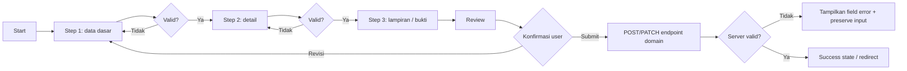

# Reusable Wizard Form Pattern

Dokumen ini menjelaskan pola **multi-step wizard form** untuk AWCMS-Mini
sebagai alternatif form input biasa. Pattern ini ditujukan untuk aplikasi
turunan yang membutuhkan input data panjang, bertahap, dan rawan salah jika
ditampilkan sebagai satu form besar.

Issue pelacak:
[#479 — UX: Add reusable multi-step wizard form pattern](https://github.com/ahliweb/awcms-mini/issues/479).

Contoh pemakaian end-to-end pada modul domain turunan (import, deklarasi
step, i18n, validasi, submit `Idempotency-Key`, anti-double-submit):
[`wizard-derived-module-example.md`](wizard-derived-module-example.md)
(Issue #482).

Fixture non-domain yang bisa langsung dijalankan di repo ini (admin shell
nyata, data dummy, submit mock lokal tanpa endpoint baru):
`src/pages/admin/examples/wizard.astro` (`/admin/examples/wizard`, Issue
#483) — juga tempat pola "pindahkan fokus ke judul panel saat step
berubah" (lihat §Accessibility checklist di bawah) benar-benar
diimplementasikan, bukan sekadar didokumentasikan.

## Tujuan

1. Membagi form panjang menjadi beberapa langkah yang mudah dipahami operator.
2. Menyediakan validasi per langkah sebelum user lanjut.
3. Menyediakan ringkasan akhir sebelum submit final.
4. Memakai pola UI, i18n, aksesibilitas, dan keamanan AWCMS-Mini.
5. Tetap menjaga server validation, ABAC, RLS, audit, dan idempotency sebagai
   kontrol utama.

## Kapan memakai wizard

Gunakan wizard bila form memenuhi salah satu kondisi berikut:

- memiliki banyak field lintas kategori;
- membutuhkan urutan input yang jelas;
- perlu review akhir sebelum submit;
- memiliki lampiran atau bukti pendukung;
- rawan salah input bila semua field ditampilkan sekaligus;
- membutuhkan draft/resume pada tahap lanjutan.

Contoh cocok:

| Domain                | Step yang disarankan                                                         |
| --------------------- | ---------------------------------------------------------------------------- |
| Surat Tugas/SPPD      | Identitas tugas → peserta → tujuan → biaya/SPM → lampiran → review           |
| SIKESRA               | Wilayah → identitas keluarga → anggota keluarga → indikator → bukti → review |
| Master faskes         | Identitas → wilayah/alamat → koordinat → layanan → kontak → review           |
| Sistem manajemen mutu | Audit → klausul → temuan → tindakan korektif → bukti → review                |
| Produk AWPOS          | Identitas produk → kategori/SKU → harga/pajak → stok awal → review           |

Tetap gunakan form biasa bila input hanya sederhana, misalnya ganti nama role,
ubah status, atau pengaturan singkat.

## Komponen target

Implementasi issue #479 menambahkan komponen berikut:

```text
src/components/ui/WizardStepper.astro
src/components/ui/WizardPanel.astro
src/components/ui/WizardActions.astro
src/lib/ui/wizard-client.ts
```

### `WizardStepper.astro`

Tanggung jawab:

- menampilkan daftar langkah;
- menandai step aktif dan selesai;
- memakai `aria-current="step"` pada step aktif;
- tidak memakai warna sebagai satu-satunya indikator status.

### `WizardPanel.astro`

Tanggung jawab:

- membungkus konten per step;
- menyembunyikan step tidak aktif tanpa menghapus state form;
- menyediakan region yang dapat dibaca assistive technology;
- menampilkan ringkasan error step.

### `WizardActions.astro`

Tanggung jawab:

- menyediakan tombol `Back`, `Next`, `Save Draft` bila tersedia, dan `Submit`;
- men-disable tombol selama mutation in-flight;
- menyampaikan state loading/submitting secara aksesibel;
- tidak menghapus input ketika server menolak request.

### `wizard-client.ts`

Tanggung jawab:

- menyimpan state step aktif;
- menjalankan validasi per step;
- mapping `VALIDATION_ERROR.details` ke field error;
- mencegah loncat step yang belum selesai;
- membuat `Idempotency-Key` untuk submit final high-risk.

## Pola i18n

Konsisten dengan `StateNotice.astro`/`WizardActions.astro`: komponen wizard
**tidak pernah** memanggil translator sendiri atau membaca locale dari
request — semua string yang tampak ke user diterima sebagai prop, dan
halaman pemanggil yang bertanggung jawab memanggil
`createTranslator(locale)` (`src/lib/i18n/translate.ts`) di frontmatter lalu
meneruskan hasil `t(key)` sebagai prop. Default prop (bila ada) berbahasa
Inggris hanya sebagai fallback aman, bukan nilai yang dianggap final untuk
production — halaman pemanggil wajib selalu mengisi prop ini dari katalog:

| Komponen        | Prop yang wajib diisi dari `t(key)`                       |
| --------------- | --------------------------------------------------------- |
| `WizardStepper` | `label`, `currentLabel`, `completedLabel`, `pendingLabel` |
| `WizardPanel`   | `title`, `description`, `errorSummaryHeading`             |
| `WizardActions` | `backLabel`, `nextLabel`, `submitLabel`, `saveDraftLabel` |

```astro
---
const t = await createTranslator(locale);
---

<WizardStepper
  steps={steps}
  activeStepKey={activeStepKey}
  label={t("wizard.stepper.label")}
  currentLabel={t("wizard.stepper.current")}
  completedLabel={t("wizard.stepper.completed")}
  pendingLabel={t("wizard.stepper.pending")}
/>
```

## Flow standar



## Prinsip validasi

Validasi client hanya untuk UX cepat. Server tetap sumber kebenaran.

Minimal validasi:

- field wajib per step;
- format dasar seperti tanggal, angka, email, kode, atau UUID;
- cross-field rule sederhana;
- review step menampilkan data final yang akan dikirim.

Endpoint domain tetap wajib memvalidasi payload lengkap, termasuk field dari step
sebelumnya. UI tidak boleh dianggap sebagai kontrol keamanan utama.

## Keamanan

Pola ini wajib mengikuti guardrail AWCMS-Mini:

1. Backend tetap memakai ABAC default-deny dan RLS untuk data tenant-scoped.
2. Submit final high-risk memakai `Idempotency-Key`.
3. Mutation berbasis cookie mengikuti kebijakan CSRF repository.
4. Draft client-side hanya boleh untuk data non-sensitif.
5. Data sensitif atau PII tidak boleh disimpan di `localStorage`.
6. Jika draft berisi data sensitif, gunakan server-side draft dengan RLS, audit,
   retention, masking, dan soft delete.
7. Jangan memakai `innerHTML` untuk data user tanpa sanitasi.
8. Error harus user-friendly dan tidak mengekspos stack trace.
9. Provider eksternal seperti R2, email, WhatsApp, atau AI tidak boleh dipanggil
   di dalam transaksi database.

## Server-side draft — tersedia (Issue #484)

Issue #479 sengaja tidak langsung membangun draft persistence agar scope MVP
tetap kecil. Setelah #482 (contoh pemakaian derived module) dan #483
(fixture nyata) landed, maintainer meng-unblock follow-up ini dengan pilot
plan konkret — sekarang tersedia sebagai modul generik
`src/modules/form-drafts/` (lihat README modul itu untuk detail lengkap:
endpoint, model idempotency per-aksi, retensi/expiry, dan alasan tiap
keputusan desain).

Skema final (`sql/019_awcms_mini_form_drafts_schema.sql`) — satu
perbedaan dari rancangan awal di bawah: `resource_id` bertipe `text`,
bukan `uuid`, disamakan dengan `awcms_mini_workflow_instances`/
`awcms_mini_audit_events.resource_id` supaya draft bisa menunjuk resource
yang belum ada atau identifier non-UUID:

```sql
CREATE TABLE awcms_mini_form_drafts (
  id uuid PRIMARY KEY DEFAULT gen_random_uuid(),
  tenant_id uuid NOT NULL REFERENCES awcms_mini_tenants (id),
  module_key text NOT NULL,
  wizard_key text NOT NULL,
  resource_type text NOT NULL,
  resource_id text,
  current_step text NOT NULL,
  payload jsonb NOT NULL,
  status text NOT NULL CHECK (status IN ('draft', 'submitted', 'abandoned', 'expired')),
  created_by uuid NOT NULL,
  updated_by uuid NOT NULL,
  submitted_by uuid,
  expires_at timestamptz,
  created_at timestamptz NOT NULL DEFAULT now(),
  updated_at timestamptz NOT NULL DEFAULT now(),
  submitted_at timestamptz,
  deleted_at timestamptz,
  deleted_by uuid,
  delete_reason text
);
```

Pemakaian dari modul domain turunan: lihat
[`wizard-derived-module-example.md`](wizard-derived-module-example.md)
§6-7 (submit `Idempotency-Key`, anti-double-submit) — pola create/
update/submit/delete draft mengikuti API `/api/v1/form-drafts` yang sama
persis dipakai `admin/examples/wizard.astro` sebagai pilot.

## Contoh definisi step

```ts
export type WizardStep = {
  key: string;
  title: string;
  description?: string;
  fields: string[];
};

export const dutyTravelWizardSteps: WizardStep[] = [
  {
    key: "basic",
    title: "Data dasar",
    description: "Judul, jenis, tanggal, dan tujuan tugas.",
    fields: ["title", "assignmentType", "startDate", "endDate"]
  },
  {
    key: "participants",
    title: "Peserta",
    description: "Pegawai yang ditugaskan dan perannya.",
    fields: ["participants"]
  },
  {
    key: "destination",
    title: "Tujuan",
    description: "Lokasi, instansi tujuan, dan uraian tugas.",
    fields: ["destinationName", "destinationAddress", "taskDescription"]
  },
  {
    key: "review",
    title: "Review",
    description: "Periksa kembali sebelum submit.",
    fields: []
  }
];
```

## Accessibility checklist

- Step aktif memakai `aria-current="step"`.
- Error summary memakai `role="alert"` atau `aria-live="polite"`.
- Tombol dapat difokus dan dioperasikan dengan keyboard.
- Urutan tab mengikuti urutan visual.
- Target sentuh minimal 44px pada layar kecil.
- Status step tidak hanya ditandai warna; tambahkan teks atau ikon.
- Submit state memakai `aria-busy="true"`.

Bukan jaminan `WizardPanel`/`WizardStepper` itu sendiri (komponen ini
tidak menyertakan `<script>` client apa pun) — tanggung jawab halaman
pemanggil, dengan implementasi referensi nyata di
`src/pages/admin/examples/wizard.astro` (Issue #483):

- Pindahkan fokus ke panel (elemen `<section id="step-...">` yang
  dirender `WizardPanel`, diberi `tabindex="-1"` sesaat lalu `.focus()`)
  setiap kali step aktif berubah (mis. setelah `Next`/`Back`), supaya
  pembaca layar mengumumkan step baru. Panggil dari script halaman yang
  mengorkestrasi transisi step, persis seperti fungsi
  `focusPanelHeading()` di fixture di atas.

### Regression guard otomatis

`tests/wizard-accessibility.test.ts` (Issue #485) menegaskan atribut di
atas tetap ada di markup/CSS komponen — bukan pengganti pengujian
assistive-tech nyata, hanya mencegah atribut aksesibilitas terhapus diam-diam
saat edit berikutnya (pola yang sama seperti guard hash
`theme-init-script.test.ts`).

### Walkthrough manual keyboard-only

Jalankan di `src/pages/admin/examples/wizard.astro` (`/admin/examples/wizard`,
Issue #483) — buka halaman, lalu **jangan sentuh mouse**:

1. `Tab` dari luar halaman ke dalam — fokus harus mendarat di skip-link
   (bila ada) lalu tombol/field pertama halaman dalam urutan visual.
2. Isi field step "Basic info" hanya dengan keyboard; tekan `Enter`/klik
   `Next` (via `Space`/`Enter` saat tombol fokus) dengan salah satu field
   kosong — fokus harus tetap di step yang sama, error field + ringkasan
   error muncul dan terbaca (uji dengan screen reader: `role="alert"`
   harus terumumkan otomatis tanpa perlu fokus berpindah manual).
3. Isi field wajib, tekan `Next` lagi — step berpindah ke "Details", dan
   fokus harus berpindah ke judul panel baru (`focusPanelHeading()`),
   bukan tetap di tombol `Next` step sebelumnya (elemen itu kini `hidden`).
4. Dari step "Details", `Tab` ke tombol `Back` lalu `Next` — urutan tab
   harus Back sebelum Next (`wizard-actions-secondary` sebelum
   `wizard-actions-primary` di markup).
5. Lanjut ke step "Review", tekan `Submit` — tombol harus terlihat
   `aria-busy="true"` dan disabled selama mock delay (~400ms), lalu
   banner sukses muncul dan terbaca.
6. Ulangi langkah 1-5 memakai screen reader (VoiceOver/NVDA) untuk
   memverifikasi step aktif, status (Current/Completed/Pending), dan
   error summary benar-benar diumumkan, bukan hanya terlihat visual.

## Testing checklist

- Step awal selalu valid secara state dan tidak melewati daftar step.
- `Next` ditolak jika validasi step gagal.
- `Back` tidak menghapus input.
- Submit final tidak bisa double-click.
- Error server dipetakan ke field terkait.
- Input tetap dipertahankan saat server error.
- Stepper dapat dipakai hanya dengan keyboard.
- `bun run check` lulus sebelum PR siap merge.

## Definition of Done

- Komponen wizard reusable tersedia di `src/components/ui`.
- Helper state tersedia di `src/lib/ui`.
- Dokumentasi pattern ini tetap sinkron dengan implementasi.
- Test helper tersedia.
- Tidak ada perubahan schema pada MVP.
- Tidak ada dependency framework baru tanpa alasan kuat.
- Tidak ada secret atau PII sensitif di client storage.
