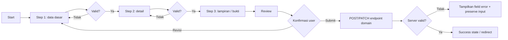

# Reusable Wizard Form Pattern

Dokumen ini menjelaskan pola **multi-step wizard form** untuk AWCMS-Mini sebagai alternatif form input biasa. Pattern ini ditujukan untuk aplikasi turunan yang membutuhkan input data panjang, bertahap, dan rawan salah jika ditampilkan sebagai satu form besar.

Issue pelacak: [#479 — UX: Add reusable multi-step wizard form pattern](https://github.com/ahliweb/awcms-mini/issues/479).

## Tujuan

1. Membagi form panjang menjadi beberapa langkah yang mudah dipahami operator.
2. Menyediakan validasi per langkah sebelum user lanjut ke langkah berikutnya.
3. Menyediakan ringkasan akhir sebelum submit final.
4. Memakai pola UI, i18n, accessibility, dan keamanan AWCMS-Mini.
5. Tetap menjaga server validation, ABAC, RLS, audit, dan idempotency sebagai kontrol utama.

## Kapan memakai wizard

Gunakan wizard bila form memenuhi salah satu kondisi berikut:

- memiliki banyak field lintas kategori;
- membutuhkan urutan input yang jelas;
- perlu review akhir sebelum submit;
- memiliki lampiran/bukti pendukung;
- rawan salah input bila seluruh field ditampilkan sekaligus;
- membutuhkan draft/resume pada tahap lanjutan.

Contoh cocok:

1. Surat Tugas/SPPD: identitas tugas → peserta → tujuan → biaya/SPM → lampiran → review.
2. SIKESRA: wilayah → identitas keluarga → anggota keluarga → indikator → bukti → review.
3. Master faskes: identitas → wilayah/alamat → koordinat → layanan → kontak → review.
4. Sistem manajemen mutu: audit → klausul → temuan → tindakan korektif → bukti → review.
5. Produk AWPOS: identitas produk → kategori/SKU → harga/pajak → stok awal → review.

Tetap gunakan form biasa bila input hanya sederhana, misalnya ganti nama role, ubah status, atau pengaturan singkat.

## Komponen target

Implementasi issue #479 sebaiknya menambah komponen berikut:

```text
src/components/ui/WizardStepper.astro
src/components/ui/WizardPanel.astro
src/components/ui/WizardActions.astro
src/lib/ui/wizard-client.ts
```

### `WizardStepper.astro`

Tanggung jawab:

- menampilkan daftar langkah;
- menandai step aktif;
- menandai step selesai;
- mendukung keyboard navigation;
- memakai `aria-current="step"` pada step aktif;
- tidak memakai warna sebagai satu-satunya indikator status.

### `WizardPanel.astro`

Tanggung jawab:

- membungkus konten per step;
- menyembunyikan step yang tidak aktif tanpa kehilangan state form;
- menyediakan region yang dapat dibaca assistive technology;
- menampilkan ringkasan error step.

### `WizardActions.astro`

Tanggung jawab:

- tombol `Back`, `Next`, `Save Draft` bila tersedia, dan `Submit`;
- disable tombol selama mutation in-flight;
- menyampaikan state loading/submitting secara aksesibel;
- tidak menghapus input ketika server menolak request.

### `wizard-client.ts`

Tanggung jawab:

- menyimpan state step aktif;
- menjalankan validasi per step;
- mapping `VALIDATION_ERROR.details` ke field error;
- mengunci submit final;
- integrasi dengan helper existing `submitJson`, `showBanner`, dan `lockElement` dari `src/lib/ui/admin-form-client.ts`.

## Flow standar



## Prinsip validasi

Validasi client hanya untuk UX cepat. Server tetap sumber kebenaran.

Minimal validasi:

- field wajib per step;
- format dasar seperti tanggal, angka, email, kode, atau UUID;
- cross-field rule sederhana, misalnya tanggal selesai tidak boleh sebelum tanggal mulai;
- review step menampilkan data final yang akan dikirim.

Endpoint domain tetap wajib memvalidasi payload lengkap, termasuk field dari step sebelumnya. UI tidak boleh dianggap sebagai kontrol keamanan utama.

## Keamanan

Pola ini wajib mengikuti guardrail AWCMS-Mini:

1. Backend tetap memakai ABAC default-deny dan RLS untuk data tenant-scoped.
2. Submit final high-risk memakai `Idempotency-Key`.
3. Mutation berbasis cookie mengikuti kebijakan CSRF repository.
4. Draft client-side hanya boleh untuk data non-sensitif.
5. Data sensitif atau PII tidak boleh disimpan di `localStorage`.
6. Jika draft berisi data sensitif, gunakan server-side draft dengan RLS, audit, retention, masking, dan soft delete.
7. Jangan memakai `innerHTML` untuk data user tanpa sanitasi.
8. Error harus user-friendly dan tidak mengekspos stack trace.
9. Provider eksternal seperti R2, email, WhatsApp, atau AI tidak boleh dipanggil di dalam transaksi database.

## Server-side draft: follow-up, bukan MVP

Issue #479 sengaja tidak langsung membangun draft persistence agar scope tetap kecil dan tidak over-engineering. Setelah pattern dipakai minimal oleh dua modul domain nyata, buat issue lanjutan untuk server-side draft.

Tabel draft yang disarankan:

```sql
CREATE TABLE awcms_mini_form_drafts (
  id uuid PRIMARY KEY DEFAULT gen_random_uuid(),
  tenant_id uuid NOT NULL REFERENCES awcms_mini_tenants (id),
  module_key text NOT NULL,
  wizard_key text NOT NULL,
  resource_type text NOT NULL,
  resource_id uuid,
  current_step text NOT NULL,
  payload jsonb NOT NULL,
  status text NOT NULL CHECK (status IN ('draft', 'submitted', 'abandoned', 'expired')),
  created_by uuid NOT NULL,
  updated_by uuid NOT NULL,
  submitted_by uuid,
  expires_at timestamptz,
  created_at timestamptz NOT NULL DEFAULT now(),
  updated_at timestamptz NOT NULL DEFAULT now(),
  submitted_at timestamptz,
  deleted_at timestamptz,
  deleted_by uuid,
  delete_reason text
);
```

Follow-up server-side draft wajib menambah:

- migration SQL berurutan;
- RLS policy tenant-scoped;
- repository dan service layer;
- OpenAPI endpoint;
- audit log untuk create/update/submit/delete draft;
- retention/expiry policy;
- test RLS dan permission;
- dokumentasi operasi.

## Contoh definisi step

```ts
export type WizardStep = {
  key: string;
  title: string;
  description?: string;
  fields: string[];
};

export const dutyTravelWizardSteps: WizardStep[] = [
  {
    key: "basic",
    title: "Data dasar",
    description: "Judul, jenis, tanggal, dan tujuan tugas.",
    fields: ["title", "assignmentType", "startDate", "endDate"]
  },
  {
    key: "participants",
    title: "Peserta",
    description: "Pegawai yang ditugaskan dan perannya.",
    fields: ["participants"]
  },
  {
    key: "destination",
    title: "Tujuan",
    description: "Lokasi, instansi tujuan, dan uraian tugas.",
    fields: ["destinationName", "destinationAddress", "taskDescription"]
  },
  {
    key: "review",
    title: "Review",
    description: "Periksa kembali sebelum submit.",
    fields: []
  }
];
```

## Contoh validasi per step

```ts
export type FieldError = {
  field: string;
  message: string;
};

export function validateStep(
  stepKey: string,
  payload: Record<string, unknown>
): FieldError[] {
  const errors: FieldError[] = [];

  if (stepKey === "basic") {
    if (typeof payload.title !== "string" || payload.title.trim() === "") {
      errors.push({ field: "title", message: "Judul wajib diisi." });
    }

    if (!payload.startDate) {
      errors.push({ field: "startDate", message: "Tanggal mulai wajib diisi." });
    }
  }

  if (stepKey === "participants") {
    if (!Array.isArray(payload.participants) || payload.participants.length === 0) {
      errors.push({ field: "participants", message: "Minimal satu peserta wajib dipilih." });
    }
  }

  return errors;
}
```

## Accessibility checklist

- Step aktif memakai `aria-current="step"`.
- Error summary memakai `role="alert"` atau `aria-live="polite"` sesuai konteks.
- Tombol dapat difokus dan dioperasikan dengan keyboard.
- Urutan tab mengikuti urutan visual.
- Target sentuh minimal 44px pada layar kecil.
- Status step tidak hanya ditandai warna; tambahkan teks atau ikon.
- Fokus berpindah ke judul panel step setelah user menekan `Next`.
- Submit state memakai `aria-busy="true"`.

## Testing checklist

- Step awal selalu valid secara state dan tidak melewati daftar step.
- `Next` ditolak jika validasi step gagal.
- `Back` tidak menghapus input.
- Submit final tidak bisa double-click.
- Error server dipetakan ke field terkait.
- Input tetap dipertahankan saat server error.
- Stepper dapat dipakai hanya dengan keyboard.
- `bun run check` lulus sebelum PR siap merge.

## Definition of Done

- Komponen wizard reusable tersedia di `src/components/ui`.
- Helper state tersedia di `src/lib/ui`.
- Dokumentasi pattern ini tetap sinkron dengan implementasi.
- Test helper tersedia.
- Tidak ada perubahan schema pada MVP.
- Tidak ada dependency framework baru tanpa alasan kuat.
- Tidak ada secret atau PII sensitif di client storage.
