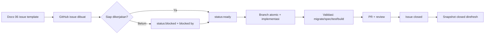

# Dokumentasi GitHub AWCMS-Mini

Dokumen ini mencatat snapshot isi GitHub repository `ahliweb/awcms-mini` dan proses pengelolaan issue. Snapshot issue dipisahkan antara `OPEN` dan `CLOSED`, dengan batas maksimal 100 issue per file.

| Metadata | Nilai |
|---|---|
| Repository | `ahliweb/awcms-mini` |
| Snapshot | 2026-07-04T09:53:29.329Z |
| Total issue | 38 |
| Open issue | 38 |
| Closed issue | 0 |
| Labels | 41 |
| Milestones | 9 |
| Max issue per file | 100 |

## File snapshot

| State | File | Jumlah issue |
|---|---|---:|
| OPEN | [issues-open-001.md](issues-open-001.md) | 38 |
| CLOSED | [issues-closed-001.md](issues-closed-001.md) | 0 |
| LABEL/MILESTONE | [labels-milestones.md](labels-milestones.md) | 50 |

## Aturan pencatatan

1. Snapshot issue GitHub disimpan di folder ini, bukan menggantikan `06_github_issues_detail.md` yang tetap menjadi template issue rencana.
2. File issue wajib dipisah berdasarkan state: `issues-open-NNN.md` dan `issues-closed-NNN.md`.
3. Satu file issue tidak boleh berisi lebih dari 100 issue. Jika jumlah issue melewati 100, buat halaman berikutnya dengan nomor berurutan.
4. Setiap issue dicatat dengan metadata, body, label, milestone, assignee, timestamp, URL, dan komentar.
5. Jangan menyalin token, secret, dump database, atau data customer asli ke issue maupun snapshot docs.
6. Saat issue diubah di GitHub, refresh snapshot ini agar docs tetap sinkron dengan state GitHub terbaru.

## Proses refresh snapshot

```bash
gh auth status
gh issue list --repo ahliweb/awcms-mini --state all --limit 1000 --json number,title,state,createdAt,updatedAt,closedAt,author,labels,assignees,milestone,url,body,comments > /tmp/awcms-mini_issues.json
gh label list --repo ahliweb/awcms-mini --limit 200 --json name,description,color > /tmp/awcms-mini_labels.json
gh api repos/ahliweb/awcms-mini/milestones --paginate > /tmp/awcms-mini_milestones.json
```

Setelah data diambil, regenerate file di folder ini dengan pembagian state dan batas 100 issue per file, lalu update `README.md`, `docs/awcms-mini/README.md`, `06_github_issues_detail.md`, `09_roadmap_repository_commit.md`, `13_final_master_index_traceability.md`, dan `CHANGELOG.md` bila struktur dokumentasi berubah.

## Alur issue



## Ringkasan state saat snapshot

| State | Jumlah | Catatan |
|---|---:|---|
| OPEN | 38 | Masih menjadi backlog aktif. |
| CLOSED | 0 | Belum ada issue closed saat snapshot dibuat. |

## Hubungan dengan dokumen utama

- `docs/awcms-mini/06_github_issues_detail.md` adalah rencana/template issue atomic.
- `docs/awcms-mini/github/` adalah snapshot state GitHub aktual.
- `docs/awcms-mini/09_roadmap_repository_commit.md` mengatur urutan branch, commit, PR, release, dan changeset.
- `AGENTS.md` tetap menjadi kontrak kerja agent dan developer.
