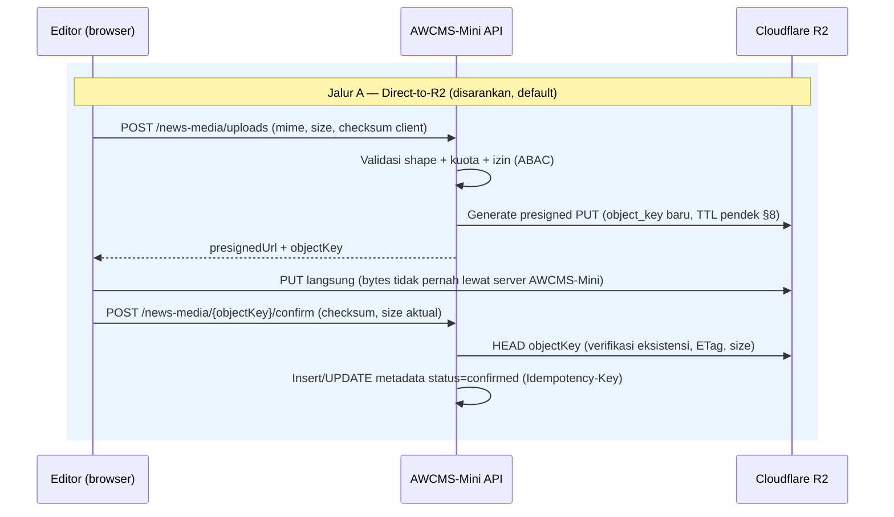
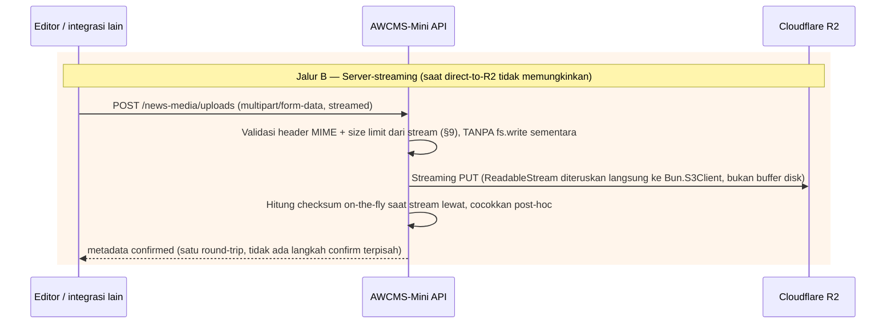
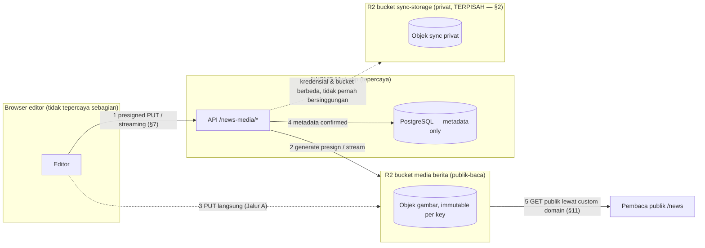

# News Portal — Full-Online R2-Only Media Architecture

Dokumen ini adalah **fondasi arsitektur** untuk epic `news-portal` (Issue
#631-#642, #649) dan prasyarat untuk epic `social-publishing` (Issue
#643-#647). Issue ini (**#631**) murni dokumentasi — tidak ada
implementasi kode/migration/endpoint. Setiap issue lanjutan **wajib**
membaca dokumen ini sebelum mengubah perilaku media/gambar berita, dan
**wajib** mempertahankan keputusan di sini kecuali ada ADR baru yang
secara eksplisit menggantikannya.

Ringkasan status per issue: lihat
`.claude/skills/awcms-mini-news-portal/SKILL.md`.

## 1. Ruang lingkup & asumsi — full-online only

**Ini bukan aturan untuk semua deployment.** Seluruh dokumen di
`docs/awcms-mini/news-portal/` mengasumsikan **mode full-online R2-only**
untuk gambar berita — deployment publik yang tersambung internet secara
permanen dan sudah punya kredensial Cloudflare R2 aktif.

- **TIDAK berlaku untuk offline/LAN** (doc 18 §Profil per-environment,
  `deployment-profiles.md`). Deployment offline/LAN yang tidak pernah
  mengaktifkan mode ini **tidak terpengaruh sama sekali** oleh epic ini —
  tidak ada perubahan default, tidak ada migrasi yang mengubah perilaku
  penyimpanan media yang sudah ada untuk deployment yang tidak
  mengaktifkan preset ini (lihat Issue #632, yang akan menambah preset
  `news_portal_full_online_r2` sebagai opsi eksplisit, bukan default
  baru untuk seluruh base).
- **TIDAK berlaku untuk modul lain.** `sync-storage`'s R2 usage (§2 di
  bawah) tetap berjalan seperti sebelumnya — epic ini tidak mengubah
  `awcms_mini_object_sync_queue`, dispatcher, atau env var `R2_*` yang
  sudah ada.
- Prasyarat produk: `blog_content` (base module, sudah `active`) dan
  online public routing (`tenant_domain`, ADR-0009/ADR-0010) sudah
  tersedia — news portal adalah lapisan editorial + media di atas
  keduanya, bukan modul yang berdiri sendiri dari nol.
- Setiap dokumen di folder ini yang menyebut "wajib"/"dilarang" berarti
  **wajib/dilarang untuk mode full-online R2-only**, bukan untuk base
  generik AWCMS-Mini secara keseluruhan.

## 2. Hubungan dengan `sync-storage`'s R2 usage yang sudah ada — bucket terpisah

`src/modules/sync-storage/` **sudah** memakai Cloudflare R2 sejak Issue
6.3/#436 (`R2_ENABLED`, `R2_ACCOUNT_ID`, `R2_ACCESS_KEY_ID`,
`R2_SECRET_ACCESS_KEY`, `R2_BUCKET`, lihat
`src/modules/sync-storage/README.md` §Scope — Issue 6.3 dan §Dispatcher).
Ini bisa disalahpahami sebagai "R2 sudah ada, tinggal pakai bucket yang
sama" — **keputusan arsitektural eksplisit di sini: JANGAN.** News
portal media **wajib** memakai bucket R2 dan kredensial R2 yang
**terpisah** dari `sync-storage`, dengan alasan konkret:

| Aspek                    | `sync-storage`'s R2 usage (sudah ada)                                                             | News portal media (epic ini)                                                                                |
| ------------------------ | ------------------------------------------------------------------------------------------------- | ----------------------------------------------------------------------------------------------------------- |
| Tujuan                   | Object queue **privat** untuk sinkronisasi antar-node offline/LAN (lampiran, receipt, file lokal) | Media **publik** yang memang harus bisa diakses siapa pun lewat CDN/custom domain                           |
| Siapa yang menulis objek | Node sync (HMAC machine-to-machine) via dispatcher internal                                       | Editor/jurnalis (bearer session) via presigned upload atau server-streaming                                 |
| Akses publik             | **Tidak pernah** — tidak ada custom domain, tidak ada CORS, tidak ada Cache-Control publik        | **By design** — custom domain, CORS untuk direct-upload dari browser, Cache-Control agresif untuk CDN       |
| Isi objek                | Bisa berupa dokumen bisnis sensitif tenant (bukan cuma gambar)                                    | Gambar berita saja (MIME allow-list ketat, §9)                                                              |
| Model ancaman dominan    | Kebocoran data bisnis privat bila bucket/CORS misconfigured jadi publik                           | Presigned URL bocor, object publik yang tidak diinginkan, upload berbahaya (§13, `r2-incident-response.md`) |
| Rotasi kredensial        | Independen — rotasi tidak boleh mengganggu media publik                                           | Independen — rotasi/leak kredensial ini **tidak boleh** memberi akses ke objek sync privat                  |

Konsekuensi konkret: **satu bucket publik yang salah konfigurasi CORS/
custom domain tidak pernah bisa membocorkan objek sync privat**, dan
**kompromi kredensial media publik (blast radius terbatas ke bucket yang
memang sudah publik) tidak pernah memberi akses ke objek sync privat**.
Sebaliknya, kompromi kredensial sync tidak pernah memberi akses tulis ke
bucket media publik. Ini adalah penerapan langsung prinsip **least
privilege** dan **segregation of duties** (lihat §15 ISO/IEC 27001 A.5.15,
27017 CLD 6.3.1).

Cloudflare account **boleh sama** (satu akun Cloudflare, dua bucket) —
yang wajib terpisah adalah **bucket** dan **API token/kredensial R2**,
bukan akun. Operator yang ingin isolasi lebih kuat (mis. akun Cloudflare
terpisah per fungsi) tetap didukung karena konvensi env var di §4 tidak
mengasumsikan akun yang sama.

## 3. Prinsip inti (tidak bisa dinegosiasi issue lanjutan)

1. **R2-only untuk binary gambar berita.** Setiap gambar berita
   (featured image, gallery block, ad image, video thumbnail, SEO/social
   preview image) **wajib** disimpan sebagai objek di bucket R2 media
   berita — tidak ada jalur penyimpanan binary lain yang sah dalam mode
   ini.
2. **PostgreSQL hanya metadata.** Tabel media registry (dirancang Issue
   #633) **tidak pernah** menyimpan bytes gambar — hanya `object_key`,
   MIME, ukuran, checksum, dimensi, status, dan atribusi. Tidak ada kolom
   `bytea`/`text` yang menampung gambar mentah atau base64 apa pun.
3. **Tidak ada fallback filesystem lokal.** Bila upload ke R2 gagal
   dalam mode ini, permintaan **gagal secara eksplisit** (error jelas ke
   editor) — sistem **tidak pernah** diam-diam menulis ke
   `LOCAL_STORAGE_PATH` sebagai pengganti. Ini kebalikan dari
   `sync-storage` (yang memang punya "objek tetap lokal dulu, upload R2
   belakangan" sebagai desain — lihat README modul itu) karena di mode
   ini R2 **adalah** satu-satunya tempat penyimpanan yang sah, bukan
   cadangan opsional.
4. **Tidak ada file sementara di disk lokal server.** Baik jalur
   direct-to-R2 maupun jalur server-streaming (§7) tidak pernah menulis
   bytes gambar ke disk lokal server aplikasi — bukan hanya "dihapus
   setelah dipakai", tapi memang tidak pernah ditulis sama sekali.
5. **Default deny sebelum tervalidasi.** Objek tidak dianggap "media
   berita sah" sampai lolos validasi MIME+ekstensi+checksum+ukuran (§9)
   DAN baris metadata `confirmed` tercatat di Postgres — konten yang
   direferensikan editorial (post, gallery, ads, video thumbnail) hanya
   boleh menunjuk media berstatus `confirmed`.

## 4. Konvensi environment variable

**Status: diimplementasikan oleh Issue #632, diperluas Issue #635.** Var
di bawah sudah ada di `.env.example` dan
`18_configuration_env_reference.md` §News portal, ditegakkan
`scripts/validate-env.ts` (`checkNewsPortalProfileConfig`,
`checkNewsMediaR2Config`, `checkNewsMediaR2SeparationFromSyncR2`,
`checkNewsMediaR2AllowedMimeTypesKnown`,
`checkNewsMediaR2PresignedTtlUpperBound` — dua terakhir Issue #635) dan
`scripts/security-readiness.ts` (`checkNewsPortalFullOnlineR2PresetReady`,
`checkNewsMediaR2SvgNotAllowed`,
`checkNewsMediaR2PublicBaseUrlProductionSafe`,
`checkNewsMediaR2NoStalePendingObjects` — dua terakhir Issue #635), dan
diresolusi oleh `src/modules/news-portal/domain/news-media-r2-config.ts`
(`resolveNewsMediaR2Config`). Nama di sini tetap **konvensi wajib**
persis apa adanya untuk implementor lanjutan (#633/#634/#635) — jangan
menciptakan skema penamaan lain atau menimpakan arti baru ke `R2_*` yang
sudah dipakai `sync-storage`.

Prefix **`NEWS_MEDIA_R2_`** — sengaja berbeda dari `R2_*` generik
(§2, disambiguasi eksplisit dari bucket sync):

| Var                                          | Wajib bila   | Default                                     | Catatan                                                                                                                                                                                                                                                                              |
| -------------------------------------------- | ------------ | ------------------------------------------- | ------------------------------------------------------------------------------------------------------------------------------------------------------------------------------------------------------------------------------------------------------------------------------------ |
| `NEWS_MEDIA_R2_ENABLED`                      | –            | `false`                                     | Master switch mode R2-only news media. Bagian dari preset #632.                                                                                                                                                                                                                      |
| `NEWS_MEDIA_R2_ACCOUNT_ID`                   | bila enabled | –                                           | Boleh sama dengan `R2_ACCOUNT_ID` (satu akun Cloudflare) atau berbeda (§2).                                                                                                                                                                                                          |
| `NEWS_MEDIA_R2_ACCESS_KEY_ID`                | bila enabled | –                                           | Token least-privilege terpisah dari `R2_ACCESS_KEY_ID` — **wajib** berbeda (§2, §13).                                                                                                                                                                                                |
| `NEWS_MEDIA_R2_SECRET_ACCESS_KEY`            | bila enabled | –                                           | Idem.                                                                                                                                                                                                                                                                                |
| `NEWS_MEDIA_R2_BUCKET`                       | bila enabled | –                                           | **Wajib** berbeda dari `R2_BUCKET` (§2) — divalidasi tidak sama saat `config:validate`/`security:readiness` (diimplementasikan #632, bukan #635 — #635 masih menambah check readiness lain di luar separation ini, mis. MIME sniffing/checksum runtime enforcement).                 |
| `NEWS_MEDIA_R2_PUBLIC_BASE_URL`              | bila enabled | –                                           | Custom domain publik (§11), mis. `https://media.contoh-berita.id`. Harus HTTPS absolut. Saat `APP_ENV=production`, WAJIB custom domain nyata — bukan `*.r2.dev`/loopback (Issue #635, `checkNewsMediaR2PublicBaseUrlProductionSafe`).                                                |
| `NEWS_MEDIA_R2_PRESIGNED_UPLOAD_TTL_SECONDS` | –            | `300`                                       | TTL presigned PUT (§8). Bukan TTL baca — baca selalu publik lewat custom domain. Maksimum `3600` detik (Issue #635, `NEWS_MEDIA_R2_MAX_PRESIGNED_UPLOAD_TTL_SECONDS`).                                                                                                               |
| `NEWS_MEDIA_R2_MAX_UPLOAD_BYTES`             | –            | `10485760` (10 MiB)                         | Batas ukuran per file (§9).                                                                                                                                                                                                                                                          |
| `NEWS_MEDIA_R2_ALLOWED_MIME_TYPES`           | –            | `image/jpeg,image/png,image/webp,image/gif` | Allow-list MIME (§9) — **tidak termasuk** `image/svg+xml` default (§9 alasan). Entri di luar `NEWS_MEDIA_R2_KNOWN_MIME_TYPES` (kelima tipe di atas) ditolak `config:validate` (Issue #635).                                                                                          |
| `NEWS_MEDIA_R2_PENDING_TTL_MINUTES`          | –            | `60`                                        | Batas usia objek `pending_upload` sebelum dibersihkan otomatis oleh `bun run news-media:reconcile` (`r2-backup-lifecycle.md` §2, Issue #690); `checkNewsMediaR2NoStalePendingObjects` (Issue #635) melaporkan warning bila job itu tidak berjalan/tidak sempat.                      |
| `NEWS_MEDIA_R2_ORPHAN_GRACE_DAYS`            | –            | `30`                                        | Masa tenggang (hari) sebelum `bun run news-media:reconcile` menghapus fisik objek R2 milik media `orphaned` + soft-delete baris metadatanya (`r2-backup-lifecycle.md` §3/§4, Issue #690). Minimum `30` hari, ditegakkan `config:validate` (`checkNewsMediaR2OrphanGraceLowerBound`). |

Implementor (#632/#633/#634/#635) wajib memakai nama ini persis — jangan
memilih nama lain "yang mirip" tanpa memperbarui tabel ini.

## 5. Model data konseptual — media registry (Issue #633, **diimplementasikan**)

**Status: diimplementasikan oleh Issue #633.** Skema final (migration
`sql/041_awcms_mini_news_media_object_registry_schema.sql`) menggunakan
tabel **`awcms_mini_news_media_objects`** — nama yang sudah dipilih di
bawah ini SEBELUM issue #633 mulai dikerjakan, dan dipertahankan persis
(bukan `awcms_mini_media_objects` yang sempat disebut di body issue
#633 — lihat migration 041's header comment dan
`.claude/skills/awcms-mini-news-portal/SKILL.md` §633 untuk alasan
rekonsiliasi lengkap). Kolom final adalah **elaborasi** dari sketsa
konseptual di bawah, bukan penggantian:

```text
awcms_mini_news_media_objects (tenant-scoped, RLS ENABLE+FORCE)
- id                        uuid PK
- tenant_id                 uuid FK -> awcms_mini_tenants
- module_key                text, CHECK = 'news_portal' (lebar bila modul lain reuse kelak)
- owner_resource_type       text, nullable — polymorphic reference generik
- owner_resource_id         uuid, nullable   (pola sama awcms_mini_audit_events, TANPA FK spesifik)
- storage_driver            text, CHECK = 'cloudflare_r2'
- bucket_name               text NOT NULL
- object_key                text NOT NULL     -- §6, plus CHECK format tenant-prefixed di DB
- original_filename         text, nullable    -- hanya untuk tampilan, TIDAK pernah masuk object_key (§6)
- public_url                text NOT NULL     -- dibangun server dari NEWS_MEDIA_R2_PUBLIC_BASE_URL (#632), tidak pernah dari input client
- mime_type                 text NOT NULL     -- hasil validasi server (§9), bukan input mentah client
- size_bytes                bigint, nullable  -- terisi saat status='verified' (bukan 'uploaded' — Issue #634 PR #653: klaim atomik pending_upload->uploaded terjadi SEBELUM GET nyata, jadi nilai asli baru diketahui saat verified)
- checksum_sha256           text, nullable    -- terisi saat status='verified', dari bytes GET nyata yang sama (lihat baris di atas)
- width/height              integer, nullable -- terisi saat status='verified'
- alt_text, caption         text, nullable    -- aksesibilitas (doc 14), wajib diisi sebelum publish (Issue #636/#640)
- status                    text — pending_upload|uploaded|verified|attached|orphaned|deleted|failed (elaborasi 7-state dari sketsa pending|confirmed|orphaned|deleted semula — lihat migration 041's header comment)
- created_by_tenant_user_id uuid NOT NULL
- created_at, updated_at, deleted_at, deleted_by, delete_reason, restored_at, restored_by
```

Helper domain/application (`src/modules/news-portal/domain/news-media-object-key.ts`,
`application/news-media-object-directory.ts`): `buildNewsMediaObjectKey`/
`isValidNewsMediaObjectKey` (§6), `buildNewsMediaPublicUrl` (trusted base
URL only), `createPendingNewsMediaObject`, `markNewsMediaObjectUploaded`/
`Verified`/`Orphaned`/`Failed`, `attachNewsMediaObject`/`detachNewsMediaObject`,
`softDeleteNewsMediaObject`/`restoreNewsMediaObject`/`purgeNewsMediaObject` —
audit events (skill `awcms-mini-audit-log`) written for create/verify/
attach/detach/delete/restore/purge. Permission key constants for the
future upload endpoint (#634) are prepared, not yet wired into
`module.ts`, in `domain/news-media-permissions.ts`.

Catatan desain yang wajib dipertahankan:

- **Tidak ada kolom binary apa pun** (§3.2) — pelanggaran ini adalah
  regresi kritis bila terjadi di issue mana pun.
- **`status='pending_upload'`/`'uploaded'` bukan jaminan objek tidak bisa
  diakses publik** — lihat §8 residual risk. Jangan berasumsi baris
  Postgres mengontrol akses storage-level.
- Soft delete (`deleted_at`) **ortogonal** terhadap `status` (pola sama
  `awcms_mini_blog_posts`) — hapus/restore tidak pernah menulis ulang
  `status`.
- Konten editorial (`blog_content`'s `featuredMediaId`, block `gallery`,
  dsb.) **harus** menunjuk baris `status='attached'` (yang mensyaratkan
  sebelumnya `verified`) di tabel ini ketika mode R2-only aktif — inilah
  yang akan diterapkan Issue #636 (bukan issue ini); ditegakkan di level
  write path oleh `attachNewsMediaObject` (hanya menerima dari
  `status='verified'`), bukan hanya konvensi.

## 6. Konvensi object key

**Status: diimplementasikan oleh Issue #633** —
`src/modules/news-portal/domain/news-media-object-key.ts`
(`buildNewsMediaObjectKey` generates it server-side;
`isValidNewsMediaObjectKey` validates the tenant-prefixed shape; the
same format is also enforced as a Postgres `CHECK` constraint on
`awcms_mini_news_media_objects.object_key`, migration 041).

Format wajib:

```text
news-media/{tenantId}/{yyyy}/{mm}/{uuid}.{ext}
```

- `tenantId` — UUID tenant (bukan `tenantCode` yang human-readable) —
  konsisten dengan isolasi ABAC/RLS berbasis UUID di seluruh repo, dan
  menghindari kebocoran slug tenant yang bisa ditebak lewat pola key.
- `{yyyy}/{mm}` — partisi tanggal upload, memudahkan lifecycle
  rule/retensi per periode (`r2-backup-lifecycle.md`) tanpa perlu daftar
  objek penuh.
- `{uuid}` — `crypto.randomUUID()` (Bun-native, konsisten dengan
  konvensi ID lain di repo) — **satu-satunya** komponen yang
  mengidentifikasi file secara unik. Objek key **tidak pernah**
  menyertakan nama file asli, judul artikel, atau teks apa pun yang
  disediakan client — mencegah path traversal, karakter tidak aman,
  kebocoran informasi lewat URL (mis. nama file berisi nama orang), dan
  membuat key tidak bisa ditebak (mitigasi tambahan untuk §8 residual
  risk).
- `{ext}` — **diturunkan dari MIME type yang sudah divalidasi server**
  (§9: `image/jpeg`→`.jpg`, `image/png`→`.png`, `image/webp`→`.webp`,
  `image/gif`→`.gif`), **bukan** dari ekstensi asli file client. Ini
  menutup celah spoofing "file.jpg yang sebenarnya berisi PHP/HTML".

`original_filename` tetap disimpan (kolom metadata terpisah, §5) untuk
ditampilkan ke editor ("photo-lapangan.jpg") tanpa pernah memengaruhi
key penyimpanan.

## 7. Alur upload — direct-to-R2 atau server-streaming, tanpa temp file lokal

Dua jalur yang sah (implementasi konkret: Issue #634). Keduanya
**dilarang** menulis bytes gambar ke disk lokal server aplikasi.





Catatan implementasi wajib untuk Issue #634:

- Jalur A adalah **default yang disarankan** — beban bandwidth upload
  tidak pernah melewati server aplikasi, konsisten dengan prinsip "tidak
  ada temp file lokal" secara struktural (server tidak pernah memegang
  bytes-nya sama sekali).
- Jalur B **tetap harus** streaming murni (Bun `ReadableStream`/
  `Request.body` diteruskan langsung ke client R2, bukan
  `await request.arrayBuffer()` lalu simpan ke variabel besar dan bukan
  `Bun.write(tempPath, ...)` — validasi ukuran harus memotong stream
  begitu `NEWS_MEDIA_R2_MAX_UPLOAD_BYTES` terlampaui, bukan menunggu
  keseluruhan body diterima dulu).
- `confirm` (Jalur A) adalah **mutation high-risk** (mendaftarkan media
  yang akan tampil publik) — wajib `Idempotency-Key` (skill
  `awcms-mini-idempotency`) supaya retry client tidak membuat baris
  metadata duplikat untuk `object_key` yang sama.
- Pemanggilan R2 (presign, HEAD, PUT streaming) **tidak pernah** di
  dalam DB transaction (ADR-0006) — pola yang sama dengan
  `object-dispatch.ts`'s CLAIM/UPLOAD/FINALIZE tiga-fase, walau di sini
  urutannya terbalik (validasi dulu, lalu upload, baru commit metadata)
  karena upload diinisiasi langsung oleh user request, bukan dispatcher
  latar belakang.

## 8. Lifecycle & expiry presigned URL

- **Presigned upload (PUT) TTL pendek** — default
  `NEWS_MEDIA_R2_PRESIGNED_UPLOAD_TTL_SECONDS=300` (5 menit). Cukup untuk
  satu upload interaktif, terlalu pendek untuk berguna bagi URL yang
  bocor lama setelah di-generate.
- **Presigned URL tidak benar-benar "single-use"** secara protokol S3/R2
  — valid sampai TTL habis, siapa pun yang memegang URL bisa PUT ke situ
  selama TTL belum lewat. Mitigasi: TTL pendek + `object_key` per-upload
  yang baru (tidak pernah reuse presigned URL untuk key yang sama) +
  langkah `confirm` yang memverifikasi checksum aktual (menolak upload
  yang isinya beda dari yang diklaim, sekalipun URL-nya valid).
- **Tidak ada presigned URL untuk GET/baca.** Gambar berita memang
  publik by design — pembacaan selalu lewat custom domain publik (§11),
  bukan presigned GET. Ini menyederhanakan model: hanya jalur upload
  yang perlu proteksi TTL, jalur baca tidak punya "kredensial" untuk
  bocor sama sekali.
- **Residual risk yang wajib didokumentasikan setiap issue lanjutan**:
  begitu PUT sukses ke `object_key` yang valid, objek itu **langsung
  reachable publik** lewat custom domain (bucket publik tidak menegakkan
  ACL per-objek berbasis status Postgres) — status `pending` di
  Postgres **tidak memblokir** akses storage-level. Mitigasi berlapis:
  (1) `object_key` tidak bisa ditebak (UUID, §6), (2) konten editorial
  tidak pernah menunjuk objek `pending` (§5), (3) objek `pending` yang
  tidak pernah di-`confirm` dibersihkan otomatis setelah
  `NEWS_MEDIA_R2_PENDING_TTL_MINUTES` (`r2-backup-lifecycle.md` §Lifecycle
  objek pending). Lihat juga `r2-incident-response.md` §Public object
  exposure.

## 9. Validasi MIME, ekstensi, dan checksum

**Kedua jalur (§7) wajib menjalankan urutan validasi yang SAMA sebelum
objek dianggap `confirmed` — tidak ada jalur pintas untuk Jalur A.**
`HEAD` request (eksistensi/`Content-Length`/ETag) TIDAK PERNAH cukup
untuk menaikkan status ke `confirmed`, karena `HEAD` tidak membaca isi
objek — ia hanya membuktikan _sesuatu_ ter-upload, bukan _apa_ yang
ter-upload. Presigned PUT S3-compatible juga tidak memverifikasi
`Content-Type` yang dikirim client saat PUT terhadap apa pun yang
disetujui server saat inisiasi upload — client bebas mem-PUT payload
apa pun (mis. HTML/JS yang diberi nama/checksum seolah gambar) ke URL
presigned yang sama. Karena itu langkah `confirm` WAJIB melakukan
**ranged `GET`** (bukan `HEAD`) untuk membaca isi objek langsung dari
R2, pada kedua jalur:

1. **Ukuran** — tolak lebih awal (dari `Content-Length` klaim awal atau
   saat stream melampaui `NEWS_MEDIA_R2_MAX_UPLOAD_BYTES`) sebelum
   membaca isi file, mencegah pemborosan CPU/bandwidth untuk file yang
   pasti ditolak (mitigasi OWASP API4 "unrestricted resource
   consumption", §15). **Residual risk pada Jalur A**: presigned PUT
   (bukan presigned POST) tidak mendukung pembatasan ukuran di level
   signature R2 — client secara teknis bisa mem-PUT byte lebih banyak
   dari yang diklaim saat inisiasi. Mitigasi wajib: langkah `confirm`
   membaca `Content-Length` sebenarnya dari R2 (`HEAD` sebagai
   pengecekan cepat sebelum `GET`) dan menolak (`REJECTED` + jadwalkan
   penghapusan objek) bila melebihi `NEWS_MEDIA_R2_MAX_UPLOAD_BYTES` —
   lapisan reaktif menyusul lapisan preventif ini; bandwidth yang
   sudah terpakai untuk objek yang akhirnya ditolak adalah risiko yang
   **diterima secara eksplisit** (sama pola dengan §8's residual risk
   soal status Postgres vs akses storage-level), bukan diklaim sudah
   tertutup penuh. Implementasi yang lebih kuat (opsional, di luar
   cakupan epic ini): presigned **POST** dengan policy condition
   `content-length-range`, yang menolak PUT berlebih di level R2
   sebelum data sampai ke bucket sama sekali.
2. **MIME sniffing dari magic bytes**, dijalankan terhadap isi objek
   hasil ranged `GET` di atas — **bukan** `Content-Type` header client,
   bukan ekstensi nama file, dan bukan checksum yang diklaim client
   (ketiganya adalah input tidak tepercaya yang mudah
   dipalsukan/self-referential). Allow-list default
   `NEWS_MEDIA_R2_ALLOWED_MIME_TYPES` (§4): JPEG, PNG, WebP, GIF.
   Mismatch antara MIME yang diklaim saat inisiasi dan MIME hasil
   sniffing berarti `REJECTED`, objek dijadwalkan penghapusan, dan
   baris metadata tidak pernah naik status ke `confirmed`.
3. **`image/svg+xml` sengaja TIDAK diizinkan** secara default — SVG bisa
   membawa `<script>`/event handler dan dieksekusi sebagai HTML oleh
   sebagian browser bila disajikan dengan `Content-Type` yang salah
   (vektor XSS well-known). Mengizinkan SVG di masa depan membutuhkan
   pipeline sanitasi khusus (di luar cakupan epic ini) dan keputusan
   eksplisit terpisah, bukan sekadar menambah ke allow-list.
4. **Ekstensi object key diturunkan dari MIME tervalidasi** (§6), bukan
   dari ekstensi asli — menutup celah "file dengan MIME benar tapi
   ekstensi berbahaya (`.php.jpg`, `.jpg.exe`)" karena ekstensi asli
   tidak pernah dipercaya sama sekali.
5. **Checksum SHA-256** — dihitung **server-side dari isi objek yang
   benar-benar dibaca di langkah 2** (Jalur A: server menyelesaikan
   `GET` penuh objek untuk menghitung digest, dibatasi
   `NEWS_MEDIA_R2_MAX_UPLOAD_BYTES` dari langkah 1, bukan hanya
   membaca beberapa byte pertama untuk sniffing; Jalur B: server sudah
   menghitung on-the-fly saat streaming). Checksum yang diklaim client
   saat inisiasi (Jalur A) **hanya dipakai sebagai deteksi korupsi
   transport** (bandingkan dua nilai yang sama-sama dihitung dari byte
   yang benar-benar diterima server) — **tidak pernah** menjadi
   satu-satunya bukti validasi konten/MIME, karena nilai itu
   self-referential terhadap klaim client sendiri. Mismatch berarti
   `REJECTED`, baris metadata tidak pernah naik status ke `confirmed`,
   dan objek di R2 dijadwalkan pembersihan (bukan dibiarkan `pending`
   selamanya — `r2-backup-lifecycle.md`).
6. Lima langkah di atas adalah **defense in depth** yang berurutan —
   satu langkah gagal berarti seluruh upload ditolak, tidak ada
   "sebagian lolos", dan tidak ada langkah yang dilewati hanya karena
   sebuah jalur (A vs B) "sudah dipercaya lebih aman".

## 10. Konfigurasi CORS

Bucket media berita butuh CORS untuk Jalur A (§7) karena browser editor
melakukan PUT langsung ke R2 dari origin admin AWCMS-Mini:

```json
[
  {
    "AllowedOrigins": ["https://admin.contoh-berita.id"],
    "AllowedMethods": ["PUT"],
    "AllowedHeaders": ["content-type", "content-md5"],
    "MaxAgeSeconds": 300
  }
]
```

Prinsip:

- `AllowedOrigins` **wajib** daftar eksplisit origin admin tenant
  (`APP_URL`/custom domain admin) — **tidak pernah** `"*"`. Wildcard
  origin pada bucket yang menerima PUT berarti origin mana pun bisa
  memicu upload memakai presigned URL yang bocor ke halaman lain (CSRF
  gaya storage).
- `AllowedMethods` hanya `PUT` (dan `OPTIONS` preflight implisit) — bucket
  ini tidak butuh CORS untuk `GET` karena pembacaan publik lewat custom
  domain tidak melalui fetch cross-origin browser dengan credential apa
  pun yang perlu diverifikasi CORS untuk sekadar menampilkan ``.
- Bucket **sync-storage** (§2) tidak butuh CORS sama sekali — tidak ada
  browser yang pernah PUT langsung ke bucket itu. Jangan menyalin
  konfigurasi CORS ini ke bucket sync.

## 11. Custom domain R2 & public image base URL

- `NEWS_MEDIA_R2_PUBLIC_BASE_URL` (§4) — domain kustom yang di-mapping
  operator ke bucket R2 media (fitur "Custom Domains" Cloudflare R2),
  bukan URL `r2.dev` bawaan (yang tidak stabil untuk produksi dan tidak
  mendukung caching/branding kustom).
- URL publik akhir sebuah objek = `{NEWS_MEDIA_R2_PUBLIC_BASE_URL}/{object_key}`
  — API/UI **tidak pernah** menyimpan URL absolut penuh sebagai sumber
  kebenaran di kolom terpisah (hindari drift bila base URL berubah);
  selalu derive dari `object_key` + config saat render, pola yang sama
  dengan `resolveCanonicalUrl`'s pendekatan "derive, don't duplicate" di
  `blog-content`.
- Domain kustom ini **berbeda** dari `PUBLIC_PLATFORM_ROOT_DOMAIN`/
  tenant domain routing (epic #555) — satu untuk media statis, satu
  untuk routing halaman HTML tenant. Boleh subdomain dari domain yang
  sama (mis. `media.` vs domain utama) tapi secara konfigurasi
  independen.
- TLS/HTTPS wajib untuk domain kustom ini — gambar berita yang disajikan
  lewat HTTP polos akan memicu mixed-content warning pada halaman
  `/news` yang sudah HTTPS.

## 12. Strategi Cache-Control

- Objek media berita **immutable per key** (§6: key baru untuk setiap
  upload, tidak pernah menimpa key yang sama dengan konten berbeda) —
  jadi aman memakai Cache-Control agresif:
  `Cache-Control: public, max-age=31536000, immutable` (1 tahun) di
  level objek R2 saat upload (bukan di level custom domain saja).
- Karena objek immutable, "mengganti gambar" berarti **upload objek
  baru** (key baru) dan memperbarui referensi (`featuredMediaId`, dsb.)
  ke key baru — bukan overwrite key lama. Ini juga menutup risiko cache
  poisoning (CDN/browser tidak pernah menyajikan versi lama dari key
  yang "diubah" karena key yang diubah selalu baru).
- Objek `pending` yang belum `confirmed` **tidak perlu** Cache-Control
  berbeda — mereka seharusnya tidak pernah direferensikan tempat publik
  mana pun sebelum `confirmed` (§5), jadi cache header-nya tidak relevan
  secara praktis, tapi tetap diberi header yang sama saat upload (objek
  R2 tidak punya cara murah untuk "memperbarui header nanti" tanpa
  menulis ulang objek).

## 13. Kredensial R2 — rotasi & least privilege

Ringkasan (detail penuh + langkah operasional: `r2-security-checklist.md`
§Kredensial):

- API token R2 untuk media berita **wajib** dibatasi ke **satu bucket**
  (`NEWS_MEDIA_R2_BUCKET`) — Cloudflare R2 API token mendukung scoping
  per-bucket; jangan pernah memakai token "Account API Token" bergaya
  admin penuh untuk kredensial yang disuntik ke environment aplikasi.
- Rotasi terjadwal (rekomendasi: 90 hari, atau segera setelah insiden —
  `r2-incident-response.md`) tanpa downtime: buat token baru → update
  env var → restart/redeploy → cabut token lama, bukan cabut lalu buat
  (mencegah window tanpa kredensial valid).
- Least privilege: token hanya perlu `Object Read & Write` untuk bucket
  media (upload dari server pada Jalur B, HEAD verifikasi pada Jalur A)
  — tidak pernah butuh permission administratif bucket (delete bucket,
  ubah CORS/lifecycle policy lewat API token yang sama yang disuntik ke
  runtime aplikasi; perubahan konfigurasi bucket itu sendiri dilakukan
  operator lewat dashboard/Terraform terpisah, bukan oleh aplikasi saat
  runtime).

## 14. Diagram trust boundary



## 15. Pemetaan kepatuhan

Pemetaan level-praktis: bagian dokumen mana yang menutup kontrol mana.
Bukan tabel kosong — setiap baris merujuk keputusan konkret di atas.

### ISO/IEC 27001:2022 Annex A

| Kontrol Annex A                           | Implementasi                                                                                                                                                                               |
| ----------------------------------------- | ------------------------------------------------------------------------------------------------------------------------------------------------------------------------------------------ |
| **A.5.15 Kontrol akses**                  | Presigned upload di-generate hanya untuk identity dengan permission `news_portal.media.create` (finalize: `news_portal.media.verify`) — diimplementasikan Issue #634, tidak pernah publik. |
| **A.5.23 Keamanan layanan cloud**         | §2 — segregasi bucket/kredensial per fungsi (media publik vs sync privat), §13 least-privilege token per bucket.                                                                           |
| **A.8.10 Penghapusan informasi**          | §8/§12 objek `pending` kedaluwarsa dibersihkan; `r2-backup-lifecycle.md` §Retention untuk penghapusan objek `deleted`.                                                                     |
| **A.8.12 Pencegahan kebocoran data**      | §10 CORS allow-list eksplisit (bukan wildcard); §2 bucket terpisah mencegah kebocoran objek sync privat lewat konfigurasi publik.                                                          |
| **A.8.24 Kriptografi**                    | §9 checksum SHA-256 wajib untuk integritas; TLS wajib untuk custom domain (§11) dan komunikasi ke R2 API.                                                                                  |
| **A.8.25 Siklus hidup pengembangan aman** | §9 urutan validasi defense-in-depth wajib diimplementasikan sebelum kode upload ditulis (ISO 27034, lihat di bawah).                                                                       |
| **A.5.30 Kesiapan TIK untuk kontinuitas** | §16/22301 di bawah — tidak ada fallback lokal berarti kesiapan R2 sendiri jadi kritis; lihat `r2-backup-lifecycle.md`.                                                                     |
| **A.5.34 Privasi dan perlindungan PII**   | §5 minimisasi metadata, §6 object key tidak pernah berisi nama file/PII; `r2-backup-lifecycle.md` §Privasi.                                                                                |

### ISO/IEC 27002:2022

Panduan implementasi untuk kontrol Annex A yang sama di atas sudah
tercermin di level desain, bukan hanya kebijakan tertulis: A.5.23
(layanan cloud) diwujudkan sebagai pemisahan bucket/kredensial yang
ditegakkan lewat env var terpisah (§4) — bukan konvensi penamaan yang
bisa dilupakan; A.8.25 (SDLC aman) diwujudkan sebagai urutan validasi
eksplisit (§9) yang harus diimplementasikan sebelum endpoint upload
sendiri ditulis, bukan ditambahkan belakangan sebagai perbaikan.

### ISO/IEC 27005:2023 (manajemen risiko)

Risiko utama yang diidentifikasi epic ini dan perlakuannya:

| Risiko                                                         | Perlakuan                                                                                                                                                                      |
| -------------------------------------------------------------- | ------------------------------------------------------------------------------------------------------------------------------------------------------------------------------ |
| Presigned upload URL bocor                                     | **Mitigasi** — TTL pendek (§8), checksum verification di `confirm`, tidak pernah presigned untuk GET.                                                                          |
| Objek publik tidak diinginkan (upload salah / bucket publik)   | **Mitigasi + risiko residual diterima** — key tidak bisa ditebak (§6), status Postgres tidak mengontrol storage-level access (§8, diterima secara eksplisit, bukan diabaikan). |
| Upload berbahaya (MIME spoofing, file besar, SVG XSS)          | **Mitigasi** — §9 validasi berlapis, SVG dilarang default.                                                                                                                     |
| Kompromi kredensial media memberi akses ke bucket sync privat  | **Dihindari (avoidance)** — §2 bucket/token terpisah secara struktural, bukan mitigasi setelah fakta.                                                                          |
| Ketergantungan penuh pada ketersediaan R2 (tidak ada fallback) | **Diterima sebagai trade-off eksplisit** dari mandat "R2-only, full-online" — lihat §16 ISO 22301.                                                                             |

### ISO/IEC 27017:2023 (kontrol keamanan cloud)

- **CLD 6.3.1 (segregasi di lingkungan virtual bersama)** — §2: bucket
  terpisah adalah wujud segregasi antar-fungsi dalam akun cloud yang
  sama.
- **CLD 9.5.1 (penghapusan aset pelanggan layanan cloud)** — §8/§12,
  `r2-backup-lifecycle.md`: kebijakan lifecycle eksplisit untuk objek
  yang tidak lagi dibutuhkan.
- **CLD 12.1.5 (keamanan operasional administrator)** — §13: rotasi
  kredensial dan larangan token administratif penuh di runtime aplikasi.
- **Model tanggung jawab bersama**: Cloudflare bertanggung jawab atas
  keamanan fisik/infrastruktur R2 dan enforcement CORS/custom domain
  yang dikonfigurasi; AWCMS-Mini bertanggung jawab atas konfigurasi
  (CORS §10, lifecycle §12) dan validasi aplikasi (§9). Dokumen ini
  tidak berasumsi Cloudflare menyediakan kontrol yang tidak
  didokumentasikan publik oleh mereka.

### ISO/IEC 27018:2023 (perlindungan PII di cloud publik)

Gambar berita bisa memuat wajah/individu yang bisa diidentifikasi
(bukan hanya "gambar generik") — R2 di sini berperan sebagai penyimpan
data yang berpotensi PII visual:

- **Minimisasi** — §5/§6: tidak ada PII tekstual (nama, deskripsi
  pribadi) yang dipaksa masuk metadata/object key; `alt_text` diisi
  editor secara sadar (bisa memilih deskripsi netral).
- **Pembatasan tujuan** — objek media berita hanya dipakai untuk tampilan
  editorial yang direferensikan eksplisit (§5 `purpose` enum), tidak ada
  pemrosesan sekunder (mis. face recognition) di scope epic ini.
- **Transparansi** — `newsroom-user-guide.md` §Privasi mengingatkan
  editor untuk memperhatikan consent/privasi subjek foto sebelum
  publish (kontrol prosedural, bukan teknis — didokumentasikan secara
  eksplisit, bukan diasumsikan).

### ISO/IEC 27701:2019 (PIMS)

AWCMS-Mini berperan sebagai **PII controller** untuk tenant sendiri
(bukan processor pihak ketiga — R2 adalah sub-processor infrastruktur,
bukan penerima data untuk tujuan lain):

- **7.4 Minimisasi PII** — §5/§6 (di atas).
- **7.9 Penghapusan PII** — `r2-backup-lifecycle.md` §Retention/§Purge:
  siklus hapus metadata (soft delete) + objek fisik R2 setelah masa
  tenggang.
- **6.2 Kondisi pemrosesan** — media hanya diproses untuk tujuan
  editorial yang dideklarasikan (`purpose`), tidak untuk profiling.

### ISO/IEC 27034 (keamanan aplikasi)

Dokumen ini **adalah** artefak normatif SDLC aman untuk fitur upload
sebelum kode ditulis (ONF — Organizational Normative Framework, level
praktis): §9 mendefinisikan Application Security Control yang wajib ada
sebelum endpoint `POST /news-media/uploads` diimplementasikan (Issue
#634), bukan checklist yang ditambahkan setelah kode selesai. Threat
model lengkap tetap di `20_threat_model_security_architecture.md` —
issue lanjutan yang mengimplementasikan upload API wajib menambah
subbagian "Standar tambahan dipicu epic news-portal" di dokumen itu,
mengikuti pola epic-epic sebelumnya (lihat subbagian visitor-analytics/
auth-online-hardening di dokumen yang sama).

### ISO 22301 (kontinuitas bisnis)

- **Trade-off eksplisit**: mandat "R2-only, tidak ada fallback lokal"
  (§3) berarti ketersediaan R2 = ketersediaan upload gambar berita baru.
  Ini **diterima secara sadar**, bukan diabaikan — konten teks/artikel
  tetap bisa dipublikasikan tanpa gambar (gambar bukan syarat mutlak
  `blog_content`'s post), dan gambar yang **sudah** ter-upload tetap
  bisa dibaca (custom domain publik R2 independen dari ketersediaan
  aplikasi AWCMS-Mini itu sendiri — R2 melayani langsung, tidak lewat
  proxy aplikasi).
- **RTO/RPO untuk media**: lihat `r2-backup-lifecycle.md` §Kontinuitas —
  strategi replikasi/backup objek dan target waktu pemulihan.
- **Komunikasi insiden**: `r2-incident-response.md` §Roles & escalation.

### OWASP ASVS (level L1/L2 relevan)

| Kontrol ASVS                                             | Implementasi                                                                                                   |
| -------------------------------------------------------- | -------------------------------------------------------------------------------------------------------------- |
| **V12.1/V12.4 (validasi file upload, penyimpanan file)** | §9 urutan validasi MIME/ekstensi/checksum/ukuran; §3 penyimpanan di luar filesystem aplikasi (object storage). |
| **V4.1/V4.2 (kontrol akses fungsi/data)**                | Presigned upload hanya untuk identity berizin (§15 A.5.15); tenant-scoped melalui `object_key` prefix (§6).    |
| **V9.1 (komunikasi TLS)**                                | §11 HTTPS wajib untuk custom domain dan panggilan API R2.                                                      |
| **V14.3 (konfigurasi aman by default)**                  | Semua `NEWS_MEDIA_R2_*` default aman (§4): mode nonaktif default, SVG tidak diizinkan default.                 |
| **V3.x (manajemen token/kredensial sesi setara)**        | Presigned URL diperlakukan setara bearer credential jangka pendek (§8) — tidak pernah dicatat penuh di log.    |

### OWASP API Security Top 10 (2023)

| Risiko                                              | Kontrol                                                                                                                            |
| --------------------------------------------------- | ---------------------------------------------------------------------------------------------------------------------------------- |
| **API1 Broken Object Level Authorization**          | `object_key` tenant-scoped + tidak bisa ditebak (§6); endpoint upload/confirm wajib cek tenant context (ABAC).                     |
| **API3 Broken Object Property Level Authorization** | Field metadata yang boleh diisi client dibatasi (mime/size/checksum diklaim, bukan status/id — status hanya diubah server).        |
| **API4 Unrestricted Resource Consumption**          | §9 langkah 1 (batas ukuran ditegakkan sebelum baca isi file), `NEWS_MEDIA_R2_MAX_UPLOAD_BYTES`.                                    |
| **API7 Server Side Request Forgery**                | Endpoint upload tidak pernah mengambil URL dari input client untuk di-fetch server-side — hanya menerima bytes/stream langsung.    |
| **API8 Security Misconfiguration**                  | §10 CORS allow-list eksplisit; §13 token least-privilege per bucket; readiness check (`r2-security-checklist.md`) sebelum go-live. |
| **API9 Improper Inventory Management**              | Tabel media registry (§5) adalah inventaris eksplisit setiap objek yang pernah diklaim dipakai — bukan asumsi implisit.            |
| **API10 Unsafe Consumption of APIs**                | Panggilan ke R2 API timeout-bounded + circuit breaker (pola sama `object-storage` breaker yang sudah ada di `sync-storage`).       |

## 16. Peta issue lanjutan

| Issue                 | Bagian dokumen ini yang diimplementasikan                                                                                                                                                  |
| --------------------- | ------------------------------------------------------------------------------------------------------------------------------------------------------------------------------------------ |
| #632                  | §4 env var + preset `news_portal_full_online_r2`, §1 gating full-online                                                                                                                    |
| #633                  | §5 media registry schema, §6 object key generator — **diimplementasikan**                                                                                                                  |
| #634                  | §7 alur upload, §8 presigned URL, §9 validasi — **diimplementasikan** (lihat `.claude/skills/awcms-mini-news-portal/SKILL.md` §634)                                                        |
| #635                  | §13 readiness (`config:validate`/`security:readiness`/`production:preflight`)                                                                                                              |
| #636                  | §5 "konten editorial wajib menunjuk media confirmed" diterapkan ke `blog_content`                                                                                                          |
| #637                  | Homepage section composer `/news` mengonsumsi §5 registry + post `featured_media_id` — **diimplementasikan** (lihat skill §637)                                                            |
| #638                  | Preset placement iklan R2-only (`awcms_mini_news_portal_ad_placements`, tabel baru, terpisah dari `blog_content`'s ads) mengonsumsi §5 registry — **diimplementasikan** (lihat skill §638) |
| #639-#640, #642, #649 | Konsumsi media registry untuk fitur editorial spesifik lanjutan (lihat skill untuk ringkasan per issue)                                                                                    |

## 17. Referensi

- `docs/awcms-mini/news-portal/r2-upload-sop.md` — SOP operasional upload.
- `docs/awcms-mini/news-portal/r2-security-checklist.md` — checklist keamanan siap-pakai.
- `docs/awcms-mini/news-portal/r2-incident-response.md` — runbook insiden.
- `docs/awcms-mini/news-portal/r2-backup-lifecycle.md` — backup/lifecycle/retensi.
- `docs/awcms-mini/news-portal/newsroom-user-guide.md` — panduan editor.
- `.claude/skills/awcms-mini-news-portal/SKILL.md` — status per issue.
- `src/modules/sync-storage/README.md` — R2 usage yang sudah ada (§2).
- `docs/adr/0006-offline-first-sync-outbox.md` — prinsip provider eksternal opsional/di luar transaksi.
- `docs/awcms-mini/deployment-profiles.md` §News portal — ringkasan per profil deployment.
- `docs/awcms-mini/18_configuration_env_reference.md` §Storage — konvensi `R2_*` yang sudah ada.
- `docs/awcms-mini/20_threat_model_security_architecture.md` — threat model dasar (subbagian epic ini menyusul di Issue #635).
