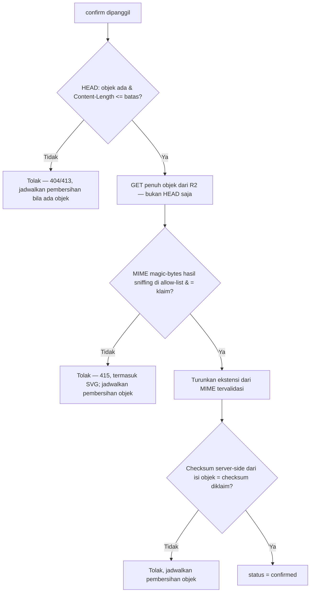

# News Portal — R2 Upload SOP

Standard operating procedure untuk alur upload gambar berita di mode
**full-online R2-only** (lihat
[`full-online-r2-architecture.md`](full-online-r2-architecture.md) §1
untuk asumsi lengkap — dokumen ini **tidak berlaku** untuk offline/LAN).
Ditujukan untuk implementor (Issue #634) dan operator yang perlu
memahami/mendiagnosis alur upload nyata.

## 1. Prasyarat sebelum SOP ini bisa dijalankan

- `NEWS_MEDIA_R2_ENABLED=true` dan seluruh var wajib terisi (lihat
  `full-online-r2-architecture.md` §4).
- `bun run config:validate` lulus (rencana Issue #632/#635 — validasi
  shape env var termasuk memastikan `NEWS_MEDIA_R2_BUCKET` ≠ `R2_BUCKET`).
- `bun run security:readiness` lulus untuk kontrol khusus news media
  (rencana Issue #635) — lihat
  [`r2-security-checklist.md`](r2-security-checklist.md) §Readiness.
- Identity pemanggil punya permission `news_media.upload` (rencana Issue
  #633) — ABAC default-deny seperti endpoint lain.

## 2. Jalur A — Direct-to-R2 (disarankan)

Diagram alur lengkap: `full-online-r2-architecture.md` §7. Langkah
operasional:

1. **Inisiasi** — client (admin UI) memanggil
   `POST /api/v1/news-media/uploads` dengan `{ mimeType, byteSize,
checksumSha256, purpose }`. Server memvalidasi **shape saja** di
   langkah ini (belum ada bytes untuk divalidasi isinya) — `mimeType`
   harus salah satu allow-list (`full-online-r2-architecture.md` §9),
   `byteSize` ≤ `NEWS_MEDIA_R2_MAX_UPLOAD_BYTES`.
2. **Generate object key baru** (§6 arsitektur) dan baris metadata
   `status='pending'`.
3. **Generate presigned PUT URL** dengan TTL
   `NEWS_MEDIA_R2_PRESIGNED_UPLOAD_TTL_SECONDS` (default 300 detik).
   Response ke client: `{ objectKey, presignedUrl, expiresAt }` — **tidak
   pernah** menyertakan kredensial R2 mentah, hanya URL yang sudah
   ditandatangani.
4. **Client PUT langsung** ke `presignedUrl` — bytes gambar tidak pernah
   transit lewat server AWCMS-Mini di langkah ini.
5. **Confirm** — client memanggil
   `POST /api/v1/news-media/{objectKey}/confirm` dengan
   `Idempotency-Key` (mutation high-risk, skill `awcms-mini-idempotency`,
   dan **wajib menulis audit event lewat skill `awcms-mini-audit-log`**
   baik sukses maupun gagal — bukan sekadar correlation-ID logging
   biasa, karena ini menaikkan status metadata ke `confirmed` yang
   dipakai untuk keputusan "boleh direferensikan konten publik").
   Server (`HEAD` SAJA TIDAK PERNAH CUKUP di sini — lihat
   `full-online-r2-architecture.md` §9):
   - `HEAD` objek di R2 sebagai pengecekan cepat — pastikan benar-benar
     ada dan `Content-Length`-nya tidak melebihi
     `NEWS_MEDIA_R2_MAX_UPLOAD_BYTES` (client tidak bisa "confirm" objek
     yang gagal ter-upload atau yang lebih besar dari batas — lihat §9
     arsitektur soal residual risk ukuran di Jalur A).
   - **`GET` penuh objek** (dibatasi ukuran yang sudah divalidasi di
     atas) — bukan `HEAD` saja — untuk (a) menjalankan MIME sniffing
     dari magic bytes terhadap isi objek yang sebenarnya, dan
     (b) menghitung checksum SHA-256 **server-side dari byte yang
     benar-benar diterima**, bukan mempercayai `Content-Length`/ETag
     semata.
   - Bandingkan MIME hasil sniffing terhadap allow-list DAN terhadap
     `mimeType` yang diklaim di langkah 1; bandingkan checksum
     server-side terhadap `checksumSha256` yang diklaim di langkah 1
     (mismatch checksum di sini hanya mendeteksi korupsi transport —
     keputusan MIME/konten selalu dari hasil sniffing, tidak pernah
     dari klaim client).
   - Semua cocok → `status='confirmed'`, `confirmed_at=now()`.
   - Tidak cocok (MIME sniffing gagal allow-list, MIME tidak sama
     dengan klaim, checksum tidak cocok, atau ukuran melebihi batas) →
     `status` tetap `pending` (atau `rejected` bila implementasi
     memilih state eksplisit), response error jelas ke client, dan
     objek dijadwalkan pembersihan (`r2-backup-lifecycle.md` §Lifecycle
     objek pending) — **objek yang MIME-nya tidak lolos sniffing tidak
     pernah dibiarkan reachable publik di bawah status apa pun selain
     dijadwalkan hapus.**
6. **TTL kedaluwarsa sebelum confirm** — bila `confirm` dipanggil setelah
   `expiresAt`, server menolak dan editor harus mengulang dari langkah 1
   (object key baru, presigned URL baru — presigned URL lama tidak
   pernah diperpanjang).

## 3. Jalur B — Server-streaming (tanpa temp file lokal)

Dipakai saat direct-to-R2 dari browser tidak memungkinkan (mis. import
terprogram lewat integrasi lain yang tidak berjalan di browser). Detail
larangan temp file: `full-online-r2-architecture.md` §3.4/§7.

1. Client mengirim `POST /api/v1/news-media/uploads` sebagai
   `multipart/form-data` atau raw body streamed.
2. Server membaca **stream**, bukan buffer penuh:
   - Validasi `Content-Length` terhadap `NEWS_MEDIA_R2_MAX_UPLOAD_BYTES`
     dari header lebih dulu (tolak cepat tanpa membaca body sama sekali
     bila header sudah melebihi batas).
   - Bila `Content-Length` tidak ada/tidak bisa dipercaya, hitung byte
     yang sudah lewat secara kumulatif saat streaming dan **potong
     koneksi** begitu melampaui batas — jangan menunggu EOF dulu.
   - MIME disniff dari beberapa byte pertama stream (magic bytes),
     bukan header `Content-Type` client.
3. Stream yang sudah divalidasi partial-nya diteruskan **langsung** ke
   `Bun.S3Client`'s write API (streaming PUT) — tidak ada
   `Bun.write(tempPath, ...)`, tidak ada `fs.writeFile` perantara, tidak
   ada variabel yang menampung seluruh isi file di memori server untuk
   file besar (bila memungkinkan secara teknis; lihat catatan performa
   di bawah).
4. Checksum dihitung on-the-fly saat byte lewat (hashing incremental),
   dibandingkan terhadap checksum yang diklaim client di akhir stream.
5. Sukses → metadata langsung `confirmed` (tidak ada langkah `confirm`
   terpisah karena server sudah melihat seluruh isi file sendiri).
   Gagal (checksum mismatch/validasi MIME gagal di tengah jalan) →
   objek yang sudah ter-upload sebagian/penuh ke R2 dijadwalkan
   pembersihan, response error ke client.

**Catatan performa/implementasi (Issue #634):** bila runtime Bun/`Bun.S3Client`
tidak mendukung streaming upload tanpa mem-buffer penuh di memori untuk
kasus tertentu, implementor wajib mendokumentasikan batasan itu secara
eksplisit di README modul (bukan mengklaim "no temp file" secara
membabi-buta) — batas ukuran (§`NEWS_MEDIA_R2_MAX_UPLOAD_BYTES`, default
10 MiB) dipilih cukup kecil justru supaya buffering in-memory (bila
benar-benar tak terhindarkan secara teknis) tetap aman untuk resource
server, sebagai pengganti "tidak pernah menyentuh disk" — larangan
tegasnya adalah **disk lokal**, bukan memori proses.

## 4. Urutan validasi (ringkasan dari arsitektur §9)

Tidak ada jalur "lolos sebagian" — kegagalan pada langkah mana pun
menghentikan seluruh proses, konsisten dengan prinsip default-deny (§3
arsitektur). **`HEAD` sendirian tidak pernah menjadi dasar `confirmed`**
— lihat `full-online-r2-architecture.md` §9 untuk kenapa ranged/full
`GET` wajib pada kedua jalur.

## 5. Penanganan error & rollback

| Skenario                                                                                                  | Penanganan                                                                                                                                                                                                    |
| --------------------------------------------------------------------------------------------------------- | ------------------------------------------------------------------------------------------------------------------------------------------------------------------------------------------------------------- |
| PUT ke R2 gagal (network/timeout, Jalur A)                                                                | Client melihat error dari R2 langsung; baris metadata tetap `pending`, dibersihkan oleh lifecycle job.                                                                                                        |
| `confirm` dipanggil tapi objek tidak ada di R2                                                            | `HEAD` gagal → `404`, metadata tetap `pending` (tidak pernah naik jadi `confirmed` tanpa objek nyata).                                                                                                        |
| MIME sniffing hasil `GET` tidak cocok allow-list/klaim, atau checksum server-side mismatch saat `confirm` | Tolak eksplisit, metadata tidak `confirmed`, objek dijadwalkan pembersihan; lihat `r2-incident-response.md` bila polanya berulang/mencurigakan (indikasi upload berbahaya).                                   |
| Retry `confirm` dengan `Idempotency-Key` sama                                                             | Idempotent — request kedua mengembalikan hasil pertama, tidak membuat baris duplikat.                                                                                                                         |
| R2 mengalami outage saat upload                                                                           | Gagal eksplisit ke editor (§3 arsitektur — tidak ada fallback lokal); circuit breaker provider mencegah percobaan berulang membebani R2 yang sedang down (pola sama `object-storage` breaker `sync-storage`). |

## 6. Troubleshooting operator

- **"Upload gagal berulang untuk semua editor"** → cek
  `bun run security:readiness`/kredensial R2 belum kedaluwarsa/rotasi
  (`r2-security-checklist.md` §Rotasi), cek circuit breaker
  `object-storage`/media provider belum dalam status open berkepanjangan.
- **"Gambar sukses upload tapi tidak muncul di halaman publik"** →
  periksa status metadata (`pending` vs `confirmed`) — kemungkinan
  langkah `confirm` belum dipanggil/gagal; periksa juga apakah
  `NEWS_MEDIA_R2_PUBLIC_BASE_URL` custom domain sudah benar dan
  propagasi DNS/TLS-nya selesai.
- **"Editor melaporkan link upload kedaluwarsa"** → normal bila TTL
  presigned URL (default 5 menit) terlampaui sebelum PUT selesai
  (koneksi lambat) — editor mengulang dari langkah inisiasi, bukan
  memakai ulang presigned URL lama.

## 7. Referensi

- `full-online-r2-architecture.md` — arsitektur lengkap, konvensi, dan pemetaan kepatuhan.
- `r2-security-checklist.md` — checklist keamanan sebelum go-live.
- `r2-incident-response.md` — bila ditemukan pola upload mencurigakan.
- `.claude/skills/awcms-mini-idempotency/SKILL.md` — pola `Idempotency-Key`.
- `.claude/skills/awcms-mini-integration/SKILL.md` — timeout/circuit breaker provider eksternal.
