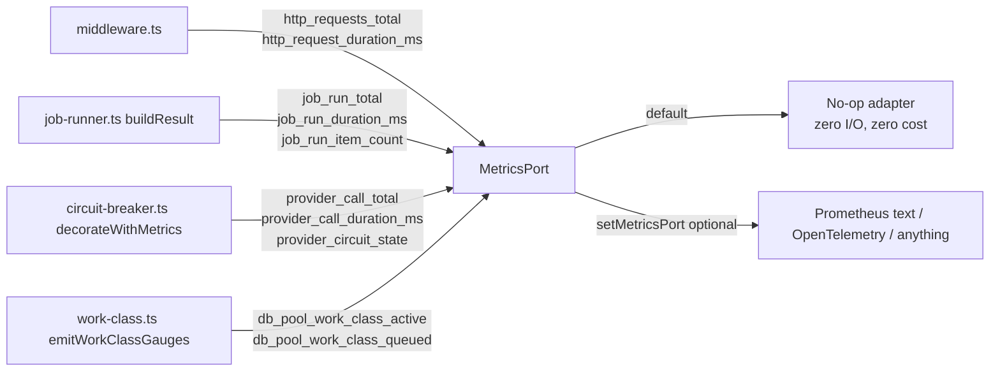

# Observability: Metrics, SLOs, Job Health, and Provider Telemetry

Issue #698 (epic #679, platform-hardening — "operational proof" wave).
Companion to [`deployment-profiles.md`](deployment-profiles.md) §Shared
worker runner and to `.claude/skills/awcms-mini-observability/SKILL.md`
(correlation ID, audit retention, log-sink extension point — Issue #447).
This doc covers the NEW, separate concept this issue adds: low-cardinality
numeric metrics (counters/histograms/gauges), initial SLIs/SLOs, and the
authorized dependency-health endpoint.

**Metrics complement, they do not replace, logging or audit.** The
structured logger (`src/lib/logging/logger.ts`, Issue #447) and the audit
trail (`src/modules/logging/application/audit-log.ts`, doc 10) record
discrete, per-event, high-detail facts. Metrics record aggregates — "how
many", "how fast", "how saturated" — meant to be scraped/pushed to a
time-series backend at a fixed, small cost regardless of traffic volume.
Neither is a substitute for the other, and metrics are **never** an
authorization source.

## Architecture



- **`src/lib/observability/metrics-port.ts`** — the port contract
  (`MetricsPort`: `incrementCounter`/`observeHistogram`/`setGauge`), the
  `METRIC_DEFINITIONS` registry (every metric name, its allowed label keys,
  an `approxCardinality` estimate, and a `privacyNote` — the "documented
  cardinality and privacy review" the issue's first acceptance criterion
  asks for), and `recordCounter`/`recordHistogram`/`recordGauge` — the ONLY
  sanctioned way application code emits a metric. These three functions
  drop any label key not declared for that metric (defense in depth) and
  never let a registered adapter's own thrown error escape (mirrors
  `logger.ts`'s `LogSink` error containment).
- **`src/lib/observability/in-memory-metrics-port.ts`** — a test double /
  minimal real adapter, used by every unit test in this codebase that
  asserts "a metric was recorded".
- **`src/lib/observability/adapters/prometheus-text-adapter.ts`** — a
  dependency-free, Bun-only Prometheus text-exposition adapter. NOT wired
  up anywhere by default; see its own doc comment for the two-line
  `setMetricsPort(createPrometheusTextMetricsPort())` a derived app adds
  to actually use it, and for how an OpenTelemetry adapter would follow
  the identical shape.
- **Default is always the no-op adapter.** Every offline/LAN deployment
  that never calls `setMetricsPort` pays zero I/O cost and needs no
  external collector — this is the guardrail "Offline/LAN operation works
  with no external collector" satisfied by construction, not by a runtime
  check.

## Where metrics are hooked in — and why no call site was touched

The issue's context explicitly asks for provider/job/pool metrics to be
wired through the EXISTING shared mechanisms, not duplicated at each call
site. Concretely:

- **Job run status/backlog** — `src/lib/jobs/job-runner.ts`'s `buildResult`
  is the single function every one of `runJob`'s ~5 return paths (lock
  acquire failure, skip-on-contention, success/partial, timeout/terminated,
  thrown error) already funnels through. `emitJobRunMetrics` is called once
  there — every current job (`logs:audit:purge`, `modules:sync`,
  `news-media:reconcile`) and every future one migrated to `runJob` gets
  `job_run_total`/`job_run_duration_ms`/`job_run_item_count` for free,
  without any script-level change.
- **Provider outcome/latency/circuit state** — `src/lib/database/circuit-breaker.ts`'s
  `getDatabaseCircuitBreaker()`/`getProviderCircuitBreaker()` are the two
  functions every one of this repo's ~10 provider call sites (email,
  object storage, Turnstile, Cloudflare DNS, Google/generic OIDC SSO, …)
  already goes through — no call site calls `createCircuitBreaker`
  directly. A new `decorateWithMetrics` wrapper sits between those two
  functions and the pure breaker `createCircuitBreaker` returns, so metrics
  come from that ONE wrapper, and `createCircuitBreaker` itself stays
  exactly as pure/timer-free as its own doc comment promises. `recordSuccess`/
  `recordFailure` gained an OPTIONAL second `durationMs` argument — every
  existing call site keeps compiling and behaving identically without
  passing it; only a future call site that wants latency observed needs to
  pass it.
- **DB pool saturation** — `src/lib/database/work-class.ts`'s `gates`
  object is the ONE place `active`/`queue.length` ever change (acquire,
  hand-off on release, decrement on release, timeout eviction).
  `emitWorkClassGauges(workClass)` is called at each of those four points.
  `/api/v1/database/pool/health` and `getWorkClassSaturation()` needed NO
  changes — they already read the same `gates` state this now also
  mirrors into metrics.
- **HTTP request outcome/latency** — `src/middleware.ts`'s `onRequest` is
  the one function every request passes through. `recordHttpRequestMetrics`
  is called at each of its response-producing branches (oversized-body
  short-circuit, public routes, `/admin/*`, and the redirect-to-login
  branch), using `context.routePattern` — Astro's own static,
  file-based route pattern (e.g. `"/api/v1/modules/[moduleKey]/health"`,
  the literal bracketed placeholder) — never the concrete request path
  with a real id in it.

## Cardinality and privacy review (acceptance criterion)

Every metric this codebase emits is declared in `METRIC_DEFINITIONS`
(`src/lib/observability/metrics-port.ts`) with its full label set, an
`approxCardinality` estimate, and a `privacyNote`. Summary:

| Metric                                         | Type      | Labels                                 | Approx. cardinality      | Why it's bounded/private                                                                                        |
| ---------------------------------------------- | --------- | -------------------------------------- | ------------------------ | --------------------------------------------------------------------------------------------------------------- |
| `http_requests_total`                          | counter   | `method`, `routePattern`, `statusCode` | low thousands worst case | `routePattern` is Astro's static route pattern (never a concrete id); `statusCode`/`method` are fixed enums.    |
| `http_request_duration_ms`                     | histogram | `method`, `routePattern`               | ~1000 bound              | Same as above.                                                                                                  |
| `db_pool_work_class_active`                    | gauge     | `workClass`                            | exactly 5                | Fixed `WorkClass` enum.                                                                                         |
| `db_pool_work_class_queued`                    | gauge     | `workClass`                            | exactly 5                | Fixed `WorkClass` enum.                                                                                         |
| `db_pool_work_class_rejected_total`            | counter   | `workClass`                            | exactly 5                | Fixed `WorkClass` enum (Issue #743 — bounded-queue immediate rejections).                                       |
| `db_pool_work_class_wait_ms`                   | histogram | `workClass`, `outcome`                 | 10 bound                 | Fixed `WorkClass` enum x 2 outcomes (`acquired`/`timeout`) (Issue #743).                                        |
| `db_pool_capacity_configured_connections`      | gauge     | `processClass`                         | exactly 3                | Fixed `ProcessClass` enum (`app`/`worker`/`setup`) (Issue #743).                                                |
| `db_pool_capacity_estimated_total_connections` | gauge     | `scenario`                             | exactly 2                | `scenario` is `expected`/`max` only (Issue #743).                                                               |
| `db_pool_capacity_approved_budget`             | gauge     | (none)                                 | exactly 1                | Unlabeled single value (Issue #743).                                                                            |
| `job_run_total`                                | counter   | `jobName`, `status`                    | ~120 bound               | `jobName` is a literal `JobDefinition.name` a script hardcodes; `status` is the fixed 6-value `JobStatus` enum. |
| `job_run_duration_ms`                          | histogram | `jobName`                              | ~20 bound                | Same.                                                                                                           |
| `job_run_item_count`                           | gauge     | `jobName`, `itemName`                  | low hundreds bound       | `itemName` is a literal object key a job handler writes in its own source, never request/tenant-supplied.       |
| `provider_call_total`                          | counter   | `provider`, `outcome`                  | ~20 bound                | `provider` is `deriveProviderFamilyLabel`'s bounded family prefix — see below.                                  |
| `provider_call_duration_ms`                    | histogram | `provider`                             | ~10 bound                | Same.                                                                                                           |
| `provider_circuit_state`                       | gauge     | `provider`                             | ~10 bound                | Same. Encoded `0=closed, 1=half_open, 2=open`.                                                                  |

**The one label that needed a specific bounding mechanism**:
`getProviderCircuitBreaker`'s registry key can be tenant-scoped — e.g.
generic-oidc-client.ts builds `sso-oidc-discovery:<tenantId>:<providerKey>`
(Issue #610's cross-tenant isolation fix). Putting that raw string in a
metric label would be BOTH a tenant-id leak and unbounded cardinality
(one series per tenant, forever). `deriveProviderFamilyLabel`
(`circuit-breaker.ts`) keeps only the literal, code-hardcoded prefix before
the first `:` — every provider call site in this repo follows the same
"literal-category-prefix, optional dynamic `:`-suffix" convention, so one
generic split rule is sufficient without needing to enumerate every
provider by name. The same function backs both the metrics label AND the
`GET /api/v1/logs/observability/dependency-health` endpoint's
`optionalProviders[].family` field, so the two never drift apart.

**No tenant IDs, unbounded-ID routes, email/IP, object keys, tokens,
prompts, or conversation content appear in any label above** — every value
is either a fixed enum member or a code-literal string, never data that
originates from a request body, a tenant record, or a token.

## Initial SLIs/SLOs and burn-rate guidance

These are STARTING targets for a derived application to tune, not
contractual commitments of this base. Each SLI is computable directly from
the metrics above; a real alerting backend (Prometheus recording
rules/alertmanager, or an OpenTelemetry-based equivalent) is where the
actual burn-rate math would run — this base does not ship one (see
guardrail: no coupling to a single SaaS).

| SLO                           | SLI (derived from)                                                                               | Initial target                                                          |
| ----------------------------- | ------------------------------------------------------------------------------------------------ | ----------------------------------------------------------------------- |
| HTTP availability             | `1 - (http_requests_total{statusCode=~"5.."} / http_requests_total)`                             | 99.9% over a rolling 28 days                                            |
| HTTP latency                  | p95 of `http_request_duration_ms` per `routePattern`                                             | < 500ms for `interactive`-class routes                                  |
| DB pool headroom              | `db_pool_work_class_active / max` per `workClass` (max is the fixed constant in `work-class.ts`) | < 0.8 for 99% of 5-minute windows, `critical_transaction`/`interactive` |
| Job success rate              | `job_run_total{status="success"} / job_run_total` per `jobName`                                  | ≥ 99% over a rolling 7 days                                             |
| Provider circuit availability | fraction of time `provider_circuit_state != 2 (open)` per `provider`                             | ≥ 99.5% over a rolling 7 days                                           |

**Burn-rate guidance** (multi-window, multi-burn-rate — the same shape as
the Google SRE workbook's approach, adapter-agnostic):

- **Fast burn** (page immediately): error budget consumed at >14.4x the
  sustainable rate over both a 5-minute AND a 1-hour window (catches a
  short, severe outage without waiting for a full evaluation window).
- **Slow burn** (ticket, not page): error budget consumed at >1x to >6x the
  sustainable rate sustained over a 6-hour AND a 3-day window (catches a
  slow, creeping regression a fast-burn rule would miss).
- Apply the same two-window pattern to EVERY SLO above, not just HTTP
  availability — e.g. "job success rate slow-burn" over 6h/3d windows
  catches a job that has started silently degrading (more `partial`/
  `failed` runs) well before its 7-day rolling average crosses 99%.

## Dashboard/runbook examples (no SaaS coupling)

A minimal dashboard needs four panel groups, one per hooked source above —
none of this requires a specific vendor, only a data source that can query
whatever `MetricsPort` adapter is registered:

1. **HTTP** — request rate (`http_requests_total` by `statusCode` class),
   p50/p95/p99 latency (`http_request_duration_ms`) by `routePattern`.
2. **Database pool** — `db_pool_work_class_active`/`max` ratio and
   `db_pool_work_class_queued` per `workClass`, plus
   `provider_circuit_state{provider="database"}`.
3. **Jobs** — `job_run_total` by `status` per `jobName` (stacked bar),
   `job_run_duration_ms` p95 per `jobName`, `job_run_item_count` as a
   backlog trend line per `jobName`+`itemName`.
4. **Providers** — `provider_circuit_state` per `provider` (0/1/2, a
   simple state timeline reads well here), `provider_call_total` by
   `outcome`, `provider_call_duration_ms` p95.

**Runbook — actionable steps per signal:**

| Signal fires                                                              | First check                                                                                                                     | Likely fix                                                                                                                |
| ------------------------------------------------------------------------- | ------------------------------------------------------------------------------------------------------------------------------- | ------------------------------------------------------------------------------------------------------------------------- |
| `http_requests_total{statusCode=~"5.."}` spike                            | Correlate `routePattern` + time window against structured logs (`correlationId` in matching log lines/audit events)             | Roll back the deploy that introduced it, or fix the specific handler.                                                     |
| `db_pool_work_class_*` saturated for `critical_transaction`/`interactive` | Check `provider_circuit_state{provider="database"}` — is the DB itself degraded, or is it a slow-query regression?              | Scale `DATABASE_POOL_MAX` (doc 18), or find/fix the slow query (see `awcms-mini-performance`).                            |
| `job_run_total{status="failed"}` spike for one `jobName`                  | Pull the job's own structured log lines / `--json-output` telemetry for the sanitized `error`/`retryClassification`             | Fix the underlying cause; a `retryable` classification means the next scheduled tick will self-heal.                      |
| `provider_circuit_state{provider=X}` at `open` (2)                        | Check that provider's own health-check endpoint if it has one (e.g. `bun run email:provider:health`) and its outage status page | Wait for the breaker's `openDurationMs` half-open trial, or escalate to the provider if the outage is confirmed external. |

## Authorized dependency health endpoint

`GET /api/v1/logs/observability/dependency-health`
(`src/pages/api/v1/logs/observability/dependency-health.ts`) — the
AUTHORIZED counterpart to the public `/api/v1/health` (liveness) and
`/api/v1/database/pool/health` (unauthenticated local-dependency
aggregate) endpoints. Requires a valid session and the
`logging.observability.read` permission (migration
`047_awcms_mini_observability_metrics_permission.sql`). Response shape:

```json
{
  "data": {
    "generatedAt": "2026-07-12T04:00:00.000Z",
    "localDependencies": [
      {
        "name": "database",
        "status": "healthy",
        "circuitBreakerState": "closed",
        "workClasses": [
          {
            "workClass": "critical_transaction",
            "active": 0,
            "max": 10,
            "queued": 0
          }
        ]
      }
    ],
    "optionalProviders": [
      { "family": "email", "circuitBreakerState": "closed" },
      { "family": "sso-oidc-discovery", "circuitBreakerState": "open" }
    ]
  }
}
```

`optionalProviders` never exposes a raw circuit-breaker registry key —
only the bounded `family` label (same `deriveProviderFamilyLabel` the
metrics layer uses). A provider never called yet simply has no entry (not
a bug — there is no state to report). When more than one registered
breaker maps to the same family (e.g. two tenants' SSO discovery
breakers), the WORST state is reported for that family — a single
aggregate signal, never a per-tenant breakdown.

## Optional Prometheus/OpenTelemetry integration (not coupled to core runtime)

```ts
// A derived application's own bootstrap code — NOT part of this base's
// default runtime path.
import { setMetricsPort } from "src/lib/observability/metrics-port";
import { createPrometheusTextMetricsPort } from "src/lib/observability/adapters/prometheus-text-adapter";

const prometheus = createPrometheusTextMetricsPort();
setMetricsPort(prometheus);

// Expose to a Prometheus scraper via a NEW route the derived app adds
// itself — deliberately not shipped here, since scrape-endpoint exposure
// policy (network-restricted? admin-only? separate port?) is a deployment
// decision, not something this base should decide on a derived app's
// behalf:
// return new Response(prometheus.renderPrometheusText(), {
//   headers: { "content-type": "text/plain; version=0.0.4" }
// });
```

An OpenTelemetry adapter follows the identical shape: implement
`MetricsPort`'s three methods against `@opentelemetry/api`'s
Counter/Histogram/Gauge instruments instead of the in-memory maps the
Prometheus adapter uses. Not included as actual code in this base to avoid
adding an unused dependency — `prometheus-text-adapter.ts` is the pattern
to copy.

## Testing

- `tests/unit/observability-metrics-port.test.ts` — no-op default never
  throws, label filtering (drops undeclared keys), adapter error
  containment.
- `tests/unit/observability-in-memory-metrics-port.test.ts` — the
  in-memory adapter's own counter/histogram/gauge accumulation semantics.
- `tests/unit/observability-prometheus-adapter.test.ts` — the
  representative Prometheus adapter's exposition-format rendering
  (HELP/TYPE, cumulative buckets, `+Inf`, sum/count).
- `tests/unit/job-runner-metrics.test.ts`,
  `tests/unit/circuit-breaker-metrics.test.ts`,
  `tests/unit/work-class-metrics.test.ts` — each hook point, including the
  tenant-scoped-key-to-bounded-family-label reduction.
- `tests/unit/observability-metrics-performance.test.ts` — load/smoke
  proof: 50,000 `recordCounter`/`recordHistogram`/`recordGauge` calls
  (the same functions `middleware.ts`/`job-runner.ts`/`circuit-breaker.ts`/
  `work-class.ts` call) complete in well under 1 second, for both the
  no-op default and a real adapter — proving the label-filtering +
  error-containment wrapper adds no material per-request overhead.
  `middleware.ts` itself cannot be unit-tested directly (it imports the
  `astro:middleware` virtual module, only resolvable inside Astro's own
  pipeline — same documented limitation as `collectRequestAnalytics`).
- `tests/integration/observability-dependency-health.integration.test.ts`
  — the authorized endpoint against real PostgreSQL: tenant/auth
  requirements, a healthy closed-circuit database dependency, and an
  open provider circuit reported under its bounded family label with the
  raw tenant-scoped key/tenant id proven absent from the response body.

## Related: performance suite (Issue #744)

[`performance-suite.md`](performance-suite.md)'s `saturation-and-recovery`
scenario directly reads back the REAL `db_pool_work_class_active`/
`db_pool_work_class_queued`/`db_pool_work_class_rejected_total` signals
this document describes (via `getWorkClassSaturation()` — no second
accounting mechanism) as its recovery proof, and its report artifact
additionally captures process CPU/memory and `pg_stat_activity`/
`pg_locks`-derived connection/lock signals — read-only samples, not new
metrics-port entries.
