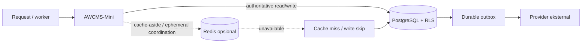

# Redis Readiness — Kapabilitas Opsional AWCMS-Mini

> Status: pondasi opsional untuk Issue #890. Redis **tidak aktif secara default** dan tidak mengubah PostgreSQL sebagai sumber kebenaran.

## 1. Tujuan

AWCMS-Mini mempersiapkan integrasi Redis untuk kebutuhan aplikasi turunan yang mulai berjalan pada lebih dari satu instance atau memiliki beban baca tinggi. Pondasi ini menggunakan `RedisClient` native Bun sehingga tidak menambah package Redis berbasis Node.js.

Redis pada AWCMS-Mini adalah **infrastruktur akselerasi dan koordinasi sementara**, bukan database transaksi utama. Seluruh kontrol tenant, RLS, audit, durable outbox, workflow, dan data domain authoritative tetap berada di PostgreSQL.

## 2. Keputusan arsitektur



Prinsipnya:

1. **Default disabled** — `REDIS_ENABLED=false` atau tidak diisi berarti tidak ada koneksi Redis.
2. **Fail-open untuk cache** — gangguan Redis menjadi cache miss atau cache write skip; transaksi bisnis tidak gagal.
3. **PostgreSQL authoritative** — Redis tidak boleh menjadi satu-satunya tempat menyimpan data yang harus dapat dipulihkan atau diaudit.
4. **Tenant-aware key** — data tenant wajib memakai `tenantId` melalui `buildRedisKey()`.
5. **TTL wajib** — helper JSON menggunakan `SET ... EX`; nilai cache tidak boleh hidup tanpa batas.
6. **Tidak di dalam transaksi database** — akses Redis dilakukan sebelum atau setelah transaksi PostgreSQL, bukan di callback transaksi.
7. **Tidak ada port publik** — overlay Compose hanya membuka Redis pada jaringan internal Compose.

## 3. Komponen implementasi

| Komponen | Fungsi |
| --- | --- |
| `src/lib/redis/config.ts` | Parsing konfigurasi, validasi, redaksi URL, key builder tenant-aware |
| `src/lib/redis/client.ts` | Singleton `RedisClient` native Bun, timeout, health check, lifecycle |
| `src/lib/redis/cache.ts` | Helper JSON cache-aside, invalidasi, dan fail-open |
| `scripts/redis-health.ts` | Pemeriksaan konfigurasi serta PING tanpa membocorkan credential |
| `docker-compose.redis.yml` | Overlay deployment opsional dan hardened |
| `config/redis.env.example` | Contoh konfigurasi terpisah dari profil default dan sesuai hygiene repo |
| `tests/unit/redis-foundation.test.ts` | Unit test tanpa Redis/network hidup |

Tidak ada dependency runtime baru dan `bun.lock` tidak berubah.

## 4. Kasus penggunaan yang disetujui

### 4.1 Cache laporan agregat

Contoh: ringkasan dashboard yang dihitung dari query PostgreSQL mahal dan boleh stale selama 30–300 detik.

```ts
const key = buildRedisKey({
  namespace: "reporting",
  tenantId,
  key: `activity:${range}`
});

const report = await redisCacheAside(
  key,
  () => loadActivityReportFromPostgres(tenantId, range),
  { ttlSec: 60 }
);
```

### 4.2 Cache metadata referensi yang jarang berubah

Contoh: daftar provinsi/kabupaten, konfigurasi publik tenant, feature flag hasil komputasi, atau katalog yang tetap memiliki sumber authoritative di PostgreSQL.

Invalidasi harus dilakukan setelah commit perubahan sumber data. TTL tetap dipasang sebagai perlindungan bila invalidasi event gagal.

### 4.3 Distributed rate limiting

Dapat ditambahkan pada issue terpisah untuk rate limit lintas instance. Implementasi harus atomic, misalnya memakai Lua script atau kombinasi command yang telah dianalisis race condition-nya. Rate limit keamanan wajib memiliki strategi saat Redis gagal: fail-closed hanya untuk endpoint yang memang ditetapkan high-risk dan setelah ada keputusan arsitektur; endpoint umum tetap menggunakan fallback lokal atau fail-open yang terdokumentasi.

### 4.4 Idempotency acceleration

Redis dapat mempercepat pemeriksaan key idempotency jangka pendek, tetapi record idempotency authoritative dan hasil transaksi tetap disimpan di PostgreSQL. Redis hanya menjadi negative/positive cache yang dapat direkonstruksi.

### 4.5 Cache invalidation antar-instance

Pub/Sub dapat dipakai untuk menyebarkan sinyal invalidasi cache. Bun menandai dukungan Pub/Sub Redis sebagai eksperimental, sehingga payload harus idempotent dan kehilangan pesan tidak boleh membuat data salah; TTL tetap menjadi fallback.

### 4.6 Short-lived distributed lock

Lock dapat digunakan untuk pekerjaan rekonsiliasi atau refresh cache yang aman diulang. Lock tidak boleh dipakai untuk menggantikan constraint PostgreSQL, row lock, unique index, atau serialisasi transaksi bisnis. Implementasi lock harus memiliki token kepemilikan, TTL, atomic release, fencing token bila dampaknya tinggi, dan test terhadap pause/expiry.

## 5. Penggunaan yang dilarang tanpa desain baru

Redis tidak boleh langsung digunakan sebagai:

- sumber tunggal sesi autentikasi;
- penyimpanan audit log atau security event;
- pengganti PostgreSQL outbox/inbox;
- penyimpanan workflow approval, transaksi, saldo, stok, dokumen posted, atau data legal;
- pengganti RLS/RBAC/ABAC;
- queue dengan klaim exactly-once tanpa desain delivery semantics;
- tempat menyimpan password, token provider, NIK, data kesehatan, atau data pribadi mentah;
- dependency sinkron di dalam transaksi PostgreSQL.

Perubahan pada area tersebut memerlukan issue tersendiri, threat model, data classification, recovery objective, OpenAPI/AsyncAPI bila relevan, serta migration plan.

## 6. Konfigurasi

Gunakan `config/redis.env.example` sebagai referensi terpisah. Salin menjadi file lokal yang diabaikan Git sebelum dipakai, misalnya `.env.redis`.

| Variable | Default | Keterangan |
| --- | ---: | --- |
| `REDIS_ENABLED` | `false` | Gate utama; tidak ada koneksi ketika false |
| `REDIS_URL` | tidak ada | URL Redis/Valkey yang didukung Bun; wajib bila enabled |
| `REDIS_KEY_PREFIX` | `awcms-mini` | Prefix aplikasi dan boundary ACL key |
| `REDIS_CONNECTION_TIMEOUT_MS` | `2000` | Batas koneksi awal |
| `REDIS_COMMAND_TIMEOUT_MS` | `1000` | Batas command aplikasi |
| `REDIS_MAX_RETRIES` | `3` | Retry reconnect; offline queue dimatikan |
| `REDIS_CACHE_DEFAULT_TTL_SEC` | `300` | TTL helper cache JSON |

URL yang didukung oleh Bun mencakup `redis://`, `rediss://`, `redis+tls://`, dan Unix socket. Bun native Redis client memerlukan Redis server versi 7.2 atau lebih baru.

Validasi khusus Redis dijalankan dengan:

```bash
bun run redis:health
```

Hasil:

- `disabled`: valid, exit code 0, tidak mencoba koneksi;
- `healthy`: konfigurasi valid dan PING berhasil;
- `unhealthy`: koneksi/PING gagal, exit code 1;
- `invalid_configuration`: konfigurasi enabled tidak valid, exit code 1.

Credential pada URL selalu diredaksi pada output.

## 7. Deployment Docker Compose

### 7.1 Menjalankan overlay

```bash
cp config/redis.env.example .env.redis
# Simpan REDIS_PASSWORD yang panjang dan URL-safe di secret manager.

docker compose \
  --env-file .env \
  --env-file .env.redis \
  -f docker-compose.yml \
  -f docker-compose.redis.yml \
  up --build
```

Overlay menambahkan:

- Redis `8.2.7-alpine` yang kompatibel dengan Bun native client;
- ACL user `awcms_app`, default user dimatikan;
- akses key dibatasi ke `${REDIS_KEY_PREFIX}:*`;
- kategori command berbahaya ditolak;
- AOF `everysec` dan snapshot untuk recovery operasional;
- `noeviction` sebagai default agar Redis tidak diam-diam membuang state non-cache yang mungkin ditambahkan kelak;
- health check berautentikasi;
- volume data dan config terpisah;
- tidak ada `ports:` ke host;
- `cap_drop: [ALL]`, `no-new-privileges`, serta resource limit.

`redis-acl-init` membuat file ACL pada named volume menggunakan hash SHA-256 password; plaintext password tidak ditulis ke volume.

### 7.2 Coolify

Untuk Coolify, gunakan Compose deployment atau resource Redis terkelola yang berada pada internal network yang sama. Ketentuan minimum:

1. Jangan expose port 6379 ke internet.
2. Simpan `REDIS_PASSWORD`/`REDIS_URL` pada secret environment Coolify.
3. Gunakan health check `bun run redis:health` setelah app ter-deploy.
4. Pisahkan Redis production, staging, dan development.
5. Pasang memory limit dan alert `used_memory`, `evicted_keys`, `rejected_connections`, latency, persistence error, dan restart count.
6. Backup volume/AOF bila Redis sudah menampung koordinasi yang perlu dipulihkan; cache murni boleh direkonstruksi.

### 7.3 LAN/offline

Redis tidak diperlukan pada instalasi satu instance dengan beban normal. Tambahkan overlay hanya bila ada manfaat terukur, misalnya query dashboard mahal, concurrency worker tinggi, atau beberapa instance app pada LAN. Hilangnya Redis tidak boleh menghentikan pelayanan inti.

## 8. Security baseline

### 8.1 Network dan autentikasi

- Redis berada di trusted internal network.
- Port 6379 tidak dipublish.
- Default user dimatikan.
- Aplikasi memakai ACL user khusus dan key pattern terbatas.
- Untuk koneksi lintas host/VPC yang tidak sepenuhnya trusted, gunakan TLS (`rediss://`).
- Rotasi credential dilakukan melalui secret manager dan restart terkontrol.

### 8.2 Data minimization

Cache hanya menyimpan data minimum yang dibutuhkan. Data sensitif harus dihindari; bila benar-benar diperlukan, lakukan threat model, encrypt payload sebelum Redis, TTL sangat pendek, dan audit akses administratif. Jangan memasukkan credential atau PII ke nama key karena key terlihat pada telemetry/administrasi Redis.

### 8.3 Logging

Kode tidak mencatat payload, value, password, atau URL mentah. Error dilewatkan melalui sanitizer dan URL diagnostic menggunakan `redactRedisUrl()`.

### 8.4 Availability

`enableOfflineQueue=false` mencegah command menumpuk tanpa batas saat Redis putus. Timeout command pendek menjaga backpressure. Cache helper selalu fail-open, sedangkan health CLI memberi exit code non-zero agar preflight/deployment dapat mendeteksi kegagalan.

## 9. Konsistensi dan invalidasi

Pola default adalah **cache-aside**:

1. Baca Redis.
2. Jika miss, baca PostgreSQL dengan tenant context + RLS.
3. Setelah hasil authoritative tersedia, tulis Redis dengan TTL.
4. Mutation menulis PostgreSQL lebih dulu.
5. Setelah commit berhasil, hapus/refresh key terkait.
6. Jika invalidasi Redis gagal, TTL membatasi staleness.

Jangan melakukan dual-write PostgreSQL + Redis sebagai satu transaksi semu. Redis dan PostgreSQL tidak memiliki atomic commit bersama; outbox/event setelah commit lebih aman untuk invalidasi lintas proses.

## 10. Kapasitas dan eviction

Mulai dengan `maxmemory=256mb` dan `maxmemory-policy=noeviction`, lalu ukur. Untuk instance yang dipastikan **cache-only**, issue deployment terpisah dapat memilih `allkeys-lru` atau kebijakan lain setelah memastikan tidak ada lock, rate-limit state, atau ephemeral coordination kritis yang berbagi instance.

Sebaiknya pisahkan logical purpose atau bahkan instance Redis ketika karakteristiknya berbeda:

| Purpose | Persistence | Eviction | Dampak kehilangan data |
| --- | --- | --- | --- |
| Cache laporan | opsional | LRU/LFU dapat diterima | query kembali ke PostgreSQL |
| Rate limiting | biasanya tidak wajib | hindari eviction prematur | limit sementara kurang akurat |
| Lock/coordination | tidak untuk recovery | `noeviction` | duplicate work mungkin terjadi |
| Pub/Sub invalidation | tidak persisten | tidak relevan | TTL memperbaiki akhirnya |
| Queue durable | jangan memakai pondasi ini langsung | `noeviction` | butuh desain queue terpisah |

## 11. Testing

Unit test tidak membutuhkan Redis hidup:

```bash
bun test tests/unit/redis-foundation.test.ts
```

Integration verification opsional:

```bash
docker compose \
  --env-file .env \
  --env-file .env.redis \
  -f docker-compose.yml \
  -f docker-compose.redis.yml \
  up -d redis-acl-init redis

docker compose \
  --env-file .env \
  --env-file .env.redis \
  -f docker-compose.yml \
  -f docker-compose.redis.yml \
  exec app bun run redis:health
```

Catatan: overlay tidak mempublish port Redis. Untuk health dari host, gunakan `docker compose exec app bun run redis:health` atau buat override development yang hanya bind ke `127.0.0.1`, jangan `0.0.0.0`.

## 12. Roadmap adopsi bertahap

### Tahap 0 — pondasi ini

- konfigurasi typed;
- Bun native client;
- fail-open cache helper;
- health CLI;
- deployment overlay hardened;
- unit test dan dokumentasi.

### Tahap 1 — pilot cache terukur

Pilih satu read model non-sensitif, misalnya dashboard tenant activity. Tetapkan baseline latency/query count, TTL, invalidation, hit ratio, dan rollback flag. Redis tidak diaktifkan untuk seluruh modul sekaligus.

### Tahap 2 — horizontal runtime

Setelah app berjalan multi-instance, implementasikan rate limiter/distributed coordination melalui issue terpisah. Tambahkan metrics dan chaos test Redis unavailable/slow.

### Tahap 3 — managed/HA Redis

Bila RTO/RPO dan traffic memerlukan high availability, gunakan Redis managed service atau arsitektur client yang mendukung topology tersebut. Bun native client saat ini tidak mendukung Redis Sentinel dan Redis Cluster; jangan mengklaim HA client-side sebelum limitation ini diselesaikan atau adapter lain disetujui secara eksplisit.

## 13. Kepatuhan dan standar

Implementasi mendukung kontrol praktis berikut:

- **ISO/IEC 27001 & 27002**: least privilege, network segregation, secret management, logging, capacity, backup, dan change management.
- **ISO/IEC 27005**: Redis diperlakukan sebagai risk-bearing dependency opsional dengan threat/availability assessment.
- **ISO/IEC 20000-1**: health check, operasional deployment, incident diagnosis, dan capacity management.
- **ISO 22301**: fallback PostgreSQL dan cache reconstruction menjaga continuity ketika Redis gagal.
- **ISO/IEC 27017**: internal network, secret environment, dan isolation untuk deployment cloud/Coolify.
- **ISO/IEC 27018 & 27701**: data minimization dan larangan menyimpan PII sensitif secara default.
- **ISO/IEC 27034**: secure application design, validation, timeout, safe error, dan test.
- **OWASP ASVS/API Security**: no secret leakage, fail-safe timeout, resource limitation, dan dependency isolation.
- **UU PDP, UU ITE, PP PSTE**: data pribadi tetap diminimalkan, dikendalikan, dan tidak dipindahkan ke cache tanpa dasar kebutuhan serta perlindungan yang sesuai.

Pemetaan ini bukan sertifikasi otomatis. Evidence operasional tetap diperlukan: konfigurasi production, hasil test, backup/restore, monitoring, incident record, access review, dan change approval.

## 14. Definition of Done untuk penggunaan pertama

Sebelum modul pertama memakai Redis:

- [ ] use case dan data classification disetujui;
- [ ] PostgreSQL tetap authoritative;
- [ ] key tenant-aware dan prefix ACL sesuai;
- [ ] TTL dan staleness budget terdokumentasi;
- [ ] invalidation setelah commit tersedia;
- [ ] Redis unavailable/slow test lulus;
- [ ] tidak ada akses Redis di dalam transaksi PostgreSQL;
- [ ] metric hit/miss/error/latency tersedia;
- [ ] memory limit dan eviction policy disetujui;
- [ ] secret rotation dan incident SOP tersedia;
- [ ] rollback cukup dengan `REDIS_ENABLED=false`;
- [ ] `bun run redis:health`, unit test, typecheck, dan full check lulus.
