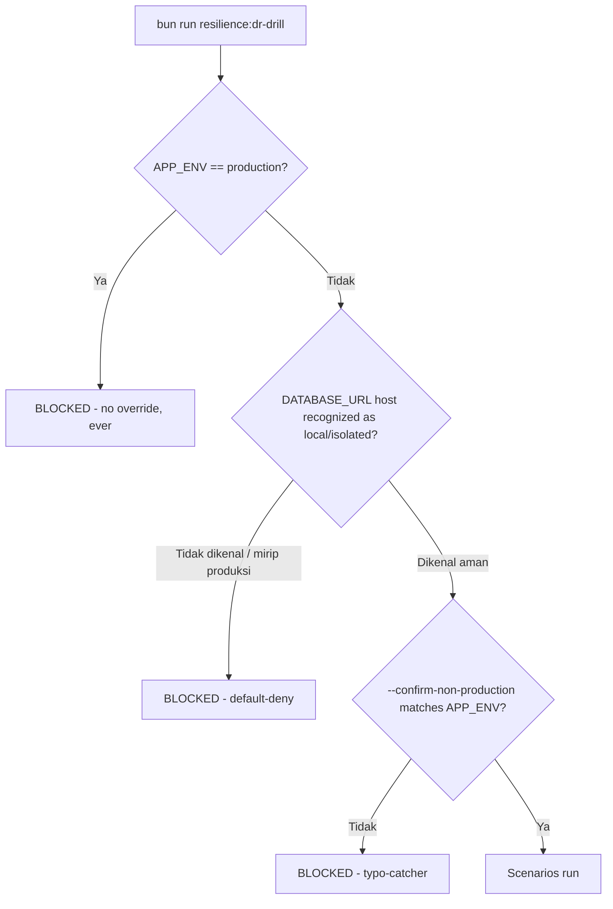

# Resilience & Disaster-Recovery Verification

Issue #699 (epic #679, platform-hardening). Companion to
[`production-preflight-runbook.md`](production-preflight-runbook.md) and
[`deployment-profiles.md`](deployment-profiles.md) — this doc covers
`bun run resilience:dr-drill` (`scripts/dr-drill.ts`), the failure-
injection and disaster-recovery verification tool, its scenario catalog,
and its safety model. Depends conceptually on Issue #684 (production
preflight's `authorizeApply` pattern), #691 (`deploy/backup/
restore-drill.sh`), and #697 (the shared worker runner,
`src/lib/jobs/job-runner.ts`) — all three are reused directly below, not
reimplemented.

## Why this exists

Documented recovery behavior (backup/restore, worker interruption
handling, provider-outage isolation) is only evidence once it has been
exercised under a controlled failure and produced a reproducible result.
Before this issue, each of those mechanisms had its own dedicated test
coverage (`tests/integration/backup-restore-drill.integration.test.ts`,
`tests/integration/job-runner.integration.test.ts`,
`tests/integration/email-dispatch.integration.test.ts`, …) but nothing
tied them together into one DR-oriented run with a single pass/fail
verdict and RTO/RPO evidence — an operator preparing for go-live (doc 07
§Go-live plan) had no single command to answer "does our documented
recovery story actually hold, right now, in this environment?".

## Safety interlock (non-negotiable)

`src/lib/resilience/target-guard.ts`'s `authorizeDrDrill` is the single
gate every run passes through before ANY scenario executes:



Two properties make this stricter than `production:preflight`'s own
`authorizeApply` (Issue #684), which it otherwise mirrors in shape (a
single pure, unit-tested gate function; an explicit
`--confirm-non-production=<APP_ENV value>` typo-catcher identical in
spirit to `--acknowledge-target`):

- **`APP_ENV=production` has NO override flag at all.** `authorizeApply`
  lets an operator apply migrations to production given the right
  evidence flags; a chaos/failure-injection tool has no equivalent
  legitimate use case against production, so this refusal cannot be
  bypassed by any combination of flags.
- **Default-deny on the database host.** `isProductionLikeTarget`
  recognizes a small allowlist of local/isolated hostnames
  (`localhost`/`127.0.0.1`/`::1`/`postgres`/`db`/`0.0.0.0`) and a denylist
  of known production-hosting patterns (RDS, Azure Database, Neon,
  Supabase, DigitalOcean, anything containing `prod`/`production`) — but
  an UNRECOGNIZED hostname is _also_ refused, not assumed safe. Widening
  the allowlist is a deliberate, reviewed code change
  (`src/lib/resilience/target-guard.ts`), never a runtime flag.

Unit tests: `tests/unit/resilience-target-guard.test.ts`. Integration
proof that the CLI itself genuinely refuses (not just the pure function):
`tests/integration/dr-drill.integration.test.ts`.

## Scenario catalog

Every scenario (`src/lib/resilience/scenarios/*.ts`) is a
`ScenarioDefinition` with its own deterministic setup/execute/verify/
cleanup phases (documented in each file's own header comment) and an
outer timeout enforced uniformly by `src/lib/resilience/
scenario-runner.ts`'s `runScenario`. Each scenario is described below with
an explicit **implemented / simulated / cross-verified** disclosure — no
scenario claims to do more than it actually does.

| Scenario                        | Tier | What it actually does                                                                                                                                                                                                                                      | Disclosure                                                                                                                                                                                                                                                                                                                                                         |
| ------------------------------- | ---- | ---------------------------------------------------------------------------------------------------------------------------------------------------------------------------------------------------------------------------------------------------------- | ------------------------------------------------------------------------------------------------------------------------------------------------------------------------------------------------------------------------------------------------------------------------------------------------------------------------------------------------------------------ |
| `provider-outage-sso-discovery` | safe | Calls the REAL `discoverOidcConfiguration` (Issue #591/#610) against a guaranteed-unreachable `127.0.0.1:1` issuer; asserts a fast, bounded, non-throwing failure.                                                                                         | **Implemented** — real function, simulated network target (a real outage is never induced against any real IdP).                                                                                                                                                                                                                                                   |
| `pool-saturation`               | safe | Drives the REAL `acquireWorkClassSlot`/`getWorkClassSaturation` gate (Issue 10.2) to capacity, then over capacity.                                                                                                                                         | **Implemented** — real in-process mechanism, no DB required.                                                                                                                                                                                                                                                                                                       |
| `postgres-disconnect`           | safe | Opens a real `Bun.SQL` connection, closes it client-side, confirms the next query fails, then reconnects with a fresh client and times the reconnect.                                                                                                      | **Simulated at the client level** — never stops/restarts the real Postgres process (that would be unsafe against the shared dev container this repo's parallel agents/tests depend on). Proxies "how fast can the app recover a working connection", not "how long does Postgres itself take to restart".                                                          |
| `worker-interruption`           | safe | Spawns the REAL `tests/integration/job-runner-long-job-fixture.ts` as a separate OS process on top of the REAL `src/lib/jobs/job-runner.ts`, sends a genuine `SIGTERM`, then repeats with the same job name to prove the advisory lock was not left stuck. | **Implemented** — real signal, real process, real advisory lock (Issue #697).                                                                                                                                                                                                                                                                                      |
| `provider-outage-email`         | safe | Runs the REAL `dispatchEmailQueue` (Issue #495) end to end against a real Postgres, with a fake `EmailProvider` that fails once (simulating an outage) then succeeds (simulating recovery).                                                                | **Implemented** for email; **cross-verified, not re-implemented, for R2** — `src/modules/sync-storage/application/object-dispatch.ts` shares the identical outbox + circuit-breaker shape and has its own dedicated integration suite (`tests/integration/object-dispatch.integration.test.ts`); re-deriving the same proof here would be redundant, not additive. |
| `backup-restore-drill`          | full | Runs the REAL `deploy/backup/restore-drill.sh` (Issue #691) against an ephemeral, drill-only encryption/HMAC key pair and a dedicated disposable `awcms_mini_dr_drill` database.                                                                           | **Implemented** — real backup, real restore, real RLS/schema-migrations verification. `full` tier only (needs a version-matched `pg_dump`/`pg_restore`; skipped, not failed, when unavailable — see `tests/integration/backup-restore-drill.integration.test.ts`'s identical environment-compatibility note).                                                      |

**Not separately implemented as a dr-drill scenario:** password/local
login independence from a down SSO IdP, beyond
`provider-outage-sso-discovery`'s function-level proof. A full HTTP-level
login-route test would need the complete integration-test HTTP harness
(`tests/integration/harness.ts`) rather than a standalone CLI script;
`tests/integration/mfa-flow.integration.test.ts` and
`tests/integration/tenant-sso-flow.integration.test.ts` already exercise
the login routes independently and never depend on an external IdP being
reachable for the non-SSO paths.

## RTO/RPO evidence

Each scenario records at least one latency metric in its `metrics` object
(part of the JSON report — see below); the two acceptance-criterion
metrics are:

- **Database restore RTO/RPO** — `backup-restore-drill`'s
  `restoreRtoSeconds` (wall-clock duration of the whole backup → restore →
  verify cycle) and `restoreRpoSeconds` (age of the backup used at the
  time of restore) — identical proxies `deploy/backup/restore-drill.sh`
  itself already reports (Issue #691).
- **Representative services** — `postgres-disconnect`'s
  `reconnectRtoMs` (DB connection recovery), `worker-interruption`'s
  `signalToExitMs`/`lockReacquireMs` (worker recovery after interruption),
  `provider-outage-sso-discovery`'s `failureLatencyMs` (bounded provider
  failure), `pool-saturation`'s `backpressureLatencyMs` (bounded queueing
  under load).

## Retry/idempotency evidence

`provider-outage-email` is the concrete proof that a retried operation
never duplicates its side effect: the scenario asserts exactly 2 provider
calls and exactly 2 recorded delivery attempts (1 failure + 1 success)
across a fail-then-recover cycle — a regression that caused a duplicate
send would fail this assertion. `worker-interruption`'s second run (same
job name, re-acquired promptly after the first interruption) is the
analogous proof for the advisory-lock path: a stuck lock would either
hang the retry (deadlock) or — the actually dangerous failure mode — let
two runs of the same job genuinely overlap.

## Machine-readable output

```bash
APP_ENV=test DATABASE_URL=postgres://...@localhost:.../db \
bun run resilience:dr-drill -- --confirm-non-production=test \
  --json-output=/tmp/dr-drill-report.json
```

Produces a report shaped like:

```json
{
  "startedAt": "2026-07-12T00:00:00.000Z",
  "finishedAt": "2026-07-12T00:00:01.500Z",
  "durationMs": 1500,
  "appEnv": "test",
  "tier": "safe",
  "scenarios": [
    {
      "name": "postgres-disconnect",
      "tier": "safe",
      "status": "pass",
      "detail": "...",
      "durationMs": 15,
      "metrics": { "reconnectRtoMs": 3.9 }
    }
  ],
  "overall": "pass"
}
```

`overall` is tri-state — mirroring `restore-drill.sh`'s own report shape
(Issue #691, PR #708 review) rather than a plain boolean:

- **`"pass"`** — every scenario genuinely ran and passed.
- **`"fail"`** — at least one scenario failed.
- **`"incomplete"`** — no failures, but at least one scenario was
  `"skipped"` (an environment constraint, e.g. no version-matched
  `pg_dump`) — a report reader can never mistake a skipped check for a
  verified pass.

`dr-drill.ts` exits non-zero unless `overall === "pass"`.

## CI safe subset vs. full drill cadence

- **CI (every PR, `.github/workflows/ci.yml`'s `quality` job):** the
  **safe** tier only — `provider-outage-sso-discovery`, `pool-saturation`,
  `postgres-disconnect`, `worker-interruption`, `provider-outage-email`.
  All five are fast (well under a second each in practice), make no real
  network calls, and never touch `pg_dump`/`pg_restore` version
  compatibility. Run with `APP_ENV=test` (never `production`) and
  `--confirm-non-production=test` — the safety interlock above makes it
  structurally impossible for this CI step to ever target anything
  production-like.
- **Full drill (`--full`, on demand or scheduled — NOT wired into every
  PR):** adds `backup-restore-drill`, a genuinely heavier real backup/
  restore round trip. Recommended cadence: alongside the existing
  scheduled restore-drill cron/CI job (doc 07 §Restore SOP ringkas), and
  always as part of go-live H-7/H-3 rehearsal
  (`production-preflight-runbook.md` §Stage 1 — Rehearsal). Run it
  manually before a major release or infrastructure change:
  ```bash
  APP_ENV=staging DATABASE_URL=<staging-url> \
  bun run resilience:dr-drill -- --confirm-non-production=staging --full
  ```

## Runbook discrepancy found during this issue (tracked follow-up)

Before this issue, neither `production-preflight-runbook.md` nor doc 07
described any operator-facing recovery procedure for a systemd/cron
worker (`bun run logs:audit:purge`, `bun run modules:sync`, …) killed
mid-run — Issue #697 implemented and tested the underlying SIGTERM/
timeout handling (`src/lib/jobs/job-runner.ts`), but the _runbook_ gap
(what should an operator actually DO if they see a `"terminated"`/
`"timeout"` status in a worker's telemetry?) was never closed. This
scenario's own `worker-interruption` proof (the advisory lock is safely
released, a retry is safe) is exactly the evidence an operator-facing
runbook entry would cite, but writing that entry is out of scope for
this atomic issue (#699 is test/verification, not runbook authorship) —
**tracked as a follow-up**: add a short "Worker interrupted mid-run" §
to `production-preflight-runbook.md` (or a new operational runbook)
describing: check the job's own JSON telemetry for
`status: "terminated"`/`"timeout"`, confirm no error alert needed (a
clean interruption is not a data-integrity incident), and simply re-run
the job — the advisory lock guarantees no overlap with any prior
still-running instance beyond the documented `lockReleaseGraceMs` (30s
default) grace window.
